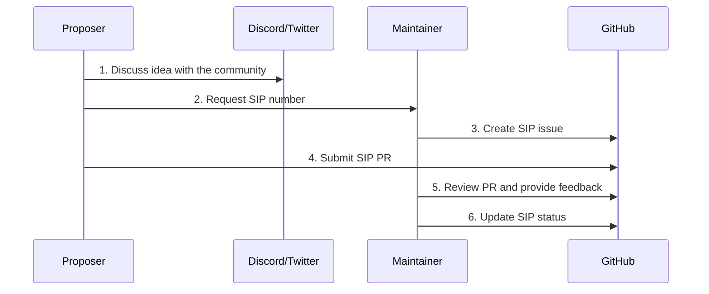

# SIP-1: SIP Process and Guidelines

## Abstract

This document establishes the Symbol Improvement Proposal (SIP) process. It defines how proposals are created, reviewed, and accepted, and includes roles, categories, status flows, and templates to guide authors, maintainers, and the broader community.

## Current Situation

Currently, there is no standardized process for proposing changes to Symbol. As a result, community members often find it difficult to contribute ideas or understand how proposals are reviewed and adopted.

## Proposed Changes

- Establish a standardized SIP process and markdown template.
- Define clear roles and responsibilities for authors and maintainers.
- Use GitHub as the central hub for SIP tracking and discussions.

## Rationale

The Symbol community regularly generates valuable ideas, but many contributors are unsure how to formally submit or advocate for changes. Discussions often happen in informal channels like Discord or Twitter and are quickly lost. This proposal provides a clear, transparent, and collaborative pathway for meaningful contributions to Symbol's evolution.

## Implementation

### SIP Workflow

1. Proposer comes up with an idea and discusses it in a public channel (Discord, Twitter, etc).

2. When the proposer considers the idea to be mature enough, they requests a SIP number from a relevant maintainer.

3. The maintainer assigns a SIP number and creates the corresponding GitHub issue.

4. The proposer writes the SIP and submits a pull request.

5. The maintainer reviews the submission and provides feedback.

6. The maintainer updates the SIP status as needed.

### SIP Categories
- **Core**: Protocol-level changes requiring forks.
- **Networking**: Node configuration or networking behavior.
- **Interface**: API (e.g., REST) or SDK-level changes.
- **Library**: Updates to client libraries (npm, Python, etc.).
- **Application**: Application related changes (Explorer, wallet, etc.).
- **Informational**: Non-binding proposals or documentation guidelines.

### SIP Statuses
- **Draft**: Initial version under development.
- **Review**: Open for review by maintainers and the community.
- **Accepted**: Approved and planned for implementation.
- **Rejected**: Declined by maintainers or community consensus.
- **Withdrawn**: The author has withdrawn the proposal.
- **Implemented**: Implemented in code.
- **Staging**: Deployed to testnet.
- **Final**: Deployed to mainnet.

## Citations

- [Bitcoin Improvement Proposals (BIPs)](https://github.com/bitcoin/bips)
- [Ethereum Improvement Proposals (EIPs)](https://github.com/ethereum/EIPs)
- [Symbol Proposal Notes by @ymuichiro](https://gist.github.com/ymuichiro/5037f4231ca753b42d622036047e67eb)