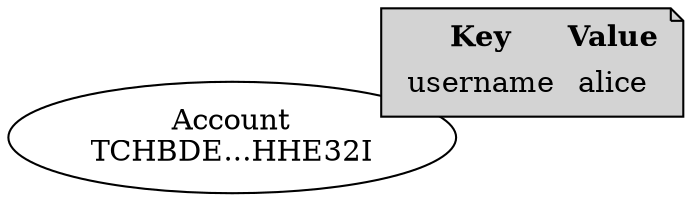

# Adding Metadata to an Account

<Accounts:|Accounts>, like <mosaics:> and <namespaces:>, can store <metadata:> as key-value pairs.

This tutorial shows how to add metadata to an account, retrieve it from the network, and update existing values.

In this example, the pair `username = alice` is attached to an account and then changed to `bob`.



## Prerequisites

Before you start, make sure to:

* Set up your development environment.
    See [Setting Up a Development Environment](../start/setup.md).
* Create an <account:> to add metadata to, either
    [from code](./create-from-private-key.md) or
    [by using a wallet](../../userbook/wallet/create-account.md).
* Obtain <XYM:> to pay for the transaction fee.
    See [Getting Testnet Funds from the Faucet](./testnet-faucet.md).

Additionally, review the [Transfer transaction](../transactions/transfer.md) tutorial to understand how
transactions are announced and confirmed, and the
[Complete Aggregate transaction](../transactions/complete-aggregate.md) tutorial to understand how
<aggregate transactions:> work.

## Full Code



{{ tutorial.code_full_tagged('devbook/accounts/account_metadata', ['py', 'js']) }}

## Code Explanation

This tutorial demonstrates adding new metadata to an account and then updating that metadata.

### Setting Up the Account

{{ tutorial.code_snippet_tagged('step-1') }}

The snippet reads the signer's private key from the `SIGNER_PRIVATE_KEY` environment variable, which defaults to a
test key if not set.
The signer's address is derived from the public key.

In this tutorial, the signer adds metadata to their own account.
Adding metadata to a different account requires the target to cosign the transaction.

### Fetching Network Time and Fees

{{ tutorial.code_snippet_tagged('step-2') }}

Network time and recommended fees are fetched from <get:/node/time> and <get:/network/fees/transaction> respectively,
following the process described in the [Transfer Transaction](../transactions/transfer.md) tutorial.

### Defining the Metadata

Each account metadata entry is uniquely identified by:

* The **signer's address**: the account adding the metadata
* The **target account's address**: the account receiving the metadata, whose signature is required
* A **scoped metadata key**: a 64-bit value chosen by the metadata creator

    The SDK provides a <dy:Metadata.metadataGenerateKey> helper function that generates this key from a
    human-readable string using SHA3-256 hashing.
    This approach makes keys more meaningful and reduces the chance of collisions.

{{ tutorial.code_snippet_tagged('step-3') }}

In this example, the key is derived from the string `username`.
For demonstration purposes, a timestamp is appended to the key string,
so each time the code is executed a new entry is added to the account.
In practice, you would use a fixed key that identifies the specific metadata entry you want to create or update.

The metadata value can be any sequence of up to 1024 bytes.
In this example, the value is the string `alice` encoded in UTF-8.

!!! note "Multiple entries with the same key"

    The key is only one of the 3 parts that identify a metadata entry,
    so a change in any part produces a different entry.

    For example, different accounts can use the same scoped metadata key on the same target account without conflict,
    because the signer's address is different.

    Each entry is independent and can only be updated by the account that originally created it.

### Creating the Embedded Account Metadata Transaction

{{ tutorial.code_snippet_tagged('step-4') }}

An account metadata transaction attaches a key-value pair to an account on the blockchain.
The same transaction type handles both adding new metadata entries and updating existing ones.

Symbol requires these transactions to be inside an <aggregate transaction:> that includes the target account owner's
signature.
This prevents unwanted metadata to be attached to an account without its owner's permission.

An aggregate is still required even when the transaction is initiated by the account owner,
to keep the transaction format uniform.
For this reason, the code defines the account metadata transaction as an <embedded transaction:>.

This transaction specifies:

* **Type:** Use <ser:AccountMetadataTransactionV1>.

* **Signer public key:** The account creating the metadata entry.
    In this case, this is the account receiving the metadata too.

* **Target address:** The account to attach the metadata to.
    When the target differs from the signer, the target account must cosign the aggregate transaction.

* **Scoped metadata key:** The 64-bit key used to identify this metadata entry.

* **Value size delta:** When creating new metadata, set this to the byte length of the value.
    When updating existing metadata, set this to the difference between the new and current value lengths.

* **Value:** The metadata content as bytes.
    When creating new metadata, provide the raw value.
    When updating, provide a computed value (explained in the
    [Modifying Existing Metadata](#modifying-existing-metadata) section).

### Building the Aggregate Transaction

{{ tutorial.code_snippet_tagged('step-5') }}

The code adds the embedded account metadata transaction to an <aggregate transaction:>.

Since the signer is modifying their own account, no <cosignatures:> are required and the aggregate can be created as
<complete aggregate transaction:|complete>, allowing it to be signed and announced immediately.

!!! note "Adding metadata to a different account"

    If the target account is different from the signer, the target must cosign the aggregate transaction to approve the
    metadata entry.

    For details on collecting cosignatures on-chain, see the [Bonded Aggregate](../transactions/bonded-aggregate.md)
    tutorial.

### Submitting the Aggregate Transaction

{{ tutorial.code_snippet_tagged('step-6') }}

The aggregate transaction is signed and announced following the same process as in
[Creating a Complete Aggregate Transaction](../transactions/complete-aggregate.md#building-the-aggregate-transaction).

### Retrieving Metadata

{{ tutorial.code_snippet_tagged('step-7') }}

To retrieve the current value of a metadata entry, the code uses the <get:/metadata> endpoint
with filters for `sourceAddress`, `targetAddress`, `scopedMetadataKey`, and `metadataType`
(`0` for account metadata).

The endpoint returns the list of entries matching the filters, which in this case contains a single item.

### Modifying Existing Metadata

{{ tutorial.code_snippet_tagged('step-8') }}

Updating an existing metadata entry requires the current value, retrieved from the network as previously shown.

To demonstrate updating metadata, the code changes the username from `alice` to `bob` by creating another
<ser:AccountMetadataTransactionV1> transaction with the same scoped metadata key.

Modifying an existing metadata value differs from creating a new one in that the updated value must be defined
in terms of the current value, using the following fields:

* {{ tutorial.var('value_size_delta') }}: The difference in length between the new and current values.
    In this example, the delta is `-2` because `bob` (3 bytes) is two bytes shorter than `alice` (5 bytes).

* `value`: The XOR'd bytes computed by comparing the current and new values byte-by-byte.

    The SDK provides a <dy:Metadata.metadataUpdateValue> helper function that handles the XOR calculation.
    The XOR operation compares each byte: matching bytes become zero, and differing bytes capture the change.

Note that {{ tutorial.var('value_size_delta') }} represents the difference in final value lengths (new vs current),
not the length of the XOR'd bytes themselves.

!!! tip "Deleting a metadata entry"

    To delete a metadata entry, set {{ tutorial.var('value_size_delta') }} to the negative of the current value length
    and provide the current value as `value`. The XOR produces an empty result, which removes the entry from the
    network.

As with the [initial metadata creation](#building-the-aggregate-transaction), this metadata modification is wrapped
in an aggregate transaction and then signed and announced.

{{ tutorial.code_snippet_tagged('step-9') }}

## Output

The output shown below corresponds to a typical run of the program.

```text linenums="1" hl_lines="16 17 18 20 31 40 41 43"
--8<-- 'devbook/accounts/account_metadata.log'
```

Key points in the output:

* **Line 16** (`"scoped_metadata_key"`): The 64-bit key generated from the input string using SHA3-256 hashing.
* **Line 17** (`"value_size_delta": 5`): When creating new metadata, this equals the byte length of the value
    (`"alice"` = 5 bytes).
* **Line 18** (`"value": "616c696365"`): The metadata value encoded as hexadecimal (`"alice"` in UTF-8).
* **Line 20**: The transaction hash for looking up the metadata creation in the explorer.
* **Line 31** (`Current value: alice`): Retrieved from the network before updating.
* **Line 40** (`"value_size_delta": -2`): Negative because the new value (`"bob"` = 3 bytes) is shorter than the
    current value (5 bytes). The difference is -2.
* **Line 41** (`"value": "03030b6365"`): The XOR'd value computed from the current and new values, not the raw new
    value.
* **Line 43**: The transaction hash for looking up the metadata update in the explorer.

The transaction hashes can be used to search for the transactions in the
[Symbol Testnet Explorer](https://testnet.symbol.fyi/).

## Conclusion

This tutorial showed how to:

| Step                                                                                          | Related documentation                        |
|-----------------------------------------------------------------------------------------------|----------------------------------------------|
| [Define metadata key and value](#defining-the-metadata)                                       | <dy:Metadata.metadataGenerateKey>            |
| [Create an account metadata transaction](#creating-the-embedded-account-metadata-transaction) | <dy:SymbolTransactionFactory.createEmbedded> |
| [Retrieve metadata](#retrieving-metadata)                                                     | <get:/metadata>                              |
| [Modify existing metadata](#modifying-existing-metadata)                                      | <dy:Metadata.metadataUpdateValue>            |
