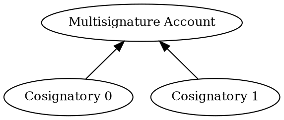

# Configuring a Multisignature Account

A <multisignature account:>, also called _multisig_, cannot initiate transactions on its own.
Instead, it relies on _cosignatory_ accounts to create transactions and sign them on its behalf.

This tutorial shows how to convert a regular account into a multisig account that requires approval from one of two
cosignatories.
If the account is already multisig, the tutorial instead demonstrates how to remove the cosignatories and revert
the account to a regular account.

The multisignature structure used in this tutorial is shown below:



!!! note "Multilevel multisignature accounts"

    More complex configurations, where a cosignatory is itself a multisig account, are also supported,
    up to three levels deep.

    Multisig accounts can be configured in any order.  
    However, once an account is converted into a multisig, it can no longer sign its own transactions and must rely
    exclusively on the cosignatories configured at that point.

## Prerequisites

Before you start, make sure to:

- Set up your development environment.
    See [Setting Up a Development Environment](../start/setup.md).
- Create 3 <accounts:>: one to turn into a multisig, and the other two to act as cosignatories.
    You can do this either [from code](./create-from-private-key.md) or
    [by using a wallet](../../userbook/wallet/create-account.md).
- Obtain <XYM:> to pay for the transaction fees and fund the accounts.
    See [Getting Testnet Funds from the Faucet](./testnet-faucet.md).

Additionally, review the [Transfer transaction](../transactions/transfer.md) tutorial to understand how
transactions are announced and confirmed, and the
[Complete Aggregate transaction](../transactions/complete-aggregate.md) tutorial to understand how
<aggregate transactions:> work.

## Full Code



{{ tutorial.code_full_tagged('devbook/accounts/configure_multisig', ['py', 'js']) }}

## Code Explanation

The code begins by defining two helper functions.
For details on how transactions are announced and how their confirmation is tracked, see the
[Transfer transaction](../transactions/transfer.md) tutorial.
The remaining helper functions are described in the sections below.

The tutorial then proceeds to [set up the required keys](#setting-up-the-accounts),
[fetch the current network conditions](#fetching-network-time-and-fees), and
[detect the current configuration](#detecting-the-multisig) of the multisig account.

Depending on whether the account is already configured as a multisig,
a transaction is created to [enable](#enabling-the-multisig) or [disable](#disabling-the-multisig) it as appropriate.
Finally, the transaction is [announced and confirmed](#submitting-the-aggregate-transaction).

### Setting Up the Accounts

{{ tutorial.code_snippet_tagged('step-1') }}

The tutorial requires three separate accounts.
Their <private keys:> can be provided through environment variables.
If not set, default values are used:

| Environment Variable       | Default value | Purpose                    |
|----------------------------|---------------|----------------------------|
| `MULTISIG_PRIVATE_KEY`     | `0000..0001`  | Multisig account           |
| `COSIGNATORY0_PRIVATE_KEY` | `0000..0002`  | First cosignatory account  |
| `COSIGNATORY1_PRIVATE_KEY` | `0000..0003`  | Second cosignatory account |

Each private key is a 64-character hexadecimal string.

The multisig account and its first cosignatory must hold enough funds to announce transactions.
If the default values are used, these accounts may already be funded.

The snippet above derives and stores the <key pair:> and <address:> of each account for later use.

### Fetching Network Time and Fees

{{ tutorial.code_snippet_tagged('step-2') }}

Network time and recommended fees are fetched from <get:/node/time> and <get:/network/fees/transaction> respectively,
following the process described in the [Transfer Transaction](../transactions/transfer.md) tutorial.

### Detecting the Multisig

The following function retrieves the list of current cosignatories for a given address using the
<get:/account/{address}/multisig> endpoint.
If the account is not configured as a multisig, or has never been used, the function returns an empty list.

{{ tutorial.code_snippet_tagged('step-3') }}

This list is then used to determine the tutorial's mode of operation,
build the appropriate configuration transaction, and sign it.

{{ tutorial.code_snippet_tagged('step-4') }}

The only differences between enabling and disabling the multisig are the transaction that is created and
the account that signs it, as shown in the next two sections.

### Enabling the Multisig

All changes to the multisig configuration of an account, including adding or removing cosignatories,
are performed using a <ser:MultisigAccountModificationTransactionV1>, which **must** be embedded in an
<aggregate transaction:>:

{{ tutorial.code_snippet_tagged('step-5') }}

The embedded <ser:MultisigAccountModificationTransactionV1> includes the following fields:

- `signer_public_key`: <public key:> of the account whose multisig configuration will be modified.

- `min_approval_delta`: difference between the _desired value_ and the _current value_ of the number of
    signatures that will be required to approve a transaction from the multisig account.

    In this case the account is initially a regular account, so the current required number of signatures is `0`.
    To convert it into a multisig account that requires one signature from one of its cosignatories,
    the delta is set to `1`.

    The delta value can be negative to _reduce_ the current value, as shown in the next section.

- `min_removal_delta`: Difference in the number of signatures required to remove cosignatories from the account
    configuration.
    This allows, for example, requiring more signatures to remove a cosignatory than to approve a regular transaction,
    which is often a more sensitive governance operation.

- `address_additions`: list of addresses of the cosignatories that will be added to the account.
    The `cosignatory_addresses` variable was prepared during the [setup phase](#setting-up-the-accounts).

!!! note "Safety measures"

    The protocol includes safety mechanisms that help prevent locking an account into an invalid state.
    Transactions that would result in an invalid multisig configuration are rejected with an error.
    For example, when:

    - The number of cosignatories is lower than the minimum number of required signatures
    - An address that is not a consignatory is removed
    - Required signatures are missing
    - Unnecessary signatures are included

The embedded transaction is then wrapped in an aggregate transaction, even though it is the only inner transaction:

{{ tutorial.code_snippet_tagged('step-6') }}

For simplicity, the tutorial uses a <complete aggregate transaction:>.
See the tutorials on [complete](../transactions/complete-aggregate.md) and
[bonded](../transactions/bonded-aggregate.md) aggregate transactions for more details.

Care is taken when calculating the transaction fee to account for the space required by all cosignatures.

Finally, signatures are attached to the aggregate transaction:

{{ tutorial.code_snippet_tagged('step-7') }}

In this case, the signature of the account being converted into a multisig is required,
along with the signatures of the cosignatories, which explicitly acknowledge their new responsibility.

One of the signatures is the main signer of the transaction and is added using <dy:SymbolFacade.signTransaction>.
The remaining signatures are cosignatures and are added using <dy:SymbolFacade.cosignTransaction>.
The choice of the main signer only affects which account pays the transaction fee.

**Once an account has multisig enabled, its own signature is no longer required.
Any transaction involving that account instead requires signatures from its cosignatories.**

### Disabling the Multisig

Disabling a multisig configuration requires removing all cosignatories.
The process is similar to enabling it, with two key differences:
cosignatories must be removed one by one, and the multisig account itself cannot sign the transaction.

For this reason, two <ser:MultisigAccountModificationTransactionV1>s are created:

{{ tutorial.code_snippet_tagged('step-8') }}

In both transactions, `signer_public_key` is set to the multisig account's public key.

The first transaction removes `cosignatory_addresses[1]` without modifying the approval or removal deltas,
because one cosignatory still remains and signatures are still required.

The second transaction removes the last remaining cosignatory and sets both `min_approval_delta` and
`min_removal_delta` to `-1`.
At this point, the current value of both fields is `1`, as configured during the [enable](#enabling-the-multisig) step,
and the desired value is `0`, so the delta is `-1`.

Both embedded transactions are then wrapped in an aggregate transaction and signed:

{{ tutorial.code_snippet_tagged('step-9') }}

The aggregate transaction is signed by `cosignatory_addresses[0]`.
This is the only valid option: once an account has cosignatories, it can no longer sign transactions on its own,
and `cosignatory_addresses[1]` is removed from the multisig after the first embedded transaction is executed.

As a result, no cosignatures are required.
Only the main signature is needed.
The entire operation can be initiated and approved by a single cosignatory because the multisig was configured with a
minimum removal requirement of one signature.

The cosignatories could also have been removed in the opposite order, as both have equal authority.
The only difference would be which account signs the transaction and pays the transaction fee.

### Submitting the Aggregate Transaction

The final step is to announce the constructed transaction and wait for its confirmation, as described in the
[Transfer transaction](../transactions/transfer.md) tutorial.

{{ tutorial.code_snippet_tagged('step-10') }}

## Output

The output shown below corresponds to two typical runs of the program.

=== ":material-plus-thick: Enabling the Multisig"

    ```text linenums="1" hl_lines="2-4 10 27-29"
    --8<-- 'devbook/accounts/configure_multisig_enable.log'
    ```

    Key points in the output:

    - **Lines 2-4**: Addresses and public keys of all involved accounts.
    - **Line 10** (`Response: No cosignatories`): No cosignatories are currently configured.
    - **Line 27** (`"min_approval_delta": 1`): The number of required signatures to approve transactions will be
        increased by one.
    - **Line 28** (`"min_removal_delta": 1`): The number of required signatures to remove a cosignatory will be
        increased by one.
    - **Line 29** (`"address_additions"`): List of addresses that will be added as cosignatories.

=== ":material-minus-thick: Disabling the Multisig"

    ```text linenums="1" hl_lines="2-4 10 27-32 39-44"
    --8<-- 'devbook/accounts/configure_multisig_disable.log'
    ```

    Key points in the output:

    - **Lines 2-4**: Addresses and public keys of all involved accounts.
    - **Line 10** (`Response: [ ... ]`): Existing cosignatories have been detected.
    - **Line 27-32** (First embedded transaction): The minimum number of required signatures will remain unchanged,
        no new cosignatories will be added, and one existing cosignatory will be removed.
    - **Line 39-44** (Second embedded transaction): The minimum number of required signatures will be decreased by one,
        no new cosignatories will be added, and the last remaining cosignatory will be removed.

The transaction hashes shown in the output can be used to look up the transactions in the
[Symbol Testnet Explorer](https://testnet.symbol.fyi/).

## Conclusion

This tutorial showed how to:

| Step                                                                   | Related documentation                          |
|------------------------------------------------------------------------|------------------------------------------------|
| [Retrieve the current multisig configuration](#detecting-the-multisig) | <get:/account/{address}/multisig>              |
| [Enable a multisig account](#enabling-the-multisig)                    | <ser:MultisigAccountModificationTransactionV1> |
| [Disable a multisig account](#disabling-the-multisig)                  | <ser:MultisigAccountModificationTransactionV1> |
| Wrap configuration in an embedded transaction                          | <dy:SymbolTransactionFactory.createEmbedded>   |
