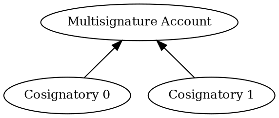

# Configuring a Multisignature Account

A <multisignature account:>, also called _multisig_, cannot initiate transactions on its own, and relies instead on
_cosignatory_ accounts to create transactions and sign them on its behalf.

This tutorial shows how to turn a regular account into a multisig that requires approval from one of two
cosignatories.
If the account is already a multisig, the tutorial shows instead how to remove the cosignatories and turn it into a
regular account again.

The multisignature tree is the following:



## Prerequisites

Before you start, make sure to:

- Set up your development environment.
    See [Setting Up a Development Environment](../start/setup.md).
- Create 3 <accounts:>: one to turn into a multisig, and the other two to act as cosignatories.
    You can do this either [from code](./create-from-private-key.md) or
    [by using a wallet](../../userbook/wallet/create-account.md).
- Obtain <XYM:> to pay for the transaction fees and fund the accounts.
    See [Getting Testnet Funds from the Faucet](./testnet-faucet.md).

Additionally, review the [Transfer transaction](../transactions/transfer.md) tutorial to understand how
transactions are announced and confirmed, and the
[Complete Aggregate transaction](../transactions/complete-aggregate.md) tutorial to understand how
<aggregate transactions:> work.

## Full Code



{{ tutorial.code_full('devbook/accounts/configure-multisig', ['py', 'js']) }}

## Code Explanation

The code starts by defining a few helper functions.
To understand how to announce transactions and wait for their confirmation see the
[Transfer transaction](../transactions/transfer.md) tutorial.
The rest of helper functions are described below.

The tutorial then proceeds to [set up the necessary keys](#setting-up-the-accounts),
[fetch the current network conditions](#fetching-network-time-and-fees), and
[detect the current configuration](#detecting-the-multisig) of the multisig account.

Depending on whether the account is already a multisig, a transaction is created to [enable](#enabling-the-multisig)
or [disable](#disabling-the-multisig) it as appropriate.
This transaction is finally [announced and confirmed](#submitting-the-aggregate-transaction).

### Setting Up the Accounts

{{ tutorial.code_snippet(['py:157:177', 'js:169:192']) }}

The tutorial requires three separate accounts, whose <private keys:> can be provided through environment variables.
Otherwise, default values are used:

| Environment Variable       | Default value | Purpose                    |
|----------------------------|---------------|----------------------------|
| `MULTISIG_PRIVATE_KEY`     | `0000..0001`  | Multisig account           |
| `COSIGNATORY0_PRIVATE_KEY` | `0000..0002`  | First cosignatory account  |
| `COSIGNATORY1_PRIVATE_KEY` | `0000..0003`  | Second cosignatory account |

Note that each key is 64 characters long.

The multisig account and its first cosignatory must hold enough funds to be able to announce transactions.
If you use the default values, they might be funded already.

The snippet above stores the <key pair:> and <address:> of each account for later use.

### Fetching Network Time and Fees

{{ tutorial.code_snippet(['py:180:198', 'js:195:213']) }}

Network time and recommended fees are fetched from <get:/node/time> and <get:/network/fees/transaction> respectively,
following the process described in the [Transfer Transaction](../transactions/transfer.md) tutorial.

### Detecting the Multisig

The following function retrieves the list of current cosignatories for the specified address using the
<get:/account/{address}/multisig> endpoint.
If the account is not configured as a multisig, or has never been used, the function returns an empty list.

{{ tutorial.code_snippet(['py:46:61', 'js:51:66']) }}

This list is then used to decide the tutorial's mode of operation.

{{ tutorial.code_snippet(['py:200:215', 'js:215:233']) }}

The only differences between enabling and disabling the multisig are the transaction needed and its signer,
as shown in the next two sections.

### Enabling the Multisig

{{ tutorial.code_snippet(['py:63:106', 'js:68:114']) }}

Multisig account modification transaction needs 3 signatures:

- the account to be turned into a multisig
- one from each cosignatory

In this example, the multisig signs both the embedded (to indicate this is the target) and the aggregate.
The cosignatories then add their signatures to the agg.
Anyone could sign the agg and pay the tx fees. The multisig's sig is always needed

### Disabling the Multisig

Including turning it back into a regular non-multisig account, which requires removing all cosignatories.

Signature of the multisig is not needed anymore. It cannot be present.

Only one cosignatory can be deleted at a time.
Signer of multisig account modification tx (embedded) must be the multisig, as usual.

### Submitting the Aggregate Transaction

## Output

The output shown below corresponds to two typical runs of the program.

=== ":material-plus-thick: Enabling the Multisig"

    ```text linenums="1" hl_lines="1"
    --8<-- 'devbook/accounts/configure-multisig-enable.log'
    ```

=== ":material-minus-thick: Disabling the Multisig"

    ```text linenums="1" hl_lines="1"
    --8<-- 'devbook/accounts/configure-multisig-disable.log'
    ```

## Conclusion
