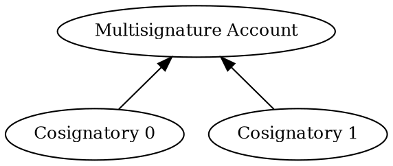

# Signing a Transaction from a Multisignature Account

This tutorial transfers 1 <XYM:> from an <account:> to itself, mirroring the
[Creating a Transfer Transaction](../transactions/transfer.md) tutorial.

However, in this case, the source account is a <multisignature account:>, also called _multisig_,
and therefore it cannot initiate or sign transactions on its own.
Instead, it relies on one of its cosignatory accounts to create transactions and sign them on its behalf.

This tutorial uses the multisig configuration created in the
[Configuring a Multisignature Account](./configure-multisig.md) tutorial,
with Cosignatory 0 initiating and signing the transaction:



## Prerequisites

Before you start, make sure to:

- Set up your development environment.
    See [Setting Up a Development Environment](../start/setup.md).
- Complete the [Configuring a Multisignature Account](./configure-multisig.md) tutorial.

Additionally, review the [Transfer transaction](../transactions/transfer.md) tutorial to understand how
transactions are announced and confirmed, and the
[Complete Aggregate transaction](../transactions/complete-aggregate.md) tutorial to understand how
<aggregate transactions:> work.

## Full Code



{{ tutorial.code_full('devbook/accounts/sign-multisig', ['py', 'js']) }}

## Code Explanation

In general, signing a transaction on behalf of a multisig account only requires wrapping it in an
<aggregate transaction:> that provides the required cosignatures.

This tutorial builds an <embedded transaction:> containing the transfer, using the multisig account as the signer,
since this is the origin of the transfer.
A <complete aggregate transaction:> then wraps the transfer transaction, signed by the cosignatory,
since this is the account that can authorize the transaction.

### Setting Up the Accounts

{{ tutorial.code_snippet(['py:16:27', 'js:12:21']) }}

The tutorial requires two separate accounts.
Their <private keys:> can be provided through environment variables.
If not set, default values are used:

| Environment Variable       | Default value | Purpose             |
|----------------------------|---------------|---------------------|
| `MULTISIG_PRIVATE_KEY`     | `0000..0001`  | Multisig account    |
| `COSIGNATORY0_PRIVATE_KEY` | `0000..0002`  | Cosignatory account |

Each private key is a 64-character hexadecimal string.

The cosignatory account must hold enough funds to pay the transaction fee.
If the default values are used, these accounts may already be funded.

The snippet above derives and stores the <key pair:> of each account for later use.

### Fetching Network Time and Fees

{{ tutorial.code_snippet(['py:32:49', 'js:26:44']) }}

Network time and recommended fees are fetched from <get:/node/time> and <get:/network/fees/transaction> respectively,
following the process described in the [Transfer Transaction](../transactions/transfer.md) tutorial.

### Building the Transaction

{{ tutorial.code_snippet(['py:51:62', 'js:46:56']) }}

The embedded <transfer transaction:> includes the following fields:

- `signer_public_key`: <public key:> of the account whose funds are being transferred, that is,
    the multisignature account.

- `recipient_address`: in this particular example, the funds are sent back to the sender, so the recipient is also
    the multisig account.

- `mosaics`: 1'000'000 atomic units of the `symbol.xym` mosaic, corresponding to 1 <XYM:>,
    as explained in the [Transfer Transaction](../transactions/transfer.md) tutorial.

The embedded transaction is then wrapped in an aggregate transaction, even though it is the only inner transaction:

{{ tutorial.code_snippet(['py:64:74', 'js:58:68']) }}

Its most relevant fields are:

- `signer_public_key`: this time this is the <public key:> of the cosignatory that will be authorizing the transaction
    and paying its fees.

- `transactions`: the list of embedded transactions.
    This example has only one, but there could be any number of them.

For simplicity, the tutorial uses a <complete aggregate transaction:>.
See the tutorials on [complete](../transactions/complete-aggregate.md) and
[bonded](../transactions/bonded-aggregate.md) aggregate transactions for more details.

Finally, the aggregate transaction is signed by the cosignatory:

{{ tutorial.code_snippet(['py:76:81', 'js:70:75']) }}

!!! note "Multiple cosignatories"

    In other multisig configurations, more signatures might be required.
    In that case, they are attached using <dy:SymbolFacade.cosignTransaction> instead of
    <dy:SymbolFacade.signTransaction>.

    See the [Configuring a Multisignature Account](./configure-multisig.md#enabling-the-multisig) tutorial for an
    example.

### Submitting the Aggregate Transaction

The final step is to announce the transaction and wait for its confirmation, as described in the
[Transfer transaction](../transactions/transfer.md) tutorial.

{{ tutorial.code_snippet(['py:83:116', 'js:77:132']) }}

Transactions are rejected if they violate protocol constraints.
The following table summarizes the most common error sources:

| Error message                            | Probable cause                                                                              |
|------------------------------------------|---------------------------------------------------------------------------------------------|
| Multisig Operation Prohibited By Account | The multisig account tried to sign the aggregate transaction itself.                        |
| Aggregate Ineligible Cosignatories       | The signer is not in the cosignatories list.                                                |
| Consumer Batch Signature Not Verifiable  | The signature attached to the aggregate transaction does not match its `signer_public_key`. |

## Output

The output shown below corresponds to a typical run of the program.

```text linenums="1" hl_lines="2-3 11 20 24"
--8<-- 'devbook/accounts/sign-multisig.log'
```

Key points in the output:

- **Lines 2-3**: Public keys of all involved accounts.
- **Line 11** (`signer_public_key`): Signer of the aggregate transaction.
    Note that it matches the cosignatory account.
- **Line 20** (`signer_public_key`): Signer of the embedded transfer transaction.
    Note that it matches the multisig account.
- **Line 24** (`recipient_address`): Encoded <address:> of the multisig account.

The transaction hashes shown in the output can be used to look up the transactions in the
[Symbol Testnet Explorer](https://testnet.symbol.fyi/).

## Conclusion

This tutorial is functionally identical to the [Transfer Transaction](../transactions/transfer.md) tutorial,
but using a <multisignature account:> as the source account.

In particular, the tutorial showed how to:

| Step                                                                  | Related documentation                        |
|-----------------------------------------------------------------------|----------------------------------------------|
| [Wrap transfer in an embedded transaction](#building-the-transaction) | <dy:SymbolTransactionFactory.createEmbedded> |
| [Attach signatures in the right place](#building-the-transaction)     | <dy:SymbolFacade.signTransaction>            |
