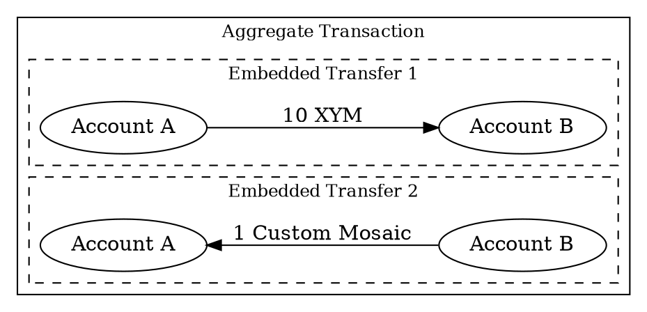

# Atomic Swap

An atomic swap is an exchange of assets between two parties where both transfers either succeed together or fail
together.
This guarantees that neither party can receive assets without the other also receiving theirs.

This page covers swaps of assets (<mosaics:>) between <accounts:> on the Symbol network.
To exchange assets between Symbol and another blockchain, see [Cross-Chain Swap](./cross-chain-swap.md).

## How Atomic Swaps Work on Symbol

On Symbol, atomic swaps are performed using <aggregate transactions:>, which group multiple
<embedded transactions:|embedded> <transfer transactions:> into a single atomic operation.

The aggregate requires the initiator's <signature:> and <cosignatures:> from all other involved accounts before it can
be confirmed.
If any cosignature is missing or the deadline expires, the entire aggregate is rejected and no assets change hands.

For details on how aggregate transactions work, see the
[Aggregate Transactions](../../textbook/transactions.md#aggregate-transactions) section in the Textbook.

## Choose an aggregate type

Symbol supports two aggregate transaction types for atomic swaps.
Continue to the tutorial that matches your use case:

| Type                                          | When to use                                         | Trade-off                                 |
|-----------------------------------------------|-----------------------------------------------------|-------------------------------------------|
| [Complete aggregate](./complete-aggregate.md) | All parties can sign off-chain before announcing.   | Requires handling off-chain coordination. |
| [Bonded aggregate](./bonded-aggregate.md)     | Parties want all coordination to happen on-chain.   | Requires a 10 XYM lock deposit.           |
