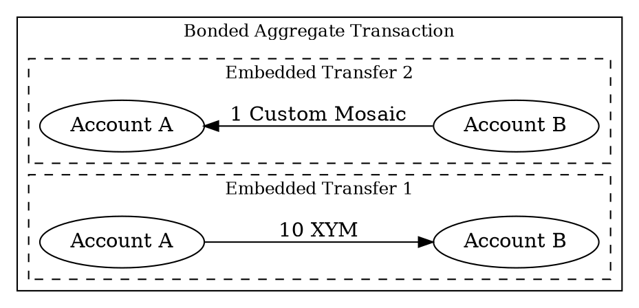

# Creating a Bonded Aggregate Transaction

This tutorial shows how to create an asset swap using <bonded aggregate transactions:>.

In this example, Account A sends 10 <XYM:> to Account B, while Account B simultaneously sends 1 custom <mosaic:> back
to Account A:



Unlike <complete aggregate transactions:>, bonded aggregates collect <cosignatures:> on-chain.
Each required party submits their cosignature directly to the network, without needing to coordinate or
communicate with the other parties off-chain.

## Prerequisites

Before you start, make sure to:

- Set up your development environment.
  See [Setting Up a Development Environment](../start/setup.md).
- Create an <account:> to initiate the aggregate transaction, either
  [from code](../accounts/create-from-private-key.md) or
  [by using a wallet](../../userbook/wallet/create-account.md).
- Obtain <XYM:> to pay for the transaction fee, transfer amounts, and the <hash lock:> deposit.
  See [Getting Testnet Funds from the Faucet](../accounts/testnet-faucet.md).

## Full Code



{{ tutorial.code_full('devbook/transactions/bonded-aggregate', ['py', 'js']) }}

The whole code is wrapped in a single `try` block to provide simple error handling,
but applications will probably want to use more fine-grained control.

## Code Explanation

### Setting Up Accounts

{{ tutorial.code_snippet(['py:15:35', 'js:12:28']) }}

Both accounts must sign the aggregate transaction.
This example includes both private keys in one script to demonstrate the complete workflow, but in practice
each party would sign on their own machine without sharing private keys.

The snippet reads the private keys from the `ACCOUNT_A_PRIVATE_KEY` and `ACCOUNT_B_PRIVATE_KEY`
environment variables, which default to test keys if not set.
The addresses for both accounts are derived from their public keys using the facade's network
configuration.

### Fetching Network Time and Fees

{{ tutorial.code_snippet(['py:38:56', 'js:31:49']) }}

To prepare an aggregate, first retrieve the current network time from <get:/node/time> and the recommended fee
multiplier from <get:/network/fees/transaction>, following the same steps described in the
[Transfer Transaction](./transfer.md) tutorial.

### Creating Embedded Transactions

{{ tutorial.code_snippet(['py:58:79', 'js:56:79']) }}

The <embedded transactions:> define the operations to execute atomically.
Each embedded transaction specifies:

* **Type:** All transaction types can be embedded within aggregates (except other aggregates).
  For embedded transfers, use `transfer_transaction_v1`, the same as for basic transfer transactions.

* **Signer public key:** The account that would sign this transaction if it were announced
  independently.

* **Transaction-specific fields:** All fields specific to the transaction type must be provided.
  For transfers, this includes the recipient address and the <mosaics:> to send.

Note that embedded transactions do **not** include fee or deadline fields.
These are inherited from the enclosing aggregate transaction.

The example creates two <transfer transactions:> for the swap:

* The first transfer sends 10 <XYM:> from Account A to Account B.
* The second transfer sends 1 custom <mosaic:> from Account B to Account A.

### Building the Aggregate Transaction

{{ tutorial.code_snippet(['py:81:97', 'js:81:98']) }}

Once the embedded transactions are prepared, create the bonded aggregate transaction that wraps them:

* **Type:** Use `aggregate_bonded_transaction_v3`.

* **Signer public key:** The account initiating the aggregate.
  This account announces the transaction and pays the transaction fee.

* **Deadline:** The maximum time the network should attempt to confirm the transaction.

* **Transactions hash:** A hash computed from all embedded transactions.
  This ensures the embedded transactions cannot be modified after signing.
  Use <dy:SymbolFacade.hashEmbeddedTransactions> to compute this value.

* **Transactions:** The array of embedded transactions to execute.

The <fee:> is calculated based on the aggregate's total size, which includes all embedded transactions plus
space reserved for <cosignatures:> (104 bytes each).

### Signing the Bonded Transaction

{{ tutorial.code_snippet(['py:99:105', 'js:100:107']) }}

Account A signs the bonded transaction, producing the main signature and finalizing the transaction hash.

This hash is required for the next step: creating a <hash lock transaction:>.

### Creating the Hash Lock

{{ tutorial.code_snippet(['py:107:155', 'js:109:162']) }}

Before announcing a bonded aggregate, a <hash lock transaction:> must be created and confirmed.
The hash lock serves as a deposit to prevent spam and ensure network resources are not exhausted by unfinished
<partial transactions:>.

The hash lock transaction specifies:

* **Type:** Use `hash_lock_transaction_v1`.

* **Mosaic:** The deposit amount (10 XYM). This deposit is locked temporarily while waiting for
  cosignatures.

* **Duration:** The number of blocks the deposit remains locked (100 blocks in this example).
  If all cosignatures are collected and the bonded aggregate confirms before the duration expires,
  the deposit is returned. Otherwise, it is forfeited.

* **Hash:** The hash of the bonded aggregate transaction being locked.

The hash lock is signed using <dy:SymbolFacade.signTransaction>, announced to <put:/transactions>, and must be
confirmed before the bonded aggregate can be announced.
The polling loop checks the transaction status using <get:/transactionStatus/{hash}> until confirmation.

### Announcing the Bonded Transaction

{{ tutorial.code_snippet(['py:157:186', 'js:163:196']) }}

Once the hash lock is confirmed, the bonded aggregate is announced to <put:/transactions/partial>.

This endpoint is specific to <partial transactions:>.
The <node:> validates the transaction, checks that a valid hash lock exists, and places the transaction in a
partial state, waiting for cosignatures.
If validation passes, the transaction is added to the partial transactions cache and broadcast to other nodes.

The transaction status is monitored using <get:/transactionStatus/{hash}> until it reaches the `partial` state,
indicating the network is ready to accept cosignatures.

### Submitting Cosignatures

{{ tutorial.code_snippet(['py:188:207', 'js:198:218']) }}

With the bonded aggregate in the partial state, Account B submits the cosignature to the network using
<put:/transactions/cosignature>.

Cosignatures for bonded transactions are created differently than for complete aggregates:

* Use <dy:SymbolFacade.cosignTransaction> with the `detached` parameter set to `true` (Python) or passed as the
  third argument (JavaScript).

* The resulting <detached cosignature:> includes a `parent_hash` field identifying the bonded transaction, along
  with Account B's signature.

The cosignature is submitted as a request to <put:/transactions/cosignature>.
The network validates the cosignature and attaches it to the partial transaction.

Once enough cosignatures are collected to satisfy all embedded transactions,
the network automatically processes the bonded aggregate and includes it in a block.

### Waiting for Confirmation

{{ tutorial.code_snippet(['py:209:228', 'js:220:244']) }}

After the cosignature is submitted, the transaction status is monitored using <get:/transactionStatus/{hash}>.

The polling loop checks the status every second until the transaction is confirmed or fails.
If all required cosignatures are collected before the deadline, the transaction confirms, both transfers execute,
and the hash lock deposit is returned to Account A.

If the deadline expires or any cosignature is invalid, the transaction fails and the deposit is forfeited.

## Output

The output shown below corresponds to a typical run of the program.

```text
--8<-- 'devbook/transactions/bonded-aggregate.log'
```

The aggregate transaction is treated as a single atomic unit by the network.
The swap executes completely: Account A receives the custom mosaic and Account B receives the XYM,
or the entire transaction fails and no assets are transferred.

You can view the transactions on the [Symbol Testnet Explorer](https://testnet.symbol.fyi/) by searching for the
aggregate transaction hash announced.

## Conclusion

This tutorial showed how to:

| Step                                                                   | Related documentation                                                               |
| -----------------------------------------------------------------------| ------------------------------------------------------------------------------------|
| [Obtain deadline and fee information](#fetching-network-time-and-fees) | <get:/node/time><br/><get:/network/fees/transaction>                                |
| [Create embedded transactions](#creating-embedded-transactions)        | <dy:SymbolTransactionFactory.createEmbedded>                                        |
| [Build the aggregate](#building-the-aggregate-transaction)             | <dy:SymbolTransactionFactory.create><br/><dy:SymbolFacade.hashEmbeddedTransactions> |
| [Create hash lock](#creating-the-hash-lock)                            | <dy:SymbolFacade.signTransaction><br/><put:/transactions>                           |
| [Announce bonded transaction](#announcing-the-bonded-transaction)      | <put:/transactions/partial>                                                         |
| [Submit cosignatures on-chain](#submitting-cosignatures)               | <dy:SymbolFacade.cosignTransaction><br/><put:/transactions/cosignature>             |
| [Wait for confirmation](#waiting-for-confirmation)                     | <get:/transactionStatus/{hash}>                                                     |
