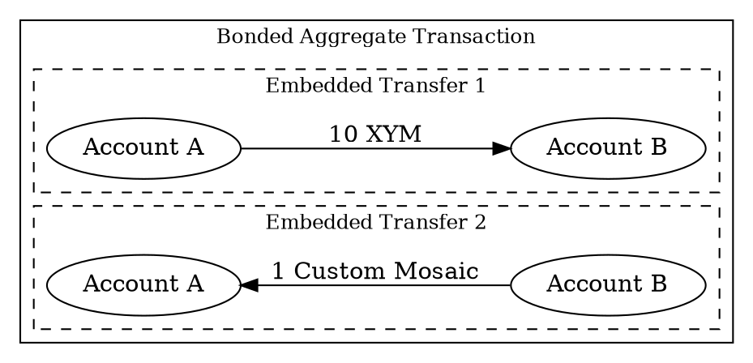

# Creating a Bonded Aggregate Transaction

This tutorial shows how to create an asset swap using <bonded aggregate transactions:>.

In this example, Account A sends 10 <XYM:> to Account B, while Account B simultaneously sends 1 custom <mosaic:> back
to Account A:



!!! note "Two types of aggregate transactions"

    <Aggregate transactions:> group multiple <transactions:> in single operation, and require <signatures:> from all
    involved accounts.

    A _bonded aggregate transaction_ collects signatures on-chain after being announced.
    This works well when off-chain coordination is impractical:

    * **No shared infrastructure:** Parties cannot coordinate through a common system, so the blockchain serves
      as the common interface.
    * **Asynchronous workflows:** Cosigners are not available at the same time or cannot coordinate in real-time.

    To prevent spam, bonded aggregates require a *hash lock* (a deposit of 10 XYM).
    The network returns this deposit when all cosignatures arrive and the transaction reaches confirmation.

    If parties can communicate off-chain to exchange signatures, <complete aggregate transactions:> don't require this
    deposit.

## Prerequisites

Before you start, make sure to:

* Set up your development environment.
  See [Setting Up a Development Environment](../start/setup.md).
* Create an <account:> (Account A) to initiate the aggregate transaction, either
  [from code](../accounts/create-from-private-key.md) or
  [by using a wallet](../../userbook/wallet/create-account.md).
* Create a second account (Account B) to participate in the swap.
* Obtain <XYM:> for Account A to pay for the transaction fee, transfer amounts, and the hash lock deposit.
  See [Getting Testnet Funds from the Faucet](../accounts/testnet-faucet.md).
* Create a <mosaic:> owned by Account B for the swap.

## Full Code



{{ tutorial.code_full('devbook/transactions/bonded-aggregate', ['py', 'js']) }}

The whole code is wrapped in a single `try` block to provide simple error handling,
but applications will probably want to use more fine-grained control.

## Code Explanation

### Setting Up Accounts

{{ tutorial.code_snippet(['py:66:86', 'js:71:89']) }}

This example includes both private keys in one script to demonstrate the complete workflow, but in practice
each party would sign on their own machine without sharing private keys.

The snippet reads the private keys from the `ACCOUNT_A_PRIVATE_KEY` and `ACCOUNT_B_PRIVATE_KEY`
environment variables, which default to test keys if not set.
If using your own keys, ensure Account A has XYM and Account B holds a custom mosaic for the swap.

The addresses for both accounts are derived from their public keys using the facade's network
configuration.

### Fetching Network Time and Fees

{{ tutorial.code_snippet(['py:89:107', 'js:92:110']) }}

To prepare an aggregate, first retrieve the current network time from <get:/node/time> and the recommended fee
multiplier from <get:/network/fees/transaction>, following the same steps described in the
[Transfer Transaction](./transfer.md) tutorial.

### Creating Embedded Transactions

{{ tutorial.code_snippet(['py:109:130', 'js:112:135']) }}

The <embedded transactions:> define the operations to execute atomically.
Each embedded transaction specifies:

* **Type:** All transaction types can be embedded within aggregates (except other aggregates).
  For embedded transfers, use `transfer_transaction_v1`, the same as for basic transfer transactions.

* **Signer public key:** The account that would sign this transaction if it were announced
  independently.

* **Transaction-specific fields:** All fields specific to the transaction type must be provided.
  For transfers, this includes the recipient address and the <mosaics:> to send.

Note that embedded transactions do **not** include fee or deadline fields.
These are inherited from the enclosing aggregate transaction.

The example creates two <transfer transactions:> for the swap:

* The first transfer sends 10 XYM from Account A to Account B.
* The second transfer sends 1 custom mosaic from Account B to Account A.

!!! note "About the custom mosaic"

    The custom mosaic with ID `0x6D1314BE751B62C2` was created for this tutorial.
    The default Account B has been seeded with this mosaic so the swap can execute successfully.

    If using your own accounts, ensure Account B holds a custom mosaic and update the mosaic ID in the code.

### Building the Aggregate Transaction

{{ tutorial.code_snippet(['py:132:148', 'js:137:154']) }}

Once the embedded transactions are prepared, create the bonded aggregate transaction that wraps them:

* **Type:** Use `aggregate_bonded_transaction_v3`.

* **Signer public key:** The account initiating the aggregate.
  This account announces the transaction and pays the transaction fee.

    !!! tip "Sharing transaction fees"

        While the signer pays the entire fee upfront, other participants can contribute to the cost by including
        XYM transfers back to the signer within the aggregate.

        For example, Account B could add XYM to its existing transfer to Account A, or include a separate embedded
        transfer transaction for the fee contribution.

        This technique allows parties to split costs or even enables one account to send transactions
        without holding XYM, since another account covers the fee.

* **Deadline:** The timestamp, in [network time](./transfer.md#fetching-network-time), after which the transaction
  expires and can no longer be confirmed.

* **Transactions hash:** A hash computed from all embedded transactions.
  This ensures the embedded transactions cannot be modified after signing.
  Use <dy:SymbolFacade.hashEmbeddedTransactions> to compute this value.

* **Transactions:** The array of embedded transactions to execute.

The fee is calculated based on the aggregate's total size, which includes all embedded transactions plus
space reserved for one <cosignature:> (104 bytes).

### Signing the Bonded Transaction

{{ tutorial.code_snippet(['py:150:158', 'js:156:165']) }}

Account A signs the bonded transaction, producing the main signature and finalizing the transaction hash.

This hash is required for the next step: creating a hash lock transaction.

### Creating the Hash Lock

{{ tutorial.code_snippet(['py:160:186', 'js:167:196']) }}

Before announcing a bonded aggregate, a hash lock transaction must be created and confirmed.
The hash lock serves as a deposit to prevent spam and ensure network resources are not exhausted by unfinished
<partial transactions:>.

The hash lock transaction specifies:

* **Type:** Use `hash_lock_transaction_v1`.

* **Mosaic:** The deposit amount (10 XYM). This deposit is locked temporarily while waiting for
  cosignatures.

* **Duration:** The number of blocks the deposit remains locked (100 blocks in this example).
  If all cosignatures are collected and the bonded aggregate confirms before the duration expires,
  the deposit is returned. Otherwise, it is forfeited.

* **Hash:** The hash of the bonded aggregate transaction being locked.

The hash lock is signed using <dy:SymbolFacade.signTransaction> and announced using the `announce_transaction` helper
function.
It must be confirmed before the bonded aggregate can be announced.

Then, the `wait_for_status` helper function polls the transaction status until confirmation.

### Announcing the Bonded Transaction

{{ tutorial.code_snippet(['py:188:196', 'js:198:204']) }}

Once the hash lock is confirmed, the bonded aggregate is announced to <put:/transactions/partial> using the
`announce_transaction` helper.

The <node:> validates the transaction, checks that a valid hash lock exists, and places it in a partial state.
The `wait_for_status` helper monitors the transaction until it reaches this state, at which point it can collect
cosignatures.

### Submitting Cosignatures

{{ tutorial.code_snippet(['py:198:252', 'js:206:267']) }}

Unlike complete aggregates where the transaction payload is shared off-chain, bonded aggregates enable true on-chain
coordination.
Account B discovers and retrieves the partial transaction directly from the blockchain.

First, Account B polls <get:/transactions/partial> with the `address` parameter to find transactions waiting for their
signature.
This returns a list of partial transactions involving Account B.

Once a transaction is found, Account B uses its hash to fetch the full details (including embedded transactions) from
<get:/transactions/partial/{transactionId}>.

After verifying the transaction content, Account B cosigns it using <dy:SymbolFacade.cosignTransactionHash> with the
transaction hash and the `detached` parameter set to `true` (Python) or passed as the third argument (JavaScript).

!!! warning "Verify before cosigning"

    Always inspect transaction content before cosigning.
    Cosignatures are binding and cannot be undone.

The resulting detached cosignature includes a `parent_hash` field identifying the bonded transaction, along
with Account B's signature.

The cosignature is submitted using the `announce_transaction` helper function to <put:/transactions/cosignature>.
The network validates the cosignature and attaches it to the partial transaction.

Once enough cosignatures are collected to satisfy all embedded transactions,
the network automatically processes the bonded aggregate and includes it in a block.

### Waiting for Confirmation

{{ tutorial.code_snippet(['py:254:258', 'js:269:272']) }}

After the cosignature is submitted, the `wait_for_status` helper function polls
<get:/transactionStatus/{hash}> until the transaction is confirmed or fails.

If all required cosignatures are collected before the deadline, the transaction confirms, both transfers execute,
and the hash lock deposit is returned to Account A.

If the deadline expires or any cosignature is invalid, the transaction fails and the deposit is forfeited.

## Output

The output shown below corresponds to a typical run of the program.

```text linenums="1" hl_lines="14 18 48 51 55 63 66 68 70 72"
--8<-- 'devbook/transactions/bonded-aggregate.log'
```

Key points in the output:

* `"type": 16961`: Indicates this is an `aggregate_bonded_transaction_v3`.
* `"transactions"`: Contains the two embedded transfers that will execute atomically.
* `"cosignatures": []`: Initially empty. Cosignatures are submitted on-chain after announcement.
* `Bonded transaction hash`: The hash of the bonded aggregate, required for creating the hash lock and
  announcing the transaction.
* `Announcing Hash lock to /transactions`: A hash lock must be announced and confirmed before the bonded aggregate.
* `Announcing Bonded aggregate transaction to /transactions/partial`: Bonded aggregates use a different endpoint than
  regular transactions.
* `Transaction is partial, ready for cosignatures`: The bonded aggregate is now waiting for cosignatures to be
  submitted on-chain.
* `Found 1 partial transaction(s)`: Account B discovers partial transactions waiting for signature.
* `Verifying transaction: 2 embedded transactions`: Account B inspects the transaction content before cosigning to
  ensure they agree with all operations.
* `Announcing cosignature to /transactions/cosignature`: The cosignature is submitted to the network.

The aggregate transaction is treated as a single atomic unit by the network.
The swap executes completely: Account A receives the custom mosaic and Account B receives the XYM,
or the entire transaction fails and no assets are transferred.

## Conclusion

This tutorial showed how to:

| Step                                                                   | Related documentation                                                               |
| -----------------------------------------------------------------------| ------------------------------------------------------------------------------------|
| [Create embedded transactions](#creating-embedded-transactions)        | <dy:SymbolTransactionFactory.createEmbedded>                                        |
| [Build the aggregate](#building-the-aggregate-transaction)             | <dy:SymbolTransactionFactory.create><br/><dy:SymbolFacade.hashEmbeddedTransactions> |
| [Create hash lock](#creating-the-hash-lock)                            | <dy:SymbolFacade.signTransaction><br/><put:/transactions>                           |
| [Announce bonded transaction](#announcing-the-bonded-transaction)      | <put:/transactions/partial>                                                         |
| [Retrieve partial transactions](#submitting-cosignatures)              | <get:/transactions/partial><br/><get:/transactions/partial/{transactionId}>         |
| [Submit cosignatures](#submitting-cosignatures)                        | <dy:SymbolFacade.cosignTransactionHash><br/><put:/transactions/cosignature>         |
