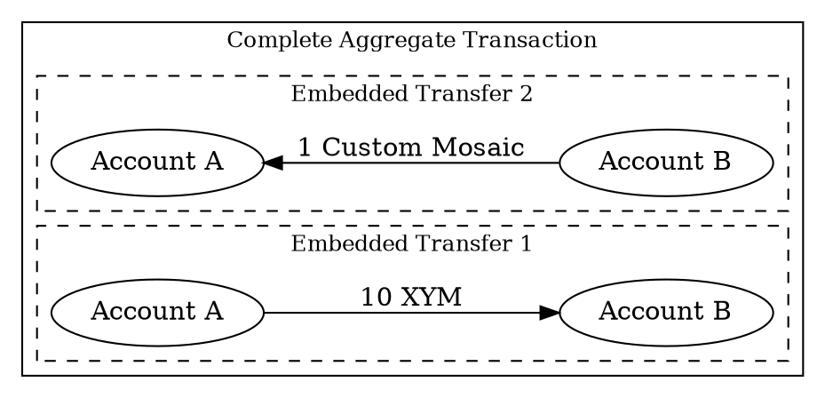

# Creating a Complete Aggregate Transaction


This tutorial shows how to create an asset swap using <complete aggregate transactions:>.

In this example, Account A sends 10 <XYM:> to Account B, while Account B simultaneously sends 1 custom <mosaic:> back
to Account A:



Both parties coordinate off-chain to collect signatures before announcement, ensuring the swap executes as a
single atomic transaction.


!!! tip "When to use complete vs bonded aggregates"

    Complete aggregates work well in the following cases:

    - A single account batches multiple transactions.
    - Multiple parties coordinate off-chain to collect <signatures:> before publishing the transaction.

    If off-chain coordination is impractical, use <Bonded Aggregate Transactions:> instead,
    which allow <cosignatures:> to be added on-chain.

## Prerequisites

Before you start, make sure to:

- Set up your development environment.
  See [Setting Up a Development Environment](../start/setup.md).
- Create an <account:> to initiate the aggregate transaction, either
  [from code](../accounts/create-from-private-key.md) or
  [by using a wallet](../../userbook/wallet/create-account.md).
- Obtain <XYM:> to pay for the transaction fee and transfer amounts.
  See [Getting Testnet Funds from the Faucet](../accounts/testnet-faucet.md).

Additionally, review the [Transfer transaction](./transfer.md) tutorial to understand how
transactions are announced and confirmed.

## Full Code



{{ tutorial.code_full('devbook/transactions/complete-aggregate', ['py', 'js']) }}

The whole code is wrapped in a single `try` block to provide simple error handling,
but applications will probably want to use more fine-grained control.

## Code Explanation

### Setting Up Accounts

{{ tutorial.code_snippet(['py:15:35', 'js:12:28']) }}

Both accounts must sign the aggregate transaction.
This example includes both private keys in one script to demonstrate the complete workflow, but in practice
each party would sign on their own machine without sharing private keys.

The snippet reads the private keys from the `ACCOUNT_A_PRIVATE_KEY` and `ACCOUNT_B_PRIVATE_KEY`
environment variables, which default to test keys if not set.
The addresses for both accounts are derived from their public keys using the facade's network
configuration.


### Fetching Network Time and Fees

{{ tutorial.code_snippet(['py:38:56', 'js:31:49']) }}

To prepare an aggregate, first retrieve the current network time from <get:/node/time> and the recommended fee
multiplier from <get:/network/fees/transaction>, following the same steps described in the
[Transfer Transaction](./transfer.md) tutorial.

### Creating Embedded Transactions

{{ tutorial.code_snippet(['py:58:79', 'js:56:79']) }}

The <embedded transactions:> define the operations to execute atomically.
Each embedded transaction specifies:

* **Type:** All transaction types can be embedded within aggregates (except other aggregates).
  For embedded transfers, use `transfer_transaction_v1`, the same as for basic transfer transactions.

* **Signer public key:** The account that would sign this transaction if it were announced
  independently.

* **Transaction-specific fields:** All fields specific to the transaction type must be provided.
  For transfers, this includes the recipient address and the <mosaics:> to send.

Note that embedded transactions do **not** include fee or deadline fields.
These are inherited from the enclosing aggregate transaction.

The example creates two <transfer transactions:> for the swap:

* The first transfer sends 10 <XYM:> from Account A to Account B.
* The second transfer sends 1 custom <mosaic:> from Account B to Account A.

### Building the Aggregate Transaction

{{ tutorial.code_snippet(['py:81:96', 'js:81:98']) }}

Once the embedded transactions are prepared, create the complete aggregate transaction that wraps them:

* **Type:** Use `aggregate_complete_transaction_v3`.

* **Signer public key:** The account initiating the aggregate.
  This account announces the transaction and pays the transaction fee.

* **Deadline:** The maximum time the network should attempt to confirm the transaction.

* **Transactions hash:** A hash computed from all embedded transactions.
  This ensures the embedded transactions cannot be modified after signing.
  Use <dy:SymbolFacade.hashEmbeddedTransactions> to compute this value.

* **Transactions:** The array of embedded transactions to execute.

The <fee:> is calculated based on the aggregate's total size, which includes all embedded transactions plus
space reserved for <cosignatures:> (104 bytes each).

### Collecting Signatures

{{ tutorial.code_snippet(['py:98:134', 'js:100:136']) }}

With the aggregate built, both accounts must sign it off-chain before announcement.

The snippet shows this process in distinct sections showing what happens on each machine:


1. **Account A (Initiator)** signs the transaction using <dy:SymbolFacade.signTransaction> and attaches the
signature using <dy:SymbolTransactionFactory.attachSignature> to create a shareable payload.
Account A then sends this payload to Account B through an off-chain channel.

2. **Account B (Cosignatory)** receives the payload and deserializes it using
<dy:SymbolTransactionFactory.deserialize> to reconstruct the transaction object.
Account B then cosigns using <dy:SymbolFacade.cosignTransaction>, which computes the transaction hash and
signs it.
The cosignature is sent back to Account A.

3. **Account A** receives the cosignature and adds it to the transaction object's cosignatures array,
then rebuilds the payload.

!!! note "Single-signer complete aggregates"

    When all embedded transactions share the same signer, such as batching multiple operations
    from one account, cosignatures are **not** required.

    In this case, the complete aggregate transaction can be announced immediately after signing, and the fee
    calculation does not need to reserve space for cosignatures.

### Announcing the Transaction

{{ tutorial.code_snippet(['py:136:149', 'js:138:150']) }}

Once all signatures are collected, the transaction is announced to a <node:> using the
<put:/transactions> endpoint.

The node validates that all required signatures are present and valid before accepting the transaction.
If validation passes, the transaction is added to the <unconfirmed pool:> and broadcast to other nodes.

### Waiting for Confirmation

{{ tutorial.code_snippet(['py:151:171', 'js:152:174']) }}

After announcement, the transaction status is monitored using <get:/transactionStatus/{hash}>.

The polling loop checks the status every second until the transaction is confirmed or fails.
Once confirmed, the swap is complete and both transfers have executed.

## Output

The output shown below corresponds to a typical run of the program.

```text
--8<-- 'devbook/transactions/complete-aggregate.log'
```

The aggregate transaction is treated as a single atomic unit by the network.
The swap executes completely: Account A receives the custom mosaic and Account B receives the XYM,
or the entire transaction fails and no assets are transferred.

You can view the transactions on the [Symbol Testnet Explorer](https://testnet.symbol.fyi/) by searching for the
aggregate transaction hash announced.

## Conclusion

This tutorial showed how to:

| Step                                                                   | Related documentation                                                               |
| ---------------------------------------------------------------------- | ------------------------------------------------------------------------------------|
| [Obtain deadline and fee information](#fetching-network-time-and-fees) | <get:/node/time><br/><get:/network/fees/transaction>                                |
| [Create embedded transactions](#creating-embedded-transactions)        | <dy:SymbolTransactionFactory.createEmbedded>                                        |
| [Build the aggregate](#building-the-aggregate-transaction)             | <dy:SymbolTransactionFactory.create><br/><dy:SymbolFacade.hashEmbeddedTransactions> |
| [Collect signatures off-chain](#collecting-signatures)                 | <dy:SymbolFacade.signTransaction><br/><dy:SymbolFacade.cosignTransaction>           |
| [Announce the transaction](#announcing-the-transaction)                | <put:/transactions>                                                                 |
| [Wait for confirmation](#waiting-for-confirmation)                     | <get:/transactionStatus/{hash}>                                                     |
