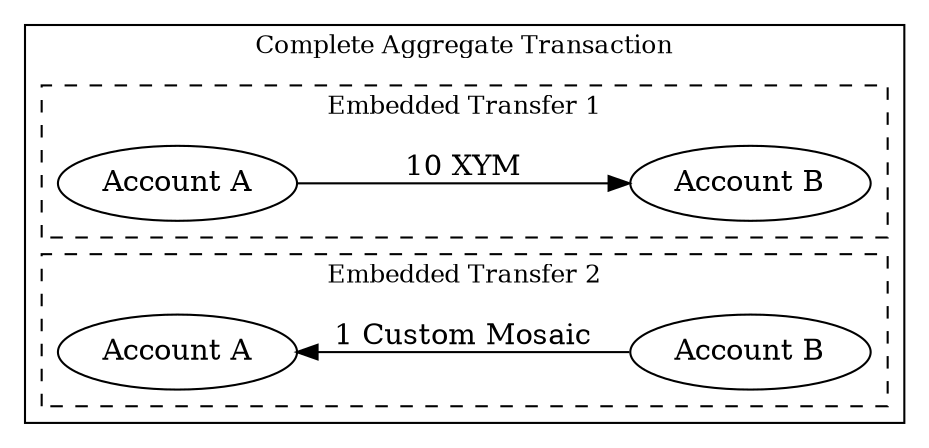

# Creating a Complete Aggregate Transaction

This tutorial shows how to create an asset swap using <complete aggregate transactions:>.

In this example, Account A sends 10 <XYM:> to Account B, while Account B simultaneously sends 1 custom <mosaic:> back
to Account A:



Both parties coordinate off-chain to collect signatures before announcement, ensuring the swap executes as a
single atomic transaction.

!!! note "Two types of aggregate transactions"

    <Aggregate transactions:> group multiple <transactions:> in single operation, and require <signatures:> from all
    involved accounts.

    A _complete aggregate transaction_ collects all signatures before being announced.
    This works well in two scenarios:

    * **Multi-party coordination:** When parties can communicate off-chain to exchange transaction payloads and
      cosignatures.
    * **Single-account batching:** When one account wants to execute multiple transactions atomically.
      No cosignatures are needed in this case.

    If off-chain coordination is impractical, use <bonded aggregate transactions:> instead,
    which allow <cosignatures:> to be added on-chain.

## Prerequisites

Before you start, make sure to:

* Set up your development environment.
  See [Setting Up a Development Environment](../start/setup.md).
* Create an <account:> (Account A) to initiate the aggregate transaction, either
  [from code](../accounts/create-from-private-key.md) or
  [by using a wallet](../../userbook/wallet/create-account.md).
* Create a second account (Account B) to participate in the swap.
* Obtain <XYM:> for Account A to pay for the transaction fee and transfer amounts.
  See [Getting Testnet Funds from the Faucet](../accounts/testnet-faucet.md).
* Create a <mosaic:> owned by Account B for the swap.

Additionally, review the [Transfer transaction](./transfer.md) tutorial to understand how
transactions are announced and confirmed.

## Full Code



{{ tutorial.code_full('devbook/transactions/complete-aggregate', ['py', 'js']) }}

The whole code is wrapped in a single `try` block to provide simple error handling,
but applications will probably want to use more fine-grained control.

## Code Explanation

### Setting Up Accounts

{{ tutorial.code_snippet(['py:15:36', 'js:12:30']) }}

This example includes both private keys in one script to demonstrate the complete workflow, but in practice
each party would sign on their own machine without sharing private keys.

The snippet reads the private keys from the `ACCOUNT_A_PRIVATE_KEY` and `ACCOUNT_B_PRIVATE_KEY`
environment variables, which default to test keys if not set.
If using your own keys, ensure Account A has XYM and Account B holds a custom mosaic for the swap.

The addresses for both accounts are derived from their public keys using the facade's network
configuration.

### Fetching Network Time and Fees

{{ tutorial.code_snippet(['py:38:56', 'js:33:51']) }}

To prepare an aggregate, first retrieve the current network time from <get:/node/time> and the recommended fee
multiplier from <get:/network/fees/transaction>, following the same steps described in the
[Transfer Transaction](./transfer.md) tutorial.

### Creating Embedded Transactions

{{ tutorial.code_snippet(['py:58:79', 'js:53:76']) }}

The <embedded transactions:> define the operations to execute atomically.
Each embedded transaction specifies:

* **Type:** All transaction types can be embedded within aggregates (except other aggregates).
  For embedded transfers, use `transfer_transaction_v1`, the same as for basic transfer transactions.

* **Signer public key:** The account that would sign this transaction if it were announced
  independently.

* **Transaction-specific fields:** All fields specific to the transaction type must be provided.
  For transfers, this includes the recipient address and the mosaics to send.

Note that embedded transactions do **not** include fee or deadline fields.
These are inherited from the enclosing aggregate transaction.

The example creates two <transfer transactions:> for the swap:

* The first transfer sends 10 XYM from Account A to Account B.
* The second transfer sends 1 custom mosaic from Account B to Account A.

!!! note "About the custom mosaic"

    The custom mosaic with ID `0x6D1314BE751B62C2` was created for this tutorial.
    The default Account B has been seeded with this mosaic so the swap can execute successfully.

    If using your own accounts, ensure Account B holds a custom mosaic and update the mosaic ID in the code.

### Building the Aggregate Transaction

{{ tutorial.code_snippet(['py:81:96', 'js:78:95']) }}

Once the embedded transactions are prepared, create the complete aggregate transaction that wraps them:

* **Type:** Use `aggregate_complete_transaction_v3`.

* **Signer public key:** The account initiating the aggregate.
  This account announces the transaction and pays the transaction fee.

    !!! tip "Sharing transaction fees"

        While the signer pays the entire fee upfront, other participants can contribute to the cost by including
        XYM transfers back to the signer within the aggregate.

        For example, Account B could add XYM to its existing transfer to Account A, or include a separate embedded
        transfer transaction for the fee contribution.

        This technique allows parties to split costs or even enables one account to send transactions
        without holding XYM, since another account covers the fee.

* **Deadline:** The timestamp, in [network time](./transfer.md#fetching-network-time), after which the transaction
  expires and can no longer be confirmed.

* **Transactions hash:** A hash computed from all embedded transactions.
  This ensures the embedded transactions cannot be modified after signing.
  Use <dy:SymbolFacade.hashEmbeddedTransactions> to compute this value.

* **Transactions:** The array of embedded transactions to execute.

The fee is calculated based on the aggregate's total size, which includes all embedded transactions plus
space reserved for one <cosignature:> (104 bytes).

### Collecting Signatures

{{ tutorial.code_snippet(['py:98:133', 'js:97:138']) }}

With the aggregate transaction built, both accounts must sign it off-chain before it can be announced.

The snippet above separates the process by machine:

1. **Account A (Initiator)** signs the transaction using <dy:SymbolFacade.signTransaction>.
  It then uses <dy:SymbolTransactionFactory.attachSignature> which normally produces a fully announce-ready payload.
  In this case, however, the payload is still missing Account B’s cosignature.
  Account A sends this intermediate payload to Account B through an off-chain channel.

2. **Account B (Cosignatory)** receives the payload and deserializes it using
  <dy:SymbolTransactionFactory.deserialize> to reconstruct the transaction object.
  Account B should verify that the embedded transactions match what it expects to sign.
  It then cosigns using <dy:SymbolFacade.cosignTransaction>, which computes the transaction hash and produces a
  cosignature object.
  Only this cosignature is sent back to Account A.

3. **Account A** receives the Account B's cosignature, adds it to the transaction object's `cosignatures` array, and
  rebuilds the payload for announcement.

!!! note "Signatures in aggregate transactions"

    An account only signs once, even if it appears as the signer in multiple embedded transactions.
    In this tutorial, Account A signs the aggregate transaction, which covers both the aggregate itself and the
    first embedded transaction where Account A is the signer.

    When all embedded transactions share the same signer (batching multiple operations from one account),
    cosignatures are **not** required. The aggregate can be announced immediately after signing, and the fee
    calculation does not need to reserve space for cosignatures.

    See [Embedded Transactions](../../textbook/transactions.md#embedded-transactions) for more details.

### Announcing the Transaction

Now that the transaction is ready to be announced, it follows the same process as regular, non-aggregate transactions,
as shown in the [Transfer Transaction](./transfer.md#announcing-the-transaction) tutorial.

{{ tutorial.code_snippet(['py:135:148', 'js:140:152']) }}

Once all signatures are collected, the transaction is announced to a <node:> using the
<put:/transactions> endpoint.

The node validates that all required signatures are present and valid before accepting the transaction.
If validation passes, the transaction is added to the <unconfirmed pool:> and broadcast to other nodes.

### Waiting for Confirmation

{{ tutorial.code_snippet(['py:150:170', 'js:154:178']) }}

After announcement, the transaction status is monitored using <get:/transactionStatus/{hash}>.

The polling loop checks the status every second until the transaction is confirmed or fails.
Once confirmed, the swap is complete and both transfers have executed.

## Output

The output shown below corresponds to a typical run of the program.

```text linenums="1" hl_lines="10 14 18 48 53 60 66"
--8<-- 'devbook/transactions/complete-aggregate.log'
```

Key points in the output:

* `"signature": "0000..."`: Shows all zeros initially because the transaction hasn't been signed yet.
* `"type": 16705`: Indicates this is an `aggregate_complete_transaction_v3`.
* `"transactions"`: Contains the two embedded transfers that will execute atomically.
* `"cosignatures": []`: Initially empty. Account B's cosignature is added before announcement.
  Note how Account A's signature is only needed once, even though it appears as signer in both the aggregate and the 
  first embedded transaction.
* `"payload": "8010..."`: The transaction payload computed from the aggregate transaction and its embedded transactions.
* `"signature": "7037..."`: Account B's cosignature for the aggregate transaction.
* `Waiting for confirmation ...`: The hash shown in the confirmation check can be used to search for the transaction
  in the [Symbol Testnet Explorer](https://testnet.symbol.fyi/).

The aggregate transaction is treated as a single atomic unit by the network.
The swap executes completely: Account A receives the custom mosaic and Account B receives the XYM,
or the entire transaction fails and no assets are transferred.

## Conclusion

This tutorial showed how to:

| Step                                                                   | Related documentation                                                               |
| ---------------------------------------------------------------------- | ------------------------------------------------------------------------------------|
| [Create embedded transactions](#creating-embedded-transactions)        | <dy:SymbolTransactionFactory.createEmbedded>                                        |
| [Build the aggregate](#building-the-aggregate-transaction)             | <dy:SymbolTransactionFactory.create><br/><dy:SymbolFacade.hashEmbeddedTransactions> |
| [Collect signatures off-chain](#collecting-signatures)                 | <dy:SymbolFacade.signTransaction><br/><dy:SymbolFacade.cosignTransaction>           |
