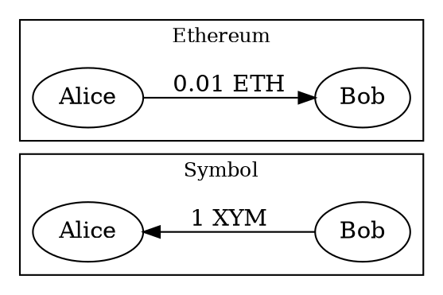

# Cross-Chain Swap Between Symbol and Ethereum

Two parties, Alice and Bob, want to exchange 0.01 ETH (on Ethereum) for 1 <XYM:> (on Symbol) without trusting each
other or using an intermediary.



Since the tokens exist on two separate blockchains, a direct transfer is not possible.
If both tokens were on Symbol, this exchange could be done in a single <aggregate transaction:>, as shown in the
[Atomic Swap](./atomic-swap.md) tutorial.
Because the tokens live on different chains, the swap must instead be coordinated using a <cross-chain swap:>.

This tutorial shows how to perform this token swap between chains using an <HTLC:> smart contract on Ethereum and
Symbol's native transactions.

To interact with both chains, the tutorial uses the Symbol SDK and an Ethereum client library.

!!! info "Supported chains"
    This tutorial demonstrates the swap between Symbol and Ethereum, but Symbol's secret lock mechanism works with
    any blockchain that supports HTLCs.

For background on the HTLC protocol, timing constraints, and limitations, see the
[Cross-Chain Swaps](../../textbook/cross-chain-swaps.md) concept page.

## Prerequisites

Before you start, make sure to:

* Set up your development environment.
    See [Setting Up a Development Environment](../start/setup.md).
* Create two Symbol <accounts:>, one for Alice and one for Bob.
    See [Creating an Account from a Private Key](../accounts/create-from-private-key.md).
* Obtain XYM for Bob's account to pay for the secret lock transaction fee and locked amount.
    See [Getting Testnet Funds from the Faucet](../accounts/testnet-faucet.md).
* Create two Ethereum accounts, one for Alice and one for Bob.
    You can use [Foundry](https://book.getfoundry.sh/getting-started/installation)'s `cast wallet new` command or any
    Ethereum wallet such as MetaMask.
* Have Sepolia testnet ETH in both Ethereum accounts to pay for gas fees and enough in Alice's account to fund the HTLC.
    Sepolia ETH can be obtained from the
    [Google Cloud faucet](https://cloud.google.com/application/web3/faucet/ethereum/sepolia) or any other Ethereum
    testnet faucet.

* Install the Ethereum library for your language:

    === ":simple-python: Python"

        ```bash
        pip install web3
        ```

    === ":simple-javascript: JavaScript"

        ```bash
        npm install ethers
        ```

## Full Code



{{ tutorial.code_full_tagged('devbook/transactions/cross-chain-swap', ['py', 'js']) }}

## Ethereum HTLC Contract

This tutorial uses a sample HTLC contract deployed on Ethereum as the other side of Symbol's secret lock.
The contract source is available in the
[hashed-timelock-contract-ethereum](https://github.com/theSymbolSyndicate/hashed-timelock-contract-ethereum)
repository.

!!! warning "Educational use only"
    Any contract used in production must carefully calibrate lock and contract expiry times, as timing is critical for
    the security of both parties.

The contract provides three key methods:

* `newContract(address receiver, bytes32 hashlock, uint timelock)`: Creates a new HTLC with a recipient, hashlock, and
    a Unix timestamp as timelock.
    Comparable to Symbol's <ser:SecretLockTransactionV1>.
* `withdraw(bytes32 contractId, bytes proof)`: Allows the recipient to claim funds by providing the proof that matches
    the hashlock.
    Comparable to Symbol's <ser:SecretProofTransactionV1>.
* `refund(bytes32 contractId)`: Returns funds to the creator after the timelock expires.
    In Symbol, refunds happen automatically when a secret lock expires.

The contract has been deployed on the Sepolia testnet at address `0xd58e030bd21c7788897aE5Ea845DaBA936e91D2B`.

## Code Explanation

Alice and Bob each need an account on both chains: Alice locks ETH on Ethereum and claims XYM on Symbol, while Bob
locks XYM on Symbol and claims ETH on Ethereum.
Alice is the initiator: she generates a random secret (the _proof_), computes its cryptographic hash (the
_hashlock_), and locks her ETH on Ethereum behind it.
Bob then locks his XYM on Symbol using the **same hashlock**, so only revealing the proof can unlock either side.

The code runs these four steps in order:

```graphviz neato cross-chain-swap-steps.svg
digraph CrossChainSwapSteps {
    node [fontsize=24 shape=point width=0];
    edge [arrowhead=none];
    pad=0.5;

    // Alice's lock bar (Ethereum - longer, top)
    A_start [pos="0,5!" width=0.2];
    A_end [pos="12,5!" width=0.2];
    A_start -> A_end [style=bold penwidth=5];
    A_label [label="Alice's ETH lock on Ethereum (72h)" shape=plaintext pos="6,5.3!"];

    // Bob's lock bar (Symbol - shorter)
    B_start [pos="2,2!" width=0.2];
    B_end [pos="7,2!" width=0.2];
    B_start -> B_end [style=bold penwidth=5];
    B_label [label="Bob's XYM lock on Symbol (48h)" shape=plaintext pos="4.5,2.3!"];

    // Vertical ticks
    T1_top [pos="0,5!"];
    T1_bot [pos="0,0.8!"];
    T1_top -> T1_bot [style=dotted];

    T2_top [pos="2,2!"];
    T2_bot [pos="2,0.8!"];
    T2_top -> T2_bot [style=dotted];

    T3_top [pos="5,2!"];
    T3_bot [pos="5,0.8!"];
    T3_top -> T3_bot [style=dotted];

    T5_top [pos="10,5!"];
    T5_bot [pos="10,0.8!"];
    T5_top -> T5_bot [style=dotted];

    // Labels below
    L1 [label="1. Alice\nlocks ETH" shape=plaintext pos="0,0.2!"];
    L2 [label="2. Bob\nlocks XYM" shape=plaintext pos="2,0.2!"];
    L3 [label="3. Alice\nclaims XYM\nand reveals proof" shape=plaintext pos="5,0.2!"];
    L5 [label="4. Bob\nclaims ETH\n " shape=plaintext pos="10,0.2!"];
}
```



1. **Alice locks ETH on Ethereum** in the Ethereum HTLC contract, guarded by the hashlock.
    The matching proof, which only Alice knows at this point, can release the lock.
2. **Bob locks XYM on Symbol** using a <ser:SecretLockTransactionV1> with the same hashlock.
3. **Alice claims XYM on Symbol** by revealing the proof through a <ser:SecretProofTransactionV1>, making the proof
    public on Symbol.
4. **Bob claims ETH on Ethereum** by reading Alice's proof from Symbol and calling `withdraw` on the Ethereum HTLC
    contract.

In practice, Alice and Bob would each run their own part on different machines.
This tutorial combines both sides in a single script for simplicity.

The code defines helper functions to fetch the network time and fees, announce transactions, and poll for confirmation,
following the same patterns described in the [Transfer](./transfer.md) tutorial.

This tutorial does not wait for transaction <finalization:|finality> between steps,
which a production implementation must do to prevent rollback-related risks.

### Setting Up Accounts

{{ tutorial.code_snippet_tagged('step-1') }}

The `ALICE_XYM_PRIVATE_KEY` and `BOB_XYM_PRIVATE_KEY` environment variables set the Symbol keys, while
`ALICE_ETH_PRIVATE_KEY` and `BOB_ETH_PRIVATE_KEY` set the Ethereum keys.
Although pre-funded test keys are provided as defaults for convenience, they are not maintained and may run out of
funds.

### Alice: Generating the Proof and Hashlock

{{ tutorial.code_snippet_tagged('step-2') }}

As the swap initiator, Alice generates a random 32-byte value as the **proof**.
She then hashes it using double SHA-256 to produce the **hashlock**.

The double SHA-256 algorithm is chosen because it is supported by both Symbol (as `hash_256`) and the Ethereum HTLC
contract.
Using the same algorithm on both chains is essential for the swap to work.

!!! info "Other hash algorithms"
    Symbol supports other hash algorithms for secret locks.
    See <ser:LockHashAlgorithm> for all available values.

### Step 1. Alice: Locking ETH on Ethereum

{{ tutorial.code_snippet_tagged('step-3') }}

Alice calls `newContract` on the Ethereum HTLC contract, locking 0.01 ETH for Bob:

* **Receiver:** Bob's Ethereum address.
* **Hashlock:** The double SHA-256 hash of the proof. Only Alice knows the proof at this point.
* **Timelock:** A Unix timestamp 72 hours in the future, after which Alice can reclaim the ETH if Bob does not complete
    the swap.
* **Value:** 0.01 ETH sent along with the transaction.

The transaction receipt contains a `LogHTLCNew` event with a `contractId` that identifies this HTLC.
Bob will need this `contractId` later to withdraw the ETH.

### Step 2. Bob: Creating a Secret Lock on Symbol

{{ tutorial.code_snippet_tagged('step-4') }}

Bob first queries the Ethereum HTLC contract using `getContract` to retrieve the hashlock that Alice used.

!!! note "Verify before locking"
    Bob should verify the full contract details (amount, recipient, timelock) before locking his own funds.
    This tutorial only reads the hashlock for simplicity.

Bob then creates a <ser:SecretLockTransactionV1> on Symbol, locking 1 XYM for Alice, using the **same hashlock**:

* **Recipient:** Alice's Symbol address.
* **Mosaic:** 1 XYM (expressed as `1_000000` atomic units with divisibility 6).
* **Duration:** 5760 blocks (~48 hours at 30-second block times).

    !!! warning "Timelock ordering"
        This duration must be **shorter** than Alice's 72-hour Ethereum timelock.
        Otherwise, Alice could refund her ETH and still claim Bob's XYM.
        The gap between the two must be **large** enough: it is the safety margin that allows Bob to withdraw on
        Ethereum even if Alice reveals the proof at the last moment.
        See [Safety Considerations](../../textbook/cross-chain-swaps.md#safety-considerations).

* **Hashlock (`secret` field):** The hashlock retrieved from the Ethereum contract.
* **Hash algorithm:** `hash_256` (double SHA-256), must match the algorithm used in the other chain's HTLC.

### Step 3. Alice: Claiming XYM on Symbol

{{ tutorial.code_snippet_tagged('step-5') }}

Once Bob's secret lock is confirmed and Alice has verified it matches the expected amount, hashlock, recipient, and
timelock, she claims the locked XYM
on Symbol by revealing the proof.

She creates a <ser:SecretProofTransactionV1> with:

* **Recipient:** Alice's own Symbol address (the same address set in Bob's secret lock).
* **Hashlock (`secret` field):** The same hashlock used in the secret lock.
* **Hash algorithm:** `hash_256` (must match the secret lock).
* **Proof:** The original random bytes that Alice generated.

Once this transaction is announced and confirmed, Alice receives the 1 XYM Bob had locked, and the proof becomes
**publicly visible** on the Symbol blockchain.
Bob (or anyone) can read it from the transaction data.

### Step 4. Bob: Withdrawing ETH on Ethereum

{{ tutorial.code_snippet_tagged('step-6') }}

Bob discovers Alice's proof on-chain without needing the transaction hash from her.

The `wait_for_secret_proof` helper polls the <get:/transactions/confirmed> endpoint filtered by Alice's address and
`type=16978` (<ser:SecretProofTransactionV1>), then matches `transaction.secret` to Bob's own hashlock to pick the right
entry and read `transaction.proof` from it.

Because hashlocks are 32 random bytes unique to each swap, only the proof transaction for this swap will match,
even if Alice has posted other secret proofs in the past.

Once the proof is retrieved, Bob calls `withdraw` on the Ethereum HTLC contract with two arguments:

* **Contract ID:** The HTLC identifier from the `LogHTLCNew` event emitted when Alice locked the ETH.
* **Proof:** The proof Alice revealed on Symbol.

!!! warning "Withdrawal deadline"
    Bob must complete this step before Alice's Ethereum timelock expires.
    Once expired, Alice can call `refund` on the Ethereum contract and reclaim her ETH.

Once this Ethereum transaction is confirmed, Bob receives Alice's 0.01 ETH, completing the swap.
Alice already received Bob's 1 XYM at the end of Step 3.

## Output

The output shown below corresponds to a typical run of the program.

```text linenums="1" hl_lines="9 10 15 16 19 50 70 80 87 89"
--8<-- 'devbook/transactions/cross-chain-swap.log'
```

Key points in the output:

* **Lines 9-10:** Alice generates the proof and hashlock. The proof must remain secret until Alice reveals it.
* **Line 15:** Alice's ETH lock on Ethereum is confirmed.
* **Line 16:** The HTLC contract ID identifies Alice's Ethereum lock. Bob uses this to query the hashlock and later
    to withdraw.
* **Line 19:** Bob retrieves the hashlock from the Ethereum contract using `getContract`.
* **Line 50:** Bob's Symbol secret lock is confirmed. Alice can now claim the XYM.
* **Line 70:** Alice includes the proof in her secret proof transaction. Once announced, it becomes public on Symbol.
* **Line 80:** Alice's secret proof is confirmed. Alice receives the 1 XYM.
* **Line 87:** Bob retrieves the revealed proof from Alice's confirmed transaction on Symbol, then uses it to
    withdraw on Ethereum.
* **Line 89:** Bob's Ethereum withdrawal is confirmed.
    Bob has received Alice's 0.01 ETH, completing the swap.

You can verify the transactions on each network's block explorer using the hashes printed in the output:

* **Ethereum:** [Sepolia Etherscan](https://sepolia.etherscan.io/) for the lock and withdraw transactions.
* **Symbol:** [Symbol Testnet Explorer](https://testnet.symbol.fyi/) for the secret lock and secret proof transactions.

## Conclusion

This tutorial showed how to:

| Step                                                                           | Related documentation          |
| ------------------------------------------------------------------------------ | ------------------------------ |
| [Generate a proof and hashlock](#alice-generating-the-proof-and-hashlock)      | <ser:LockHashAlgorithm>        |
| [Lock ETH on Ethereum](#step-1-alice-locking-eth-on-ethereum)                  | Ethereum HTLC contract         |
| [Create a secret lock on Symbol](#step-2-bob-creating-a-secret-lock-on-symbol) | <ser:SecretLockTransactionV1>  |
| [Reveal the proof on Symbol](#step-3-alice-claiming-xym-on-symbol)             | <ser:SecretProofTransactionV1> |
| [Withdraw ETH on Ethereum](#step-4-bob-withdrawing-eth-on-ethereum)            | Ethereum HTLC contract         |

## Next Steps

This tutorial is a simplified example.
Before using cross-chain swaps in production, review the
[Safety Considerations](../../textbook/cross-chain-swaps.md#safety-considerations) in the textbook.
