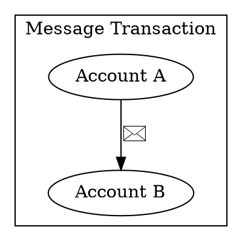
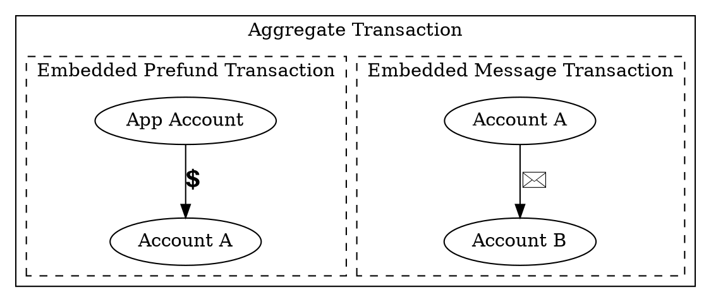
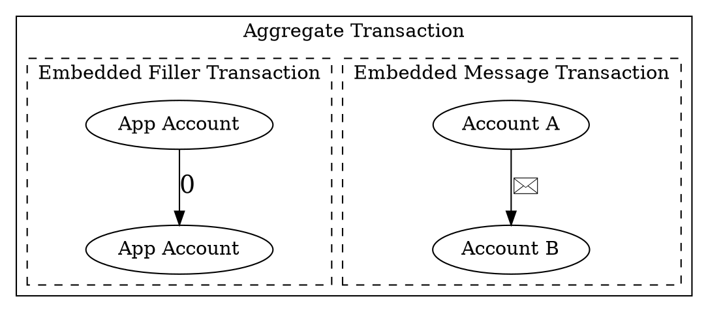

# Paying Transaction Fees on Behalf of Another Account

Using a blockchain typically requires users to own the network's native currency in order to pay transaction fees.
For newcomers, this often means acquiring funds through an exchange and completing <KYC:> procedures.

Fortunately, apps can offer a more streamlined experience by taking care of transaction fees on behalf of their users.

On Ethereum, this functionality was initially introduced through standards such as
[EIP-4337](https://eips.ethereum.org/EIPS/eip-4337), which enables account abstraction and sponsored transactions.
Further proposals, including [EIP-7702](https://eips.ethereum.org/EIPS/eip-7702), build on this approach by allowing
regular accounts to adopt smart contract behavior.

On Symbol, similar behavior can be implemented out of the box using <aggregate transactions:>.
This tutorial presents two techniques that allow a Symbol account to pay transaction fees on behalf of another
account.

!!! warning "Succinct example"

    For simplicity, this tutorial only shows the code that builds the transactions.

    As a result, **the code shown is not directly executable**.
    Refer to the [Transfer Transaction](./transfer.md) tutorial to learn how to announce and confirm the transactions
    constructed in this tutorial.

## Problem Statement

Consider a messaging application in which users control their own Symbol accounts and exchange messages by sending
<transfer transactions:> with a message payload.
The application relays messages and triggers notifications when new ones are received.
No central authority can censor or block communication.

Messages can also be encrypted so that only the intended recipient can read them, but encryption is outside the
scope of this tutorial.

To improve usability, the application developer chooses to pay transaction fees on behalf of users, while still
sending messages from each user's own account.
The cost of these fees can then be recovered through external billing mechanisms, such as a monthly subscription paid in
traditional currency, for example.

The trade-off for this convenience is the introduction of a centralization point limited to transaction fee
payment, which users can remove individually once they choose to manage fees themselves.



{{ tutorial.code_full('devbook/transactions/fee-sponsorship', ['py', 'js'], show=false) }}

## Option 1: Prefunded Fees

In this approach, an account controlled by the application developer sends a _prefund_ transfer to the user's account.

To ensure that the funds cannot misused, both the prefund transfer and the message transfer are embedded in a single
<aggregate transaction:>.
The aggregate is signed by both the application account and the user, and announced by the latter.

**Transaction fees are deducted after all embedded transactions are executed**, which makes the prefunded amount available
to the message sender for paying all transaction fees.

Note that the prefund amount must be sufficient to cover both embedded transactions' fees,
and that the order of the embedded transactions does not matter in this case.

For security reasons, the application should not hold any private keys belonging to the application account.
Instead, it can build a <complete aggregate transaction:> and request the developer's signature through an off-chain
API, or build a <bonded aggregate transaction:> and request the signature exclusively through on-chain means.

Once the developer's signature is obtained, the application can attach the user's signature and announce the
aggregate transaction, even if the user's account balance is zero.

{{ tutorial.code_snippet(['py:15:69', 'js:11:73']) }}

### Message Transaction

The embedded transaction that sends the message from the user to the recipient is a standard <transfer transaction:>.

{{ tutorial.code_snippet(['py:16:23', 'js:12:19']) }}

### Prefund Transaction

This is also a <transfer transaction:>, with the particularity that the amount to transfer is not yet known.
The total fee depends on the final size of the aggregate transaction, which cannot be calculated at this stage.
For this reason, the amount is initially set to `0`.

The sender of this transaction is the application account, and the recipient is the user account.

{{ tutorial.code_snippet(['py:25:38', 'js:21:34']) }}

### Aggregate Transaction

The <complete aggregate transaction:> is built as usual, and its `fee` field is updated once the transaction size is known.

The prefund transaction's amount is then set to match the calculated fee.

Finally, the `transactions_hash` field is updated with the hash of the embedded transactions.
This field is normally set when the aggregate is created using <dy:SymbolTransactionFactory.create>, but in this
case it must be updated afterwards, once the prefund transaction has been modified.

!!! caution

    As shown in the code, when setting the `transactions_hash` field, use the model-specific type `sc.Hash256` (:simple-python:)
    or `models.Hash256` (:simple-javascript:), and not the generic cryptography type `Hash256`.

{{ tutorial.code_snippet(['py:40:55', 'js:36:55']) }}

### Signatures

The user account adds its signature using <dy:SymbolTransactionFactory.attachSignature>,
since it is the signer of the aggregate transaction.
The application account's cosignature is then added using <dy:SymbolFacade.cosignTransaction>,
which can be obtained through either on-chain or off-chain methods, as explained above.

{{ tutorial.code_snippet(['py:57:67', 'js:57:70']) }}

Once the payload is obtained, the transaction is ready to be announced and confirmed.

## Option 2: Sponsored Fees

In an aggregate transaction, all transaction fees are paid exclusively by the aggregate signer.
A straightforward solution to the stated problem is therefore to embed the message transaction in an aggregate
transaction signed by the application account.

However, Symbol requires every aggregate signer to participate in at least one embedded transaction.
As a result, an additional filler embedded transaction must be included that requires the application account's
signature.

This filler transaction must have no side effects and an empty transfer from the application account to itself is
a suitable choice.

Compared to Option 1, this approach is simpler to set up, as it does not require calculating the total fee after the
embedded transactions are built, nor updating the transactions and their hashes.
On the other hand, the application account takes a more active role, which might be counterproductive if the goal is
to empower users to eventually manage their own funds and fees.

Option 2 is also slightly cheaper, since the filler transaction is smaller than the prefunding transfer.

{{ tutorial.code_snippet(['py:73:119', 'js:77:129']) }}

### Message Transaction

The embedded transaction that sends the message from the user to the recipient is a standard <transfer transaction:>.

{{ tutorial.code_snippet(['py:74:81', 'js:78:85']) }}

### Filler Transaction

This is also a <transfer transaction:>, from the application account to itself, in which no funds are transferred.
As explained above, its only purpose is to allow the application account to sign and pay for the aggregate transaction.

{{ tutorial.code_snippet(['py:83:92', 'js:87:96']) }}

### Aggregate Transaction

The <complete aggregate transaction:> is built as usual, updating its `fee` field once the transaction size is known.
But unlike Option 1, it does not need to be further modified.

{{ tutorial.code_snippet(['py:94:105', 'js:98:111']) }}

### Signatures

The application account adds its signature using <dy:SymbolTransactionFactory.attachSignature>,
since it is the signer of the aggregate transaction.
This signature can be obtained through either on-chain or off-chain methods, as explained above.

The user account's cosignature is then added using <dy:SymbolFacade.cosignTransaction>.

{{ tutorial.code_snippet(['py:107:117', 'js:113:126']) }}

Once the payload is obtained, the transaction is ready to be announced and confirmed.

## Conclusion

This tutorial demonstrated two ways to have one account pay transaction fees on behalf of another using
<aggregate transactions:>.
Both approaches allow applications to sponsor transaction fees while preserving user ownership and control over
their accounts.

By separating fee payment from transaction authorization, applications can provide a smoother onboarding
experience for new users without sacrificing the decentralization properties of the system.
