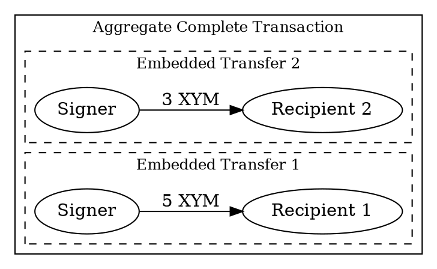

# Batching Transactions

A <complete aggregate transaction:> can bundle multiple transactions from a single account into one atomic operation,
with one fee and one confirmation.

This is useful for distributing rewards, splitting payments, or funding several accounts at once, for example.

This tutorial shows how to batch two <transfer transactions:> that send <XYM:> to different recipients.



Because all embedded transactions share the same signer, no <cosignatures:> are needed.
The aggregate can be signed and announced by a single account.
For examples requiring the collection of signatures from multiple accounts, see the
[Complete Aggregate](./complete-aggregate.md) and [Bonded Aggregate](./bonded-aggregate.md) tutorials.

## Prerequisites

Before you start, make sure to set up your development environment.
See [Setting Up a Development Environment](../start/setup.md).

You also need an <account:> with enough <XYM:> to cover the transfers and the transaction fee.
Although a pre-funded test account is provided for convenience, it is not maintained and may run out of funds at any time.

To use your own account, complete the following steps:

* Create an account to send the batched transactions, either [from code](../accounts/create-from-private-key.md) or
  [by using a wallet](../../userbook/wallet/create-account.md).
* Obtain XYM to pay for the transaction fee and transfer amounts.
  See [Getting Testnet Funds from the Faucet](../accounts/testnet-faucet.md).

Additionally, review the [Transfer transaction](./transfer.md) tutorial to understand how
transactions are announced and confirmed.

## Full Code



{{ tutorial.code_full_tagged('devbook/transactions/transaction_batching') }}

## Code Explanation

### Setting Up the Account

{{ tutorial.code_snippet_tagged('step-1') }}

The signer account is loaded from the `SIGNER_PRIVATE_KEY` environment variable.
If not provided, a test key is used as default.

The two recipient addresses are loaded from the `RECIPIENT_1` and `RECIPIENT_2` environment variables.
If not provided, test addresses are used as defaults.

### Fetching Recommended Fees

{{ tutorial.code_snippet_tagged('step-2') }}

Recommended fees are fetched from <get:/network/fees/transaction>,
following the process described in the [Transfer Transaction](./transfer.md) tutorial.

### Creating Embedded Transactions

{{ tutorial.code_snippet_tagged('step-3') }}

Each transfer is created as an <embedded transaction:> that will be wrapped inside the aggregate.
All embedded transactions use the same {{ tutorial.var('signer_public_key') }} because they all originate from the
same account.

The example creates two <transfer transactions:>:

* The first transfer sends 5 XYM to Recipient 1.
* The second transfer sends 3 XYM to Recipient 2.

The {{ tutorial.var('signer_public_key') }} is still required on each embedded transaction, even when all share the
same signer.

Embedded transactions do **not** include fee or deadline fields.
These are inherited from the enclosing aggregate transaction.

!!! note "Batching other transaction types"

    Although this example batches transfer transactions, any transaction type can be embedded within an aggregate
    (except other aggregates).
    For example, you could batch mosaic creation with a namespace alias registration in a single atomic operation.

### Building the Aggregate Transaction

{{ tutorial.code_snippet_tagged('step-4') }}

The aggregate transaction is created from the transaction's descriptor, which contains:

* **Type:** Use <ser:AggregateCompleteTransactionV3>.

* **Transactions hash:** A hash computed from all embedded transactions using
  <dy:SymbolFacade.hashEmbeddedTransactions>.
  This ensures the embedded transactions cannot be modified after signing.

* **Transactions:** The array of embedded transactions to execute.

<dy:SymbolFacade.createTransactionFromTypedDescriptor> also receives the signer public key, fee multiplier, and
deadline duration.
The signer signs the aggregate and pays the transaction fee.

<dy:SymbolFacade.createTransactionFromTypedDescriptor> calculates the fee based on the aggregate's total size.
Since no cosignatures are needed, no extra cosignature count is provided.

### Signing and Announcing

{{ tutorial.code_snippet_tagged('step-5') }}

The aggregate is signed with <dy:SymbolFacade.signTransaction> and serialized into a payload using
<dy:SymbolTransactionFactory.attachSignature>.
The signed payload is then announced to a <node:> using the <put:/transactions> endpoint, following the same process as
regular transactions described in the [Transfer Transaction](./transfer.md#announcing-the-transaction) tutorial.

### Waiting for Confirmation

{{ tutorial.code_snippet_tagged('step-6') }}

After announcement, the transaction status is monitored using <get:/transactionStatus/{hash}>.
The polling loop checks the status every second until the transaction is confirmed or fails.

## Output

The output shown below corresponds to a typical run of the program.

```text linenums="1" hl_lines="14 24 27 28 38 41 42 48"
--8<-- 'devbook/transactions/transaction_batching.log'
```

Key points in the output:

* **Line 14** (`"type": 16705`): Identifies this as an <ser:AggregateCompleteTransactionV3>.
* **Lines 24 and 38** (`"recipient_address"`): The two embedded transfers target different accounts.
  These are the hex-encoded forms of the Base32 addresses printed on lines 4-5.
* **Lines 27-28 and 41-42** (`"mosaic_id"`, `"amount"`): Each transfer sends XYM (mosaic alias ID
  `16666583871264174062`).
  The amounts `5000000` and `3000000` correspond to 5 and 3 XYM because this mosaic has <divisibility:> 6.
* **Line 48** (`"cosignatures": []`): Empty because all embedded transactions share the same signer.
  No additional signatures are required.

The aggregate transaction executes atomically: both recipients receive their XYM transfers, or neither does.

The transaction hash printed in the output (line 52) can be used to search for the transaction in the
[Symbol Testnet Explorer](https://testnet.symbol.fyi/).

## Conclusion

This tutorial showed how to:

| Step                                                            | Related documentation                                                                                                        |
| --------------------------------------------------------------- | ---------------------------------------------------------------------------------------------------------------------------- |
| [Create embedded transactions](#creating-embedded-transactions) | <dy:SymbolFacade.createEmbeddedTransactionFromTypedDescriptor><br/><ser:TransferTransactionV1>                               |
| [Build the aggregate](#building-the-aggregate-transaction)      | <dy:SymbolFacade.createTransactionFromTypedDescriptor><br/><ser:AggregateCompleteTransactionV3><br/><dy:SymbolFacade.hashEmbeddedTransactions> |
| [Sign and announce](#signing-and-announcing)                    | <dy:SymbolFacade.signTransaction><br/><dy:SymbolTransactionFactory.attachSignature>                                          |

## Next Steps

* **Add cosigners:** If the embedded transactions involve multiple signers that can cosign off-chain
  before announcing, see the [Complete Aggregate](./complete-aggregate.md) tutorial.
* **Collect signatures on-chain:** If cosigners need to sign after the transaction is announced,
  see the [Bonded Aggregate](./bonded-aggregate.md) tutorial.
* **Sponsor fees:** Let one account pay transaction fees on behalf of another using the
  [Paying Transaction Fees on Behalf of Another Account](./fee-sponsorship.md) tutorial.
