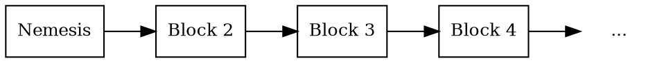

# Blocks

Block
:   A block records a set of <transactions:> and other _state changes_ that occurred at a specific point in time.

A state change is any update to the blockchain's data, for example, moving funds from one account to another or
creating a new <mosaic:>.

In addition to transactions, blocks contain metadata such as timestamps and various cryptographic <hashes:> that
ensure the integrity of different parts of the block.
The most important of these is the _previous block hash_, which links each block to its predecessor.
This ensures the integrity of the entire chain and is what makes it a _blockchain_.

Blocks may also include _receipts_: records that capture the side effects of transactions beyond their main intent.

The Symbol network produces one new block every 30 seconds.

## The Nemesis Block

Nemesis block
:   The first block in the Symbol blockchain.
    Unlike all other blocks, which are created through network consensus, the nemesis block is manually generated by the
    network creators.

It defines the initial state of the blockchain.
This includes the initial distribution of mosaics, such as <XYM:>, to specific accounts, the creation of namespaces,
and other configuration parameters that set the foundation for the network.

Because it is the root of the chain, the nemesis block has no previous block hash.
All other blocks are linked back to it directly or indirectly.

This block is commonly called the _genesis block_ in other blockchain protocols.
In Symbol, the name _nemesis_ is a playful reference to its predecessor, NEM.

All blocks that follow are created through a process called <harvesting:>, Symbol's equivalent of mining in other
blockchains.
Harvesters validate transactions and add them to the chain, receiving transaction fees as a reward.

## Rollbacks

Rollback
:   The process of discarding one or more recently added blocks when the network switches to a better chain,
    typically after a fork is resolved.

In a decentralized network like Symbol, <nodes:> may temporarily become out of sync.
This can happen due to latency, connectivity issues, or changes in network topology.
During such _network partitions_, disconnected groups of nodes may temporarily disagree on the most recent blocks.

As a result, more than one version of the blockchain may exist for a short time.
This leads to a _fork_, where two or more competing chains share a common history but differ in their latest blocks.

During a fork, for example, queries to different nodes might return different balances for the same account,
depending on whether those nodes have seen all the transactions that affect it.

When connectivity is restored, Symbol resolves forks using a deterministic rule: the chain with the highest _chain
score_, based on cumulative difficulty, is considered the correct one.
Nodes that find themselves on the lower-scoring fork _roll back_ any blocks that are no longer part of the
main chain and switch to the better one.

Any transactions in the discarded blocks return to the <unconfirmed pool:> and must be re-verified before they can be
included in a block again.

Rollbacks are usually shallow and rare, affecting only the most recent blocks.
However, to completely remove this risk, Symbol uses _finalization_.

## Finalization

Finalization
:   The process that makes blocks, and the transactions they contain, irreversible, eliminating the risk of
    <rollbacks:>.

Once a block is finalized, it is guaranteed to remain in the chain and will never be rolled back, even in the event of
a network partition or fork.

This process is driven by all eligible <voting nodes:>, which use a separate consensus algorithm to
periodically agree on the most recent block that can be safely finalized.
The result is a _finalization point_: a checkpoint in the blockchain that all nodes agree to build upon.

Finalization gives applications a reliable foundation to work from.
For example, a wallet can consider a transaction to be fully confirmed once it is included in a finalized block.

Votes from voting nodes are weighted by account balance to prevent <Sybil attacks:>,
and only accounts holding at least 10'000 <XYM:> are eligible to participate.

In the absence of network partitions, blocks are typically finalized within 10 to 20 minutes,
depending on how long ago the last finalization point occurred.

## Block Structure

Each block in the Symbol blockchain contains a combination of metadata and transaction data, including:

| **Field**               | **Description**                                                                                                                                       |
| ----------------------- | ----------------------------------------------------------------------------------------------------------------------------------------------------- |
| **Height**              | The block's position in the chain, starting from 1 for the <nemesis block:>. Each new block has a height one greater than its predecessor.        |
| **Timestamp**           | Milliseconds elapsed since <nemesis block:>, strictly increasing for each block. Average time between blocks is kept close to 30s.                |
| **Previous block hash** | <Hash:> of the previous block. If its contents were tampered with, this hash would change, breaking the chain and invalidating all subsequent blocks. |
| **State hashes**        | <Hashes:> summarizing the block's transaction list, generated receipts, and the resulting state after processing.                                     |
| **Fee multiplier**      | A multiplier set by the block harvester that determines how fees are calculated for each transaction in the block, based on their size in bytes.      |
| **Transactions**        | A list of valid transactions included in the block. Each transaction is independently verified before being accepted into the block.                  |
| **Receipts**            | A set of records automatically generated during block processing to reflect internal changes not captured by transactions themselves.                 |

## Receipts

Receipt
:   Receipts capture state changes that occurred in a block but were not directly caused by the transactions included in
that block.

They make it easier to understand these indirect changes without having to track down the original transactions, which
may have occurred long ago.

For example, a transaction may lease a namespace for one year.
When that year passes and the namespace expires, no transaction is issued.
Instead, a _namespace expiration_ receipt is generated in the block where the expiration occurs.

Similarly, when an account earns harvesting rewards, there is no transaction transferring funds to that account.
Instead, the account balance is increased directly, and a _balance change_ receipt is generated in the block that
produced the reward.

Receipts are included in blocks and organized into two types: transaction statements and resolution statements.

### Transaction Statements

Transaction statements contain receipts associated with individual transactions.
These transactions may be included in the same block or may have occurred in previous blocks.

Each receipt describes a state change triggered by the execution of a transaction, but not directly encoded in the
transaction itself.

Transaction statements in Symbol have the following basic types:

* **Balance change**: Adjusts the balance of an account.
* **Balance transfer**: Moves mosaics between accounts.
* **Mosaic expiration**: Marks the end of a mosaic's lifetime.
* **Namespace expiration**: Marks the end of a namespace's rental period.
* **Inflation**: Network currency mosaics were created due to inflation.

### Resolution Statements

Resolution statements record how <namespaces:> were resolved during transaction execution.

In Symbol, namespaces allow users to refer to <mosaics:> and <addresses:> using human-readable aliases.
However, before a transaction can be executed, all aliases must be translated to their underlying values.

A resolution statement records the resolved value used for a specific alias within a block.
This is especially useful when analyzing historical data, since aliases may have been updated or deleted after the
transaction was confirmed.

There are two types of resolution statements:

* **Address resolution**: Resolves a namespace to an account <address:>.
* **Mosaic resolution**: Resolves a namespace to a <mosaic ID:>.

Like transaction statements, resolution statements are included in the block's receipt hash to ensure integrity and
verifiability.

### Supported Receipt Types

| **Receipt**                | **Description**                                                                                                         |
| -------------------------- | ----------------------------------------------------------------------------------------------------------------------- |
| **Core**                   |                                                                                                                         |
| `Harvest Fee`              | The recipient, account, and amount of fees received for harvesting a block. Recorded when a block is harvested.         |
| `Inflation`                | The amount of native currency <mosaics:> created. Recorded when inflation is configured and triggered by a new block.   |
| `Transaction Group`        | A collection of state changes for a given source. Recorded when a state change receipt is issued.                       |
| `Address Alias Resolution` | The unresolved and resolved <namespace:>. Recorded when a transaction uses an <address:> alias.                         |
| `Mosaic Alias Resolution`  | The unresolved and resolved <namespace:>. Recorded when a transaction uses a <mosaic:> alias.                           |
| **Mosaic**                 |                                                                                                                         |
| `Mosaic Expired`           | The identifier of the <mosaic:> expiring in this block. Recorded when a mosaic's lifetime elapses.                      |
| `Mosaic Rental Fee`        | The sender, recipient, and amount representing the cost of registering a <mosaic:>. Recorded at mosaic registration.    |
| **Namespace**              |                                                                                                                         |
| `Namespace Expired`        | The identifier of the <namespace:> expiring in this block. Recorded when the namespace's lifetime elapses.              |
| `Namespace Deleted`        | The identifier of the <namespace:> deleted in this block. Recorded when the grace period of an expired namespace ends.  |
| `Namespace Rental Fee`     | The sender, recipient, and cost of extending a <namespace:>. Recorded at registration or renewal.                       |
| **HashLock**               |                                                                                                                         |
| `LockHash Created`         | The sender, mosaic ID, and amount locked. Recorded when a valid `HashLockTransaction` is announced.                     |
| `LockHash Completed`       | The sender, mosaic ID, and amount returned. Recorded when an `AggregateBondedTransaction` linked to the hash completes. |
| `LockHash Expired`         | The recipient, mosaic ID, and amount returned. Recorded when a hash lock expires.                                       |
| **SecretLock**             |                                                                                                                         |
| `LockSecret Created`       | The sender, mosaic ID, and amount locked. Recorded when a valid `SecretLockTransaction` is announced.                   |
| `LockSecret Completed`     | The recipient, mosaic ID, and amount transferred. Recorded when a secret is successfully revealed.                      |
| `LockSecret Expired`       | The recipient, mosaic ID, and amount returned. Recorded when a secret lock expires.                                     |

