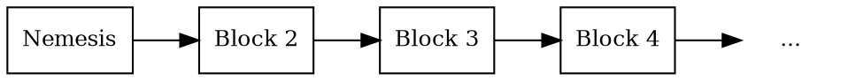
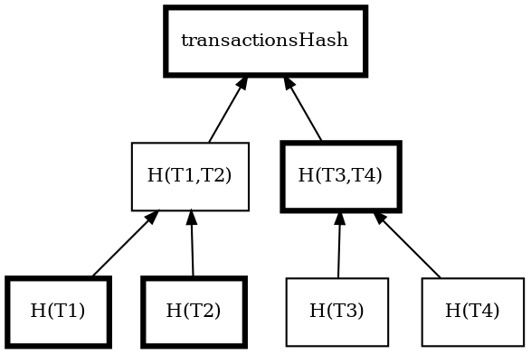

# Blocks

Block
:   A block records a set of <transactions:> and other _state changes_ that occurred at a specific point in time.

A state change is any update to the blockchain's data, for example, moving funds from one account to another or
creating a new <mosaic:>.

In addition to transactions, blocks contain metadata such as timestamps and various cryptographic <hashes:> that
ensure the integrity of different parts of the block.
The most important of these is the _previous block hash_, which links each block to its predecessor.
This ensures the integrity of the entire chain and is what makes it a _blockchain_.

Blocks may also include _receipts_: records that capture the side effects of transactions beyond their main intent.

The Symbol network produces one new block every 30 seconds.

## The Nemesis Block

Nemesis block
:   The first block in the Symbol blockchain.
    Unlike all other blocks, which are created through network consensus, the nemesis block is manually generated by the
    network creators.

It defines the initial state of the blockchain.
This includes the initial distribution of mosaics, such as <XYM:>, to specific accounts, the creation of namespaces,
and other configuration parameters that set the foundation for the network.

Because it is the root of the chain, the nemesis block has no previous block hash.
All other blocks are linked back to it directly or indirectly.

This block is commonly called the _genesis block_ in other blockchain protocols.
In Symbol, the name _nemesis_ is a playful reference to its predecessor, NEM.

All blocks that follow are created through a process called <harvesting:>, Symbol's equivalent of mining in other
blockchains.
Harvesters validate transactions and add them to the chain, receiving transaction fees as a reward.

## Block Structure

Each block in the Symbol blockchain contains a combination of metadata and transaction data, including:

| **Field**               | **Description**                                                                                                                                       |
| ----------------------- | ----------------------------------------------------------------------------------------------------------------------------------------------------- |
| **Height**              | The block's position in the chain, starting from 1 for the <nemesis block:>. Each new block has a height one greater than its predecessor.        |
| **Timestamp**           | Milliseconds elapsed since <nemesis block:>, strictly increasing for each block. Average time between blocks is kept close to 30s.                |
| **Previous block hash** | <Hash:> of the previous block. If its contents were tampered with, this hash would change, breaking the chain and invalidating all subsequent blocks. |
| **State hashes**        | [Hashes](default:Hash) summarizing the block's transaction list, generated receipts, and the resulting state after processing.                        |
| **Fee multiplier**      | A multiplier set by the block harvester that determines how fees are calculated for each transaction in the block, based on their size in bytes.      |
| **Transactions**        | A list of valid transactions included in the block. Each transaction is independently verified before being accepted into the block.                  |
| **Receipts**            | A set of records automatically generated during block processing to reflect internal changes not captured by transactions themselves.                 |

## Block Score

The following quantity is defined for each block, to aid in the <consensus:> process.

Block Score
:   A numerical value assigned to each block that reflects how hard it was to <harvesting:|harvest>.
    Higher scores indicate higher difficulty and are therefore preferred when resolving <forks:>.

$$
\textit{block score} = difficulty − \textit{time elapsed since last block}
$$

Chain Score
:   Sum of the <block scores:> of all blocks produced in a given period of time.

## Receipts

Receipt
:   Receipts capture state changes that occurred in a block but were not directly caused by the transactions included in
that block.

They make it easier to understand these indirect changes without having to track down the original transactions, which
may have occurred long ago.

For example, a transaction may lease a namespace for one year.
When that year passes and the namespace expires, no transaction is issued.
Instead, a _namespace expiration_ receipt is generated in the block where the expiration occurs.

Similarly, when an account earns harvesting rewards, there is no transaction transferring funds to that account.
Instead, the account balance is increased directly, and a _balance change_ receipt is generated in the block that
produced the reward.

Receipts are included in blocks and organized into two types: transaction statements and resolution statements.

### Transaction Statements

Transaction statements contain receipts associated with individual transactions.
These transactions may be included in the same block or may have occurred in previous blocks.

Each receipt describes a state change triggered by the execution of a transaction, but not directly encoded in the
transaction itself.

Transaction statements in Symbol have the following basic types:

* **Balance change**: Adjusts the balance of an account.
* **Balance transfer**: Moves mosaics between accounts.
* **Mosaic expiration**: Marks the end of a mosaic's lifetime.
* **Namespace expiration**: Marks the end of a namespace's rental period.
* **Inflation**: Network currency mosaics were created due to inflation.

### Resolution Statements

Resolution statements record how <namespaces:> were resolved during transaction execution.

In Symbol, namespaces allow users to refer to <mosaics:> and <addresses:> using human-readable aliases.
However, before a transaction can be executed, all aliases must be translated to their underlying values.

A resolution statement records the resolved value used for a specific alias within a block.
This is especially useful when analyzing historical data, since aliases may have been updated or deleted after the
transaction was confirmed.

There are two types of resolution statements:

* **Address resolution**: Resolves a namespace to an account <address:>.
* **Mosaic resolution**: Resolves a namespace to a <mosaic ID:>.

Like transaction statements, resolution statements are included in the block's receipt hash to ensure integrity and
verifiability.

### Supported Receipt Types

| **Receipt**                | **Description**                                                                                                         |
| -------------------------- | ----------------------------------------------------------------------------------------------------------------------- |
| **Core**                   |                                                                                                                         |
| `Harvest Fee`              | The recipient, account, and amount of fees received for harvesting a block. Recorded when a block is harvested.         |
| `Inflation`                | The amount of native currency <mosaics:> created. Recorded when inflation is configured and triggered by a new block.   |
| `Transaction Group`        | A collection of state changes for a given source. Recorded when a state change receipt is issued.                       |
| `Address Alias Resolution` | The unresolved and resolved <namespace:>. Recorded when a transaction uses an <address:> alias.                         |
| `Mosaic Alias Resolution`  | The unresolved and resolved <namespace:>. Recorded when a transaction uses a <mosaic:> alias.                           |
| **Mosaic**                 |                                                                                                                         |
| `Mosaic Expired`           | The identifier of the <mosaic:> expiring in this block. Recorded when a mosaic's lifetime elapses.                      |
| `Mosaic Lease Fee`         | The sender, recipient, and amount representing the cost of registering a <mosaic:>. Recorded at mosaic registration.    |
| **Namespace**              |                                                                                                                         |
| `Namespace Expired`        | The identifier of the <namespace:> expiring in this block. Recorded when the namespace's lifetime elapses.              |
| `Namespace Deleted`        | The identifier of the <namespace:> deleted in this block. Recorded when the grace period of an expired namespace ends.  |
| `Namespace Lease Fee`      | The sender, recipient, and cost of extending a <namespace:>. Recorded at registration or renewal.                       |
| **HashLock**               |                                                                                                                         |
| `LockHash Created`         | The sender, mosaic ID, and amount locked. Recorded when a valid `HashLockTransaction` is announced.                     |
| `LockHash Completed`       | The sender, mosaic ID, and amount returned. Recorded when an `AggregateBondedTransaction` linked to the hash completes. |
| `LockHash Expired`         | The recipient, mosaic ID, and amount returned. Recorded when a hash lock expires.                                       |
| **SecretLock**             |                                                                                                                         |
| `LockSecret Created`       | The sender, mosaic ID, and amount locked. Recorded when a valid `SecretLockTransaction` is announced.                   |
| `LockSecret Completed`     | The recipient, mosaic ID, and amount transferred. Recorded when a secret is successfully revealed.                      |
| `LockSecret Expired`       | The recipient, mosaic ID, and amount returned. Recorded when a secret lock expires.                                     |

## State Hashes

Each block header contains three [hashes]<hashes:> that represent different aspects of the block:

* **Transaction hash:** Root of a <Merkle tree:> built from the block's transactions.
* **Receipts hash:** Root of a Merkle tree built from the block's receipt statements.
* **State hash:** A hash of the complete chain state after processing the block.

These hashes let any node independently verify a block's contents without trusting the source.
If a block is tampered with, the corresponding hash will not match, and the block will be rejected.

### Transaction hash

Merkle tree
:   A [binary tree](https://en.wikipedia.org/wiki/Binary_tree)) where each leaf node holds a data hash, and each parent
    node holds the hash of its two children.
    The root summarizes the entire dataset in a single hash.

The transaction hash is computed as a <Merkle tree:>.
Each transaction is hashed individually, then adjacent hashes are combined pairwise using SHA3-256 until a single root
remains.
If there is an odd number of hashes at any level, the last one is duplicated before combining.

If any transaction in the block is added, removed, or modified, the transaction hash changes.
To prove that a specific transaction belongs to a block, only a short path of intermediate hashes is needed
(one per level) rather than all transaction payloads.

For example, to prove transaction **T2** exists in a four-transaction block, only **H(T2)**, **H(T1)**, and
**H(T3,T4)** are needed:

The verifier hashes **H(T2)** with **H(T1)** to get **H(T1,T2)**, then hashes that with **H(T3,T4)** to recompute
the root.
If the result matches the block's transaction hash, **T2** is proven to be part of the block.

Each level of the tree halves the number of nodes, so a proof requires only log₂(n) hashes.
For a block with 16 transactions, only 4 hashes are needed instead of 16 full transaction payloads.

### Receipts hash

The receipts hash is computed the same way as the transaction hash, using a <Merkle tree:> built from the block's
receipt statements instead of transactions.

### State hash

Patricia tree
:   A [trie-based](en.wikipedia.org/wiki/Trie) structure where keys are encoded as paths through the tree.
    Unlike a <Merkle tree:>, a Patricia tree supports proofs of both existence and non-existence.

The state hash represents the entire chain state after processing the block.
Symbol maintains separate <Patricia trees:> for each type of on-chain data:

* Account balances, keys, and importance scores
* Mosaic definitions and properties
* Namespace registrations
* Multisig account configurations
* Account and mosaic restrictions
* Metadata entries
* Hash lock and secret lock deposits

Each Patricia tree has its own root hash.
The state hash is computed as `SHA3-256(root₁ || root₂ || ... || rootₙ)`, a single hash over the concatenated roots
of all sub-caches.

Because this hash captures the full chain state, two nodes that agree on a block's state hash are guaranteed to have
identical views of every account, mosaic, and namespace at that height.
