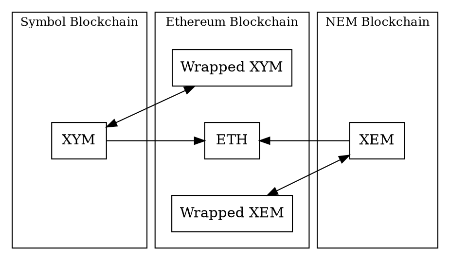

# Bridging Symbol and NEM to Other Networks

This page explains the concepts behind a Symbol bridge that allows moving <XYM:> and <XEM:> to and from the
[Ethereum blockchain](https://ethereum.org), either as its native <ETH:> or as
[ERC-20](https://ethereum.org/developers/docs/standards/tokens/erc-20/) tokens called _Wrapped XYM_ and _Wrapped XEM_.

Unlike [cross-chain swaps](./cross-chain-swaps.md), which coordinate trustless exchanges between users, the Symbol
Bridge is a centralized service operated by a bridge provider.
It watches one blockchain for deposits and sends corresponding payouts on another blockchain.

The bridge implementation is
[open source](https://github.com/symbol/product/blob/dev/bridge) and will be deployed and maintained by
The Symbol Syndicate.

## Why Bridges Are Needed

Tokens belong to the blockchain where they are created.
<XYM:>, for example, exists on Symbol and can be transferred by Symbol <transactions:|transactions>.
It cannot be sent directly to an Ethereum <address:> because Ethereum nodes do not process Symbol transactions,
and Symbol nodes do not process Ethereum transactions.

A bridge coordinates activity on both networks.
It receives tokens on one blockchain, verifies the request, and sends corresponding tokens on another blockchain.
This does not make the two blockchains share a single ledger.
Instead, it creates a controlled relationship between balances held by bridge accounts and tokens issued or paid out
on the other network.

## The Symbol Bridge

Bridge
:   A service that connects two blockchains by accepting tokens on one network and delivering corresponding tokens
    on another.

The Symbol Bridge can connect Symbol or NEM with the Ethereum network.
Each bridge _instance_ is configured for a specific pair of source and target networks and a specific _operating mode_,
as described below.

For example, an instance can accept `XYM` on Symbol and send `Wrapped XYM` on Ethereum,
while another instance can accept `XEM` on NEM and send `ETH` on Ethereum.
The same general idea applies in all cases: the user makes a request on the source network, and the bridge completes
the corresponding payout on the target network.

## Bridge Accounts

The bridge has accounts on both networks it connects.
Users do not send tokens directly across networks.
Instead, they send tokens to the bridge account on the source network and include the destination address where the
payout should be delivered on the target network.

The bridge watches its accounts for incoming requests.
When it finds a valid request, it sends the corresponding payout from its account on the other network.
For this to work, the payout-side account must have enough tokens to satisfy requests and enough native currency to pay
network fees.

Because the bridge operates through ordinary blockchain accounts and transactions, it is not part of the Symbol
consensus protocol itself.
It is an off-chain service that observes one chain and submits transactions to another.

## Operating Modes

The Symbol Bridge supports three modes: wrapping, staking, and swapping.
Each mode answers a different question about what should be delivered on the target network.

### Wrap Mode

Wrapped token
:   A token on one blockchain that represents a token held by the bridge on another blockchain.

Wrap mode converts native tokens into wrapped tokens at a fixed 1:1 rate.
If a user deposits 100 `XYM` into the bridge account on Symbol, the bridge sends 100 `Wrapped XYM` on Ethereum,
minus any applicable fees.

The reverse operation is called unwrapping.
When a user sends `Wrapped XYM` back to the bridge on Ethereum, the bridge sends the corresponding amount of `XYM`
on Symbol.

Wrapped tokens are useful because they let value from one network be represented on another network without changing
where the original native token belongs.
Wrapped tokens can then participate in the application ecosystem of the target network and be redeemed back to
native tokens at any time.

### Stake Mode

Staked token
:   A token that represents a proportional claim on native tokens held by the bridge, including any rewards that have
    accrued while those native tokens were held.

Stake mode is similar to wrap mode, but the conversion rate is dynamic instead of fixed.
Native tokens held by the bridge can earn rewards, such as <harvesting:> rewards on Symbol.
When this happens, each staked token represents a share of a larger native-token balance.

For example, if the bridge receives `XYM` and sends `Staked XYM`, the `Staked XYM` represents a claim on the bridge's
pooled `XYM` balance.
If that pool earns additional `XYM`, unstaking can return more native tokens than the user originally staked.

This means stake mode is not a simple 1:1 representation.
The amount received when staking or unstaking depends on the current relationship between outstanding staked tokens
and the native tokens held by the bridge.

### Swap Mode

Swap mode converts a native Symbol or NEM token into Ethereum's native token, `ETH`.
Unlike wrap and stake modes, swap mode behaves more like an exchange.
The payout amount is based on a price source, rather than a fixed token relationship.

Swap mode is one-way.
A user can deposit `XYM` or `XEM` and receive `ETH`, but the bridge does not support sending `ETH` back to receive the
original native token.
Bridge operators can also configure limits, such as a maximum transfer amount.

## How a Bridge Request Works

A bridge request has five conceptual stages.
The user only needs to initiate the first one and the rest follow.

1. **Deposit**
   The user sends tokens to the bridge account on the source network.
   The transaction includes the destination address on the target network.

2. **Detection**
   The bridge watches the source network and detects the incoming transaction.
   It checks that the request is valid, for example, that it uses the expected token and contains a valid destination
   address.

3. **Finality**
   The bridge waits until the source transaction is sufficiently <finalization:|final>.
   Different blockchains have different finality rules, so the waiting time depends on the networks involved.

4. **Conversion**
   The bridge calculates the payout amount according to its operating mode.
   It also accounts for network fees and any bridge fee configured by the operator.

5. **Payout**
   The bridge submits a transaction on the target network, sending the converted tokens to the requested destination
   address.
   It then tracks that outgoing transaction until it is finalized.

An application can take care of these steps under the hood and offer a simplified user interface.

## Wrapping and Unwrapping

Wrapping moves value from a native token into a represented token on another network.
Unwrapping redeems the represented token back into the native token.

| Mode | Forward operation | Reverse operation |
| --- | --- | --- |
| Wrap | Native token to wrapped token | Wrapped token to native token |
| Stake | Native token to staked token | Staked token to native token |
| Swap | Native token to `ETH` | Not supported |

In wrap and stake modes, the bridge processes requests in both directions.
In swap mode, only the forward direction is supported.

## Fees and Payout Amounts

Bridge requests involve more than the amount deposited.
The user pays the source-network transaction fee when submitting the request, and the bridge pays the target-network
transaction fee when sending the payout.
The bridge can deduct that target-network fee from the payout amount.

Some bridges can also charge a conversion fee.
This is separate from blockchain transaction fees and is configured by the bridge operator.

When the target network is Ethereum, the bridge pays gas in `ETH`.
If the payout token is not `ETH`, the bridge may use a price source to estimate the equivalent value and deduct it
from the bridged token amount.
This introduces price risk because network fees and market prices can change between calculation and confirmation.

## Finality and Processing Time

A bridge should not act on a transaction the moment it first appears.
It normally waits until the transaction is considered final enough for the source network.
This protects the bridge from acting on transactions that could still be rolled back or replaced.

Processing time depends on several factors:

* The block time of each network.
* The finality rules used by each network.
* How often the bridge checks for new requests.
* Network congestion and transaction fees on the payout network.

For this reason, bridge requests are not instant even when both blockchains are healthy.

## Invalid Requests and Limits

A bridge can only process requests that match the rules of the bridge instance.
Requests generally need to send the expected token to the correct bridge account and include a valid destination
address for the target network.

Transfers that send unsupported tokens, omit the destination address, encrypt the message when a plain address is
required, or exceed configured limits might not be processed.
Depending on the bridge and the error, these transfers might not be recoverable automatically.

Users should always check the bridge's supported token, direction, destination-address format, fees, and limits before
submitting a request.

## Trust Model and Responsibilities

A bridge is a service operated outside the blockchain protocol.
It controls accounts, observes transactions, calculates payouts, and signs outgoing transactions.
Users therefore trust the bridge operator to run the service correctly, maintain enough liquidity, protect signing
keys, and handle invalid or delayed requests responsibly.

The bridge can also depend on external services, like price providers and decentralized exchanges.
It may use network API nodes to read blockchain state, price sources to calculate swaps or fee deductions, and block
explorers or status APIs to report progress.
Problems in any of these dependencies can delay or interrupt bridge operation.

This means a bridge should be evaluated separately from Symbol itself.
Symbol can finalize the user's deposit correctly while a bridge operator is still responsible for detecting that
deposit and completing the payout on the other network.
