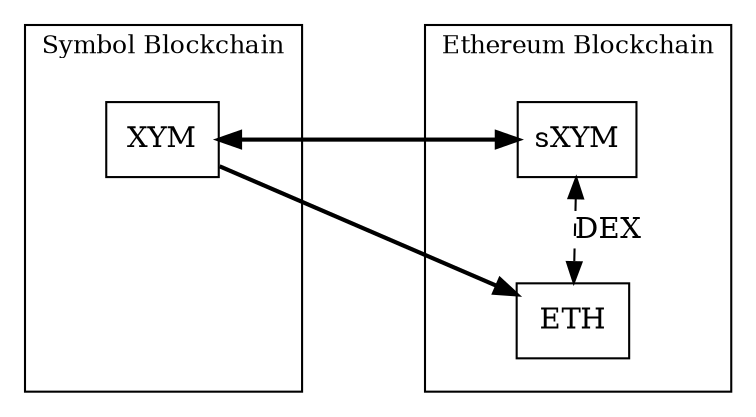
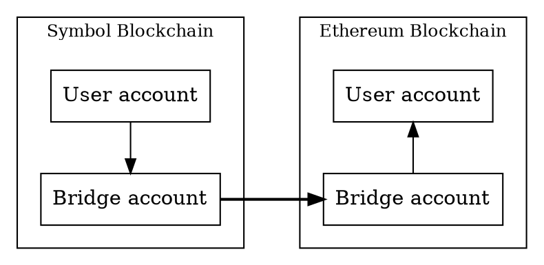
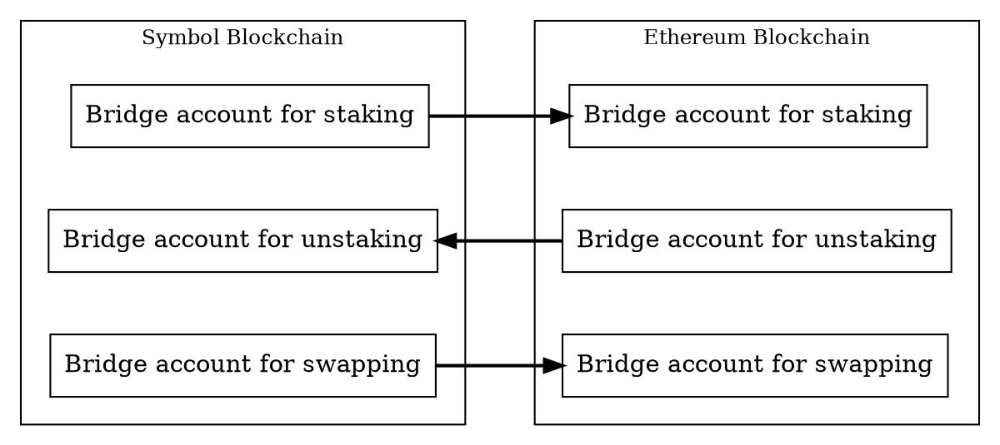

# Bridging Symbol to Ethereum

This page explains the concepts behind a Symbol bridge for moving <XYM:> to and from the
[Ethereum blockchain](https://ethereum.org) as an
[ERC-20](https://ethereum.org/developers/docs/standards/tokens/erc-20/) token called _Staked XYM_ (`sXYM`),
or converting `XYM` into Ethereum's native <ETH:>.

Unlike [cross-chain swaps](./cross-chain-swaps.md), which coordinate trustless exchanges between users, the Symbol
Bridge is a centralized service operated by The Symbol Syndicate.
It watches one blockchain for deposits and sends corresponding payouts on another blockchain.

The bridge implementation is available as [open source](https://github.com/symbol/product/blob/dev/bridge).

The workflows directly supported by the bridge are:

* **Staking**: `XYM` → `sXYM`
* **Unstaking**: `sXYM` → `XYM`
* **Swapping**: `XYM` → `ETH`

Since both `sXYM` and `ETH` exist on the Ethereum network, they can be exchanged through a conventional
<DEX:> like [Uniswap](https://uniswap.org), without requiring a bridge.
`ETH` can thus be converted to `XYM` via `sXYM`.

## Why Bridges Are Needed

Tokens belong to the blockchain where they are created.
<XYM:>, for example, exists on Symbol and can be transferred by Symbol <transactions:>.
It cannot be sent directly to an Ethereum account because Ethereum nodes do not process Symbol transactions,
and Symbol nodes do not process Ethereum transactions.

A bridge coordinates activity on both networks.
It receives tokens on one blockchain, verifies the request, and sends corresponding tokens on another blockchain.
This does not make the two blockchains share a single ledger.
Instead, it creates a controlled relationship between balances held by bridge accounts and tokens issued or paid out
on the other network.

## Bridge Accounts

The bridge has accounts on both networks it connects.
Users do not send tokens directly across networks.
Instead, they send tokens to the bridge account on the source network and include the destination address where the
payout should be delivered on the target network.

The bridge watches its accounts for incoming requests.
When it finds a valid request, it sends the corresponding payout from its account on the other network.
For this to work, the payout-side account must have enough tokens to satisfy requests and enough native currency to pay
network fees.

Because the bridge operates through ordinary blockchain accounts and transactions, it is neither part of the Symbol
nor the Ethereum consensus protocols.
It is an off-chain service that observes one chain and submits transactions to another.

For each possible workflow, the bridge uses a different pair of accounts, so it uses six accounts in total:

## Staked XYM

Staked XYM (`sXYM`) is an [ERC-20](https://ethereum.org/developers/docs/standards/tokens/erc-20/) token on Ethereum
that represents a share of the `XYM` held by the bridge on Symbol.
It is similar to a wrapped token because it represents `XYM` on another network, but it is not fixed at a permanent
1:1 rate.

In other words, `sXYM` represents proportional ownership of native tokens held by the bridge, including any rewards
that accrue while those native tokens are held.

When users stake `XYM`, they send it to the bridge account on Symbol and receive `sXYM` on Ethereum.
When users unstake, they send `sXYM` to the bridge account on Ethereum and receive `XYM` on Symbol.

The bridge's Symbol account can earn additional `XYM`, for example through <harvesting:>.
When that happens, the total amount of `XYM` held by the bridge increases while the amount of existing `sXYM` stays the
same.
As a result, each `sXYM` represents a claim on a slightly larger amount of `XYM`.

For example, with 1'000 outstanding `sXYM` and 1'000 `XYM` in the bridge account, both tokens are effectively at a
1:1 rate.
If the bridge account later earns 500 additional `XYM`, the same outstanding `sXYM` now represents a claim on
1'500 `XYM`.
Unstaking after that point returns more `XYM` per `sXYM` than before.

This also means that new staking requests receive fewer `sXYM` per `XYM` after rewards have accrued.
The user's share is still proportional: staking adds `XYM` to the pool and mints the corresponding share of `sXYM`,
while unstaking returns the `XYM` represented by the redeemed `sXYM`.

## Process

A bridge request has five conceptual stages.
The user only needs to initiate the first one and the rest follow.

1. **Deposit**

    The user sends tokens to the bridge account on the source network for the operation they wish to perform.
    The transaction includes the destination address on the target network.

2. **Detection**

    The bridge watches the source network and detects the incoming transaction.
    It checks that the request is valid, for example, that it transfers the expected token and contains a valid
    destination address.

3. **Finality**

    The bridge waits until the source transaction is considered sufficiently <finalization:|final>.
    Different blockchains have different finality rules, so the waiting time depends on the network involved.

4. **Conversion**

    The bridge calculates the payout amount according to its configuration.
    It also accounts for network fees and any bridge fee configured by the operator.

5. **Payout**

    The bridge submits a transaction on the target network, sending the converted tokens to the requested destination
    address.
    It then tracks that outgoing transaction until it is finalized.

## Workflows

An application like the Symbol Mobile Wallet takes care of the steps described above and offers a streamlined user
interface for the following workflows.

### Staking `XYM` to `sXYM`

The user starts the process by announcing a standard <transfer transaction:> on Symbol, setting:

* **Transaction recipient**: The address of the bridge account for staking on Symbol.
* **Transaction** [Message](./transfer_transactions.md#optional-message):
    The address of the account **on Ethereum** that should receive the `sXYM`.

The bridge service detects the transfer and starts the process described above.

### Unstaking `sXYM` to `XYM`

The user starts the process by submitting a transaction on Ethereum, setting:

* **Transaction recipient**: The address of the bridge account for unstaking on Ethereum.
* **Additional transaction data**: The address of the account **on Symbol** that should receive the `XYM`.

The bridge service detects the transfer and starts the process described above.

### Swapping `XYM` to `ETH`

The user starts the process by announcing a standard <transfer transaction:> on Symbol, setting:

* **Transaction recipient**: The address of the bridge account for swapping on Symbol.
* **Transaction** [Message](./transfer_transactions.md#optional-message):
    The address of the account **on Ethereum** that should receive the `ETH`.

### Swapping back `ETH` to `XYM`

This workflow is not directly supported by the bridge but can be performed in two steps:

1. Swap `ETH` for `sXYM` using a <DEX:>.

    The Symbol Syndicate maintains a [Uniswap](https://uniswap.org) pool for this purpose.

2. Unstake the `sXYM` to `XYM` using the unstaking workflow above.

## Fees and Payout Amounts

Bridge requests involve more than the amount deposited.
The user pays the source-network transaction fee when submitting the request, and the bridge pays the target-network
transaction fee when sending the payout.
The bridge deducts that target-network fee from the payout amount.

Depending on configuration, the bridge can also charge a conversion fee.
This fee is separate from blockchain transaction fees.

When the target network is Ethereum, the bridge pays gas in `ETH`.
If the payout token is not `ETH`, the bridge uses a price source to estimate the equivalent value and deduct it
from the bridged token amount.

## Finality and Processing Time

The bridge does not act on a transaction the moment it first appears.
Instead, it waits until the transaction is considered sufficiently <finalization:|final> for the source network.
This protects the bridge from acting on transactions that could still be rolled back or replaced.

Processing time depends on several factors:

* The block time of each network.
* The finality rules used by each network.
* Network congestion and transaction fees on the payout network.

For this reason, bridge requests are not instant even when both blockchains are healthy.

## Invalid Requests and Limits

A bridge can only process requests that match the rules of the selected workflow.
Requests generally need to send the expected token to the correct bridge account and include a valid destination
address for the target network.

Transfers that send unsupported tokens, omit the destination address, encrypt the message when a plain address is
required, or exceed configured limits are not processed.
Depending on the bridge and the error, these transfers might not be recoverable automatically.

If operating the bridge manually, users should always check the bridge's supported token, direction,
destination-address format, fees, and limits before submitting a request.

## Trust Model and Responsibilities

A bridge is a service operated outside the blockchain protocol.
It controls accounts, observes transactions, calculates payouts, and signs outgoing transactions.
Users therefore trust the bridge operator to run the service correctly, maintain enough liquidity, protect signing
keys, and handle invalid or delayed requests responsibly.

The bridge also depends on the following external services:

* Price providers to calculate swaps or fee deductions.
* Network API nodes to read blockchain state.
* Block explorers and status APIs to report progress.

Problems in any of these dependencies can delay or interrupt bridge operation.

This means a bridge should be evaluated separately from Symbol itself.
Symbol can finalize the user's deposit correctly while the bridge operator is still responsible for detecting that
deposit and completing the payout on the other network.
