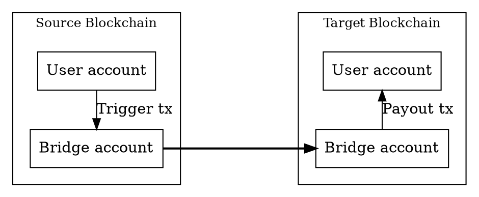
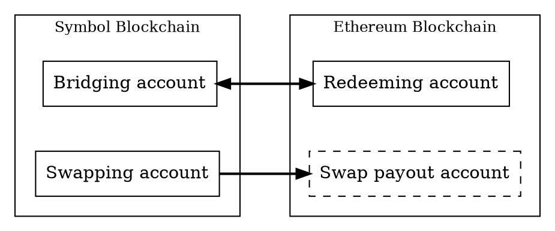

# Bridging Symbol to Ethereum

This page explains the concepts behind a Symbol bridge for moving <XYM:> to and from the
[Ethereum blockchain](https://ethereum.org) as an
[ERC-20](https://ethereum.org/developers/docs/standards/tokens/erc-20/) token called _Bridged XYM_ (`bXYM`),
or converting `XYM` into Ethereum's native <ETH:>.

Unlike [cross-chain swaps](./cross-chain-swaps.md), which coordinate trustless exchanges between users, the Symbol
Bridge is a centralized service operated by The Symbol Syndicate.
It watches one blockchain for deposits and sends corresponding payouts on the other blockchain.

The bridge implementation is available as [open source](https://github.com/symbol/product/blob/dev/bridge).

The workflows directly supported by the bridge are:

* **Bridging**: `XYM` → `bXYM`
* **Redeeming**: `bXYM` → `XYM`
* **Swapping**: `XYM` → `ETH`

Since both `bXYM` and `ETH` exist on the Ethereum network, they can be exchanged through a conventional
<DEX:> like [Uniswap](https://uniswap.org), without requiring a bridge.
`ETH` can thus be converted to `XYM` via `bXYM`.

## Why Bridges Are Needed

Tokens belong to the blockchain where they are created.
<XYM:>, for example, exists on Symbol and can be transferred by Symbol <transactions:>.
It cannot be sent directly to an Ethereum account because Ethereum nodes do not process Symbol transactions,
and Symbol nodes do not process Ethereum transactions.

A bridge coordinates activity on both networks.
It receives tokens on one blockchain, verifies the request, and sends corresponding tokens on another blockchain.
This does not make the two blockchains share a single ledger.

## Bridge Accounts

The bridge has accounts on both networks it connects.
Users do not send tokens directly across networks.
Instead, they send tokens to the bridge account on the source network and include the destination address where the
payout should be delivered on the target network.

The bridge watches its accounts for incoming requests.
When it finds a valid request (see [Invalid Requests](#invalid-requests-and-limits) below),
it sends the corresponding payout from its account on the other network.
For this to work, the payout-side account must have enough tokens to satisfy requests and enough native currency to pay
network fees.

Because the bridge operates through ordinary blockchain accounts and transactions, it is neither part of the Symbol
nor the Ethereum consensus protocols.
It is an off-chain service that observes one chain and submits transactions to another.

The bridge uses four different accounts to handle all possible workflows:

Making a transfer to any of these accounts except the swap payout account initiates the workflows described below.

!!! warning "Do not transfer any funds to the swap payout account"

    This account exists only to pay users on the Ethereum network after performing a swap.
    Funds transferred **into** it will not be recoverable.

## Bridged XYM

Bridged XYM (`bXYM`) is an [ERC-20](https://ethereum.org/developers/docs/standards/tokens/erc-20/) token on Ethereum
that represents a share of the `XYM` held by the bridge on Symbol.
It is similar to a wrapped token because it represents `XYM` on another network, but the conversion rate is not fixed.

In other words, `bXYM` represents proportional ownership of native tokens held by the bridge, including any rewards
that accrue while those native tokens are held.

When users bridge `XYM`, they send it to the bridging account on Symbol and receive `bXYM` on Ethereum.
When users redeem `bXYM` (or "unbridge" it), they send it to the redeeming account on Ethereum and receive `XYM`
on Symbol.

The bridge's Symbol account can earn additional `XYM`, for example through <harvesting:>.
When that happens, the total amount of `XYM` held by the bridge increases while the amount of existing `bXYM` stays the
same.
As a result, each `bXYM` represents a claim on a slightly larger amount of `XYM`.

For example, with 1'000 outstanding `bXYM` and 1'000 `XYM` in the bridge account, both tokens are effectively at a
1:1 rate.
If the bridge account later earns 500 additional `XYM`, the same outstanding `bXYM` now represents a claim on
1'500 `XYM`.
Redeeming after that point returns more `XYM` per `bXYM` than before.

This conversion rate is applied before fees are deducted, so it does not exactly match what the user finally receives.
See [Fees and Payout Amounts](#fees-and-payout-amounts) below.

!!! note "Notes"

    * Besides bridging and redeeming, the only operations that modify the amount of `XYM` held by the bridge are
        harvesting and [donations](#invalid-requests-and-limits).

        Since these operations only _increase_ the bridge's balance, `bXYM` will usually be worth more than `XYM` and
        bridging one `XYM` will result in receiving less than one `bXYM`.

    * The conversion rate between `XYM` and `bXYM` is separate from the market price of `bXYM` on a DEX,
        which depends on liquidity and trading activity.

        <Arbitrage:|Arbitrage> can help the DEX price track the redemption value, but the bridge does not control or guarantee that
        market price.

## Process

A bridge request has five conceptual stages.
The user only needs to initiate the first one and the rest follow automatically.

1. **Deposit**

    The user sends tokens to the bridge account on the source network that handles the operation they wish to perform
    (bridging, redeeming, or swapping).
    The transaction includes the destination address on the target network.

2. **Detection**

    The bridge monitors the source network and detects the incoming transaction.
    It checks that the request is valid, for example, that it transfers the expected token and contains a valid
    destination address.

3. **Finality**

    The bridge waits until the source transaction is considered sufficiently <finalization:|final>.
    See [Finality and Processing Time](#finality-and-processing-time) below.

4. **Conversion**

    The bridge calculates the payout amount according to the selected operation and an external price provider if
    needed.
    The bridge also accounts for network fees and any bridge fee configured by the operator.
    See [Fees and Payout Amounts](#fees-and-payout-amounts) below.

5. **Payout**

    The bridge submits a transaction on the target network, sending the converted tokens to the requested destination
    address.
    It then tracks that outgoing transaction until it is finalized.

## Workflows

An application like the Symbol Mobile Wallet takes care of the steps described above and offers a streamlined user
interface for the following workflows.

!!! warning "Invalid requests are not refunded"

    It is strongly recommended to operate the bridge through an application rather than interacting directly with its
    accounts because [invalid transactions](#invalid-requests-and-limits) are not refunded.

### Bridging `XYM` to `bXYM`

The user starts the process by announcing a standard <transfer transaction:> on Symbol, setting:

* **Transaction recipient**: The address of the bridging account on Symbol.
* **Transferred** <Mosaic:|Mosaic>: `XYM`.
* **Transaction** [Message](./transfer_transactions.md#optional-message):
    The unencrypted address of the account **on Ethereum** that should receive the `bXYM`.

The bridge service detects the transfer and starts the process described above.

### Redeeming `bXYM` to `XYM`

The user starts the process by submitting a transaction on Ethereum, setting:

* **Transaction recipient**: The address of the redeeming account on Ethereum.
* **Transferred token**: `bXYM`.
* **Additional transaction data**: The address of the account **on Symbol** that should receive the `XYM`.

The bridge service detects the transfer and starts the process described above.

### Swapping `XYM` to `ETH`

The user starts the process by announcing a standard <transfer transaction:> on Symbol, setting:

* **Transaction recipient**: The address of the swapping account on Symbol.
* **Transferred** <Mosaic:|Mosaic>: `XYM`.
* **Transaction** [Message](./transfer_transactions.md#optional-message):
    The unencrypted address of the account **on Ethereum** that should receive the `ETH`.

The bridge service detects the transfer and starts the process described above.

### Swapping back `ETH` to `XYM`

This workflow is not directly supported by the bridge but can be performed in two steps:

1. Swap `ETH` for `bXYM` using a <DEX:>.

    The Symbol Syndicate maintains a [Uniswap](https://uniswap.org) pool for this purpose.

2. Redeem the `bXYM` to `XYM` using the redeeming workflow above.

## Fees and Payout Amounts

Bridge requests cost more than the amount deposited.
The user pays the source-network transaction fee when submitting the request, and the bridge pays the target-network
transaction fee when sending the payout.
The bridge deducts that target-network fee from the payout amount in the following way:

| Operation | Fees involved                                                                                                                                      |
| --------- | -------------------------------------------------------------------------------------------------------------------------------------------------- |
| Bridging  | The bridge pays the payout transaction fee in `ETH`, uses a price provider to estimate its value in `bXYM`, and deducts it from the payout amount. |
| Redeeming | The bridge pays the payout transaction fee in `XYM` and deducts it directly from the payout amount.                                                |
| Swapping  | The bridge pays the payout transaction fee in `ETH` and deducts it directly from the payout amount.                                                |

Depending on configuration, the bridge can also charge a conversion fee.
This fee is separate from blockchain transaction fees.

## Finality and Processing Time

The bridge does not act on a transaction the moment it first appears.
Instead, it waits until the transaction is considered sufficiently <finalization:|final> for the source network.
This protects the bridge from acting on transactions that could still be rolled back or replaced.

Processing time depends on several factors:

* The block time of each network.
* The finality rules used by each network.
* Network congestion and transaction fees on the payout network.

For this reason, bridge requests are not instant even when both blockchains are healthy.

!!! note

    The bridge does not provide <slippage:> protection, so the received amount can vary.

## Invalid Requests and Limits

The bridge can only process requests that match the rules of the selected workflow.
Requests generally need to send the expected token to the correct bridge account and include a valid destination
address for the target network.

!!! warning "Invalid requests are not refunded"

    Transfers to the wrong bridge account, or transfers that send unsupported tokens, omit the destination address,
    encrypt the message, or exceed configured limits are not processed and the funds remain in the bridge account
    as _donations_.

Applications like the Symbol Mobile Wallet perform routine checks before submitting a request to minimize this risk.

When using the bridge manually by sending a transaction to any of its accounts, users should always check the
bridge's supported token, direction, destination-address format, fees, and limits before submitting a request.

## Trust Model and Responsibilities

The bridge is a service operated outside the blockchain protocol.
It controls accounts, observes transactions, calculates payouts, and signs outgoing transactions.
Users therefore trust the bridge operator to run the service correctly, maintain enough liquidity, protect signing
keys, and handle invalid or delayed requests responsibly.

The bridge also depends on the following external services:

* Price providers to calculate exchange rates.
* Network <API nodes:> to read blockchain state.
* Block explorers and status APIs to report progress.

Problems in any of these dependencies can delay or interrupt bridge operation.

This means the bridge should be evaluated separately from Symbol itself.
Symbol can finalize the user's deposit correctly, but the bridge operator is still responsible for detecting that
deposit and completing the payout on the other network.

# For Further Information

* [Symbol Bridge implementation source code](https://github.com/symbol/product/blob/dev/bridge).
* [Symbol Bridge API specification](https://bridge.symbol.tools/testnet/ethereum-wrapped/openapi).
