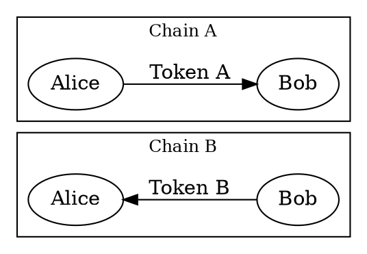

# Cross-Chain Swaps

Cross-chain swap
:   A cross-chain swap enables trading tokens (<mosaics:> in Symbol) across different blockchains without relying on an
    intermediary (e.g., a centralized exchange).

Since tokens cannot be transferred directly between blockchains with different technologies, the trade is performed
inside each chain separately.
The cross-chain swap protocol ensures that either both parties receive their funds or each party is refunded.

This is conceptually similar to an <aggregate transaction:>, but instead of grouping operations within one blockchain,
the swap coordinates operations across two independent chains.

## Protocol

Symbol follows the [Hashed TimeLock Contract](https://en.bitcoin.it/wiki/Hash_Time_Locked_Contracts) (HTLC) protocol
to create a trustless environment for the decentralized exchange of assets.

HTLC uses two mechanisms to provide trustless swaps:

Hashlock
:   A cryptographic hash of a secret value called the _proof_.
    Funds can only be claimed by revealing the proof that produces this hash.
    Revealing the proof on one chain allows the counterparty to read it and use it on the other chain.

Timelock
:   A deadline after which unclaimed funds are returned to their original owner.
    In Symbol, the maximum secret lock duration is 365 days.

In Symbol, a single <ser:SecretLockTransactionV1> locks funds by specifying both the hashlock (`secret` field) and the
timelock (`duration` field), along with the hash algorithm and the recipient.
A <ser:SecretProofTransactionV1> unlocks them by revealing the proof that matches the hashlock.

The key insight is that the **same hashlock** is used on both blockchains.
When one party reveals the proof on one chain, the other party can read it and use it on the other chain.
The timelocks must be configured so that neither party can cheat the other
(see [Timing Constraints](#timing-constraints)).

## Example

Alice and Bob want to exchange tokens across two different blockchains, Chain A and Chain B.
Both Alice and Bob have accounts on both chains.

The swap proceeds in four steps:

```graphviz neato timelock-windows.svg
digraph TimelockWindows {
    node [fontsize=14];
    pad=0.5;

    // Alice's lock bar (Chain A - longer, top)
    A_start [label="" shape=point pos="0,5!" width=0.1];
    A_end [label="" shape=point pos="12,5!" width=0.1];
    A_start -> A_end [style=bold penwidth=3 arrowhead=none];
    A_label [label="Alice's lock on Chain A (longer timelock)"
        shape=plaintext pos="6,5.3!" fontsize=14];

    // Timelock Difference (between Bob's expiry and Alice's expiry)
    TG_start [label="" shape=point pos="7,3.5!" width=0.1];
    TG_end [label="" shape=point pos="12,3.5!" width=0.1];
    TG_start -> TG_end [style=dashed penwidth=2 arrowhead=none];
    TG_label [label="Timelock Difference"
        shape=plaintext pos="9.5,3.8!" fontsize=14];

    // Bob's lock bar (Chain B - shorter)
    B_start [label="" shape=point pos="1,2!" width=0.1];
    B_end [label="" shape=point pos="7,2!" width=0.1];
    B_start -> B_end [style=bold penwidth=3 arrowhead=none];
    B_label [label="Bob's lock on Chain B (shorter timelock)"
        shape=plaintext pos="4,2.3!" fontsize=14];

    // Vertical ticks
    T1_top [label="" shape=point pos="0,5!" width=0];
    T1_bot [label="" shape=point pos="0,0.8!" width=0];
    T1_top -> T1_bot [arrowhead=none style=dotted];

    T2_top [label="" shape=point pos="1,2!" width=0];
    T2_bot [label="" shape=point pos="1,0.8!" width=0];
    T2_top -> T2_bot [arrowhead=none style=dotted];

    T3_top [label="" shape=point pos="6,2!" width=0];
    T3_bot [label="" shape=point pos="6,0.8!" width=0];
    T3_top -> T3_bot [arrowhead=none style=dotted];

    T4_top [label="" shape=point pos="7,2!" width=0];
    T4_bot [label="" shape=point pos="7,0.8!" width=0];
    T4_top -> T4_bot [arrowhead=none style=dotted];

    T5_top [label="" shape=point pos="10,5!" width=0];
    T5_bot [label="" shape=point pos="10,0.8!" width=0];
    T5_top -> T5_bot [arrowhead=none style=dotted];

    T6_top [label="" shape=point pos="12,5!" width=0];
    T6_bot [label="" shape=point pos="12,0.8!" width=0];
    T6_top -> T6_bot [arrowhead=none style=dotted];

    // Labels below
    L1 [label="1. Alice\nlocks" shape=plaintext pos="0,0.2!" fontsize=13];
    L2 [label="2. Bob\nlocks" shape=plaintext pos="1,0.2!" fontsize=13];
    L3 [label="3. Alice\nreveals proof" shape=plaintext pos="6,0.2!" fontsize=13];
    L4 [label="Bob's timelock\nexpires" shape=plaintext pos="7,0.2!" fontsize=13];
    L5 [label="4. Bob\nwithdraws" shape=plaintext pos="10,0.2!" fontsize=13];
    L6 [label="Alice's timelock\nexpires" shape=plaintext pos="12,0.2!" fontsize=13];
}
```

1. **Alice locks tokens on Chain A:** Alice generates a random proof and computes its <hashlock:>.
    She creates a lock on Chain A using this hashlock, naming Bob as the recipient and setting an expiration
    (<timelock:>).
2. **Bob locks tokens on Chain B:** Bob reads the hashlock from Alice's lock on Chain A and creates his own lock using
    the **same hashlock** on Chain B, naming Alice as the recipient.
    Bob's timelock must expire **before** Alice's timelock on Chain A.
3. **Alice claims on Chain B:** Alice reveals the proof on Chain B to claim Bob's locked tokens.
4. **Bob claims on Chain A:** Bob reads the proof from Chain B and uses it to claim Alice's locked tokens on Chain A.

The protocol ensures that, if the timelocks are configured correctly, either both parties receive their funds or each
party is refunded:

| Scenario                        | Outcome                                                                                                              |
| ------------------------------------------------| -----------------------------------------------------------------------------------------------------|
| Bob does not lock tokens                        | Alice's tokens are refunded after her timelock on Chain A expires.                                   |
| Alice does not reveal proof                     | Bob's tokens are refunded when his timelock expires. Alice's tokens are also refunded later.         |
| Alice reveals proof, Bob claims in time         | Alice gets Bob's tokens. Bob can claim Alice's tokens before her timelock expires.                   |
| Alice reveals proof, Bob does not claim in time | **Worst case for Bob**. Alice keeps Bob's tokens and gets her own back when her timelock expires.    |

See [Timing Constraints](#timing-constraints) for details on how to configure the timelocks correctly.

## Timing Constraints

The safety of the swap depends on how the timelocks are configured relative to each other.
The following sections use the Alice and Bob [example](#example) for clarity.

### Timelock Ordering

Since Alice knows the proof from the start, she controls when to reveal it.
Bob's timelock must expire **before** Alice's timelock to prevent Alice from waiting for her own refund and then still
claiming Bob's tokens by revealing the proof.

### Timelock Difference

The difference between Bob's timelock expiry and Alice's timelock expiry must be **large enough** for Bob to detect the
proof on Chain B, submit his claim on Chain A, and get it confirmed.

In the worst case, Alice reveals the proof at the last moment before Bob's lock expires, leaving Bob only this
difference to react.

The difference should account for:

* **Finality periods** on both chains.
* **Observation time** for Bob to detect the proof on Chain B.
* **Transaction submission and confirmation time** on Chain A.
* **Possible resubmission** if Bob's claim transaction is rolled back.

See the [timing diagram](#example) in the example above.

### Finality

Each party must wait for the previous step's transaction to reach [finality](consensus.md#finalization)
on their chain before acting on the next step.

In particular, Alice's lock (step 1) must be final before Bob locks, and Bob's lock (step 2) must be final before
Alice reveals the proof.
A <rollback:> at either point could remove a lock after the counterparty has already acted.

If a claim transaction (steps 3 or 4) is rolled back, the party can resubmit as long as the timelock has not expired.

### Front-Running Risk

When Alice reveals the proof on Chain B (step 3), the proof may be visible in the <unconfirmed pool:> before the
transaction is confirmed.
An observer on Chain B could extract the proof and attempt to claim funds on either chain before the intended
recipient does.

In Symbol, anyone can submit the proof, but the funds are always sent to the recipient specified in the lock, which
eliminates this risk.
The counterpart chain's HTLC implementation must also enforce recipient-only claiming to prevent this attack.
Verify this before using any HTLC contract for a cross-chain swap.

Even if Alice's proof transaction fails to confirm, the proof is already exposed.
This does not break the protocol: Alice can resubmit on Chain B, and Bob can use the revealed proof on Chain A.
Both parties can still claim their funds as long as their respective timelocks have not expired.

## Supported Chains

Symbol's secret lock mechanism can be used with any blockchain that supports HTLC or an equivalent locking mechanism
with a compatible hash algorithm.

The counterpart chain must support locking funds with one of the hash algorithms listed in <ser:LockHashAlgorithm>.

For example, Ethereum can use a smart contract that implements HTLC with double SHA-256, and Bitcoin natively supports
`OP_HASH160` and `OP_HASH256`.
