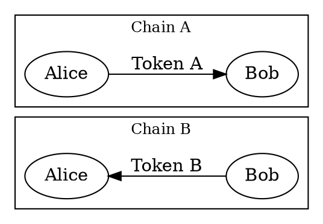

# Cross-Chain Swaps

Cross-chain swap
:   A cross-chain swap enables trading tokens trustlessly across different blockchains without relying on an
    intermediary (e.g., a centralized exchange).

Since tokens cannot be transferred directly between blockchains with different technologies, a separate transfer is
performed on each chain.

The cross-chain swap protocol ensures that either both transfers succeed or neither does.

This is conceptually similar to an <aggregate transaction:>, but instead of grouping operations within one blockchain,
the swap coordinates operations across two independent chains.

## Protocol

Cross-chain swaps on Symbol can be implemented using the HTLC protocol:

HTLC
:   [Hashed Time-Lock Contract](https://en.bitcoin.it/wiki/Hash_Time_Locked_Contracts).
    A protocol that combines a <hashlock:> (funds can only be claimed by revealing a secret proof) and a <timelock:>
    (funds are refunded if unclaimed before a deadline) to enable trustless exchanges between parties.

### How it Works

HTLC relies on two locking mechanisms:

Hashlock
:   A condition that keeps funds locked until someone reveals a specific secret (the _proof_).
    The lock stores the cryptographic <hash:|hash> of the proof, so claiming the funds forces the proof to be published on the
    chain.

Timelock
:   A condition that keeps funds locked until a specific time or block height is reached.

The key insight for cross-chain swaps is that the **same hashlock** is used on both chains.
The initiator locks tokens on one chain using a hashlock, so the transfer cannot complete until the proof is revealed.
The other party then locks tokens on the other chain using the same hashlock.
To claim the other party's tokens, the initiator must reveal the proof, which in turn lets the other party use it to
claim the initiator's tokens and complete the swap.

The timelocks must be configured so that neither party can cheat the other
(see [Safety Considerations](#safety-considerations) below).

### In Symbol

Symbol offers a transaction type called `Secret Lock` that places both a hashlock and a timelock on tokens
(<mosaics:> in Symbol) in a single operation, along with the hash algorithm and the recipient.
A companion `Secret Proof` transaction unlocks them by revealing the proof that matches the hashlock.

If the recipient does not claim before the timelock expires, the locked tokens are returned to the sender automatically.
No separate refund transaction is required.

The maximum timelock duration is 365 days.

### Compatibility with other chains

To swap with Symbol, the other chain must support an equivalent HTLC mechanism with a hash algorithm compatible with
the ones Symbol supports:

| Algorithm  | Description                                                                                                                                     |
|------------|-------------------------------------------------------------------------------------------------------------------------------------------------|
| `SHA3_256` | The proof is hashed with [SHA-3 256](https://en.wikipedia.org/wiki/SHA-3).                                                                      |
| `HASH_160` | The proof is hashed first with [SHA-256](https://en.wikipedia.org/wiki/SHA-2) and then with [RIPEMD-160](https://en.wikipedia.org/wiki/RIPEMD). |
| `HASH_256` | The proof is hashed twice with [SHA-256](https://en.wikipedia.org/wiki/SHA-2).                                                                  |

For example:

* Bitcoin natively supports HTLC via `OP_HASH160` and `OP_HASH256`.
* Ethereum HTLC smart contracts can be implemented using the built-in SHA-256 and RIPEMD-160 functions.

## Example

Alice and Bob want to exchange tokens across two different blockchains, Chain A and Chain B, following the scenario
in the overview diagram at the top of this page:

* Alice holds `Token A` on Chain A and wants `Token B` from Bob.
* Bob holds `Token B` on Chain B and wants Alice's `Token A`.

Both Alice and Bob have accounts on both chains, so they can send and receive on either side.

The swap proceeds in four steps:

```graphviz neato timelock-windows.svg
digraph TimelockWindows {
    node [fontsize=24 shape=point width=0];
    edge [arrowhead=none];
    pad=0.5;

    // Alice's lock bar (Chain A - longer, top)
    A_start [pos="0,5!" width=0.2];
    A_end [pos="12,5!" width=0.2];
    A_start -> A_end [style=bold penwidth=5];
    A_label [label="Alice's Token A lock on Chain A (longer timelock)" shape=plaintext pos="6,5.3!"];

    // Timelock Difference (between Bob's expiry and Alice's expiry)
    TG_start [pos="7,3.5!" width=0.2];
    TG_end [pos="12,3.5!" width=0.2];
    TG_start -> TG_end [style=dashed penwidth=5];
    TG_label [label="Timelock Difference" shape=plaintext pos="9.5,3.8!"];

    // Bob's lock bar (Chain B - shorter)
    B_start [pos="1,2!" width=0.2];
    B_end [pos="7,2!" width=0.2];
    B_start -> B_end [style=bold penwidth=5];
    B_label [label="Bob's Token B lock on Chain B (shorter timelock)" shape=plaintext pos="4,2.3!"];

    // Vertical ticks
    T1_top [pos="0,5!"];
    T1_bot [pos="0,0.8!"];
    T1_top -> T1_bot [style=dotted];

    T2_top [pos="1,2!"];
    T2_bot [pos="1,0.8!"];
    T2_top -> T2_bot [style=dotted];

    T3_top [pos="5,2!"];
    T3_bot [pos="5,0.8!"];
    T3_top -> T3_bot [style=dotted];

    T4_top [pos="7,2!"];
    T4_bot [pos="7,0.8!"];
    T4_top -> T4_bot [style=dotted];

    T5_top [pos="10,5!"];
    T5_bot [pos="10,0.8!"];
    T5_top -> T5_bot [style=dotted];

    T6_top [pos="12,5!"];
    T6_bot [pos="12,0.8!"];
    T6_top -> T6_bot [style=dotted];

    // Labels below
    L1 [label="1.\nAlice\nlocks" shape=plaintext pos="0,0.2!"];
    L2 [label="2.\nBob\nlocks" shape=plaintext pos="1,0.2!"];
    L3 [label="3. Alice\nclaims and\nreveals proof" shape=plaintext pos="5,0.2!"];
    L4 [label="Bob's\ntimelock\nexpires" shape=plaintext pos="7,0.2!"];
    L5 [label="4. Bob\nclaims\n " shape=plaintext pos="10,0.2!"];
    L6 [label="Alice's\ntimelock\nexpires" shape=plaintext pos="12,0.2!"];
}
```

1. **Alice locks tokens on Chain A:** Alice starts the transfer of `Token A` to Bob on Chain A, but locks it so the
    transfer cannot complete until a proof is revealed.
    She generates a random proof, computes its hash, and creates the <hashlock:> naming Bob as the recipient and
    setting a <timelock:>.
2. **Bob locks tokens on Chain B:** Bob reads the hashlock from Alice's transfer on Chain A and starts his
    own transfer of `Token B` on Chain B, locking it with the **same hashlock** and naming Alice as the recipient.
    Bob's timelock must expire **before** Alice's timelock on Chain A (see [Timelock Ordering](#timelock-ordering)).
3. **Alice claims on Chain B:** Alice reveals the proof on Chain B to complete Bob's transfer and receive `Token B`.
4. **Bob claims on Chain A:** Bob reads the proof from Chain B and uses it to complete Alice's transfer on Chain A
    and receive `Token A`.

    Note that Bob can claim as soon as the proof is revealed.
    He does not need to wait for his timelock on Symbol to expire as depicted in the diagram.

If the timelocks are configured correctly, the protocol ensures every participant has a fair chance to receive their
part of the swap:

| Scenario                                        | Outcome                                                                                           |
|-------------------------------------------------|---------------------------------------------------------------------------------------------------|
| Bob does not lock tokens                        | Alice's tokens are refunded after her timelock on Chain A expires.                                |
| Alice does not reveal proof                     | Bob's tokens are refunded when his timelock expires. Alice's tokens are also refunded later.      |
| Alice reveals proof, Bob claims in time         | Alice gets Bob's tokens. Bob can claim Alice's tokens before her timelock expires.                |
| Alice reveals proof, Bob does not claim in time | **Worst case for Bob**. Alice keeps Bob's tokens and gets her own back when her timelock expires. |

See [Safety Considerations](#safety-considerations) for details on how to configure the timelocks correctly.

## Safety Considerations

A cross-chain swap is only safe when both parties verify each other's locks, the timelocks are configured correctly,
each party waits for the right confirmations, and both parties understand how the public proof can be used against
them.

The following sections cover each of these concerns, using the Alice and Bob [example](#example) for clarity.

### Lock Verification

Before acting on the other party's lock, each party must verify that the lock matches what was agreed.
Blindly following the protocol without this check allows the counterparty to cheat by posting a lock with the
wrong amount, token, hashlock, recipient, or expiry.

Each party should verify:

* **Amount and token:** The lock holds the expected quantity of the agreed token.
* **Hashlock:** The lock uses the agreed hashlock, the same value on both chains.
* **Recipient:** The lock names the correct recipient.
* **Timelock:** The expiry follows the agreed ordering (see [Timelock Ordering](#timelock-ordering) and
    [Timelock Difference](#timelock-difference)).

In practice:

* **Before Bob locks** (step 2), Bob verifies Alice's lock on Chain A.
* **Before Alice reveals the proof** (step 3), Alice verifies Bob's lock on Chain B.

If any check fails, the party should refuse to continue.
In that case, Alice can wait for her own timelock to expire and get her tokens refunded,
while Bob has not yet locked any funds.

### Timelock Ordering

Alice is the initiator of the swap.
Because Alice knows the proof from the start, she controls when it is first revealed.

For this reason, Bob's timelock must expire before Alice's timelock.
Otherwise, Alice could wait until reclaiming her own tokens and then still reveal the proof in time to claim Bob's
tokens.

### Timelock Difference

The difference between Bob's timelock expiry and Alice's timelock expiry must be **large enough** for Bob to detect the
proof on Chain B, submit his claim on Chain A, and obtain confirmation.

In the worst case, Alice reveals the proof at the last moment before Bob's lock expires, leaving Bob only this
remaining time to react.

The required margin should account for:

* **Finality periods** on both chains (see [Finality](#finality) below).
* **Observation time** for Bob to detect the proof on Chain B.
* **Transaction submission and confirmation time** on Chain A.
* **Possible resubmission** if Bob's claim transaction is not initially accepted by the network.

If Bob considers the window too short, he can refuse the swap and ask Alice to use a longer timelock on Chain A.

See the [timing diagram](#example) in the example above.

### Late Proof Revelation

Alice must reveal the proof well before Bob's timelock expires.

If she waits until the last moment and her claim transaction on Chain B does not confirm in time, Bob may be refunded on
Chain B while the proof has already become public.

Bob can then use that proof to claim Alice's tokens on Chain A, leaving Alice with nothing.

### Finality

Each party must wait for the previous step's transaction to reach <finalization:|finality> on their chain before acting
on the next step.

In particular, Alice's _lock_ (step 1) must be final before Bob locks, and Bob's lock (step 2) must be final before
Alice reveals the proof.
A <rollback:> at either point could remove a lock after the other party has already acted.

On the other hand, if a _claim_ transaction (steps 3 or 4) is rolled back, the party can resubmit as long as the
timelock has not expired.

### Front-Running Risk

When Alice reveals the proof on Chain B (step 3), the proof may be visible in the <unconfirmed pool:> before the
transaction is confirmed.
An observer on Chain B could extract the proof and attempt to claim funds on either chain before the intended
recipient does.

In Symbol, anyone can submit the proof, but the funds are always sent to the recipient specified in the lock, which
eliminates this risk.
The other chain's HTLC implementation must also enforce recipient-only claiming to prevent this attack.
Verify this before using any HTLC contract for a cross-chain swap.

Even if Alice's proof transaction fails to confirm, the proof is already exposed.
This does not break the protocol: Alice can resubmit on Chain B, and Bob can use the revealed proof on Chain A.
Both parties can still claim their funds as long as their respective timelocks have not expired.
