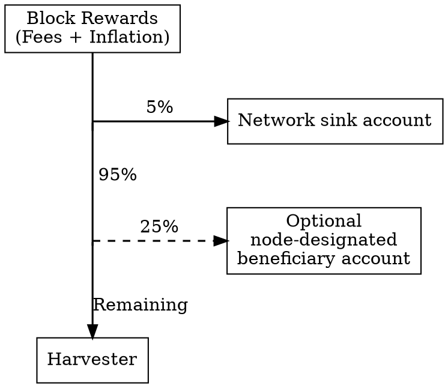

# Harvesting

Harvesting
:   The process by which Symbol adds new <blocks:> to the chain and distributes rewards to participating <accounts:>.
    It plays a similar role to **mining** in <PoW:> or **staking** in <PoS:>.

Each new block is created by a single, random <node:> and signed by one of the node's _harvester accounts_.
This account can either be the node's main account or any of its <delegators:>.

The fees from the <transactions:> included in the block, along with a portion of <inflation:>,
are distributed to the harvester account and to other accounts designated by the node operator,
which may or may not include the node's main account.

Unlike mining in <PoW:>, harvesting does not require specialized hardware.
Participation is open to any account holding at least 10,000 <XYM:> and connected to a node,
either directly or through delegation.
This balance contributes to the account's <importance:> score, which determines how often it can harvest a block.

## Harvesting Process

Symbol does not use an explicit selection process to determine which node will harvest the next block.
Instead, every node independently attempts to produce a new block using its main account and
each of the linked <delegator:> accounts.

To do this, a _target_ value is calculated based primarily on each account's <importance:>.
The higher the importance, the higher its target will be.

The node then assembles a candidate block by collecting transactions from the <unconfirmed pool:>
and assigning the harvesting rewards to the configured beneficiaries.
Once the block is assembled, the node <hashes:> it and generates a random number called the _hit_.

If the _hit_ is lower than the _target_, the block is valid and is announced to the rest of the network.
Other nodes then verify the block, ensuring:

* The transactions are valid.
* The target and hit values were correctly calculated.
* The hit is indeed lower than the target.

If any of these checks fail, other nodes simply ignore the new block.
The <consensus:> mechanism makes sure that the node eventually adopts a block that the rest of the network agrees on.

If the block is valid, it is accepted by other nodes that include it in their copies of the chain.
This process is repeated at the next block height.

!!! info "Simultaneous Block Creation"
    Note that no special measures are in place to prevent multiple nodes from generating blocks at the same height.
    When this occurs, the network may temporarily <fork:> as different nodes adopt different blocks for the same
    position in the chain.

    The <consensus:> mechanism resolves these conflicts as nodes become aware of the competing blocks.

??? abstract "Target and Hit Calculation"

    * The **target** is calculated independently by each node and reflects its likelihood of harvesting the next block
        using a specific account.
        It depends on three factors:

        * The account's <importance:> score: more active or better-funded accounts will harvest more often.
        * The network-wide **difficulty**, which adjusts dynamically based on recent block production times,
            to maintain a constant rate.
        * The **time** elapsed since the last block: longer delays increase the chance of a new block being produced.

    * The **hit** is a random number derived from the new block's content and the account's <VRF key:>,
        making it unpredictable.

        Without the VRF key, an attacker could predict which node is next in line and attempt to censor it,
        for example, by launching a <DoS:> attack.

    For the block to be valid, the node's target must be **greater than** its hit.
    A higher importance or a longer delay increases the target, making the condition easier to satisfy.

## Harvesting Methods

Node owners can participate in harvesting by enabling [local](#local-harvesting) or [remote](#remote-harvesting) harvesting,
depending on their preferred balance between simplicity and security.
Accounts that do not operate a node but meet the balance requirements can still harvest by linking to a node through
[delegated harvesting](#delegated-harvesting), sharing in its rewards.

### Local Harvesting

Local Harvesting
:   A type of <harvesting:> where the rewards are sent directly to the harvester account.
    The node signs produced blocks using the operator's <main key:>, which must be stored on the machine.

!!! warning
    The harvester account must hold a significant balance to maintain a high <importance:> score.
    Storing its <private key:> on a machine that is permanently online puts the entire balance at risk
    in case of unauthorized access.

While local harvesting offers a straightforward setup, these security risks make it unsuitable for public nodes.
Most operators instead prefer remote harvesting.

### Remote Harvesting

Remote Harvesting
:   A type of <harvesting:> that delegates block signing to a separate _proxy_ account,
    while the node's <importance:> score and rewards remain tied to the operator's <main key:>.

The proxy account holds no funds and exists only to sign blocks on behalf of the main account.
Because its <private key:> is stored in the node's configuration files, hosted on a permanently-online machine,
it is designed to be expendable.

The main account still determines the node's importance and receives all block rewards.
However, its key remains offline, safe from compromise.
For simplicity, the main account is still called the harvester account, even though blocks are signed by the proxy.

This separation of duties offers strong protection for the harvester's funds
and makes remote harvesting the preferred option for most operators.

### Delegated Harvesting

Delegated Harvesting
:   A form of <harvesting:> that allows eligible accounts not operating a node to delegate harvesting duties to a
    third-party node.
    The account's <importance:> score is used, and any harvested fees are shared between the account and the node's
    configured beneficiary.

Such an account is called a _delegator_, or _delegated harvester_, even though the actual block signing
is done by the node's proxy account.

Delegator
:   An account that <delegated harvesting:|delegates> harvesting to a third-party node while retaining its <importance:>
    and receiving a share of the harvested rewards.
    Also called a _delegated harvester_.

Although the node performs the work, the delegator is still considered the harvester.
This arrangement benefits both parties: the account earns rewards without running a node,
and the node increases its block production (and collected fees) without relying solely on its own importance.

Delegated harvesting uses the same proxy-based setup as remote harvesting.
The delegator signs a <transfer transaction:> with an encrypted message that requests the node to
harvest on its behalf.

Whether the node grants the request depends on its policy and any competing requests it may have received.

As with remote harvesting, block signing is performed by an account other than the delegator,
so its <private key:> never needs to leave secure storage.

## Reward Distribution

When a block is harvested, rewards are distributed among several participants.
These rewards consist of:

* The fees paid by the <transactions:> included in the block.
* An additional amount of <inflation:>.

The total reward is divided among the following parties:

* **The network sink account**:
    {id="sink"}

    A system account that receives a fixed 5% of the reward.
    This amount can be used to fund network-wide reward programs.

* **The node-designated beneficiary**:
    {id="beneficiary"}

    An optional account, chosen by the node owner,  that receives a fixed 25% of the reward
    (after subtracting the network sink amount).

    Node owners may retain this portion for themselves or redistribute it through their own reward programs,
    for example, by sharing it with their delegators.

* **The harvester**:
    {id="harvester"}

    The account that created the block.
    It can be the node's <remote harvesting:> account, or any of its <delegators:>.

!!! example
    For example, assuming 100 XYM of block rewards (fees + inflation) and that a beneficiary account is configured:

    

    | Recipient                | Calculation             |      Amount |
    | ------------------------ | ----------------------- | ----------: |
    | **Network sink account** | 5% of 100 XYM           |       5 XYM |
    | **Beneficiary account**  | 25% of remaining 95 XYM |   23.75 XYM |
    | **Harvester account**    | Remaining XYM           |   71.25 XYM |
    | **Total**                |                         | **100 XYM** |

    

## Importance

Importance
:   A measure of an account's contribution to the network, based on its balance, the transaction fees it has paid,
    and its participation in <harvesting:> new blocks.
    This score determines harvesting eligibility and vote weight in consensus.

Importance serves a role similar to hashrate in <PoW:> systems or stake in <PoS:> systems:
the higher the value, the greater the chance to harvest a block and earn rewards.

??? info "Importance Calculation"

    All accounts that have a balance of at least 10'000 XYM are called _high value accounts_ and participate in the
    importance calculation.

    The importance score $I_A$ for a high value account $A$ is based on its _stake score_, its _transaction score_,
    and its _node score_.

    * The stake score $S_A$ is the percentage of currency it owns relative to the total currency owned by
        all high value accounts.

    * The transaction score $T_A$ is the percentage of fees paid by the account relative to the total amount
        of fees paid by all high value accounts.

    * The node score $N_A$ is the percentage of times it has been specified as a harvesting beneficiary relative to
        the total number of high value account beneficiaries in the same period.

    The details about how these scores are combined to produce the importance score can be found in
    [the Symbol whitepaper](site:/assets/pdfs/SymbolWhitepaper.pdf), section 14.1.

!!! note

    Importance scores on mainnet are calculated every 720 blocks (roughly 6 hours) and the smaller of the previous
    two scores is used when calculating harvesting probabilities.
    Therefore, when you first fund an account, it will require 12 hours to have a probability greater than zero to
    start harvesting.

    On testnet scores are recalculated every 180 blocks (roughly 1.5 hours), so testing is easier.
