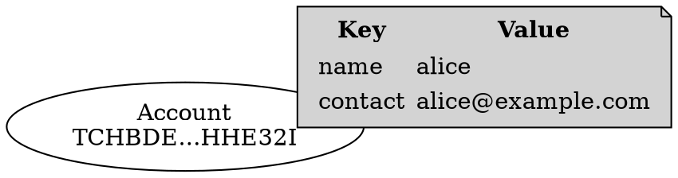
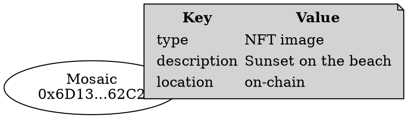
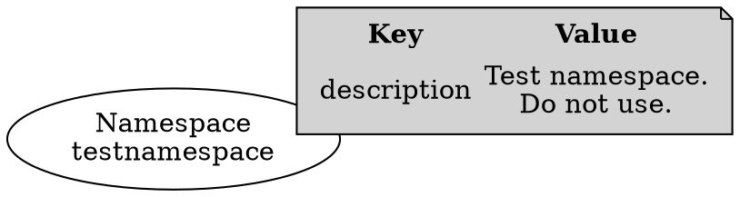

# Metadata

Metadata
:   Flexible data stored on-chain via metadata transactions.
    It can be attached to <accounts:>, <mosaics:>, or <namespaces:>.

The protocol does not impose any semantic constraint on this metadata.
Its meaning is entirely defined by the application that creates it.

Every piece of data is identified by a unique key made of several parts.
Conflicts between data provided by different applications are avoided by including the metadata creator’s address
in this unique key.

Reception of unwanted metadata is avoided by requiring the signature of the owner of the entity
(account, mosaic or namespace) where the metadata is to be attached.
I.e., metadata can only be attached if the owner of the target entity cosigns the transaction.

Each unique key can store up to 1024 bytes in its corresponding value, and can be updated or deleted as needed.

Three different types of metadata are supported: [Account](#account-metadata), [Mosaic](#mosaic-metadata),
and [Namespace](#namespace-metadata).

## Account Metadata

The metadata is associated with an <account:>.

Each stored value's unique identifier is composed of:

* The **signer's address**: the account adding the metadata.
    Its signature is required when creating, updating, or deleting the metadata entry.
* The **target account's address**: the account where the metadata is to be attached.
    Its signature is required when creating, updating, or deleting the metadata entry.
* The **metadata key**: a 64-bit value chosen by the metadata creator that allows
    attaching multiple pieces of data to the same account.

    It can be easily generated from a text string for ease of use.

Metadata cannot be attached to an account without its explicit approval.

Use cases include:

* Tagging accounts with identity information.
* Adding public contact or usage data.
* Certifying purpose or affiliations.

## Mosaic Metadata

The metadata is associated with a <mosaic:>.

Each stored value's unique identifier is composed of:

* The **signer's address**: the account adding the metadata.
    Its signature is required when creating, updating, or deleting the metadata entry.
* The **target account's address**: the account that created the mosaic.
    Its signature is required when creating, updating, or deleting the metadata entry.
* The **target mosaic ID**: to identify this particular mosaic.
* The **metadata key**: a 64-bit value chosen by the metadata creator that allows
    attaching multiple pieces of data to the same mosaic.

    It can be easily generated from a text string for ease of use.

Metadata cannot be attached to a mosaic without the explicit approval of the mosaic's owner.

Mosaics represent on-chain assets, and metadata allows enriching them with descriptive information.
For example, if mosaics are used to store <NFTs:>, the metadata can store:

* Author information
* Contact information
* External hash if the content is stored off-chain
* Internal hash if the content is stored on-chain

## Namespace Metadata

The metadata is associated with a <namespace:>.

Each stored value's unique identifier is composed of:

* The **signer's address**: the account adding the metadata.
    Its signature is required when creating, updating, or deleting the metadata entry.
* The **target account's address**: the account that created the namespace.
    Its signature is required when creating, updating, or deleting the metadata entry.
* The **target namespace ID**: to identify this particular namespace.
* The **metadata key**: a 64-bit value chosen by the metadata creator that allows
    attaching multiple pieces of data to the same namespace.

    It can be easily generated from a text string for ease of use.

Metadata cannot be attached to a namespace without the explicit approval of the namespace's owner.

Namespaces are human-readable identifiers for accounts and mosaics.
Adding metadata to them can further clarify their purpose, ownership, or contact information, for example.

## Summary

The following table summarizes the main numerical limits related to metadata.

| Limit                                         | Value |
| --------------------------------------------- | ----- |
| Maximum length in bytes of the metadata value | 1'024 |
