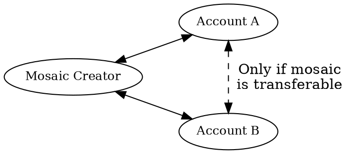

# Mosaics

Mosaic
:   A representation of an asset on the Symbol blockchain, commonly called tokens on other protocols.
    For example: currencies, licenses, collectibles, access rights, or voting power.

Unlike smart contract-based tokens on other platforms, Symbol mosaics are supported directly at the protocol level,
and require no additional coding to use.

Each mosaic defines a new type of asset, and the individual tokens that belong to this type are called _mosaic units_.

Mosaics can represent fungible assets, such as coins, where each unit is interchangeable,
and non-fungible assets, such as paintings or <NFTs:>, where each unit is unique.

New mosaics can be created as needed.
Each is assigned a unique identifier and optionally a human-readable name for easier use
[as explained below](#mosaic-ids-and-namespaces).

## Mosaic Properties

Symbol mosaics support several configurable properties that define their behavior.

### Divisibility

Divisibility
:   This property defines how many decimal places a mosaic quantity can have.
    A mosaic with divisibility `0` is indivisible: it can only be transferred in whole units.
    Higher values allow fractional units.

For example, a divisibility of `2` means each _whole unit_ can be divided into 100 _fractional units_ (10^2^),
allowing the mosaic to be handled in increments of `0.01`.

Fractional units are also called _atomic units_, so in this example, 1 unit consists of 100 atomic units.

In many other protocols, this value is hardcoded.
For example, Bitcoin uses 8 decimal places, and Ethereum uses 18.
Symbol allows each mosaic to define its own divisibility, depending on the needs of the asset it represents.

The maximum allowed divisibility in Symbol is `6`.

### Initial Supply

This property defines the total number of mosaic units created at issuance.
The supply is fixed unless [supply mutability](#supply-mutability) is enabled.

### Supply Mutability

This property indicates whether the mosaic's total supply can be increased or decreased after creation.
It allows for dynamic issuance or removal of mosaic units, depending on the desired asset lifecycle.

Only the account that originally created the mosaic can modify its total supply.
These changes affect only the creator's balance:

* When _minting_ (increasing the supply), new units are created and added to the creator’s account.
* When _burning_ (decreasing the supply), existing units are removed from the creator’s account.
    If the account does not have enough balance, the operation fails.

### Duration

Mosaics can be assigned an optional duration, expressed in blocks.
Once this period ends, the mosaic expires and disappears from the balances of all accounts.

If a duration is provided, the maximum allowed value in Symbol is 10 years (3650 days).

!!! note
    Mosaic duration cannot be extended after creation.
    Before creating an expiring mosaic, consider whether your use case truly requires it to expire.

    This behavior is different from that of namespaces, which can be renewed.

### Transferability

Specifies whether the mosaic can be freely transferred between accounts.
If disabled, only the creator can send or receive the mosaic.

### Restrictability

Allows the creator to define rules that limit what accounts can hold or transfer the mosaic.
This is useful for compliance, whitelisting, or access control scenarios.

See the documentation about mosaic restrictions for more information.

### Revocability

Grants the creator the ability to forcibly remove mosaic units from another account,
returning them to the creator’s own account.
This feature can be used to reclaim tokens or enforce contractual terms.

## Mosaic IDs and Namespaces

Mosaic ID
:   A 64-bit number that uniquely identifies a mosaic on the network.

For example, **XYM**, the native network currency on Symbol, has the mosaic ID `0x6BED913FA20223F8` on mainnet.

To make mosaics easier to reference, especially in user interfaces,
a human-readable _namespace_ can be linked to the mosaic.
This works like an internet domain name: instead of referencing the raw mosaic ID,
users can refer to the mosaic by name, such as `symbol.xym`.

Namespaces are optional and can be reassigned or expire independently of the mosaic itself.
See the documentation about namespaces for more information.
