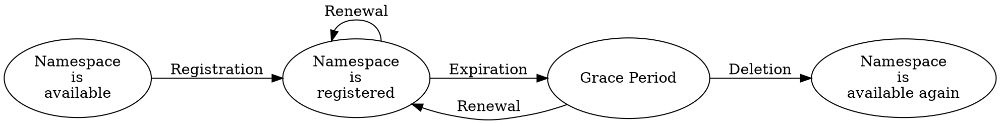

# Namespaces

Namespace
:   A human-readable text string that can be used in place of an <address:> or a <Mosaic ID:>.

Namespaces make it easier to reference assets and accounts without relying on long, unreadable identifiers.
They improve usability in wallets and block explorers by allowing meaningful _aliases_ like `symbol.xym` or
`my_company.main_account` to stand in for raw mosaic IDs or account addresses,
making interactions clearer and less error-prone.

Because namespaces are a limited resource, they are leased for a fixed period rather than owned permanently,
but leases can be renewed.

## Subnamespaces

Namespaces in Symbol follow a hierarchical structure, similar to internet domain names.
Each name consists of one to three parts, separated by dots, for example, `foo`, `foo.bar`, or `foo.bar.baz`.

The first part is called the _root namespace_.
Any additional parts are _subnamespaces_, which must be registered separately under the root.

Root namespace
:   A namespace that has no parent and can be used on its own.
    It can be used to group subnamespaces together in a hierarchical manner.
    Each root namespace can have up to 256 subnamespaces.

Subnamespace
:   A namespace that belongs to a parent root namespace.
    Subnamespaces expire when the parent namespace expires (see [Duration](#duration)).

## Properties

### Name

Each namespace has a unique name that identifies it on the network, and must follow specific formatting rules:

* Names can only contain lowercase letters, numbers, hyphens `-`, and underscores `_`.
* They must start with a letter or number.
* They can be at most 64 characters long.

Once registered, a name cannot be changed.

### Duration

When a root namespace is created, it is leased for a fixed period, between 30 days and 5 years.
During this time, the creator can perform operations such as:

* Linking the namespace to a <mosaic:> or an <account:>, turning it into an alias that is easier to reference.
* Creating subnamespaces under the root namespace.
* Renewing the root namespace to extend its duration.
    Subnamespaces do not need to be renewed, as they have the same duration as their root namespace.

If the namespace is not renewed before expiration, it enters a 30-day  _grace period_.
During this time, the namespace is effectively disabled, but it is not yet available for others to register.
Only the original creator can renew a namespace during the grace period.
Once the grace period ends, the namespace is fully expired and becomes available for others to register.

The following operations are permitted depending on the state of the namespace registration:

| Operation                           | Namespace Available | Namespace Registered |    Grace Period    |
| ----------------------------------- | :-----------------: | :------------------: | :----------------: |
| Register the namespace              | :white_check_mark:  |   :material-close:   |  :material-close:  |
| Register a subnamespace             |  :material-close:   |  :white_check_mark:  |  :material-close:  |
| Link namespace to mosaic or account |  :material-close:   |  :white_check_mark:  |  :material-close:  |
| Send a transaction using an alias   |  :material-close:   |  :white_check_mark:  |  :material-close:  |
| Renew a namespace                   |  :material-close:   |  :white_check_mark:  | :white_check_mark: |

!!! note
    Unlike <mosaics:>, namespaces **can** be renewed before expiration.
    This allows them to remain active indefinitely, as long as the creator continues to renew them.

## Lease Fee

Registering a namespace requires paying a lease fee in the network currency (<XYM:>).
This reflects the fact that namespaces are a limited global resource and helps prevent name squatting.

The fee depends on current network conditions and the type of namespace:

* **Root namespace**: The fee is proportional to the desired duration.
* **Subnamespace**: The fee does not depend on the parent namespace's duration.

The cost of the lease can be determined beforehand by querying the network,
and applications like the [Symbol Wallet](../userbook/wallet/install.md) typically display this information.

The fee must be paid at the time of registration or renewal, and is non-refundable.

!!! note
    Registering or renewing any kind of namespace requires announcing a transaction, which also has an associated fee.
    However, this transaction fee is typically negligible compared to the lease fee.

## Linking

Namespaces can be linked to either a <mosaic:> or an <account:>, turning the name into an _alias_ for that object.
This allows users to refer to a mosaic or account by its namespace instead of by its raw identifier.

For example:

* Linking `symbol.xym` to the native mosaic replaces the unreadable ID `0x6BED913FA20223F8` with a name that is
    easier to display and remember.

* Linking `bob.wallet` to an account avoids having to share a full address like `NA5S6U...XDF3`,
    and lets others send funds using a recognizable label.

Each namespace can be linked to **only one object at a time**, and the link must be either to a mosaic or to an account.
However, the same object can be linked by multiple namespaces.

* **When linking to a mosaic**: Only the creator of the mosaic can establish the link.
    This prevents unauthorized aliasing of third-party assets.

* **When linking to an account**: The linking transaction must not be blocked by an <account operation restriction:>.
    This allows the account owner to control unauthorized aliasing.

Linking is optional, and a namespace can exist without pointing to any object,
but it is of limited practical use unless linked.

!!! warning
    Links can be changed or removed at any time by the namespace owner.

    This feature offers flexibility, but should be used sparingly, as it can be confusing to users, especially when
    viewing historical transactions.

    To help with this, every time a transaction using an alias is added to a block, a _resolution statement <receipt:>_
    is recorded to indicate what the alias referred to at the time of the transaction.

    This allows wallets and block explorers to display the correct address or mosaic ID,
    even if the alias has since changed or been removed.

    Additionally, before accepting an alias from a user, wallets can query the currently linked object and the date
    the link was created, so users can verify that the alias points to the intended destination.

## Ownership

A namespace is controlled by the account that created the root namespace.

Only the owner can:

* Link or unlink the namespace.
* Create subnamespaces.
* Renew the root namespace.

Namespace ownership cannot be transferred directly.
Instead, control must be transferred by handing over the owner account, for example,
using a <multisignature account:>.

Subnamespaces always share the same owner as the root and cannot be managed separately.

## Summary

The following table summarizes the main numerical limits related to namespaces.

| Limit                                   | Value                  | Notes                              |
| --------------------------------------- | ---------------------- | ---------------------------------- |
| Maximum depth of namespace hierarchy    | 3 levels               | Root + up to 2 subnamespaces       |
| Maximum length of a namespace name      | 64 characters          | Applies to each level individually |
| Allowed characters in namespace names   | `a–z`, `0–9`, `-`, `_` | Must start with a letter or number |
| Maximum subnamespaces per root          | 256                    |                                    |
| Minimum root namespace duration         | 30 days                |                                    |
| Maximum root namespace duration         | 5 years                |                                    |
| Namespace grace period after expiration | 30 days                |                                    |
