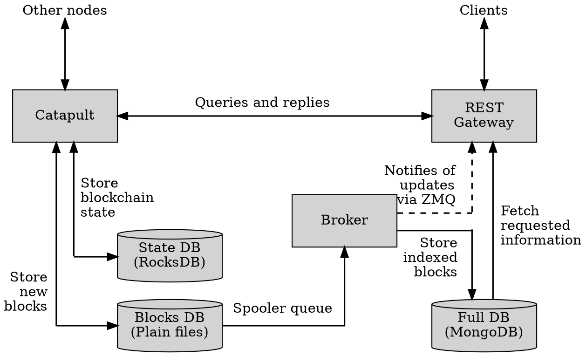
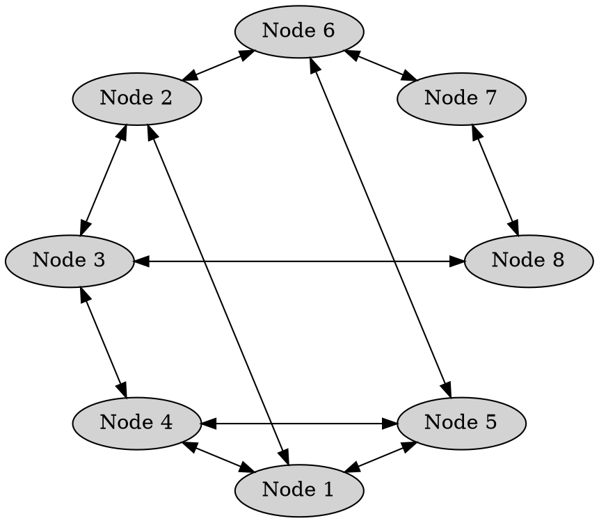

# Nodes

Node
:   A computer running the Symbol software which shares information with other nodes,
    validates incoming <transactions:>, and participates in consensus and block creation.

Nodes form the backbone of the blockchain, ensuring the network remains functional as long as enough nodes are active.

To participate in block creation, each node must be associated with a harvester <account:>,
which signs any blocks the node produces.
To help offset operational costs, the <XYM:> rewards from <harvesting:> can be directed
to one or more accounts chosen by the node operator.

Symbol nodes consist of multiple software components, which can be enabled and configured independently.
This flexibility allows for a variety of setups with different hardware requirements.

The most common configurations are known as _roles_ and are described further below.

## Node Structure

### :octicons-terminal-24: Catapult

Catapult
:   The core engine that verifies <transactions:> and <blocks:>, runs the consensus algorithm, creates new blocks,
    and propagates the changes through the network.

!!! image inline end ""

    {.off-glb .invertible}

It communicates directly with other nodes in [the peer-to-peer fashion described below](#peer-to-peer-communication).
For performance reasons, it keeps separate [blocks database](#blocks-database) and
[blockchain state database](#state-database).

It can also respond to basic queries from the [REST Gateway](#rest-gateway), such as the node's public key, peer list,
network configuration, and time.

### :octicons-database-24: State Database

Catapult uses [RocksDB](http://rocksdb.org), a key-value database that holds the current state of the blockchain.
This includes account balances, active mosaics, and namespaces, for example.

### :octicons-database-24: Blocks Database

All <blocks:> are stored as plain files on disk, along with <receipts:>,
the <unconfirmed pool:|unconfirmed transactions pool> and all
<bonded aggregate transaction:|partial transactions> waiting for completion.

### :octicons-terminal-24: REST Gateway

Provides the HTTP API that external clients, such as apps and wallets, use to interact with the blockchain.

Most queries are answered directly from its own [full database](#full-database), which stores blocks, state and
pending transactions.
Queries about the node itself or the network are forwarded to the <Catapult:> engine.

The REST Gateway also supports WebSocket connections, allowing subscribed applications to be notified of events
as they happen, instead of having to repeatedly ask for updates.

[ZeroMQ](#zero-mq) delivers these events to the gateway, which then forwards them to subscribers.

### :octicons-terminal-24: Broker

This component copies any updates from the [blocks database](#blocks-database) into the [full database](#full-database)
used by the [REST Gateway](#rest-gateway).

When enabled, <Catapult:> uses a spooler to notify the Broker asynchronously of changes to the blocks database.
This decoupling ensures that indexing and storing into the blocks database do not interfere with
Catapult's time-sensitive operation.

As soon as changes are detected, the Broker also notifies the REST Gateway through [Zero MQ](#zero-mq) so subscribed
applications can receive timely updates.

### :octicons-terminal-24: Zero MQ

[ZeroMQ](https://zeromq.org/) is the messaging system used to transmit events and state changes in real time
from the [Broker](#broker) to the [REST Gateway](#rest-gateway), and ultimately to any subscribed application.

Unlike regular HTTP requests, ZeroMQ enables push-based communication, where updates are delivered immediately
without requiring clients to poll for new data.
This makes it possible for applications to react quickly to events such as new blocks, confirmed transactions,
or changes in account state.

### :octicons-database-24: Full Database

<Catapult:>'s [blocks](#blocks-database) and [state](#state-database) databases are optimized for high throughput.

In parallel, nodes also maintain a replica of this data in [MongoDB](https://www.mongodb.com),
which is optimized for handling the potentially complex queries received by the [REST Gateway](#rest-gateway).

Only the [Broker](#broker) writes to this database, keeping it synchronized with the underlying blockchain data.

## Roles

Symbol nodes are highly configurable and can fulfill different roles depending on which components are enabled.

Each role places different demands on hardware, based on the enabled components.

### Peer Nodes

Peer Node
:   A peer node participates in the network's consensus process by validating incoming transactions and blocks,
    and relaying them to neighboring nodes.

Peer nodes maintain the network's integrity by independently verifying the data they receive before propagating it.

This role only requires running the <Catapult:> engine and its associated databases.

Peer nodes communicate exclusively with other nodes and do not expose an external API.
They are not intended for client access unless they also perform the API role.

### API Nodes

API Node
:   An API node exposes a public [REST](https://en.wikipedia.org/wiki/REST) interface that allows external clients
    such as wallets, explorers, and applications to interact with the network.

This role requires enabling all the components described in the [Node Structure](#node-structure) section.
All API nodes are also peer nodes.

It also stores <bonded aggregate transactions:> and collect cosignatures until the transactions are complete and
ready for processing.

### Voting Nodes

Voting Node
:   Voting nodes contribute to the <finalization:> process, which makes blocks immutable.

A voting node can be either a peer or an API node, that is, it may or may not expose an API.

### Dual Nodes

Dual Node
:   An API node with <harvesting:> enabled is sometimes referred to as a _dual node_.

### Light API Nodes

Light API Node
:   A node is called a _light API node_ when <Catapult:>'s limited HTTP API is made publicly accessible.

This API can only answer basic queries about the node and the network, and requires significantly fewer resources than
a full <API node:>.

Exposing this interface enables <delegated harvesting:> on the node,
since it allows clients to retrieve the node's public key, which would otherwise be inaccessible.

The only available API endpoints on light API nodes are:

* <get:/chain/info>
* <get:/node/info>
* <get:/node/peers>
* <get:/node/server>
* <get:/node/unlockedaccount>

## Peer To Peer Communication

Symbol nodes communicate directly with one another in a decentralized, peer-to-peer fashion.
There is no central coordinator: instead, each node establishes connections with a subset of other nodes,
forming a distributed network.

Nodes share their lists of known peers, allowing a newly connected node to quickly discover others and integrate
into the network.
This process ensures robust connectivity and helps the network remain resilient, even if individual nodes go offline.

To facilitate bootstrapping, an initial list of peers is bundled with <Catapult:>.
This allows a new node to make its first connections and begin discovering others.
However, nodes on this list receive no special treatment:
once connected, all peers are treated equally by the protocol.

### Node Reputation

In a decentralized system such as Symbol, nodes must decide which peers to trust and maintain connections with.
Rather than relying on static whitelists or manually curated connections, Symbol nodes use a _reputation_ system
to dynamically score and rank their peers based on observed behavior over time.

Each node calculates reputation independently, using metrics such as communication success, response time,
and the validity of received data.
Nodes that behave correctly and respond consistently are given higher scores.
Those that send invalid data, fail to respond, or otherwise misbehave may be penalized or temporarily blacklisted.

When a node needs to establish a new connection, it selects from the available peers, prioritizing those with higher
reputation based on past interactions.

Note that reputation scores are local: each node maintains its own view of the network,
based solely on its direct experience.

!!! note "Node rotation"

    To prevent the formation of isolated or stagnant node groups,
    Symbol nodes periodically drop a portion of their longest-running connections,
    even if those peers have good reputation scores.

    This forced churn ensures that nodes continually discover and evaluate new peers,
    maintaining a well-connected and adaptive network topology.

    By balancing reputation-based stability with deliberate connection turnover,
    the protocol avoids network fragmentation and promotes long-term decentralization.

Finally, note that this reputation score is an internal metric used by nodes to decide which other nodes to connect to.
When <harvesting:>, accounts may delegate their balance to any node they choose, based on reputation factors
that may or may not be related to the score described in this page.
