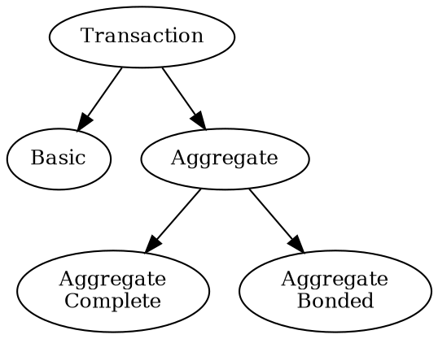
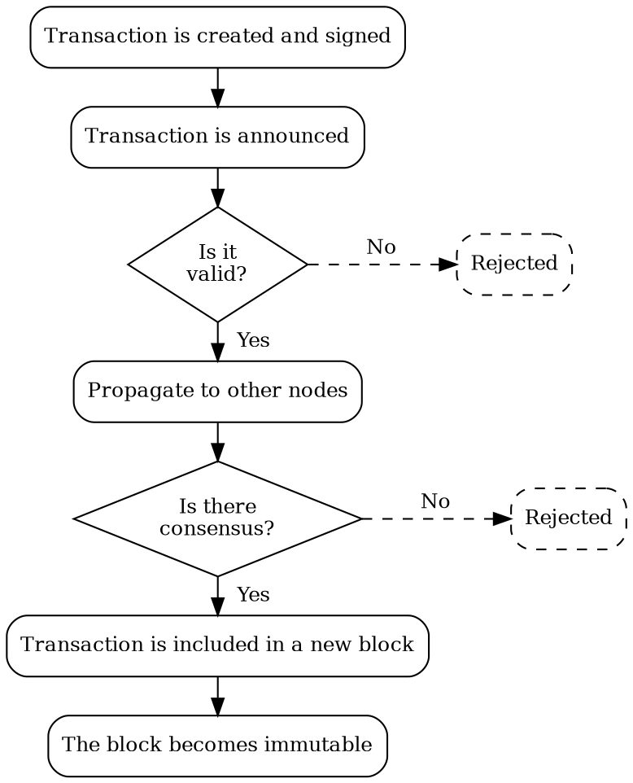

# Transactions

Transaction
:   A transaction represents an action or group of actions to perform on the Symbol blockchain,
    like moving funds from one <account:> to another, or registering a new currency, for example.

These actions are expressed in a signed message which needs to be announced to the network.
Nodes in the network then validate it and, if it is accepted, the transaction gets included in a block and
changes the state of the blockchain.

## Fundamental Transaction Types

Symbol supports two core transaction types: basic and aggregate, with the latter further divided into
complete and bonded variants.



### Basic Transactions

Basic Transaction
:   A basic <transaction:> represents a single action, initiated by a single account,
    requiring only that account's <signature:>.

Transferring funds out of an account or registering a new namespace are basic transactions, for example.

### Aggregate Transactions

Aggregate Transaction
:   Aggregate transactions group multiple basic transactions together and execute them atomically:
    either all of the <embedded transactions:> are accepted or none is.

They are initiated by a single account, but require signatures from every involved account.

Cosignature
:   When a transaction requires multiple signatures, they are called cosignatures.

Aggregate transactions provide a great deal of flexibility to Symbol, because they enable coordinated behavior
between multiple accounts, without requiring trust between them.

!!! tip "Aggregate Transaction Example"

    Accounts A and B want to exchange assets, so two transfer transactions are required.
    But they do not trust each other, so neither wants to be the first one to announce their transaction, and risk
    the other party not fulfilling their part.

    By wrapping both transactions in an aggregate:

    * Both parties can review the whole exchange before signing it.
    * They can be sure that both transactions will be executed, or none of them will be.
    * They can be sure that none of the transactions will be modified after the signature.
    * It does not matter who announces the aggregate transaction.

    ```dot
    digraph {
        rankdir="LR";
        fontsize=12;
        subgraph clusterAggregate {
            label = "Aggregate Transaction";
            tooltip = "Aggregate Transaction";
            subgraph clusterT1 {
                label = "Embedded Transaction 1";
                tooltip = "Embedded Transaction 1";
                style = dashed;
                A1 [label="A" tooltip="A"];
                B1 [label="B" tooltip="B"];
                A1 -> B1;
            }
            subgraph clusterT2 {
                label = "Embedded Transaction 2";
                tooltip = "Embedded Transaction 2";
                style = dashed;
                A2 [label="A" tooltip="A"];
                B2 [label="B" tooltip="B"];
                A2 -> B2 [dir=back];
            }
        }
    }
    ```

Depending on whether an aggregate transaction has all the required signatures when it is announced to the network,
two different transaction types are considered: complete and bonded.

### Complete Aggregate Transactions

Complete Aggregate Transaction
:   An <aggregate transaction:> submitted to the network with all required <cosignatures:> already attached.
    Nodes can therefore proceed to validation and include the transaction in a block immediately.

This transaction type requires that cosignatures are collected off-chain.

### Bonded Aggregate Transactions

Bonded Aggregate Transaction
:   An <aggregate transaction:> submitted to the network without all required <cosignatures:>.
    The network temporarily holds the transaction while waiting for the additional cosignatures.

Using this type of transaction, all involved parties interact exclusively on-chain.

Specific transaction types exist so the required accounts can submit the missing cosignatures.

Once the network receives all required cosignatures, the aggregate transaction continues processing.

To prevent spam which could exhaust network resources, initiating a bonded aggregate transaction requires a
small deposit or _bond_.
If all cosignatures are collected before the transaction expires, the bond is returned, otherwise, it is forfeited.

### Embedded Transactions

Embedded Transaction
:   When basic transactions are included in an aggregate transaction they are called embedded transactions.

Embedded transactions behave exactly like basic transactions, except for:

* They are not signed individually.
    Instead, the whole aggregate transaction is signed by every required account, and all the signatures are
    attached.

    For example, if an aggregate contains multiple transactions from the same account, only one signature
    from that account is required.

* They do not provide fee or deadline information.
    Again, this is provided by the enclosing aggregate transaction.

* Not all transaction types are allowed as embedded transactions.
    As an important example, aggregate transactions cannot be embedded within other aggregate transactions.

## Transaction Lifecycle



All transactions follow the same general lifecycle.

### 1. Creation and signature

A software client, typically an app, creates the transaction and fills in all its parameters.
For example, a transfer transaction requires the source <account:>, destination account, and amount.

This step also involves collecting all required signatures.
For a transfer transaction, only the source account's signature is required, but more complex transactions might
require multiple signatures.

Each signature is typically provided by a <wallet:>.
Signatures prove that all required parties have authorized the transaction, since only the holder of an account's
<key pair:|private key> can produce a valid signature.

### 2. Announcement

The application connects to one of the API nodes in the network and submits the transaction.

### 3. Validation

The node checks that the transaction is well-formed and includes all required, valid signatures.
Some transaction types require additional semantic checks.
For example, a transfer transaction verifies that the source account has enough funds.

For the complete list of checks see [Validation Details](#validation-details) below.

If any of these checks fail, the transaction is rejected and the process stops.
If all checks pass, the process continues.

### 4. Propagation

Once the node considers the transaction to be valid, it is broadcast to the peer nodes in the network.

Each receiving node performs the same validation:
it checks the transaction's structure, signatures, and any conditions specific to its type.
If the transaction passes validation, it is further propagated to other peers.

This process ensures that a broad portion of the network knows about the transaction and accepts it as valid.

### 5. Consensus

Each node has an importance score based on its staked funds and other factors.
This score is used as a weight when evaluating the node's vote on a transaction's validity.

The consensus algorithm collects votes from nodes until a predefined threshold is reached.
If the threshold is reached, the transaction is confirmed.
If not, it remains in this stage until it eventually expires and is rejected.

### 6. Confirmation

Once enough positive weighted votes are collected, the transaction is added to a block and considered confirmed.

However, due to the distributed nature of the blockchain, blocks can occasionally be rolled back and confirmed
transactions reverted.
This can occur when a large number of previously disconnected nodes rejoin the network and override decisions made
on transactions confirmed during the disconnection.

A common solution is to wait for several additional blocks after a transaction is confirmed.
Each new block adds another layer of confirmation, increasing confidence that the transaction will not be reverted.

On Symbol, however, an additional mechanism guarantees that confirmed transactions cannot be reverted.

### 7. Finalization

Finalization is the process that makes blocks, and the transactions they contain, irreversible.

It runs in parallel with consensus, finalizing blocks in batches after they have been added to the blockchain.

By waiting for finalization, applications can be certain the transactions they submitted will not be reverted.

## Common Transaction Structure

All transaction types in Symbol share a set of common attributes:

| Attribute             | Description                                                                               |
| --------------------- | ----------------------------------------------------------------------------------------- |
| **Signer public key** | Identifies the account initiating the transaction.                                        |
| **Signature**         | A cryptographic proof that the signer authorized the transaction.                         |
| **Deadline**          | A network timestamp after which the transaction expires.                                  |
| **Max fee**           | The maximum fee the signer is willing to pay to have the transaction included in a block. |
| **Type**              | Transaction type, which determines which additional attributes, if any, are present.      |

## Validation Details

All nodes in the network independently perform the following checks before accepting a transaction:

* **Signature verification**: Ensures the signer approves the transaction, and the data has not been tampered with.
* **Fee sufficiency**: Verifies that the provided fee meets the node's minimum requirement and that
    the signer has sufficient funds.
* **Deadline check**: Rejects transactions whose deadline has already passed.
* **Semantic checks**: Validates that the transaction is logically correct based on its type.
    For example, in a transfer transaction, the sender must own enough of the specified mosaics to cover both
    the transferred amount and the associated fee.

Invalid transactions are discarded and not propagated further through the network.

## Types of Transactions

Symbol supports multiple transaction types, each tailored to a specific kind of operation.
These are built on top of the common structure and include additional fields as needed.

Examples include:

* **Transfer transactions**: Used to send mosaics and messages between accounts.
* **Aggregate transactions**: Combine multiple transactions into one, enabling atomic execution.
* **Namespace registrations**: Reserve human-readable names on the blockchain.

All transaction types inherit the same processing flow and validation steps, but vary in intent and data structure.

More transaction types can be added via plugins.
