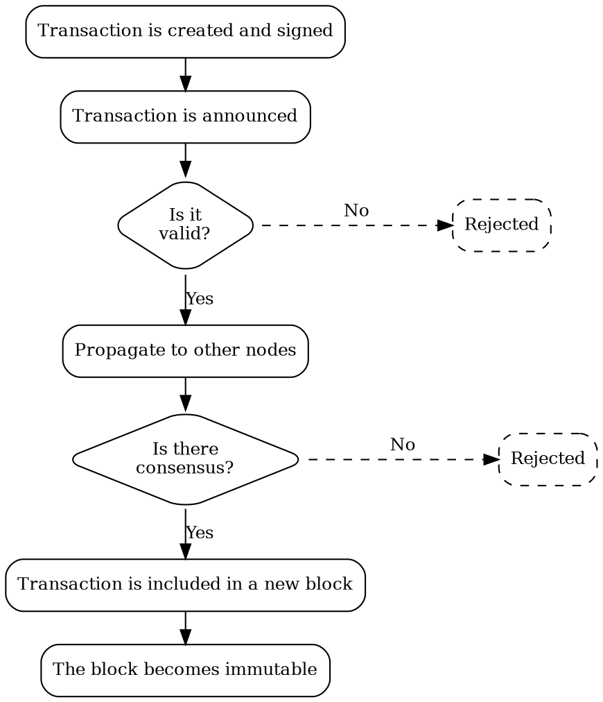

# Transactions

Transaction
:   A transaction represents an action to perform on the Symbol blockchain,
    like moving funds from one account to another, or registering a new currency, for example.

This action is expressed in a signed message which needs to be announced to the network.
Nodes in the network then validate it and, if it is accepted, the transaction gets included in a block and
changes the state of the blockchain.

## Transaction Lifecycle

All transactions follow the same general lifecycle:

### 1. Creation and signature

A software client, typically an app, creates the transaction and fills in all its parameters.
For example, a transfer transaction requires the source <account:>, destination account, and amount.

This step also involves collecting all required signatures.
For a transfer transaction, only the source account's signature is required, but more complex transactions might
require multiple signatures.

Each signature is typically provided by a <wallet:>.
Signatures prove that all required parties have authorized the transaction, since only the holder of an account's
<key pair:|private key> can produce a valid signature.

### 2. Announcement

The application connects to one of the API nodes in the network and submits the transaction.

### 3. Validation

The node checks that the transaction is well-formed and includes all required, valid signatures.
Some transaction types require additional semantic checks.
For example, a transfer transaction verifies that the source account has enough funds.

If any of these checks fail, the transaction is rejected and the process stops.
If all checks pass, the process continues.

### 4. Propagation

Once the node considers the transaction to be valid, it is broadcast to the peer nodes in the network.

Each receiving node performs the same validation:
it checks the transaction's structure, signatures, and any conditions specific to its type.
If the transaction passes validation, it is further propagated to other peers.

This process ensures that a broad portion of the network knows about the transaction and accepts it as valid.

### 5. Consensus

Each node has an importance score based on its staked funds and other factors.
This score is used as a weight when evaluating the node's vote on a transaction's validity.

The consensus algorithm collects votes from nodes until a predefined threshold is reached.
If the threshold is reached, the transaction is confirmed.
If not, it remains in this stage until it eventually expires and is rejected.

### 6. Confirmation

Once enough positive weighted votes are collected, the transaction is added to a block and considered confirmed.

However, due to the distributed nature of the blockchain, blocks can occasionally be rolled back and confirmed
transactions reverted.
This can occur when a large number of previously disconnected nodes rejoin the network and override decisions made
on transactions confirmed during the disconnection.

A common solution is to wait for several additional blocks after a transaction is confirmed.
Each new block adds another layer of confirmation, increasing confidence that the transaction will not be reverted.

On Symbol, however, an additional mechanism guarantees that confirmed transactions cannot be reverted.

### 7. Finalization

Finalization is the process that makes blocks, and the transactions they contain, irreversible.

It runs in parallel with consensus, finalizing blocks in batches after they have been added to the blockchain.

By waiting for finalization, applications can be certain the transactions they submitted will not be reverted.

## Types of Transactions

Symbol supports multiple transaction types, each tailored to a specific kind of operation.
These are built on top of the common structure and include additional fields as needed.

Examples include:

* **Transfer transactions**: Used to send mosaics and messages between accounts.
* **Aggregate transactions**: Combine multiple transactions into one, enabling atomic execution.
* **Namespace registrations**: Reserve human-readable names on the blockchain.

All transaction types inherit the same processing flow and validation steps, but vary in intent and data structure.

More transaction types can be added via plugins.

## Common Transaction Structure

All transaction types in Symbol share a base structure.
These common fields ensure that transactions can be processed uniformly by the network.

Key attributes include:

* **Signer public key**: Identifies the account initiating the transaction.
* **Deadline**: A network timestamp after which the transaction is considered expired.
* **Max fee**: The maximum fee the signer is willing to pay.
* **Network type and version**: Ensures compatibility with the network.
* **Signature**: A cryptographic proof that the signer authorized the transaction.

## Validation Details

When a transaction is announced to the network, it undergoes several layers of validation before inclusion in a block:

* **Signature verification**: Ensures the signer is authorized and the data has not been tampered with.
* **Fee sufficiency**: Confirms the provided fee meets or exceeds network recommendations.
* **Deadline check**: Rejects transactions that are already expired.
* **Semantic checks**: Ensures the transaction is logically valid. For example, that the sender has enough mosaics to transfer.
* **Custom checks** for each transaction type (e.g. uniqueness of a namespace name).

Invalid transactions are discarded and not propagated further through the network.
