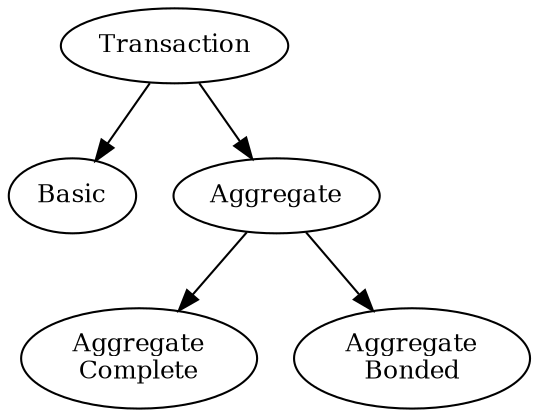
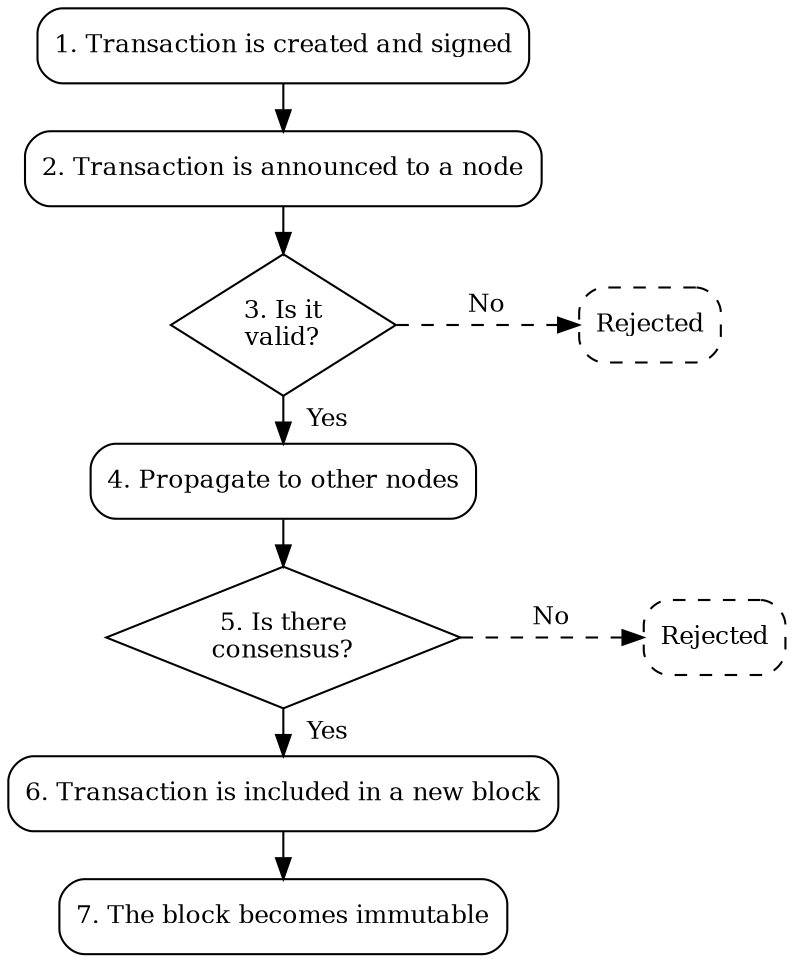

# Transactions

Transaction
:   A transaction represents an action or group of actions to perform on the Symbol blockchain,
    like moving funds from one <account:> to another, or registering a new currency, for example.

These actions are expressed in a signed message, which is then announced to the network.
<Nodes:|Nodes> in the network then validate it and, if it is accepted, the transaction gets included in a block and
changes the state of the blockchain.

## Fundamental Transaction Types

Symbol supports two core transaction types: basic and aggregate.
Aggregate transactions are further divided into complete and bonded variants.



### Basic Transactions

Basic Transaction
:   A basic <transaction:> represents a single action, initiated by a single account,
    requiring only that account's <signature:>.

Examples include transferring funds from an account or registering a new <namespace:>.

### Aggregate Transactions

Aggregate Transaction
:   Aggregate transactions group multiple basic transactions and execute them atomically:
    all <embedded transactions:> are accepted or none are.

They are initiated by a single account, but might require signatures from other involved accounts.

Cosignature
:   When a transaction requires multiple signatures, they are called cosignatures.

Aggregate transactions provide a great deal of flexibility to Symbol, because they enable coordinated behavior
between multiple accounts, without requiring trust between them.

!!! tip "Aggregate Transaction Example"

    Accounts A and B want to exchange assets, so two <transfer transactions:> are required.
    But they do not trust each other, so neither wants to be the first to announce their transaction and
    risk the other party failing to fulfill their part.

    A solution which does not require trust in each other is to wrap both transactions in an aggregate:

    ```dot
    digraph {
        rankdir="LR";
        fontsize=12;
        subgraph clusterAggregate {
            label = "Aggregate Transaction";
            tooltip = "Aggregate Transaction";
            subgraph clusterT1 {
                label = "Embedded Transaction 1";
                tooltip = "Embedded Transaction 1";
                style = dashed;
                A1 [label="A" tooltip="A"];
                B1 [label="B" tooltip="B"];
                A1 -> B1;
            }
            subgraph clusterT2 {
                label = "Embedded Transaction 2";
                tooltip = "Embedded Transaction 2";
                style = dashed;
                A2 [label="A" tooltip="A"];
                B2 [label="B" tooltip="B"];
                A2 -> B2 [dir=back];
            }
        }
    }
    ```

    * Both parties can review the whole exchange before signing it.
    * No transaction will be processed until both parties have signed the aggregate.
    * They can be sure that both transactions will be executed, or none of them will be.
    * They can be sure that none of the transactions will be modified after the signature.
    * It does not matter which party announces the aggregate transaction.

Depending on whether an aggregate transaction has all the required signatures when it is announced to the network,
two different transaction types are considered: complete and bonded.

### Complete Aggregate Transactions

Complete Aggregate Transaction
:   An <aggregate transaction:> submitted to the network with all required <cosignatures:> already attached.
    Nodes can therefore proceed to validation and include the transaction in a block immediately.

This transaction type requires that cosignatures are collected off-chain in advance.

### Bonded Aggregate Transactions

Bonded Aggregate Transaction
:   An <aggregate transaction:> submitted to the network without all required <cosignatures:>.
    The network temporarily holds the transaction while waiting for the additional cosignatures.

    Also called partial transactions.

With this transaction type, all involved parties interact exclusively on-chain.

The required accounts can submit the missing cosignatures to any <API node:> on the network using a specific API.

Once the network receives all required cosignatures, the aggregate transaction continues processing.

To prevent spam which could exhaust network resources, initiating a bonded aggregate transaction requires a
small deposit or _bond_.
If all cosignatures are collected before the transaction expires, the bond is returned, otherwise, it is forfeited.

### Embedded Transactions

Embedded Transaction
:   When basic transactions are included in an aggregate transaction they are called embedded transactions.

Embedded transactions behave exactly like basic transactions, except for:

* They are not individually signed.
    Instead, the whole aggregate transaction is signed by every required account, and all the signatures are
    attached.

    For example, if an aggregate contains multiple transactions from the same account, only one signature
    from that account is required.

* They do not provide fee or deadline information.
    This information is instead provided by the enclosing aggregate transaction.

* Not all transaction types are allowed as embedded transactions.
    As an important example, aggregate transactions cannot be embedded within other aggregate transactions.

!!! info
    The Symbol main and test networks currently enforce the following limits:

    * A maximum of **100 embedded transactions** per aggregate.
    * A maximum of **25 cosignatures** per aggregate.

## Transaction Lifecycle

Transactions follow the same general process as in other blockchains:



<Bonded aggregate transactions:|Bonded aggregate transactions> differ slightly from the normal flow.
Aggregate transactions missing cosignatures are temporarily stored in a _partial transactions cache_ on each node,
and halt processing after step 2.
When enough cosignatures have been collected these transactions become complete and resume processing from step 3.

### 1. Creation and signature

A software client, typically an app, creates the transaction and fills in all its parameters.
For example, a transfer transaction requires the source <account:>, destination account, and amount.

This step also involves collecting all required signatures.
For a transfer transaction, only the source account's signature is required.
More complex transactions, such as <aggregate transactions:>, may require multiple signatures.

Each signature is typically provided by a <wallet:>.
Signatures prove that all required parties have authorized the transaction, since only the holder of an account's
<key pair:|private key> can produce a valid signature.

### 2. Announcement

The client application submits the transaction to a connected API node on the network.

### 3. Validation

The node checks that the transaction is well-formed and includes all required, valid signatures.
For <bonded aggregate transactions:>, signature checks are delayed until all signatures are received.

Some transaction types require additional semantic checks.
For example, a transfer transaction verifies that the source account has enough funds.

For the complete list of checks see [Validation Details](#validation-details) below.

If any of these checks fail, the transaction is rejected and not propagated further.
If all checks pass, the process continues.

### 4. Propagation

Once the node considers the transaction to be valid, it is broadcast to the <peer nodes:> in the network,
and added to every node's  _unconfirmed pool_.

Unconfirmed pool
:   A list of transactions pending validation, shared by all nodes in the network.

Nodes pick up transactions from this pool and perform the same validation:
they checks the transaction's structure, signatures, and any conditions specific to its type.
If the transaction passes validation, it is further propagated to other peers.

This process ensures that a broad portion of the network knows about the transaction and accepts it as valid.

### 5. Consensus

Each node has an importance score based on its staked funds and other factors.
This score is used as a weight in the node's vote during the consensus process.

The consensus algorithm collects votes from nodes until a predefined threshold is reached.
If the threshold is reached, the transaction is confirmed.
If not, the transaction remains in the <unconfirmed pool:> until its deadline expires, at which point it is rejected.

### 6. Confirmation

Once enough positive weighted votes are collected, the transaction is added to a <block:> and the block
propagated to all other nodes.

However, due to the distributed nature of the blockchain, blocks can occasionally be <rollback:|rolled back> and
confirmed transactions reverted.

A common solution is for applications to wait for several additional blocks after a transaction is confirmed.
Each new block adds another layer of confirmation, increasing confidence that the transaction will not be reverted.

On Symbol, however, an additional mechanism provides final guarantees that confirmed transactions cannot be reverted.

### 7. Finalization

<Finalization:|Finalization> runs in parallel with consensus, finalizing blocks in batches after they have been added to the blockchain.

By waiting for finalization, applications can be certain the transactions they submitted will not be reverted
by <rollbacks:>.

## Common Transaction Structure

All transaction types in Symbol share a set of common attributes:

| Attribute             | Description                                                                           |
| --------------------- | ------------------------------------------------------------------------------------- |
| **Signer public key** | Public key of the account that created and signed the transaction.                    |
| **Signature**         | Cryptographic proof that the signer authorized the transaction and its content.       |
| **Deadline**          | Timestamp indicating when the transaction expires if not confirmed.                   |
| **Max fee**           | Maximum fee the signer is willing to pay to have the transaction included in a block. |
| **Type**              | Transaction type, which determines which additional attributes, if any, are present.  |

## Validation Details

Before a transaction is included in a block, each node independently validates it using the following checks:

| **Check**           | **Description**                                                                                     |
| ------------------- | --------------------------------------------------------------------------------------------------- |
| **Signature check** | Verifies the signature is valid and matches the signer's public key and the transaction's contents. |
| **Fee check**       | Confirms the max fee meets the node's minimum threshold and that the signer has sufficient balance. |
| **Deadline check**  | Discards the transaction if its deadline has already passed.                                        |
| **Semantic checks** | Validates that the transaction is logically correct based on its type. Example: a transfer transaction fails if the sender lacks sufficient funds. |

Transactions that fail any of these checks are rejected and not propagated further.

## Supported Transaction Types

Symbol supports a wide range of transaction types, each tailored to a specific kind of operation.
All transaction types share the same [common structure](#common-transaction-structure) and follow the same processing
and validation steps, but differ in purpose and required fields.

<div class="subsections" markdown>

| **Transaction Type**                | **Description**                                                                                   |
| ----------------------------------- | ------------------------------------------------------------------------------------------------- |
| **[Transfer Transactions](default:transfer transaction)** |                                                                             |
| `Transfer`                          | Send <mosaics:> and optional messages between two <accounts:>.                                    |
| **[Aggregate Transactions](default:aggregate transaction)** |                                                                           |
| `Aggregate Complete`                | Send transactions in batches to different accounts.                                               |
| `Aggregate Bonded`                  | Propose an arrangement of transactions between different accounts.                                |
| `Hash Lock`                         | Lock a deposit needed to announce a <bonded aggregate transaction:>.                              |
| [**Finalization**](#7-finalization) |                                                                                                   |
| `Voting Key Link`                   | Link an account with a <BLS:> public key required for finalization voting.                        |
| **Harvesting**                      |                                                                                                   |
| `Account Key Link`                  | This transaction is required for all accounts wanting to activate remote or delegated harvesting. |
| `Node Key Link`                     | This transaction is required for all accounts willing to activate delegated harvesting.           |
| `Vrf Key Link`                      | Link an account with a VRF public key required for harvesting.                                    |
| **Locks**                           |                                                                                                   |
| `Secret Lock`                       | Start a token swap between different chains.                                                      |
| `Secret Proof`                      | Conclude a token swap between different chains.                                                   |
| **Metadata**                        |                                                                                                   |
| `Account Metadata`                  | Associate a key-value state (metadata) to an account.                                             |
| `Mosaic Metadata`                   | Associate a key-value state (metadata) to a mosaic.                                               |
| `Namespace Metadata`                | Associate a key-value state (metadata) to a namespace.                                            |
| **[Mosaics](default:mosaic)**       |                                                                                                   |
| `Mosaic Definition`                 | Create a new  mosaic.                                                                             |
| `Mosaic Supply Change`              | Change the total supply of a mosaic.                                                              |
| `Mosaic Supply Revocation`          | Revoke mosaic.                                                                                    |
| **[Multisig](default:multisignature account)** |                                                                                        |
| `Multisig Account Modification`     | Create or modify a multi-signature account.                                                       |
| **[Namespaces](default:namespace)** |                                                                                                   |
| `Namespace Registration`            | Register (or renew a registration for) a namespace.                                               |
| `Address Alias`                     | Attach or detach a namespace (alias) to an account address.                                       |
| `Mosaic Alias`                      | Attach or detach a namespace to a mosaic.                                                         |
| **[Restrictions](default:restrictions)** |                                                                                              |
| `Account Address Restriction`       | Allow or block incoming and outgoing transactions for a given a set of addresses.                 |
| `Account Mosaic Restriction`        | Allow or block incoming transactions containing a given set of mosaics.                           |
| `Account Operation Restriction`     | Allow or block outgoing transactions depending on their transaction type.                         |
| `Mosaic Global Restriction`         | Set global rules to transfer a restrictable mosaic.                                               |
| `Mosaic Address Restriction`        | Set address-specific rules to transfer a restrictable mosaic.                                     |

</div>

More transaction types can be introduced via plugins.
However, all nodes must support the same plugin set to maintain consensus across the network.
