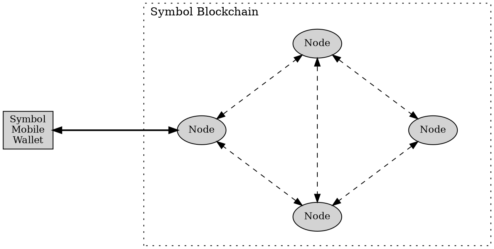

# Changing the Node

This page explains how to change the <node:> used by the Symbol Mobile Wallet App.

The app connects to a node to read information from the Symbol blockchain and announce transactions.
Your funds are not stored on the node, so changing nodes does not move your funds or change your accounts.

Changing the node can be useful when the current node becomes unresponsive, slow, or temporarily out of sync.
You can also select a node closer to your location to improve responsiveness.
Node locations and status information are listed at [symbol.fyi/nodes](https://symbol.fyi/nodes).

If you are not sure which node to use, choose **Select automatically** and let the app pick one.

## Prerequisites

* Make sure you have installed the Symbol Mobile Wallet.
    If you have not done that yet, see the [Installing the App](./install.md) guide.

* You must already have a wallet set up and unlocked in the app.
    See [Creating a Wallet](./create-wallet.md) or [Importing a Wallet](./import-wallet.md) if needed.

## How to Change the Node

Follow these steps to change the node used by the app:



{{ tutorial.list_begin("portrait") }}

{{ tutorial.step_begin("create-wallet-5.webp") }}
From the wallet's **:material-home: HOME** screen, tap the **:material-cog: Settings** button in the top-right corner.
{{ tutorial.step_end() }}

{{ tutorial.step_begin("export-wallet-1.webp") }}
Tap **:octicons-database-24: Network**.
{{ tutorial.step_end() }}

{{ tutorial.step_begin("network-2.webp") }}
Tap the **NODE** dropdown.
{{ tutorial.step_end() }}

{{ tutorial.step_begin("network-3.webp") }}
Select a node from the list, or select **Select Automatically**.
{{ tutorial.step_end() }}

{{ tutorial.list_end() }}

The app will use the selected node for future blockchain queries and transaction announcements.
You can change nodes as often as you want while looking for the one that works best for you.

!!! abstract "Not all nodes allow connections from apps"

    The Symbol network is mostly composed of <peer nodes:> that constantly interact with each other,
    validating transactions and maintaining the blockchain's integrity.

    Only a subset of them are also <API nodes:> which allow connections from programs like the Symbol Mobile Wallet.

    This is why the list of nodes shown in the app may be much shorter than the full list of nodes in the network.
