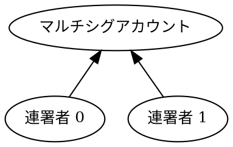

# マルチシグアカウントの設定

[マルチシグアカウント](default: マルチシグアカウント)（「マルチシグ」とも呼ばれます）は、それ単体ではトランザクションを開始できません。代わりに、「連署者（cosignatory）」アカウントがトランザクションを作成し、マルチシグアカウントに代わって署名を行います。

このチュートリアルでは、通常のアカウントを、2つの連署者のうち1つの承認を必要とするマルチシグアカウントに変換する方法を説明します。アカウントがすでにマルチシグである場合は、代わりに連署者を削除して通常のアカウントに戻す方法を実演します。

このチュートリアルで使用するマルチシグ構造は以下の通りです。



!!! note "マルチレベルマルチシグアカウント"

    連署者自体がマルチシグアカウントである、より複雑な構成も最大3階層までサポートされています。

    マルチシグアカウントは任意の順序で設定できます。
    ただし、一度アカウントがマルチシグに変換されると、そのアカウント自身でトランザクションに署名することはできなくなり、その時点で設定されている連署者に完全に従う必要があります。

## 前提条件

開始する前に、以下を確認してください。

- 開発環境をセットアップしていること。
    [開発環境のセットアップ](../start/setup.md) を参照してください。
- 3つの [アカウント](default: アカウント) を作成していること。1つはマルチシグに変換するため、他の2つは連署者として機能させるためです。
    これは [コード](./create-from-private-key.md) または [ウォレット](../../userbook/wallet/create-account.md) を使用して行うことができます。
- トランザクション手数料の支払いとアカウントへの資金供給のために [XYM](default: XYM) を入手していること。
    [蛇口 (Faucet) からのテストネット通貨の入手](./testnet-faucet.md) を参照してください。

さらに、トランザクションがどのようにアナウンスされ承認されるかを理解するために [転送トランザクション](../transactions/transfer.md) のチュートリアルを、[アグリゲートトランザクション](default:アグリゲートトランザクション) の仕組みを理解するために [アグリゲートコンプリートトランザクション](../transactions/complete-aggregate.md) のチュートリアルを復習してください。

## 完全なコード



{{ tutorial.code_full('devbook/accounts/configure-multisig', ['py', 'js']) }}

## コード解説

コードは、2つのヘルパー関数の定義から始まります。
トランザクションのアナウンス方法や承認の追跡方法の詳細については、[転送トランザクション](../transactions/transfer.md) のチュートリアルを参照してください。その他のヘルパー関数については、以下のセクションで説明します。

その後、チュートリアルは [必要な鍵の設定](#_5)、[現在のネットワーク状態の取得](#_6)、およびマルチシグアカウントの [現在の設定の検出](#_7) へと進みます。

アカウントがすでにマルチシグとして設定されているかどうかに応じて、状況に合わせて [有効化](#_8) または [無効化](#_9) するためのトランザクションが作成されます。
最後に、トランザクションが [アナウンスおよび承認](#_10) されます。

### アカウントの設定

{{ tutorial.code_snippet(['py:157:177', 'js:167:190']) }}

このチュートリアルでは3つの個別のアカウントが必要です。
それらの [秘密鍵](default: 秘密鍵) は環境変数を通じて提供できます。設定されていない場合は、デフォルト値が使用されます。

| 環境変数 | デフォルト値 | 用途 |
|----------------------------|---------------|----------------------------|
| `MULTISIG_PRIVATE_KEY` | `0000..0001` | マルチシグアカウント |
| `COSIGNATORY0_PRIVATE_KEY` | `0000..0002` | 連署者アカウント1 |
| `COSIGNATORY1_PRIVATE_KEY` | `0000..0003` | 連署者アカウント2 |

各秘密鍵は64文字の16進数文字列です。

マルチシグアカウントとその連署者アカウント1は、トランザクションをアナウンスするのに十分な資金を保有している必要があります。デフォルト値を使用する場合、これらのアカウントにはすでに資金が供給されている可能性があります。

上記のスニペットは、後で使用するために各アカウントの [キーペア](default:キーペア) と [アドレス](default:アドレス) を派生させて保存します。

### ネットワーク時間と手数料の取得

{{ tutorial.code_snippet(['py:180:198', 'js:193:211']) }}

[転送トランザクション](../transactions/transfer.md) チュートリアルで説明されているプロセスに従い、ネットワーク時間と推奨手数料をそれぞれ <get:/node/time> および <get:/network/fees/transaction> から取得します。

### マルチシグの検出

以下の関数は、<get:/account/{address}/multisig> エンドポイントを使用して、指定されたアドレスの現在の連署者リストを取得します。
アカウントがマルチシグとして設定されていない、または一度も使用されていない場合、関数は空のリストを返します。

{{ tutorial.code_snippet(['py:46:61', 'js:51:66']) }}

このリストはチュートリアルの動作モードを決定し、適切な設定トランザクションを構築して署名するために使用されます。

{{ tutorial.code_snippet(['py:200:215', 'js:213:231']) }}

マルチシグの有効化と無効化の唯一の違いは、作成されるトランザクションとそれに署名するアカウントです（次の2つのセクションで説明します）。

### マルチシグの有効化

連署者の追加や削除を含む、アカウントのマルチシグ設定へのすべての変更は、<ser:MultisigAccountModificationTransactionV1> を使用して行われます。これは**必ず** [アグリゲートトランザクション](default: アグリゲートトランザクション) 内に埋め込まれる必要があります。

{{ tutorial.code_snippet(['py:65:76', 'js:70:82']) }}

埋め込まれた <ser:MultisigAccountModificationTransactionV1> には以下のフィールドが含まれます。

- `signer_public_key`: マルチシグ設定を変更するアカウントの [公開鍵](default:公開鍵)。

- `min_approval_delta`: マルチシグアカウントからのトランザクションを承認するために必要となる署名数の、「希望する値」と「現在の値」の差分。

    このケースでは、アカウントは最初は通常のアカウントであるため、現在の必要署名数は `0` です。
    連署者のうち1人からの署名を必要とするマルチシグアカウントに変換するために、デルタは `1` に設定されます。

    デルタ値は、次のセクションで示すように、現在の値を減らすために負の値にすることもできます。

- `min_removal_delta`: アカウント設定から連署者を削除するために必要な署名数の差分。
    これにより、例えば通常のトランザクションの承認よりも、連署者の削除（より機微なガバナンス操作）に多くの署名を要求するといった設定が可能です。

- `address_additions`: アカウントに追加される連署者のアドレスリスト。
    `cosignatory_addresses` 変数は [アカウントの設定](#_5) で準備したものです。

!!! note "安全対策"

    プロトコルには、アカウントを無効な状態でロックされてしまうのを防ぐための安全メカニズムが含まれています。無効なマルチシグ構成となるトランザクションはエラーで拒否されます。例えば以下のような場合です。

    - 連署者の数が、最小必要署名数を下回る場合
    - 連署者ではないアドレスを削除しようとする場合
    - 必要な署名が不足している場合
    - 不要な署名が含まれている場合

埋め込みトランザクションは、それが唯一の内部トランザクションであっても、アグリゲートトランザクションにラップされます。

{{ tutorial.code_snippet(['py:78:94', 'js:84:100']) }}

簡単にするため、このチュートリアルでは [アグリゲートコンプリートトランザクション] (default: アグリゲートコンプリートトランザクション) を使用します。
詳細については、[コンプリート](../transactions/complete-aggregate.md) および [ボンデッド](../transactions/bonded-aggregate.md) アグリゲートトランザクションのチュートリアルを参照してください。

すべての連署に必要な容量を考慮して、トランザクション手数料の計算には注意が払われています。

最後に、署名がアグリゲートトランザクションに付加されます。

{{ tutorial.code_snippet(['py:96:104', 'js:102:110']) }}

このケースでは、マルチシグに変換されるアカウントの署名と、新しい責任を追うことを明示的に承認するために連署者の署名が必要です。

署名の1つはトランザクションのメインの署名者であり、<dy:SymbolFacade.signTransaction> を使用して追加されます。残りの署名は連署（cosignature）であり、<dy:SymbolFacade.cosignTransaction> を使用して追加されます。メインの署名者の選択は、どのアカウントがトランザクション手数料を支払うかにのみ影響します。

**一度アカウントのマルチシグが有効になると、そのアカウント自身の署名は不要になります。そのアカウントに関わるすべてのトランザクションには、代わりに設定された連署者の署名が必要となります。**

### マルチシグの無効化

マルチシグ設定を無効にするには、すべての連署者を削除する必要があります。プロセスは有効化と似ていますが、2つの大きな違いがあります。連署者は1人ずつ削除しなければならないことと、マルチシグアカウント自体がトランザクションに署名できないことです。

このため、2つの <ser:MultisigAccountModificationTransactionV1> が作成されます。

{{ tutorial.code_snippet(['py:110:129', 'js:117:138']) }}

両方のトランザクションで、 `signer_public_key` はマルチシグアカウントの公開鍵に設定されます。

最初のトランザクションは、承認または削除のデルタを変更せずに `cosignatory_addresses[1]` を削除します。これは、まだ1人の連署者が残っており、署名が依然として必要だからです。

2番目のトランザクションは、最後に残った連署者を削除し、 `min_approval_delta` と `min_removal_delta` の両方を `-1` に設定します。
この時点で、両方のフィールドの現在の値は [有効化](#マルチシグの有効化) ステップで設定された `1` であり、希望する値は `0` であるため、デルタは `-1` になります。

その後、両方の埋め込みトランザクションはアグリゲートトランザクションにラップされ、署名されます。

{{ tutorial.code_snippet(['py:131:151', 'js:140:160']) }}

アグリゲートトランザクションは `cosignatory_addresses[0]` によって署名されます。
これが唯一の有効な選択肢です。一度アカウントに連署者が設定されると、そのアカウント自身でトランザクションに署名することはできなくなり、また `cosignatory_addresses[1]` は最初の埋め込みトランザクションが実行された後にマルチシグから削除されるためです。

結果として、連署（追加の署名）は不要です。メインの署名のみが必要です。
マルチシグは最小削除要件が1つの署名で設定されていたため、操作全体を単一の連署者によって開始し承認することができます。

連署者は、両方が同等の権限を持っているため、逆の順序で削除することもできました。唯一の違いは、どのアカウントがトランザクションに署名し、手数料を支払うかです。

### アグリゲートトランザクションの送信

最後のステップは、構築されたトランザクションをアナウンスし、[転送トランザクション](../transactions/transfer.md) チュートリアルで説明されているように承認を待つことです。

{{ tutorial.code_snippet(['py:217:221', 'js:233:239']) }}

## 出力

以下に示す出力は、プログラムの典型的な2つの実行結果に対応しています。

=== ":material-plus-thick: マルチシグの有効化"

    ```text linenums="1" hl_lines="2-4 10 27-29"
    --8<-- 'devbook/accounts/configure-multisig-enable.log'
    ```

    出力の主なポイント:

    - **2-4行目**: 関与するすべてのアカウントのアドレスと公開鍵。
    - **10行目** (`Response: No cosignatories`): 現在連署者は設定されていません。
    - **27行目** (`"min_approval_delta": 1`): トランザクション承認に必要な署名数が1つ増加します。
    - **28行目** (`"min_removal_delta": 1`): 連署者の削除に必要な署名数が1つ増加します。
    - **29行目** (`"address_additions"`): 連署者として追加されるアドレスのリスト。

=== ":material-minus-thick: マルチシグの無効化"

    ```text linenums="1" hl_lines="2-4 10 27-32 39-44"
    --8<-- 'devbook/accounts/configure-multisig-disable.log'
    ```

    出力の主なポイント:

    - **2-4行目**: 関与するすべてのアカウントのアドレスと公開鍵。
    - **10行目** (`Response: [ ... ]`): 既存の連署者が検出されました。
    - **27-32行目** (最初の埋め込みトランザクション): 最小必要署名数は変更されず、新しい連署者は追加されず、既存の連署者が1人削除されます。
    - **39-44行目** (2番目の埋め込みトランザクション): 最小必要署名数が1つ減少し、新しい連署者は追加されず、最後に残った連署者が削除されます。

出力に示されているトランザクションハッシュを使用して、[Symbol Testnet Explorer](https://testnet.symbol.fyi/) でトランザクションを検索できます。

## 結論

このチュートリアルでは、以下の方法を説明しました。

| ステップ | 関連ドキュメント |
|------------------------------------------------------------------------|------------------------------------------------|
| [現在のマルチシグ設定の取得](#_7) | <get:/account/{address}/multisig> |
| [マルチシグアカウントの有効化](#_8) | <ser:MultisigAccountModificationTransactionV1> |
| [マルチシグアカウントの無効化](#_9) | <ser:MultisigAccountModificationTransactionV1> |
| 設定を埋め込みトランザクションにラップする | <dy:SymbolTransactionFactory.createEmbedded> |
