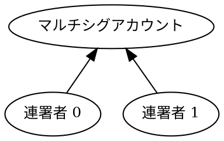

# マルチシグアカウントからのトランザクション署名 [cite: 1]

このチュートリアルでは、[転送トランザクションの作成](../transactions/transfer.md) チュートリアルと同様に、[アカウント] (default: アカウント) から自身へ 1 [XYM] (default: XYM) を転送します [cite: 1]。

ただし、このケースでは送信元が [マルチシグアカウント] (default: マルチシグアカウント)（「マルチシグ」とも呼ばれます）であるため、アカウント単体でトランザクションを開始したり署名したりすることはできません [cite: 1]。代わりに、連署者アカウントのいずれかに依存してトランザクションを作成し、代理で署名を行う必要があります [cite: 1]。

このチュートリアルでは、[マルチシグアカウントの設定](./configure-multisig.md) チュートリアルで作成したマルチシグ構成を使用し、連署者 0 がトランザクションの開始と署名を行います [cite: 1]。



## 前提条件 [cite: 1]

開始する前に、以下を確認してください [cite: 1]。

- 開発環境をセットアップしていること [cite: 1]。
    [開発環境のセットアップ](../start/setup.md) を参照してください [cite: 1]。
- [マルチシグアカウントの設定](./configure-multisig.md) チュートリアルを完了していること [cite: 1]。

さらに、トランザクションがどのようにアナウンスされ承認されるかを理解するために [転送トランザクション](../transactions/transfer.md) チュートリアルを、[アグリゲートトランザクション] (default: アグリゲートトランザクション) の仕組みを理解するために [アグリゲートコンプリートトランザクション](../transactions/complete-aggregate.md) のチュートリアルを復習しておいてください [cite: 1]。

## 完全なコード [cite: 1]



{{ tutorial.code_full('devbook/accounts/sign-multisig', ['py', 'js']) }}

## コード解説 [cite: 1]

一般的に、マルチシグアカウントの代理でトランザクションに署名するには、必要な連署を提供する [アグリゲートトランザクション] (default: アグリゲートトランザクション) でラップするだけで済みます [cite: 1]。

このチュートリアルでは、転送の起点となるマルチシグアカウントを署名者として、転送内容を含む [埋め込みトランザクション] (default: 埋め込みトランザクション) を構築します [cite: 1]。その後、トランザクションを承認できるアカウントである連署者が署名した [アグリゲートコンプリートトランザクション] (default: アグリゲートコンプリートトランザクション) で、その転送トランザクションをラップします [cite: 1]。

### アカウントの設定 [cite: 1]

{{ tutorial.code_snippet(['py:16:27', 'js:12:21']) }}

このチュートリアルでは2つの個別のアカウントが必要です [cite: 1]。
それらの [秘密鍵] (default: 秘密鍵) は環境変数を通じて提供できます [cite: 1]。設定されていない場合は、デフォルト値が使用されます [cite: 1]。

| 環境変数 | デフォルト値 | 用途 |
|----------------------------|---------------|---------------------|
| `MULTISIG_PRIVATE_KEY` | `0000..0001` | マルチシグアカウント |
| `COSIGNATORY0_PRIVATE_KEY` | `0000..0002` | 連署者アカウント |

各秘密鍵は64文字の16進数文字列です [cite: 1]。

連署者アカウントは、トランザクション手数料を支払うのに十分な資金を保有している必要があります [cite: 1]。デフォルト値を使用する場合、これらのアカウントにはすでに資金が供給されている可能性があります [cite: 1]。

上記のスニペットは、後で使用するために各アカウントの [鍵ペア] (default: 鍵ペア) を派生させて保存します [cite: 1]。

### ネットワーク時間と手数料の取得 [cite: 1]

{{ tutorial.code_snippet(['py:32:49', 'js:26:44']) }}

[転送トランザクション](../transactions/transfer.md) チュートリアルで説明されているプロセスに従い、ネットワーク時間と推奨手数料をそれぞれ <get:/node/time> および <get:/network/fees/transaction> から取得します [cite: 1]。

### トランザクションの構築 [cite: 1]

{{ tutorial.code_snippet(['py:51:62', 'js:46:56']) }}

埋め込まれた [転送トランザクション] (default: トランザクション) には以下のフィールドが含まれます [cite: 1]。

- `signer_public_key`: 資金の転送元となるアカウント、つまりマルチシグアカウントの [公開鍵] (default: 公開鍵) [cite: 1]。

- `recipient_address`: この例では、資金は送信元に戻されるため、受信者もマルチシグアカウントになります [cite: 1]。

- `mosaics`: [転送トランザクション](../transactions/transfer.md) チュートリアルで説明されているように、1 [XY] (default: XYM) に相当する `symbol.xym` モザイクの 1,000,000 絶対単位 [cite: 1]。

埋め込みトランザクションは、内部トランザクションが1つだけの場合でも、アグリゲートトランザクションにラップされます [cite: 1]。

{{ tutorial.code_snippet(['py:64:74', 'js:58:68']) }}

主なフィールドは以下の通りです [cite: 1]。

- `signer_public_key`: 今回は、トランザクションを承認し、その手数料を支払う連署者の [公開鍵] (default: 公開鍵) です [cite: 1]。

- `transactions`: 埋め込みトランザクションのリスト。この例では1つだけですが、いくつでも含めることができます [cite: 1]。

簡単にするため、このチュートリアルでは [アグリゲートコンプリートトランザクション] (default: アグリゲートコンプリートトランザクション) を使用します [cite: 1]。
詳細については、[コンプリート](../transactions/complete-aggregate.md) および [ボンデッド](../transactions/bonded-aggregate.md) アグリゲートトランザクションのチュートリアルを参照してください [cite: 1]。

最後に、連署者によってアグリゲートトランザクションに署名が行われます [cite: 1]。

{{ tutorial.code_snippet(['py:76:81', 'js:70:75']) }}

!!! note "複数の連署者"

    他のマルチシグ構成では、より多くの署名が必要になる場合があります。その場合、 <dy:SymbolFacade.signTransaction> ではなく <dy:SymbolFacade.cosignTransaction> を使用して署名を付加します [cite: 1]。

    例については [マルチシグアカウントの設定](./configure-multisig.md#マルチシグの有効化) チュートリアルを参照してください [cite: 1]。

### アグリゲートトランザクションの送信 [cite: 1]

最後のステップは、[転送トランザクション](../transactions/transfer.md) チュートリアルで説明されているように、トランザクションをアナウンスして承認を待つことです [cite: 1]。

{{ tutorial.code_snippet(['py:83:116', 'js:77:132']) }}

プロトコル制約に違反した場合、トランザクションは拒否されます [cite: 1]。以下の表は、最も一般的なエラーの原因をまとめたものです [cite: 1]。

| エラーメッセージ | 考えられる原因 |
|------------------------------------------|---------------------------------------------------------------------------------------------|
| Multisig Operation Prohibited By Account | マルチシグアカウント自体がアグリゲートトランザクションに署名しようとした [cite: 1]。 |
| Aggregate Ineligible Cosignatories | 署名者が連署者リストに含まれていない [cite: 1]。 |
| Consumer Batch Signature Not Verifiable | アグリゲートトランザクションに付加された署名が、その `signer_public_key` と一致しない [cite: 1]。 |

## 出力 [cite: 1]

以下に示す出力は、プログラムの典型的な実行結果に対応しています [cite: 1]。

```text linenums="1" hl_lines="2-3 11 20 24"
--8<-- 'devbook/accounts/sign-multisig.log'
```

出力の主なポイント[cite: 1]:

- **2-3行目**: 関与するすべてのアカウントの公開鍵 [cite: 1]。
- **11行目** (`signer_public_key`): アグリゲートトランザクションの署名者。連署者アカウントと一致していることに注目してください [cite: 1]。
- **20行目** (`signer_public_key`): 埋め込まれた転送トランザクションの署名者。マルチシグアカウントと一致していることに注目してください [cite: 1]。
- **24行目** (`recipient_address`): エンコードされたマルチシグアカウントの [アドレス] (default: アドレス) [cite: 1]。

出力に示されているトランザクション [ハッシュ] (default: ハッシュ) を使用して、[Symbol Testnet Explorer](https://testnet.symbol.fyi/) でトランザクションを検索できます [cite: 1]。

## 結論 [cite: 1]

このチュートリアルは機能的には [転送トランザクション](../transactions/transfer.md) チュートリアルと同じですが、送信元アカウントとして [マルチシグアカウント] (default: マルチシグアカウント) を使用しています [cite: 1]。

特に、このチュートリアルでは以下の方法を説明しました [cite: 1]。

| ステップ | 関連ドキュメント |
|-----------------------------------------------------------------------|----------------------------------------------|
| [転送を埋め込みトランザクションにラップする](#トランザクションの構築) | <dy:SymbolTransactionFactory.createEmbedded> |
| [適切な場所に署名を付加する](#トランザクションの構築) | <dy:SymbolFacade.signTransaction> |