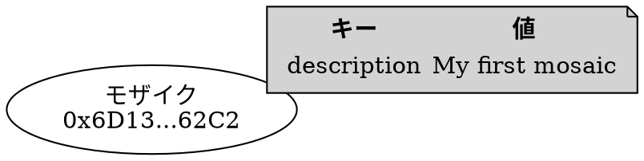

# モザイクへのメタデータの追加

[モザイク] (default: モザイク) は、[アカウント] (default: アカウント) や [ネームスペース] (default: ネームスペース) と同様に、キーと値のペアとして [メタデータ] (default: メタデータ) を保存できます [cite: 1, 2, 4]。

このチュートリアルでは、モザイクにメタデータを追加し、ネットワークから取得し、既存の値を更新する方法を説明します [cite: 1]。

この例では、ペア `description = My first mosaic` をモザイクに関連付け、その後 `Updated mosaic` に変更します [cite: 1]。



## 前提条件

開始する前に、以下を確認してください。

* 開発環境をセットアップしていること [cite: 1, 4]。
    [開発環境のセットアップ](../start/setup.md) を参照してください [cite: 1, 4]。
* モザイクを所有するための [アカウント] (default: アカウント) を、[コードから](../accounts/create-from-private-key.md) または [ウォレットを使用して](../../userbook/wallet/create-account.md) 作成していること [cite: 1, 4]。
* 署名者アカウントが所有するモザイクを作成していること [cite: 1]。
    [モザイクの作成](./create-mosaic.md) を参照してください [cite: 1]。
* トランザクション手数料を支払うための [XYM] (default: XYM) を入手していること [cite: 1]。
    [蛇口 (Faucet) からテストネットの資金を入手する](../accounts/testnet-faucet.md) を参照してください [cite: 1]。

さらに、トランザクションがどのようにアナウンスされ承認されるかを理解するために [転送トランザクション](../transactions/transfer.md) のチュートリアルを、[アグリゲートトランザクション] (default: アグリゲートトランザクション) の仕組みを理解するために [アグリゲートコンプリートトランザクション](../transactions/complete-aggregate.md) のチュートリアルを復習しておいてください [cite: 1, 4]。

## 完全なコード



{{ tutorial.code_full('devbook/mosaics/mosaic-metadata', ['py', 'js']) }}

## コード解説

このチュートリアルでは、モザイクに新しいメタデータを追加し、その後そのメタデータを更新する方法を実演します [cite: 1]。

### アカウントとモザイクのセットアップ

{{ tutorial.code_snippet(['py:53:66', 'js:51:65']) }}

このスニペットは、署名者の [秘密鍵] (default: 秘密鍵) を `SIGNER_PRIVATE_KEY` 環境変数から読み取ります。設定されていない場合はデフォルトのテストキーが使用されます [cite: 1, 4]。
署名者の [アドレス] (default: アドレス) は [公開鍵] (default: 公開鍵) から派生します [cite: 1, 4]。

メタデータが関連付けられるモザイクの ID は、 `MOSAIC_ID` 環境変数から読み取られます [cite: 1]。
これは接頭辞のない16進文字列であり、設定されていない場合はテスト値がデフォルトとして使用されます [cite: 1]。

!!! note "メモ" "モザイクが存在している必要があります"

    モザイクはあらかじめ作成され、署名者アカウントによって所有されている必要があります。そうでない場合、メタデータを追加するトランザクションは拒否されます [cite: 1]。

    作成方法については [モザイクの作成](./create-mosaic.md) チュートリアルを参照してください [cite: 1]。

### ネットワーク時間と手数料の取得

{{ tutorial.code_snippet(['py:69:87', 'js:68:86']) }}

[転送トランザクション](../transactions/transfer.md) チュートリアルで説明されているプロセスに従い、ネットワーク時間と推奨手数料をそれぞれ <get:/node/time> および <get:/network/fees/transaction> から取得します [cite: 1, 4]。

### メタデータの定義

各モザイクメタデータエントリは、以下の4つによって一意に識別されます [cite: 1]。

* **署名者のアドレス**: メタデータを追加するアカウント [cite: 1, 4]。
* **ターゲットアカウントのアドレス**: モザイクの所有者（このアカウントの署名が必要） [cite: 1]。
* **ターゲットモザイク ID** [cite: 1]。
* **スコープ指定されたメタデータキー**: メタデータ作成者によって選択される64ビットの値 [cite: 1, 4]。

    SDKは、人間が読み取り可能な文字列からSHA3-256ハッシュを使用してこのキーを生成する <dy:Metadata.metadataGenerateKey> ヘルパー関数を提供しています [cite: 1, 4]。
    この方法により、キーがより意味のあるものになり、衝突の可能性が低減します [cite: 1, 4]。

{{ tutorial.code_snippet(['py:92:95', 'js:91:94']) }}

この例では、キーは文字列 `description` から派生します [cite: 1]。
デモンストレーションのためにキー文字列にはタイムスタンプが付加されているため、コードを実行するたびに新しいエントリがモザイクに追加されます [cite: 1]。
実際には、作成または更新したい特定のメタデータエントリを識別する固定キーを使用します [cite: 1, 4]。

メタデータの値は、最大1024バイトまでの任意のシーケンスにすることができます [cite: 1, 4]。
この例では、値はUTF-8でエンコードされた文字列 `My first mosaic` です [cite: 1]。

!!! note "メモ" "同じキーを持つ複数のエントリ"

    キーはメタデータエントリを識別する4つの要素のうちの1つにすぎないため、いずれかの要素が変更されると別のエントリになります [cite: 1, 4]。

    例えば、署名者のアドレスが異なれば、異なるアカウントが同じモザイクに対して同じスコープ指定メタデータキーを競合なく使用できます [cite: 1]。

    各エントリは独立しており、最初に作成したアカウントのみが更新できます [cite: 1, 4]。

### 埋め込みモザイクメタデータトランザクションの作成

{{ tutorial.code_snippet(['py:97:110', 'js:96:110']) }}

モザイクメタデータトランザクションは、[ブロックチェーン] (default: ブロックチェーン) 上のモザイクにキーと値のペアを関連付けます [cite: 1, 4]。
同じトランザクションタイプで、新しいメタデータエントリの追加と既存の更新の両方を処理します [cite: 1, 4]。

Symbolでは、これらのトランザクションを署名者アカウントとモザイク所有者の両方の署名を含む [アグリゲートトランザクション] (default: アグリゲートトランザクション) 内に含める必要があります [cite: 1, 4]。
これにより、所有者の許可なく不要なメタデータがモザイクに関連付けられるのを防ぎます [cite: 1]。

このチュートリアルでは、署名者がモザイク所有者でもあるため、必要な署名は1つだけです [cite: 1]。
しかし、トランザクションは依然としてアグリゲート内にある必要があるため、コードではモザイクメタデータトランザクションを以下のプロパティを持つ [埋め込みトランザクション] (default: 埋め込みトランザクション) として定義します [cite: 1, 4]。

* **Type:** `mosaic_metadata_transaction_v1` を使用します [cite: 1]。

* **署名者の公開鍵:** メタデータエントリを作成するアカウント [cite: 1, 4]。

* **ターゲットアドレス:** モザイク所有者のアドレス [cite: 1]。
    署名者がモザイク所有者と異なる場合、所有者はアグリゲートトランザクションに [連署] (default: マルチシグアカウント) する必要があります [cite: 1]。

* **ターゲットモザイク ID:** メタデータを関連付けるモザイク [cite: 1]。

* **スコープ指定されたメタデータキー:** このメタデータエントリを識別するために使用される64ビットのキー [cite: 1, 4]。

* **値のサイズの差分 (Value size delta):** 新しいメタデータを作成する場合は、値のバイト長に設定します [cite: 1, 4]。
    既存のメタデータを更新する場合は、新しい値と現在の値の長さの差分に設定します [cite: 1, 4]。

* **値:** バイト形式のメタデータ内容 [cite: 1, 4]。
    新しいメタデータを作成する場合は、生の値を指定します [cite: 1, 4]。
    更新する場合は、計算された値を指定します（[既存のメタデータの変更](#既存のメタデータの変更) セクションで説明します） [cite: 1, 4]。

### アグリゲートトランザクションの構築

{{ tutorial.code_snippet(['py:112:122', 'js:112:122']) }}

コードは、埋め込みモザイクメタデータトランザクションを [アグリゲートトランザクション] (default: アグリゲートトランザクション) に追加します [cite: 1, 4]。

署名者がモザイク所有者であるため、 [連署] (default: 連署) は不要であり、アグリゲートは [コンプリート] (default: アグリゲートコンプリートトランザクション) として作成できるため、すぐに署名してアナウンスできます [cite: 1, 4]。

!!! note "メモ" "別のアカウントによるメタデータの追加"

    署名者がモザイク所有者と異なる場合、メタデータエントリを承認するために所有者がアグリゲートトランザクションに連署する必要があります [cite: 1]。

    オンチェーンで連署を収集する詳細については、[アグリゲートボンデッドトランザクション](../transactions/bonded-aggregate.md) のチュートリアルを参照してください [cite: 1, 4]。

### アグリゲートトランザクションの送信

{{ tutorial.code_snippet(['py:124:133', 'js:124:135']) }}

アグリゲートトランザクションは、[アグリゲートコンプリートトランザクションの作成](../transactions/complete-aggregate.md#building-the-aggregate-transaction) と同じプロセスに従って署名され、アナウンスされます [cite: 1, 4]。

### メタデータの取得

{{ tutorial.code_snippet(['py:138:156', 'js:140:161']) }}

メタデータエントリの現在の値を取得するために、コードは `sourceAddress`、`targetAddress`、`scopedMetadataKey`、`targetId`（モザイク ID）、および `metadataType`（モザイクメタデータの場合は `1`）のフィルタを指定して <get:/metadata> エンドポイントを使用します [cite: 1]。

エンドポイントはフィルタに一致するエントリのリストを返します。この例では単一のアイテムが含まれます [cite: 1, 4]。

### 既存のメタデータの変更

{{ tutorial.code_snippet(['py:158:175', 'js:163:181']) }}

既存のメタデータエントリを更新するには、前述のようにネットワークから取得した現在の値が必要です [cite: 1, 4]。

メタデータの更新を実演するために、コードは同じスコープ指定メタデータキーを使用して別の `mosaic_metadata_transaction_v1` トランザクションを作成し、説明を `My first mosaic` から `Updated mosaic` に変更します [cite: 1]。

既存のメタデータ値を変更することは、新しい値が現在の値を基準として以下のフィールドを使用して定義される必要があるという点で、新規作成とは異なります [cite: 1, 4]。

* `value_size_delta`: 新しい値と現在の値の長さの差 [cite: 1, 4]。
    この例では、文字列 `Updated mosaic`（14バイト）は `My first mosaic`（15バイト）より1バイト短いため、デルタは `-1` になります [cite: 1]。

* `value`: 現在の値と新しい値をバイトごとに比較して計算された XOR されたバイト [cite: 1, 4]。

    SDKは XOR 計算を処理する <dy:Metadata.metadataUpdateValue> ヘルパー関数を提供しています [cite: 1, 4]。
    XOR 操作は各バイトを比較します。一致するバイトはゼロになり、異なるバイトが変更箇所を捉えます [cite: 1, 4]。

`value_size_delta` は、XOR されたバイト自体の長さではなく、最終的な値の長さの差（新 vs 旧）を表すことに注意してください [cite: 1, 4]。

!!! tip "ヒント" "メタデータエントリの削除"

    メタデータエントリを削除するには、`value_size_delta` を現在の値の長さの負の値に設定し、現在の値を `value` として提供します。XOR によって空の結果が生成され、ネットワークからエントリが削除されます [cite: 1, 4]。

[最初のメタデータ作成](#アグリゲートトランザクションの構築) と同様に、このメタデータの変更はアグリゲートトランザクションにラップされ、署名してアナウンスされます [cite: 1, 4]。

{{ tutorial.code_snippet(['py:177:199', 'js:183:208']) }}

## 出力

以下に示す出力は、プログラムの典型的な実行結果に対応しています [cite: 1]。

```text linenums="1" hl_lines="3 17 18 19 22 36 46 47 49"
--8<-- 'devbook/mosaics/mosaic-metadata.log'
```

出力の主なポイント:

* **3行目** (`Mosaic ID`): 使用されたモザイク ID（10進数および16進数形式） [cite: 1]。
* **17行目** (`"scoped_metadata_key"`): 入力文字列からSHA3-256ハッシュを使用して生成された64ビットのキー [cite: 1]。
* **18行目** (`"target_mosaic_id"`): メタデータを受け取るモザイク [cite: 1]。
* **19行目** (`"value_size_delta": 15`): 新しいメタデータを作成する場合、これは値のバイト長に等しくなります（`"My first mosaic"` = 15バイト） [cite: 1]。
* **22行目**: エクスプローラーでメタデータの作成を確認するためのトランザクション [ハッシュ] (default: ハッシュ) [cite: 1]。
* **36行目** (`Current value: My first mosaic`): 更新前にネットワークから取得された値 [cite: 1]。
* **46行目** (`"value_size_delta": -1`): 新しい値（`"Updated mosaic"` = 14バイト）が現在の値（15バイト）より短いため、負の値になります [cite: 1]。
* **47行目** (`"value"`): 生の新しい値ではなく、現在の値と新しい値から計算された XOR 値 [cite: 1]。
* **49行目**: エクスプローラーでメタデータの更新を確認するためのトランザクションハッシュ [cite: 1]。

トランザクションハッシュを使用して、[Symbol Testnet Explorer](https://testnet.symbol.fyi/) でトランザクションを検索できます [cite: 1]。

## 結論

このチュートリアルでは、以下の方法を説明しました[cite: 1]:

| ステップ | 関連ドキュメント |
| ------------------------------------------------------------------------------------------ | -------------------------------------------------- |
| [メタデータのキーと値の定義](#メタデータの定義) | <dy:Metadata.metadataGenerateKey> |
| [モザイクメタデータトランザクションの作成](#埋め込みモザイクメタデータトランザクションの作成) | <dy:SymbolTransactionFactory.createEmbedded> |
| [メタデータの取得](#メタデータの取得) | <get:/metadata> |
| [既存のメタデータの変更](#既存のメタデータの変更) | <dy:Metadata.metadataUpdateValue> |