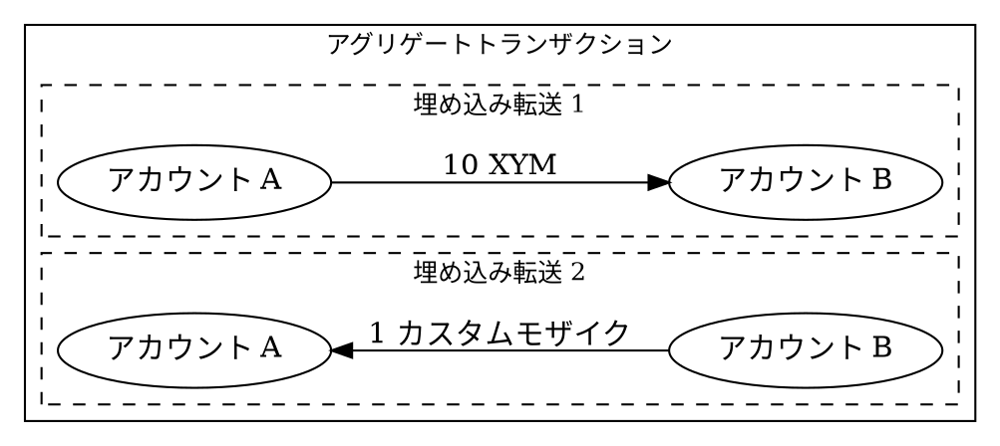

# アトミックスワップ {: #atomic-swap }

アトミックスワップとは、2つの当事者間での資産の交換であり、両方の転送が同時に成功するか、または同時に失敗するかのいずれかになる仕組みです。
これにより、一方が資産を受け取っているのに、もう一方が受け取れないという事態が発生しないことが保証されます。

このページでは、Symbolネットワーク上の [アカウント](default:アカウント) 間における資産（ [モザイク](default:モザイク) ）のスワップについて説明します。
Symbolと他のブロックチェーン間で資産を交換する方法については、[クロスチェーンスワップ](#) を参照してください。

## Symbolでのアトミックスワップの仕組み {: #how-atomic-swaps-work-on-symbol }

Symbolでは、アトミックスワップは [アグリゲートトランザクション](default:アグリゲートトランザクション) を使用して実行されます。これは、複数の [埋め込みトランザクション](default:埋め込みトランザクション) [転送トランザクション](default:転送トランザクション) を1つのアトミックな操作にまとめるものです。

アグリゲートトランザクションが承認されるには、開始者の [署名](default:署名) と、関与する他のすべてのアカウントからの [連署](default:連署) が必要です。
連署が1つでも欠けていたり、デッドラインに達したりした場合、アグリゲート全体が拒否され、資産の移動は行われません。

アグリゲートトランザクションの仕組みの詳細については、テキストブックの[アグリゲートトランザクション](../../textbook/transactions.md#aggregate-transactions) セクションを参照してください。

## アグリゲートタイプの選択 {: #choose-an-aggregate-type }

Symbolは、アトミックスワップ用に2つのアグリゲートトランザクションタイプをサポートしています。
ユースケースに合ったチュートリアルに進んでください。

| 種類                                    | 使用するケース                                 | トレードオフ                      |
|-----------------------------------------|-------------------------------------------|-----------------------------|
| [アグリゲートコンプリート](./complete-aggregate.md) | アナウンス前に、すべての当事者がオフチェーンで署名できる場合。   | オフチェーンでの調整を処理する必要がある。 |
| [アグリゲートボンデッド](./bonded-aggregate.md)    | 当事者が、すべての調整をオンチェーンで行うことを希望する場合。 | 10 XYMのロックデポジットが必要。       |
