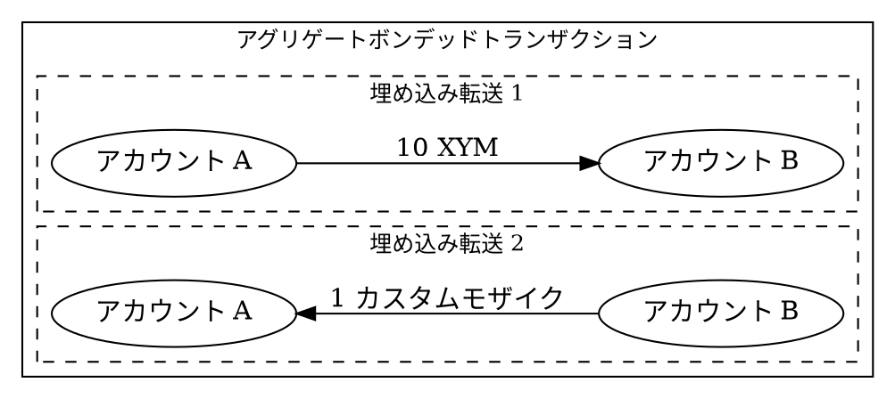

# アグリゲートボンデッドトランザクションの作成

このチュートリアルでは、[アグリゲートボンデッドトランザクション] (default: アグリゲートボンデッドトランザクション) を使用してアセットスワップを作成する方法を説明します [cite: 1, 2, 4, 7]。

この例では、アカウント A が アカウント B に 10 [XYM] (default: XYM) を送信し、同時に アカウント B が 1 つのカスタム [モザイク] (default: モザイク) をアカウント A に送り返します [cite: 1, 4, 7]。



!!! note "メモ" "2種類のアグリゲートトランザクション"

    [アグリゲートトランザクション] (default: アグリゲートトランザクション) は、複数の [トランザクション] (default: トランザクション) を単一の操作にグループ化し、関係するすべてのアカウントからの [署名] (default: 署名) を必要とします [cite: 4, 7, 31, 34]。

    「アグリゲートボンデッドトランザクション」は、アナウンスされた後にオンチェーンで署名を収集します [cite: 4, 7, 27]。これは、オフチェーンでの調整が実用的でない場合に有効です [cite: 4, 7, 34, 35]。例：

    * **共有インフラがない:** 当事者間で共通のシステムを通じた調整ができないため、ブロックチェーンを共通のインターフェースとして使用します [cite: 4, 7, 34]。
    * **非同期ワークフロー:** 連署者が同時に対応できない、またはリアルタイムでの調整ができません [cite: 4, 7, 34]。

    スパムを防止するため、アグリゲートボンデッドには「[ハッシュロック] (default: ハッシュ)」が必要です（10 XYM のデポジット） [cite: 4, 7, 27]。すべての [連署] (default: 連署) が届き、トランザクションが承認されると、ネットワークはこのデポジットを返却します [cite: 4, 7, 27, 83]。

    当事者がオフチェーンで通信して署名を交換できる場合、[アグリゲートコンプリートトランザクション] (default: アグリゲートコンプリートトランザクション) を使用すれば、このデポジットは不要です [cite: 4, 7, 27, 83]。

## 前提条件

開始する前に、開発環境がセットアップされていることを確認してください。
[開発環境のセットアップ](../start/setup.md) を参照してください。

また、スワップを完了させるために、[XYM] (default: XYM) を持つ2つの [アカウント] (default: アカウント) と1つのカスタム [モザイク] (default: モザイク) が必要です [cite: 4, 7, 70, 77, 79]。便宜上、事前に資金供給されたアカウントが提供されていますが、これらはメンテナンスされておらず資金が不足している可能性があります。

自身のアカウントを使用する場合は、以下の手順を完了してください：

* アグリゲートトランザクションを開始するためのアカウント（アカウント A）を、[コードから](../accounts/create-from-private-key.md) または [ウォレットを使用して](../../userbook/wallet/create-account.md) 作成します [cite: 4, 7, 75, 78]。
* スワップに参加するための2つ目のアカウント（アカウント B）を作成します [cite: 4, 7, 70]。
* トランザクション手数料、転送量、およびハッシュロックのデポジットを支払うための XYM をアカウント A で入手します [cite: 4, 7, 70, 78]。[蛇口 (Faucet) からテストネットの資金を入手する](../accounts/testnet-faucet.md) を参照してください。
* スワップのためにアカウント B が所有するモザイクを作成します [cite: 4, 7, 70, 77]。[モザイクの作成](../mosaics/create-mosaic.md) を参照してください。

さらに、トランザクションがどのようにアナウンスされ、承認されるかを理解するために [転送トランザクション](./transfer.md) チュートリアルを確認してください。

## 完全なコード



{{ tutorial.code_full('devbook/transactions/bonded-aggregate', ['py', 'js']) }}

アグリゲートボンデッドトランザクションには、2つの異なる役割が含まれます。アグリゲートを構築・署名・アナウンスする **開始者**（アカウント A）と、保留中のトランザクションをポーリングし、内容を確認した後に署名を追加する1人以上の **連署者**（アカウント B、および追加の連署者）です [cite: 4, 7, 27, 83]。

実際には、それぞれの役割は別々のマシンの別々のプログラムとして動作します [cite: 4, 7, 34, 35]。このチュートリアルでは、簡略化のため両方の役割を1つのスクリプトにまとめています。

コード全体は、単純なエラー処理を提供するために単一の `try` ブロックでラップされていますが、実際のアプリケーションではより詳細な制御が必要になるでしょう [cite: 14, 15, 34, 35]。

## アカウント A: 開始者のワークフロー

### アカウントの設定

{{ tutorial.code_snippet(['py:62:82', 'js:76:94']) }}

この例では、簡略化のため1つのスクリプトに両方の [秘密鍵] (default: 秘密鍵) を含めています [cite: 4, 7, 71, 73]。実際には、各当事者が自身のマシンで署名します。
アカウント A は、埋め込みトランザクションの署名者としてアカウント B を設定し、B の [アドレス] (default: アドレス) を派生させるために、アカウント B の [公開鍵] (default: 公開鍵) のみを必要とします [cite: 4, 7, 72, 73]。

環境変数 `ACCOUNT_A_PRIVATE_KEY` と `ACCOUNT_B_PRIVATE_KEY` で各アカウントの鍵を設定します [cite: 4, 7, 71]。提供されない場合は、デフォルトのテストキーが使用されます。
自身の鍵を使用する場合は、アカウント A が XYM を持ち、アカウント B がスワップ用のカスタムモザイクを保持していることを確認してください。

両方のアカウントのアドレスは、ファサードのネットワーク設定を使用して公開鍵から派生します [cite: 4, 7, 72]。

### ネットワーク時間と手数料の取得

{{ tutorial.code_snippet(['py:85:103', 'js:97:115']) }}

[転送トランザクション](./transfer.md) チュートリアルで説明されているプロセスに従い、ネットワーク時間と推奨手数料をそれぞれ <get:/node/time> および <get:/network/fees/transaction> から取得します。

### 埋め込みトランザクションの作成

{{ tutorial.code_snippet(['py:105:126', 'js:117:140']) }}

[埋め込みトランザクション] (default: 埋め込みトランザクション) は、アトミック（不可分）に実行される操作を定義します [cite: 4, 7, 27, 78]。各埋め込みトランザクションでは以下を指定します。

* **タイプ:** すべてのトランザクションタイプをアグリゲート内に埋め込むことができます（他のアグリゲートを除く）。埋め込み転送の場合は、通常の転送トランザクションと同じ `transfer_transaction_v1` を使用します [cite: 4, 7, 78, 85]。

* **署名者の公開鍵:** このトランザクションが単独でアナウンスされた場合に署名するアカウントです [cite: 4, 7, 72, 85]。

* **トランザクション固有のフィールド:** トランザクションタイプに固有のすべてのフィールドを指定する必要があります。転送の場合は、受信者アドレスと送信する [モザイク] (default: モザイク) が含まれます [cite: 4, 7, 77, 78]。

埋め込みトランザクションには、手数料（fee）や有効期限（deadline）のフィールドは **含まれない** ことに注意してください [cite: 4, 7, 27, 85]。これらは、それらを包むアグリゲートトランザクションから継承されます。

この例では、スワップのために2つの [転送トランザクション] (default: トランザクション) を作成します [cite: 4, 7, 78, 85]：

* 1つ目の転送は、アカウント A からアカウント B へ 10 XYM を送信します。
* 2つ目の転送は、アカウント B からアカウント A へ 1 つのカスタムモザイクを送信します。

!!! note "メモ" "カスタムモザイクについて"

    ID `0x6D1314BE751B62C2` のカスタムモザイクはこのチュートリアルのために作成されました。スワップが正常に実行されるよう、デフォルトのアカウント B にはこのモザイクが事前に配布されています。

    自身のアカウントを使用する場合は、アカウント B がカスタムモザイクを保持していることを確認し、コード内のモザイク ID を更新してください。

### アグリゲートトランザクションの構築

{{ tutorial.code_snippet(['py:128:144', 'js:142:159']) }}

埋め込みトランザクションの準備ができたら、それらをラップするアグリゲートボンデッドトランザクションを作成します：

* **タイプ:** `aggregate_bonded_transaction_v3` を使用します [cite: 4, 7, 27]。

* **署名者の公開鍵:** アグリゲートを開始するアカウントです。このアカウントがトランザクションをアナウンスし、トランザクション手数料を支払います [cite: 4, 7, 27, 72, 85]。

    !!! tip "ヒント" "トランザクション手数料の共有"

        署名者が全額を前払いで支払いますが、他の参加者がアグリゲート内で費用を負担することも可能です。詳細は [他のアカウントの代理でのトランザクション手数料の支払い](./fee-sponsorship.md) を参照してください。

* **有効期限 (Deadline):** トランザクションが失効し、承認されなくなる [ネットワーク時間](./transfer.md#ネットワーク時間の取得) 上のタイムスタンプです。

* **トランザクションハッシュ:** すべての埋め込みトランザクションから計算されるハッシュです。これにより、署名後に埋め込みトランザクションが変更されないことが保証されます。この値の計算には <dy:SymbolFacade.hashEmbeddedTransactions> を使用します。

* **トランザクション:** 実行する埋め込みトランザクションの配列です [cite: 4, 7, 85]。

手数料は、アグリゲートの総サイズに基づいて計算されます。これには、すべての埋め込みトランザクションと、1つの連署（104バイト）用に予約されたスペースが含まれます [cite: 4, 7, 21]。

### ボンデッドトランザクションの署名

{{ tutorial.code_snippet(['py:146:154', 'js:161:170']) }}

アカウント A がボンデッドトランザクションに署名し、メインの署名を作成してトランザクションハッシュを確定させます [cite: 4, 7, 34, 71, 73]。

このハッシュは、次のステップであるハッシュロックトランザクションの作成に必要です [cite: 4, 7, 27]。

### ハッシュロックの作成

{{ tutorial.code_snippet(['py:156:182', 'js:172:201']) }}

アグリゲートボンデッドをアナウンスする前に、ハッシュロックトランザクションを作成し、承認させる必要があります。ハッシュロックは、スパムを防止し、未完了の [部分的トランザクション] (default: アグリゲートボンデッドトランザクション) によってネットワークリソースが枯渇しないようにするためのデポジットとして機能します [cite: 4, 7, 27]。

ハッシュロックトランザクションでは以下を指定します。

* **タイプ:** `hash_lock_transaction_v1` を使用します [cite: 4, 7, 78]。

* **モザイク:** デポジット額（10 XYM）。このデポジットは連署を待つ間、一時的にロックされます [cite: 4, 7, 27, 77]。

* **期間 (Duration):** デポジットがロックされるブロック数（この例では 100 ブロック）。期間が切れる前にすべての連署が収集され、アグリゲートボンデッドが承認されれば、デポジットは返却されます。そうでない場合は没収されます [cite: 4, 7, 27]。

* **ハッシュ:** ロック対象となるアグリゲートボンデッドトランザクションのハッシュです [cite: 4, 7, 27]。

ハッシュロックは <dy:SymbolFacade.signTransaction> を使用して署名され、ヘルパー関数 `announce_transaction` を使用してアナウンスされます。アグリゲートボンデッドをアナウンスするには、ハッシュロックが先に承認されている必要があります [cite: 4, 7, 27, 83]。

その後、`wait_for_status` ヘルパー関数が承認されるまでトランザクションステータスをポーリングします。

### ボンデッドトランザクションのアナウンス

{{ tutorial.code_snippet(['py:184:192', 'js:203:210']) }}

ハッシュロックが承認されたら、アグリゲートボンデッドを `announce_transaction` ヘルパーを使用して <put:/transactions/partial> にアナウンスします [cite: 4, 7, 27, 83]。

[ノード] (default: ノード) はトランザクションを検証し、有効なハッシュロックが存在することを確認して、それを「部分的（partial）」な状態に置きます [cite: 4, 7, 79]。`wait_for_status` ヘルパーはこの状態に達するまでトランザクションを監視し、その時点で連署を収集できるようになります [cite: 4, 7, 27, 83]。

## アカウント B: 連署者のワークフロー

### トランザクションの復元

{{ tutorial.code_snippet(['py:194:217', 'js:212:238']) }}

トランザクションペイロードがオフチェーンで共有されるコンプリートアグリゲートとは異なり、ボンデッドアグリゲートはオンチェーンでの調整を可能にします [cite: 4, 7, 34]。

まず、アカウント B は `address` パラメータを指定して <get:/transactions/partial> をポーリングし、自身の署名を待っているトランザクションを探します [cite: 4, 7, 27, 83]。これにより、アカウント B が関与している部分的トランザクションのリストが返されます。

この例では、両方のアカウントが同じスクリプトで動作しているため、特定のトランザクションハッシュを探しています。実際には、アカウント B はポーリングによって保留中のトランザクションを発見し、その内容に基づいてどれに連署するかを決定します [cite: 4, 7, 34, 35, 83]。

### トランザクションの検証

{{ tutorial.code_snippet(['py:219:229', 'js:240:250']) }}

トランザクションが見つかったら、アカウント B はそのハッシュを使用して、<get:/transactions/partial/{transactionId}> から詳細（埋め込みトランザクションを含む）を完全に取得します。

連署する前に、アカウント B は埋め込みトランザクションが期待される操作と一致しているか検証する必要があります [cite: 4, 7, 34]。この例では、単に埋め込みトランザクションの数をログに記録していますが、実際には金額、受信者、モザイクを確認して、スワップ条件が正しいことを確認します [cite: 4, 7, 34, 77, 78]。

!!! warning "注意" "連署する前に検証すること"

    連署する前に必ずトランザクション内容を検査してください。連署は拘束力を持ち、取り消すことはできません [cite: 4, 7, 34]。

### トランザクションへの連署

{{ tutorial.code_snippet(['py:231:246', 'js:252:268']) }}

アカウント B は、トランザクションハッシュと `detached`（デタッチド）パラメータを `true` に設定した <dy:SymbolFacade.cosignTransactionHash> を使用して、トランザクションに連署します [cite: 4, 7, 83]。

デタッチド（独立した）署名は、ネットワークに単独で送信できるスタンドアロンのオブジェクトです [cite: 4, 7, 83]。連署者はノードに直接送信するため、ボンデッドアグリゲートではこれが必要です [cite: 4, 7, 79, 83]。

生成されたデタッチド署名のペイロードには以下が含まれます：

* **バージョン:** 連署形式のバージョン。
* **署名者の公開鍵:** 誰が連署したかを識別するための、アカウント B の公開鍵 [cite: 4, 7, 72]。
* **署名:** トランザクションハッシュとアカウント B の秘密鍵から計算された暗号署名 [cite: 4, 7, 71, 73]。
* **親ハッシュ:** 連署対象となるボンデッドトランザクションのハッシュ [cite: 4, 7, 27]。

連署ペイロードは、`announce_transaction` ヘルパー関数を使用して <put:/transactions/cosignature> に送信されます [cite: 4, 7, 83]。ネットワークは連署を検証し、それを部分的トランザクションに付加します [cite: 4, 7, 79, 83]。

すべての埋め込みトランザクションを満たすのに十分な連署が収集されると、ネットワークは自動的にボンデッドアグリゲートを処理し、ブロックに含めます [cite: 4, 7, 27, 79]。

### 承認の待機

{{ tutorial.code_snippet(['py:248:252', 'js:270:274']) }}

`wait_for_status` ヘルパー関数が、トランザクションが承認されるか失敗するまで <get:/transactionStatus/{hash}> をポーリングします。

期限前に必要なすべての連署が収集されれば、トランザクションは承認され、両方の転送が実行され、ハッシュロックのデポジットはアカウント A に返却されます [cite: 4, 7, 27]。

期限が切れるか、連署のいずれかが無効な場合、トランザクションは失敗し、デポジットは没収されます [cite: 4, 7, 27]。


## 出力

以下に示す出力は、プログラムの典型的な実行結果に対応しています。

```text linenums="1" hl_lines="14 18 48 51 54 63 67 71 73"
--8<-- 'devbook/transactions/bonded-aggregate.log'
```

出力の主なポイント：

* **14行目** (`"type": 16961`): これが `aggregate_bonded_transaction_v3` であることを示します [cite: 27]。
* **18行目** (`"transactions"`): アトミックに実行される2つの埋め込み転送が含まれています [cite: 85]。
* **48行目** (`"cosignatures": []`): 最初は空です。署名はアナウンス後にオンチェーンで送信されます [cite: 27]。
* **51行目** (`Bonded aggregate transaction hash:`): ハッシュロックの作成とトランザクションのアナウンスに必要な、ボンデッドアグリゲートのハッシュです [cite: 27]。
* **54行目** (`Announcing Hash lock to /transactions`): ボンデッドアグリゲートの前にハッシュロックをアナウンスし、承認させる必要があります [cite: 27]。
* **63行目** (`Announcing Bonded aggregate transaction to /transactions/partial`): ボンデッドアグリゲートは通常のトランザクションとは異なるエンドポイントを使用します [cite: 83]。
* **67行目** (`Bonded aggregate transaction partial in 1 seconds`): ボンデッドアグリゲートは現在、連署がオンチェーンで送信されるのを待っています [cite: 83]。
* **71行目** (`[Account B] Verifying transaction: 2 embedded transactions`): アカウント B は連署する前にトランザクション内容を検査し、すべての操作に同意できるか確認しています [cite: 34, 35]。
* **73行目** (`Announcing cosignature to /transactions/cosignature`): 連署がネットワークに送信されます [cite: 83]。

アグリゲートトランザクションは、ネットワークによって単一のアトミックな単位として扱われます [cite: 27]。スワップは完全に実行される（アカウント A がカスタムモザイクを受け取り、アカウント B が XYM を受け取る）か、トランザクション全体が失敗してアセットが一切転送されないかのどちらかとなります [cite: 4, 7, 27]。

## 結論

このチュートリアルでは、以下の方法を説明しました：

| ステップ | 関連ドキュメント |
| ----------------------------------------------------------------------------| ------------------------------------------------------------------------------------|
| [埋め込みトランザクションの作成](#埋め込みトランザクションの作成) | <dy:SymbolTransactionFactory.createEmbedded> |
| [アグリゲートの構築](#アグリゲートトランザクションの構築) | <dy:SymbolTransactionFactory.create><br/><dy:SymbolFacade.hashEmbeddedTransactions> |
| [ボンデッドトランザクションの署名](#ボンデッドトランザクションの署名) | <dy:SymbolFacade.signTransaction> |
| [ハッシュロックの作成](#ハッシュロックの作成) | <dy:SymbolTransactionFactory.create><br/><put:/transactions> |
| [ボンデッドトランザクションのアナウンス](#ボンデッドトランザクションのアナウンス) | <put:/transactions/partial> |
| [トランザクションの復元](#トランザクションの復元) | <get:/transactions/partial> |
| [トランザクションの検証](#トランザクションの検証) | <get:/transactions/partial/{transactionId}> |
| [トランザクションへの連署](#トランザクションへの連署) | <dy:SymbolFacade.cosignTransactionHash><br/><put:/transactions/cosignature> |
| [承認の待機](#承認の待機) | <get:/transactionStatus/{hash}> |

## 次のステップ

* **WebSocket による監視:** ポーリングの代わりに、[ボンデッドトランザクションフローのリスニング](../websockets/listen-bonded-transaction-flow.md) チュートリアルを使用してリアルタイム通知を使用します。
* **手数料のスポンサー:** [他のアカウントの代理でのトランザクション手数料の支払い](./fee-sponsorship.md) チュートリアルを使用して、あるアカウントが別のアカウントの代わりに手数料を支払えるようにします。
* **コンプリートアグリゲートの使用:** 当事者間でオフチェーンでの調整ができる場合は、[アグリゲートコンプリートトランザクションの作成](./complete-aggregate.md) チュートリアルを使用してハッシュロックをスキップします。