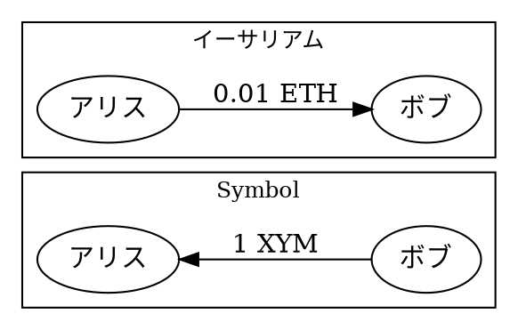

# Symbolとイーサリアム間のクロスチェーンスワップ {: #cross-chain-swap-between-symbol-and-ethereum }

2つの当事者であるアリスとボブは、互いを信頼したり仲介者を使用したりすることなく、0.01 ETH（イーサリアム上）と1 <XYM:>（Symbol上）を交換したいと考えています。



トークンは2つの異なるブロックチェーン上に存在するため、直接の転送は不可能です。
両方のトークンがSymbol上にある場合、この交換は [アトミックスワップ](./atomic-swap.md) のチュートリアルで示されているように、単一の [アグリゲートトランザクション](default:アグリゲートトランザクション) で行えます。
トークンは異なるチェーン上に存在するため、代わりに [クロスチェーンスワップ](default:クロスチェーンスワップ) を使用してスワップを調整する必要があります。

このチュートリアルでは、イーサリアム上の <HTLC:> スマートコントラクトとSymbolのネイティブトランザクションを使用して、チェーン間でこのトークンスワップを実行する方法を示します。

両方のチェーンとやり取りするために、このチュートリアルではSymbol SDKとイーサリアムクライアントライブラリを使用します。

!!! info "サポートされているチェーン"
    このチュートリアルではSymbolとイーサリアム間のスワップを実演していますが、Symbolのシークレットロックの仕組みは、HTLCをサポートする任意のブロックチェーンで機能します。

HTLCプロトコル、タイミングの制約、および制限の背景については、[クロスチェーンスワップ](../../textbook/cross-chain-swaps.md) の概念ページを参照してください。

## 前提条件 {: #prerequisites }

始める前に、以下のことを確認してください。

* 開発環境をセットアップする。
    [開発環境のセットアップ](../start/setup.md)を参照してください。
* アリス用とボブ用に、2つのSymbol [アカウント](default:アカウント) を作成する。
    [秘密鍵からのアカウントの作成](../accounts/create-from-private-key.md)を参照してください。
* ボブのアカウントで、シークレットロックのトランザクション手数料とロックされる金額を支払うためのXYMを取得する。
    [フォーセットからテストネット資金を取得する](../accounts/testnet-faucet.md)を参照してください。
* アリス用とボブ用に、2つのイーサリアムアカウントを作成する。
    [Foundry](https://book.getfoundry.sh/getting-started/installation) の `cast wallet new` コマンド、またはMetaMaskなどの任意のイーサリアムウォレットを使用できます。
* ガス代を支払うために両方のイーサリアムアカウントにSepoliaテストネットETHを用意し、HTLCに資金を供給するのに十分な額をアリスのアカウントに用意する。
    Sepolia ETHは、[Google Cloud faucet](https://cloud.google.com/application/web3/faucet/ethereum/sepolia) またはその他のイーサリアムテストネットフォーセットから取得できます。

* 使用する言語のイーサリアムライブラリをインストールする。

    === ":simple-python: Python"

        ```bash
        pip install web3
        ```

    === ":simple-javascript: JavaScript"

        ```bash
        npm install ethers
        ```

## 完全なコード {: #full-code }



{{ tutorial.code_full('devbook/transactions/cross-chain-swap', ['py', 'js']) }}

## イーサリアムHTLCコントラクト {: #ethereum-htlc-contract }

このチュートリアルでは、Symbolのシークレットロックの相手側として、イーサリアム上にデプロイされたサンプルのHTLCコントラクトを使用します。
コントラクトのソースは [hashed-timelock-contract-ethereum](https://github.com/theSymbolSyndicate/hashed-timelock-contract-ethereum) リポジトリで入手できます。

!!! warning "教育目的のみ"
    本番環境で使用されるコントラクトは、タイミングが双方のセキュリティにとって重要であるため、ロックとコントラクトの有効期限を慎重に調整する必要があります。

コントラクトは3つの主要なメソッドを提供します。

* `newContract(address receiver, bytes32 hashlock, uint timelock)`: 受信者、ハッシュロック、およびタイムロックとしてのUnixタイムスタンプを使用して新しいHTLCを作成します。
    Symbolの <ser:SecretLockTransactionV1> に相当します。
* `withdraw(bytes32 contractId, bytes proof)`: 受信者がハッシュロックと一致する証明を提供することで、資金を請求できるようにします。
    Symbolの <ser:SecretProofTransactionV1> に相当します。
* `refund(bytes32 contractId)`: タイムロックの期限切れ後に資金を作成者に返金します。
    Symbolでは、シークレットロックの期限が切れると自動的に返金が行われます。

コントラクトはSepoliaテストネットのアドレス `0xd58e030bd21c7788897aE5Ea845DaBA936e91D2B` にデプロイされています。

## コードの解説 {: #code-explanation }

アリスとボブはそれぞれ両方のチェーンにアカウントを持つ必要があります。アリスはイーサリアムでETHをロックしてSymbolでXYMを請求し、一方ボブはSymbolでXYMをロックしてイーサリアムでETHを請求します。
アリスが開始者です。彼女はランダムな秘密（*証明*）を生成し、その暗号化ハッシュ（*ハッシュロック*）を計算し、それを条件としてイーサリアム上で自身のETHをロックします。
次に、ボブは**同じハッシュロック**を使用してSymbolで自身のXYMをロックします。これにより、証明を公開することでのみ、どちらの側のロックも解除できるようになります。

コードは以下の4つのステップを順番に実行します。

```graphviz neato cross-chain-swap-steps.svg
digraph CrossChainSwapSteps {
    node [fontsize=24 shape=point width=0];
    edge [arrowhead=none];
    pad=0.5;

    // アリスのロックバー (イーサリアム - 長い、上部)
    A_start [pos="0,5!" width=0.2];
    A_end [pos="12,5!" width=0.2];
    A_start -> A_end [style=bold penwidth=5];
    A_label [label="イーサリアムでのアリスのETHのロック (72時間)" shape=plaintext pos="6,5.3!"];

    // ボブのロックバー (Symbol - 短い)
    B_start [pos="2,2!" width=0.2];
    B_end [pos="7,2!" width=0.2];
    B_start -> B_end [style=bold penwidth=5];
    B_label [label="SymbolでのボブのXYMのロック (48時間)" shape=plaintext pos="4.5,2.3!"];

    // 垂直方向の目盛り
    T1_top [pos="0,5!"];
    T1_bot [pos="0,0.8!"];
    T1_top -> T1_bot [style=dotted];

    T2_top [pos="2,2!"];
    T2_bot [pos="2,0.8!"];
    T2_top -> T2_bot [style=dotted];

    T3_top [pos="5,2!"];
    T3_bot [pos="5,0.8!"];
    T3_top -> T3_bot [style=dotted];

    T5_top [pos="10,5!"];
    T5_bot [pos="10,0.8!"];
    T5_top -> T5_bot [style=dotted];

    // 下部のラベル
    L1 [label="1. アリスが\nETHをロックする" shape=plaintext pos="0,0.2!"];
    L2 [label="2. ボブが\nXYMをロックする" shape=plaintext pos="2,0.2!"];
    L3 [label="3. アリスが\nXYMを請求し\n証明を公開する" shape=plaintext pos="5,0.2!"];
    L5 [label="4. ボブが\nETHを請求する\n " shape=plaintext pos="10,0.2!"];
}
```



1. **アリスがイーサリアムでETHをロックする:** イーサリアムのHTLCコントラクト内で、ハッシュロックによって保護されます。
    この時点ではアリスだけが知っている、一致する証明によってのみロックを解除できます。
2. **ボブがSymbolでXYMをロックする:** 同じハッシュロックを使用して、 <ser:SecretLockTransactionV1> を作成します。
3. **アリスがSymbolでXYMを請求する:** <ser:SecretProofTransactionV1> を通じて証明を公開することで、証明がSymbol上で誰でも見れる状態になります。
4. **ボブがイーサリアムでETHを請求する:** Symbolからアリスの証明を読み取り、イーサリアムHTLCコントラクトの `withdraw` を呼び出します。

実際には、アリスとボブはそれぞれ別のマシンで自分のパートを実行します。
このチュートリアルでは、分かりやすくするために両方の側を1つのスクリプトにまとめています。

コードでは、[転送](./transfer.md)チュートリアルで説明されているのと同じパターンに従って、ネットワークの時刻や手数料を取得したり、トランザクションをアナウンスしたり、承認をポーリングしたりするためのヘルパー関数を定義しています。

このチュートリアルではステップ間でトランザクションの [ファイナリティ](default:ファイナライズ) を待ちませんが、本番環境への実装ではロールバック関連のリスクを防ぐために必ず待機する必要があります。

### アカウントのセットアップ {: #setting-up-accounts }

{{ tutorial.code_snippet(['py:181:210', 'js:155:188']) }}

`ALICE_XYM_PRIVATE_KEY` と `BOB_XYM_PRIVATE_KEY` 環境変数はSymbolの鍵を設定し、 `ALICE_ETH_PRIVATE_KEY` と `BOB_ETH_PRIVATE_KEY` はイーサリアムの鍵を設定します。
便宜上、事前に資金が提供されたテストキーがデフォルトとして提供されていますが、これらは保守されておらず、資金が枯渇する可能性があります。

### アリス：証明とハッシュロックの生成 {: #alice-generating-the-proof-and-hashlock }

{{ tutorial.code_snippet(['py:214:221', 'js:192:199']) }}

スワップの開始者として、アリスはランダムな32バイトの値を**証明**として生成します。
次に、ダブルSHA-256を使用してそれをハッシュ化し、**ハッシュロック**を生成します。

ダブルSHA-256アルゴリズムが選択されているのは、Symbol（ `hash_256` として）とイーサリアムのHTLCコントラクトの両方でサポートされているためです。
スワップを機能させるには、両方のチェーンで同じアルゴリズムを使用することが不可欠です。

!!! info "その他のハッシュアルゴリズム"
    Symbolは、シークレットロック用に他のハッシュアルゴリズムもサポートしています。
    利用可能なすべての値については、 <ser:LockHashAlgorithm> を参照してください。

### ステップ1. アリス：イーサリアムでETHをロックする {: #step-1-alice-locking-eth-on-ethereum }

{{ tutorial.code_snippet(['py:224:247', 'js:202:223']) }}

アリスはイーサリアムHTLCコントラクトの `newContract` を呼び出し、ボブのために0.01 ETHをロックします。

* **受信者:** ボブのイーサリアムアドレス。
* **ハッシュロック:** 証明の二重SHA-256ハッシュ。この時点ではアリスだけが証明を知っています。
* **タイムロック:** ボブがスワップを完了しなかった場合にアリスがETHを回収できるようになる、72時間後のUnixタイムスタンプ。
* **値:** トランザクションとともに送信される0.01 ETH。

トランザクションレシートには、このHTLCを識別する `contractId` を含む `LogHTLCNew` イベントが含まれています。
ボブは後でETHを引き出すためにこの `contractId` が必要になります。

### ステップ2. ボブ：Symbolでシークレットロックを作成する {: #step-2-bob-creating-a-secret-lock-on-symbol }

{{ tutorial.code_snippet(['py:250:288', 'js:226:269']) }}

ボブはまず、 `getContract` を使用してイーサリアムHTLCコントラクトをクエリし、アリスが使用したハッシュロックを取得します。

!!! note "ロック前の検証"
    ボブは自身の資金をロックする前に、コントラクトの詳細すべて（金額、受信者、タイムロック）を検証する必要があります。
    このチュートリアルでは、簡単にするためにハッシュロックのみを読み取っています。

次に、ボブはSymbolで <ser:SecretLockTransactionV1> を作成し、**同じハッシュロック**を使用してアリスのために1 XYMをロックします。

* **受信者:** アリスのSymbolアドレス。
* **モザイク:** 1 XYM（可分性6の `1_000000` アトミック単位として表現）。
* **期間:** 5760ブロック（30秒のブロック時間で約48時間）。

    !!! warning "タイムロックの順序"
        この期間は、アリスの72時間のイーサリアムタイムロック**より短く**なければなりません。
        そうしないと、アリスは自分のETHを返金しても、ボブのXYMを請求できる可能性があります。
        2つの間のギャップは十分に**大きく**なければなりません。これは、アリスがぎりぎりで証明を公開した場合でも、ボブがイーサリアムで引き出すことを可能にする安全マージンです。
        [安全上の考慮事項](../../textbook/cross-chain-swaps.md#safety-considerations)を参照してください。

* **ハッシュロック（ `secret` フィールド）:** イーサリアムのコントラクトから取得したハッシュロック。
* **ハッシュアルゴリズム (Hash algorithm):** `hash_256` (二重SHA-256)。もう一方のチェーンのHTLCで使用されているアルゴリズムと一致する必要があります。

### ステップ3. アリス：SymbolでXYMを請求する {: #step-3-alice-claiming-xym-on-symbol }

{{ tutorial.code_snippet(['py:291:317', 'js:272:302']) }}

ボブのシークレットロックが承認され、それが予想される金額、ハッシュロック、受信者、およびタイムロックと一致することをアリスが検証したら、彼女は証明を公開することによってSymbol上でロックされたXYMを請求します。

彼女は以下を使用して <ser:SecretProofTransactionV1> を作成します。

* **受信者:** アリス自身のSymbolアドレス（ボブのシークレットロックで設定されたのと同じアドレス）。
* **ハッシュロック（ `secret` フィールド）:** シークレットロックで使用されたのと同じハッシュロック。
* **ハッシュアルゴリズム:** `hash_256` （シークレットロックと一致する必要があります）。
* **証明:** アリスが生成した元のランダムなバイト。

このトランザクションがアナウンスされて承認されると、アリスはボブがロックしていた1 XYMを受け取り、証明はSymbolブロックチェーン上で**誰でも見れる状態**になります。
ボブ（または誰でも）はトランザクションデータからそれを読み取れます。

### ステップ4. ボブ：イーサリアムでETHを引き出す {: #step-4-bob-withdrawing-eth-on-ethereum }

{{ tutorial.code_snippet(['py:320:338', 'js:305:318']) }}

ボブは、アリスからトランザクションハッシュをもらう必要なしに、オンチェーンでアリスの証明を発見します。

`wait_for_secret_proof` ヘルパーは、アリスのアドレスと `type=16978` (<ser:SecretProofTransactionV1>) でフィルタリングされた <get:/transactions/confirmed> エンドポイントをポーリングし、 `transaction.secret` をボブ自身のハッシュロックと照合して正しいエントリを選び出し、そこから `transaction.proof` を読み取ります。

ハッシュロックは各スワップに固有の32バイトのランダムなバイトであるため、過去にアリスが他のシークレット証明を投稿していたとしても、このスワップの証明トランザクションのみが一致します。

証明が取得されると、ボブはイーサリアムHTLCコントラクトの `withdraw` を2つの引数とともに呼び出します。

* **コントラクトID:** アリスがETHをロックしたときに発行された `LogHTLCNew` イベントからのHTLC識別子。
* **証明:** アリスがSymbol上で公開した証明。

!!! warning "引き出し期限"
    ボブは、アリスのイーサリアムタイムロックが期限切れになる前にこのステップを完了する必要があります。
    期限が切れると、アリスはイーサリアムのコントラクトで `refund` を呼び出してETHを回収できてしまいます。

このイーサリアムトランザクションが承認されると、ボブはアリスの0.01 ETHを受け取り、スワップが完了します。
アリスはステップ3の終わりにすでにボブの1 XYMを受け取っています。

## 出力 {: #output }

以下に示す出力は、プログラムの一般的な実行例に対応しています。

```text linenums="1" hl_lines="9 10 15 16 19 50 70 80 87 89"
--8<-- 'devbook/transactions/cross-chain-swap.log'
```

出力の重要なポイント：

* **行 9-10:** アリスは証明とハッシュロックを生成します。証明は、アリスが公開するまで秘密にしておく必要があります。
* **行 15:** イーサリアムでのアリスのETHロックが承認されます。
* **行 16:** HTLCコントラクトIDは、アリスのイーサリアムロックを識別します。ボブはこれを使用してハッシュロックをクエリし、後で引き出します。
* **行 19:** ボブは `getContract` を使用して、イーサリアムコントラクトからハッシュロックを取得します。
* **行 50:** ボブのSymbolシークレットロックが承認されます。これで、アリスはXYMを請求できるようになります。
* **行 70:** アリスはシークレット証明トランザクションに証明を含めます。アナウンスされると、Symbol上で誰でも見れる状態（パブリック）になります。
* **行 80:** アリスのシークレット証明が承認されます。アリスは1 XYMを受け取ります。
* **行 87:** ボブは、Symbol上で承認されたアリスのトランザクションから公開された証明を取得し、それを使用してイーサリアムで引き出しを行います。
* **行 89:** ボブのイーサリアムでの引き出しが承認されます。
    ボブはアリスの0.01 ETHを受け取り、スワップが完了します。

出力に表示されたハッシュを使用して、各ネットワークのブロックエクスプローラーでトランザクションを確認できます。

* **イーサリアム:** ロックおよび引き出しトランザクション用の [Sepolia Etherscan](https://sepolia.etherscan.io/)。
* **Symbol:** シークレットロックおよびシークレットプルーフトランザクション用の [Symbol Testnet Explorer](https://testnet.symbol.fyi/)。

## 結論 {: #conclusion }

このチュートリアルでは、以下の方法を示しました。

| ステップ                                                                           | 関連ドキュメント          |
| ------------------------------------------------------------------------------ | ------------------------------ |
| [証明とハッシュロックの生成](#alice-generating-the-proof-and-hashlock)      | <ser:LockHashAlgorithm>        |
| [イーサリアムでETHをロックする](#step-1-alice-locking-eth-on-ethereum)                  | イーサリアムHTLCコントラクト         |
| [Symbolでシークレットロックを作成する](#step-2-bob-creating-a-secret-lock-on-symbol) | <ser:SecretLockTransactionV1>  |
| [Symbolで証明を公開する](#step-3-alice-claiming-xym-on-symbol)             | <ser:SecretProofTransactionV1> |
| [イーサリアムでETHを引き出す](#step-4-bob-withdrawing-eth-on-ethereum)            | イーサリアムHTLCコントラクト         |

## 次のステップ {: # }

このチュートリアルは簡略化された例です。
本番環境でクロスチェーンスワップを使用する前に、テキストブックの[安全上の考慮事項](../../textbook/cross-chain-swaps.md#safety-considerations)を確認してください。
