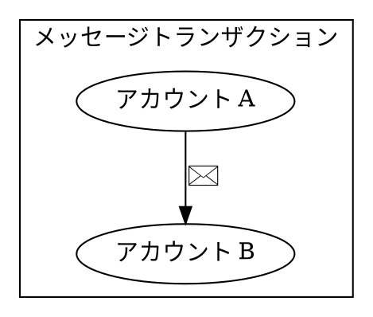
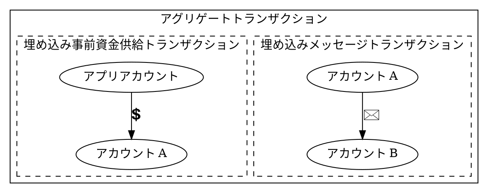
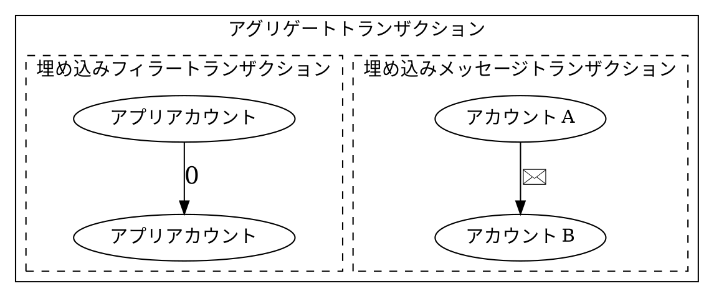

# 他のアカウントの代理でのトランザクション手数料の支払い {: #paying-transaction-fees-on-behalf-of-another-account }

通常、ブロックチェーンを利用するには、トランザクション手数料を支払うためにネットワークのネイティブ通貨を所有している必要があります。
初心者にとって、これは取引所を通じて資金を入手し、[KYC](default:KYC) 手続きを完了させる必要があることを意味します。

幸いなことに、アプリがユーザーの代わりにトランザクション手数料を負担することで、よりスムーズな体験を提供できます。

Ethereum では、この機能は当初 [EIP-4337](https://eips.ethereum.org/EIPS/eip-4337) などの標準規格を通じて導入されました。これにより、アカウント抽象化とスポンサー付きトランザクションが可能になりました。
さらに、[EIP-7702](https://eips.ethereum.org/EIPS/eip-7702) を含む新しい提案では、通常のアカウントがスマートコントラクトのような挙動を採用できるようにすることで、このアプローチを発展させています。

Symbol では、[アグリゲートトランザクション](default:アグリゲートトランザクション) を使用して、同様の挙動を標準機能として実装できます。
このチュートリアルでは、Symbol の [アカウント](default: アカウント) が別のアカウントの代わりにトランザクション手数料を支払うことを可能にする 2 つの手法を紹介します。

!!! warning "簡潔な例"

    簡略化のため、このチュートリアルではトランザクションを構築するコードのみを示します。

    そのため、**示されているコードは直接実行可能ではありません**。
    このチュートリアルで構築されたトランザクションをアナウンスし、承認を確認する方法については、[転送トランザクション](./transfer.md) のチュートリアルを参照してください。

## 問題の定義 {: #problem-statement }

ユーザーが自分自身の Symbol アカウントを制御し、メッセージのペイロードを含む [転送トランザクション](default: トランザクション) を送信することでメッセージを交換する、メッセージングアプリケーションを考えてみましょう。
アプリケーションはメッセージをリレーし、新しいメッセージを受信したときに通知をトリガーします。
中央の権限が通信を検閲したりブロックしたりすることはできません。

メッセージは、意図した受信者のみが読み取れるように暗号化することもできますが、暗号化はこのチュートリアルの範囲外です。

ユーザビリティを向上させるために、アプリケーション開発者は、各ユーザーの自身のアカウントからメッセージを送信しつつ、ユーザーの代わりにトランザクション手数料を支払うことを選択します。
これらの手数料のコストは、例えば法定通貨で支払われる月額サブスクリプションなどの外部課金メカニズムを通じて回収できます。

この利便性と引き換えに、トランザクション手数料の支払いに限定された中央集権的なポイントが導入されますが、ユーザーが自分自身で手数料を管理することを選択すれば、個別にこのポイントを排除できます。



{{ tutorial.code_full_tagged('devbook/transactions/fee_sponsorship', ['py', 'js'], show=false) }}

## オプション 1: 手数料前払い {: #option-1-prefunded-fees }

このアプローチでは、アプリケーション開発者が制御するアカウントが、ユーザーのアカウントに対して *前払い手数料* の転送を行います。

資金が悪用されないことを保証するために、手数料前払いの転送とメッセージの転送の両方が、単一の [アグリゲートトランザクション](default:アグリゲートトランザクション) 内に組み込まれます。
アグリゲートは、アプリケーションアカウントとユーザーの両方によって署名され、後者によってアナウンスされます。

**トランザクション手数料は、すべての埋め込みトランザクションが実行された後に差し引かれます**。これにより、事前供給された金額をメッセージ送信者がすべてのトランザクション手数料の支払いに充てることが可能になります。

事前供給額は、両方の [埋め込みトランザクション](default: 埋め込みトランザクション) の手数料をカバーするのに十分である必要があり、この場合、埋め込みトランザクションの順序は関係ありません。

セキュリティ上の理由から、アプリケーションはアプリケーションアカウントに属するいかなる [秘密鍵](default: 秘密鍵) も保持すべきではありません。
代わりに、 [コンプリートアグリゲートトランザクション](default: コンプリートアグリゲートトランザクション) を構築してオフチェーン API を通じて開発者の [署名](default: 署名) を要求するか、 [ボンデッドアグリゲートトランザクション](default: ボンデッドアグリゲートトランザクション) を構築してオンチェーンの手段のみで署名を要求することができます。

開発者の署名が得られれば、アプリケーションはユーザーの署名を付加してアグリゲートトランザクションをアナウンスできます。これは、ユーザーのアカウント残高がゼロであっても可能です。

{{ tutorial.code_snippet_tagged('step-1') }}

### メッセージトランザクション {: #message-transaction }

ユーザーから受信者へメッセージを送信する埋め込みトランザクションは、標準的な [転送トランザクション](default: トランザクション) です。

{{ tutorial.code_snippet_tagged('step-2') }}

### 事前資金供給トランザクション {: #prefund-transaction }

これも転送トランザクションですが、転送する金額がまだ決まっていないという特徴があります。
総手数料はアグリゲートトランザクションの最終的なサイズに依存し、この段階では計算できません。
そのため、金額は最初 `0` に設定されます。

このトランザクションの送信者はアプリケーションアカウントで、受信者はユーザーアカウントです。

{{ tutorial.code_snippet_tagged('step-3') }}

### アグリゲートトランザクション {: #aggregate-transaction }

[コンプリートアグリゲートトランザクション](default: コンプリートアグリゲートトランザクション) は通常通り構築され、トランザクションサイズが判明した時点でその `fee` フィールドが更新されます。

その後、事前資金供給トランザクションの金額が、計算された手数料と一致するように設定されます。

最後に、 `transactions_hash` フィールドが埋め込みトランザクションの [ハッシュ](default: ハッシュ) で更新されます。
このフィールドは通常、 <dy:SymbolTransactionFactory.create> を使用してアグリゲートが作成されるときに設定されますが、このケースでは事前資金供給トランザクションが修正された後に更新する必要があります。

!!! caution "注意"

    コードに示されているように、 `transactions_hash` フィールドを設定する際は、モデル固有の型である `sc.Hash256` (:simple-python:) または `models.Hash256` (:simple-javascript:) を使用し、汎用的な暗号化型である `Hash256` は使用しないでください。

{{ tutorial.code_snippet_tagged('step-4') }}

### 署名 {: #signatures }

ユーザーアカウントは、アグリゲートトランザクションの署名者であるため、 <dy:SymbolTransactionFactory.attachSignature> を使用して自身の署名を追加します。
その後、前述のようにオンチェーンまたはオフチェーンのいずれかの方法で取得されたアプリケーションアカウントの [連署](default: マルチシグアカウント) 、 <dy:SymbolFacade.cosignTransaction> を使用して追加されます。

{{ tutorial.code_snippet_tagged('step-5') }}

ペイロードが取得できれば、トランザクションをアナウンスし、承認を確認する準備が整います。

## オプション 2: 手数料スポンサーシップ {: #option-2-sponsored-fees }

アグリゲートトランザクションでは、すべてのトランザクション手数料はアグリゲート署名者によってのみ支払われます。
したがって、提示された問題に対する直接的な解決策は、アプリケーションアカウントによって署名されたアグリゲートトランザクション内にメッセージトランザクションを埋め込むことです。

ただし、Symbol ではすべてのアグリゲート署名者が少なくとも 1 つの埋め込みトランザクションに参加している必要があります。
その結果、アプリケーションアカウントの署名を必要とする、追加の「フィラー (filler)」埋め込みトランザクションを含める必要があります。

このフィラートランザクションは副作用を持たない必要があり、アプリケーションアカウントから自分自身への空の転送が適した選択肢となります。

オプション 1 と比較して、このアプローチはセットアップがより簡単です。埋め込みトランザクションの構築後に総手数料を計算したり、トランザクションやそのハッシュを更新したりする必要がないためです。
一方で、アプリケーションアカウントがより積極的な役割を果たすことになります。これは、ユーザーが最終的に自身の資金や手数料を管理できるようにすることを目標としている場合には、逆効果になる可能性があります。

また、フィラートランザクションは事前資金供給の転送よりもサイズが小さいため、オプション 2 の方がわずかに安価です。

{{ tutorial.code_snippet_tagged('step-6') }}

### メッセージトランザクション {: #message-transaction }

ユーザーから受信者へメッセージを送信する埋め込みトランザクションは、標準的な転送トランザクションです。

{{ tutorial.code_snippet_tagged('step-7') }}

### フィラートランザクション {: #filler-transaction }

これもアプリケーションアカウントから自分自身への転送トランザクションであり、資金は転送されません。
前述のように、その唯一の目的は、アプリケーションアカウントがアグリゲートトランザクションに署名し、手数料を支払うことを可能にすることです。

{{ tutorial.code_snippet_tagged('step-8') }}

### アグリゲートトランザクション {: #aggregate-transaction }

コンプリートアグリゲートトランザクションは通常通り構築され、トランザクションサイズが判明した時点でその `fee` フィールドを更新します。
オプション 1 とは異なり、さらに修正を加える必要はありません。

{{ tutorial.code_snippet_tagged('step-9') }}

### 署名 {: #signatures }

アプリケーションアカウントは、アグリゲートトランザクションの署名者であるため、 <dy:SymbolTransactionFactory.attachSignature> を使用して自身の署名を追加します。
この署名は、前述のようにオンチェーンまたはオフチェーンの方法で取得できます。

その後、ユーザーアカウントの [連署](default: マルチシグアカウント) が <dy:SymbolFacade.cosignTransaction> を使用して追加されます。

{{ tutorial.code_snippet_tagged('step-10') }}

ペイロードが取得できれば、トランザクションをアナウンスし、承認を確認する準備が整います。

## 結論 {: #conclusion }

このチュートリアルでは、 [アグリゲートトランザクション](default: アグリゲートトランザクション) を使用して、あるアカウントが別のアカウントの代わりにトランザクション手数料を支払う 2 つの方法を紹介しました。
どちらのアプローチも、ユーザーの所有権と自身のアカウントに対する制御を維持しつつ、アプリケーションがトランザクション手数料をスポンサーすることを可能にします。

手数料の支払いとトランザクションの承認を分離することで、アプリケーションはシステムの分散型の特性を損なうことなく、新規ユーザーに対してよりスムーズなオンボーディング体験を提供できます。
