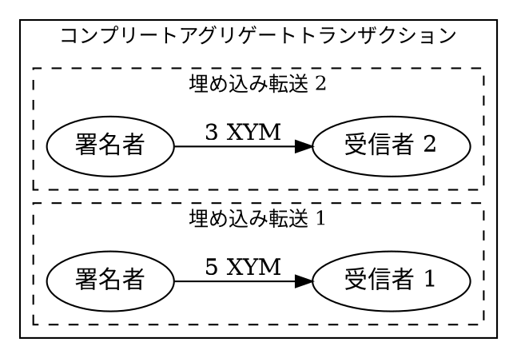

# トランザクションのバッチ処理

[コンプリートアグリゲートトランザクション](default:コンプリートアグリゲートトランザクション) を使用すると、単一の [アカウント](default:アカウント) からの複数のトランザクションを1つのアトミックな操作に結論、1回の手数料と1回の承認で済ませることができます。

これは、例えば報酬の分配、支払いの分割、または複数のアカウントへの同時資金供給などに役立ちます。

このチュートリアルでは、異なる受信者に <XYM:> を送信する2つの [転送トランザクション](default:転送トランザクション) をバッチ処理する方法を説明します。



すべての埋め込みトランザクションが同じ署名者を共有するため、cosignatures:|連署 は必要ありません。
アグリゲートは単一のアカウントによって署名され、アナウンスされます。
複数のアカウントから署名を収集する必要がある例については、[コンプリートアグリゲート](./complete-aggregate.md) および [ボンデッドアグリゲート](./bonded-aggregate.md) のチュートリアルを参照してください。

## 前提条件 {: #prerequisites }

開始する前に、開発環境がセットアップされていることを確認してください。
[開発環境のセットアップ](../start/setup.md) を参照してください。

また、転送とトランザクション手数料をカバーするのに十分な <XYM:> を持つ [アカウント](default:アカウント)も必要です。
便宜上、事前に資金供給されたテストアカウントが提供していますが、これはメンテナンスされておらず、いつでも資金が不足する可能性があります。

自身のアカウントを使用する場合は、以下の手順を完了してください。

* バッチトランザクションを送信するためのアカウントを、[コード](../accounts/create-from-private-key.md)または[ウォレット](../../userbook/wallet/create-account.md)を使用して 作成します。

* トランザクション手数料と転送額を支払うための XYM を入手します。[蛇口 (Faucet) からテストネットの通貨を入手する](../accounts/testnet-faucet.md) を参照してください。

さらに、トランザクションがどのようにアナウンスされ、承認されるかを理解するために、[転送トランザクション](./transfer.md) のチュートリアルを確認してください。

## 完全なコード {: #full-code }



{{ tutorial.code_full_tagged('devbook/transactions/transaction_batching', ['py', 'js', 'java']) }}

## コード解説 {: #code-explanation }

### アカウントの設定 {: #setting-up-the-account }

{{ tutorial.code_snippet_tagged('step-1') }}

署名者アカウントは、 `SIGNER_PRIVATE_KEY` 環境変数から読み込まれます。
指定されていない場合は、デフォルトでテストキーが使用されます。

2つの受信者アドレスは、 `RECIPIENT_1` および `RECIPIENT_2` 環境変数から読み込まれます。
指定されていない場合は、デフォルトでテストアドレスが使用されます。

### 推奨手数料の取得 {: #fetching-recommended-fees }

{{ tutorial.code_snippet_tagged('step-2') }}

推奨手数料は、[転送トランザクション](./transfer.md) のチュートリアルで説明されているプロセスに従い、 <get:/network/fees/transaction> から取得されます。

### 埋め込みトランザクションの作成 {: #creating-embedded-transactions }

{{ tutorial.code_snippet_tagged('step-3') }}

各転送は、アグリゲート内にラップされる[埋め込みトランザクション](default:埋め込みトランザクション)として作成されます。
すべての埋め込みトランザクションは同じアカウントから発生するため、同じ `signer_public_key` を使用します。

この例では、2つの [転送トランザクション](default:転送トランザクション)を作成します。

* 最初の転送では、受信者 1 に 5 XYM を送信します。
* 2番目の転送では、受信者 2 に 3 XYM を送信します。

すべてが同じ署名者を共有している場合でも、各埋め込みトランザクションで `signer_public_key` が必要です。

埋め込みトランザクションには、手数料や有効期限のフィールドは**含まれません**。
これらは、それを囲むアグリゲートトランザクションから継承されます。

!!! note "他のトランザクションタイプのバッチ処理"

    この例では転送トランザクションをバッチ処理していますが、（他のアグリゲートを除く）任意のトランザクションタイプをアグリゲート内に埋め込むことができます。
    例えば、モザイクの作成とネームスペースエイリアスの登録を単一のアトミックな操作としてバッチ処理することができます。

### アグリゲートトランザクションの構築 {: #building-the-aggregate-transaction }

{{ tutorial.code_snippet_tagged('step-4') }}

アグリゲートトランザクションは、トランザクションのディスクリプタから作成します。
ディスクリプタには以下のフィールドが含まれます。

* **Type:** <ser:AggregateCompleteTransactionV3> を使用します。

* **Transactions hash:** <dy:SymbolFacade.hashEmbeddedTransactions> を使用して、すべての埋め込みトランザクションから計算されるハッシュ。
これにより、署名後に埋め込みトランザクションが変更されないことが保証されます。

* **Transactions:** 実行する埋め込みトランザクションの配列。

<dy:SymbolFacade.createTransactionFromTypedDescriptor> には、署名者の公開鍵、手数料乗数、デッドラインの期間も渡します。
署名者はアグリゲートに署名し、トランザクション手数料を支払います。

<dy:SymbolFacade.createTransactionFromTypedDescriptor> が、アグリゲートの合計サイズに基づいて手数料を計算します。
連署は必要ないため、追加の連署数は指定しません。

### 署名とアナウンス {: #signing-and-announcing }

{{ tutorial.code_snippet_tagged('step-5') }}

アグリゲートは <dy:SymbolFacade.signTransaction> で署名され、 <dy:SymbolTransactionFactory.attachSignature> を使用してペイロードにシリアライズされます。
署名されたペイロードはその後、[転送トランザクション](./transfer.md) チュートリアルで説明されている通常のトランザクションと同じプロセスに従って、 <put:/transactions> エンドポイントを使用して [ノード](default:ノード) にアナウンスされます。

### 承認の待機 {: #waiting-for-confirmation }

{{ tutorial.code_snippet_tagged('step-6') }}

アナウンス後、 <get:/transactionStatus/{hash}> を使用してトランザクションステータスが監視されます。
ポーリングループは、トランザクションが承認されるか失敗するまで、毎秒ステータスを確認します。

## 出力 {: #output }

以下に示す出力は、プログラムの典型的な実行結果に対応しています。

```text linenums="1" hl_lines="14 24 27 28 38 41 42 48"
--8<-- 'devbook/transactions/transaction_batching.log'
```

出力の主なポイント:

* **14行目** (`"type": 16705`): これが <ser:AggregateCompleteTransactionV3> であることを識別します。

* **24行目と38行目** (`"recipient_address"`): 2つの埋め込み転送は異なるアカウントをターゲットにしています。
これらは、4〜5行目に出力された Base32 アドレスの16進数エンコード形式です。

* **27-28行目と41-42行目** (`"mosaic_id", "amount"`): 各転送は XYM（モザイクエイリアス ID `16666583871264174062`）を送信します。
このモザイクの [可分性](default:可分性) は 6 であるため、金額 5000000 と 3000000 はそれぞれ 5 および 3 XYM に対応します。

* **48行目** (`"cosignatures": []`): すべての埋め込みトランザクションが同じ署名者を共有しているため、空です。
追加の署名は必要ありません。

アグリゲートトランザクションはアトミックに実行されます。つまり、両方の受信者が XYM の転送を受け取るか、どちらも受け取らないかのいずれかになります。

出力されたトランザクションハッシュ（52行目）を使用して、 [Symbol Testnet Explorer](https://testnet.symbol.fyi/) でトランザクションを検索できます。

## 結論 {: #conclusion }

このチュートリアルでは、以下の方法を説明しました。

| ステップ                                                   | 関連ドキュメント                                                                          |
|--------------------------------------------------------|-------------------------------------------------------------------------------------|
| [埋め込みトランザクションの作成](#creating-embedded-transactions) | <dy:SymbolFacade.createEmbeddedTransactionFromTypedDescriptor><br/><ser:TransferTransactionV1> |
| [アグリゲートの構築](#building-the-aggregate-transaction)     | <dy:SymbolFacade.createTransactionFromTypedDescriptor><br/><ser:AggregateCompleteTransactionV3><br/><dy:SymbolFacade.hashEmbeddedTransactions> |
| [署名とアナウンス](#signing-and-announcing)                  | <dy:SymbolFacade.signTransaction><br/><dy:SymbolTransactionFactory.attachSignature> |

## 次のステップ {: #next-steps }

* **連署者の追加:** 埋め込みトランザクションに複数の署名者が関与し、アナウンス前にオフチェーンで連署できる場合は、[コンプリートアグリゲート](./complete-aggregate.md)のチュートリアルを参照してください。

* **オンチェーンでの署名収集:** トランザクションがアナウンスされた後に連署者が署名する必要がある場合は、[ボンデッドアグリゲート](./bonded-aggregate.md)のチュートリアルを参照してください。

* **手数料のスポンサー:** [他のアカウントの代理での手数料支払い](./fee-sponsorship.md) のチュートリアルを使用して、あるアカウントが別のアカウントの代わりにトランザクション手数料を支払うことができるようにします。
