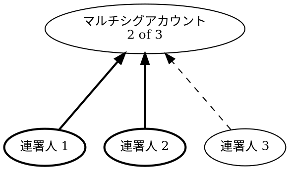

# アカウント

アカウント
: 暗号資産や [NFT](default:NFT) などのデジタル資産を安全に保管する場所です。
    従来の銀行における貸金庫に似た役割を果たします。

ブロックチェーンでは、アカウントは [キーペア](default:キーペア) によって保護されます。
秘密鍵を使うことでのみ資産を **送金** でき、公開鍵を共有することで自由に **受け取る** ことができます。

公開鍵は利便性のために通常 [アドレス](default:アドレス) として共有され、
「アカウント」と「アドレス」は同義語として使われます。

アカウントはデジタル資産の管理だけでなく、秘密鍵の所有権を表し、
デジタルアイデンティティとしての役割も果たします。
ブロックチェーン上では、アカウントはトランザクションの承認、権限設定、
および [コンセンサス](default:コンセンサス) への参加が可能です。

!!! note "アカウントのライフサイクル"

    アカウントはブロックチェーンと初めてやり取りを行った時点で有効になります。
    たとえば、資産を受け取ったときです。
    有効化される前は、チェーン上には一切情報が記録されず、ブロックエクスプローラにも表示されません。

    一度有効化されたアカウントは資産をすべて引き出すことはできますが、
    ブロックチェーンから削除することはできません。

アカウントの安全性は、[アカウント制限](default:アカウント制限) を利用することでさらに高められます。
これにより、やり取り可能なアドレス、受け取れるモザイク、実行可能な操作を制限できます。

## ニーモニック {: #mnemonics }

ニーモニックフレーズ
: [秘密鍵](default:秘密鍵) を人間が読みやすい形で表したもので、
    通常は 12 語または 24 語のランダムな単語リストとして表示されます。

一般に「ニーモニック」と呼ばれ、[HDウォレット](default:HDウォレット) で
アカウントを作成または復元する際によく使用されます。

Symbol は 24 個の英単語を使用する [BIP-39](https://github.com/bitcoin/bips/blob/master/bip-0039.mediawiki)
標準に準拠しています。

!!! warning "ニーモニックは秘密鍵と同様に扱ってください"

    ニーモニックフレーズにアクセスできる人は、そこから生成される
    すべてのアカウントを操作できます。
    決して共有せず、暗号化されていないデジタル形式で保存しないよう注意してください。

## ウォレット {: #wallets }

ウォレット
: Symbol のアカウントを管理し、トランザクションを作成・署名するためのアプリケーションです。

[秘密鍵](default:秘密鍵) または [ニーモニックフレーズ](default:ニーモニックフレーズ) を保存し、
それらを使ってトランザクションに署名します。
より広い意味では、ブロックチェーンを探索し、やり取りするためのツールを提供します。

ウォレットには次の種類があります。

* :material-application-outline: **ソフトウェアウォレット**

    デスクトップやモバイル端末にインストールして使用するアプリケーションです。

    フル機能を備えていますが、セキュリティリスクも高くなります。
    ブロックチェーンと通信するために常時オンラインである必要があり、
    パスワードで保護されていても秘密鍵が漏えいする可能性があります。

* :material-integrated-circuit-chip: **ハードウェアウォレット**

    鍵をオフラインで保管する外部デバイスです。

    主に安全な署名処理のために設計されており、
    操作にはソフトウェアウォレットとの接続が必要です。

    内部に保存された秘密鍵はバックアップ時を除きデバイス外に出ることはなく、
    非常に高い安全性を持ちます。

ほとんどのウォレットでは、複数アカウントの管理、QR コードによる署名や署名要求、
メタデータの入力、[マルチシグアカウント](default:マルチシグアカウント) の設定が可能です。
また、[秘密鍵](default:秘密鍵) や [ニーモニックフレーズ](default:ニーモニックフレーズ) を使用して
アカウントをインポートまたはエクスポートすることもできます。

## HDウォレット {: #hd-wallets }

HDウォレット
: 階層的決定性（HD）方式を採用した [ウォレット](default:ウォレット) で、
    単一のシードから複数の [アカウント](default:アカウント) を生成します。
    複数の [キーペア](default:キーペア) を個別に管理する必要がなく、非常に便利です。

複数アカウントの管理が簡単になりますが、
シードが漏えいするとすべてのアカウントが危険にさらされるため、
シードの保護には特に注意が必要です。
シードは通常 [ニーモニックフレーズ](default:ニーモニックフレーズ) として表されます。

現在のウォレットの多くは HD ウォレットです。

Symbol は [BIP-32](https://github.com/bitcoin/bips/blob/master/bip-0032.mediawiki) 標準に基づき、
シードからアカウントを生成します。

## メタデータ {: #metadata }

メタデータ
: [アカウント](default:アカウント) や、[モザイク](default:モザイク)、[ネームスペース](default:ネームスペース) など
    他のブロックチェーンの要素に付与できる構造化データです。

Symbol 上のメタデータはキーと値のペアとして構成され、オンチェーンに保存されます。

アカウントの明示的な承認なしにはメタデータを付与できないため、主な用途は次のとおりです。

* アカウントに識別情報をタグ付けする。
* 公開されている連絡先や利用しているデータを追加する。
* 所属や目的を証明する。

## マルチシグアカウント {: #multisignature-accounts }

マルチシグアカウント
: 　トランザクションを受け入れるために複数の署名者（連署人）による署名を必要とする
    特別な [アカウント](default:アカウント) です。
    「マルチシグ」とも呼ばれます。

マルチシグアカウントは次の手順で設定します。

* 連署人のリストを定義する。
* 承認のしきい値（M-of-N）を設定する。
    すなわち、合計 N 人の署名者のうち M 人の署名が必要であることを示します。

    * **承認しきい値**：通常のトランザクションを承認するために必要な署名数。
    * **削除しきい値**：連署人を削除するために必要な署名数。

例えば、**2-of-3** のマルチシグには 3 人の連署人がいて、そのうち任意の 2 人が署名すれば
トランザクションを承認できます。

上の図では、連署人 1 と 2 が署名しており、最小条件 `M=2` を満たしています。
そのため、連署人 3 の署名がなくてもトランザクションは有効です。

使用例：

* **資金や機能の共同管理**
    設定された連署人の承認なしにアカウント上での操作は実行できません。
    また、1 つのアカウントが侵害されてもリスクを軽減できます。

* **多要素認証**
    セキュリティ強化のため、複数デバイスからの承認を求めるマルチシグ構成を作成できます。

* **アカウントの所有権移転**
    秘密鍵の譲渡による所有権移転は、送信者が鍵を削除した保証がないため安全ではありません。
    この問題を解決するには、送信者が移転対象のアカウントを 1-of-1 のマルチシグとして設定し、
    受信者アカウントを唯一の連署人として指定します。
    その後も同様の方法で、単一署名者を変更することで所有権を移転できます。

連署人として他のマルチシグアカウントを指定することもでき、
柔軟で多層的な承認モデルを構築可能です。

## インポータンス {: #importance }

インポータンス
: アカウントの残高、支払ったトランザクション手数料、新しいブロックの[ハーベスティング](default:ハーベスティング)への
    参加に基づいて、アカウントがネットワークへどれだけ貢献しているかを表す指標です。
    このスコアは、新しいブロックをハーベストする確率とコンセンサスにおける投票の重みを決定します。

インポータンスは、[PoW](default:PoW) システムにおけるハッシュレートや
[PoS](default:PoS) システムにおけるステークと似た役割を果たします。
値が高いほど、ブロックをハーベストして報酬を得る可能性が高くなります。

??? info "インポータンスの計算"

    10'000 XYM 以上の残高を持つすべてのアカウントは _高価値アカウント_ と呼ばれ、
    インポータンス計算に参加します。

    高価値アカウント $A$ のインポータンススコア $I_A$ は、_ステークスコア_、
    _トランザクションスコア_、_ノードスコア_ に基づきます。

    * ステークスコア $S_A$ は、すべての高価値アカウントが保有する通貨総量に対して、
        そのアカウントが保有する通貨の割合です。

    * トランザクションスコア $T_A$ は、すべての高価値アカウントが支払った手数料総額に対して、
        そのアカウントが支払った手数料の割合です。

    * ノードスコア $N_A$ は、同じ期間内の高価値アカウント受取人全体に対して、
        そのアカウントがハーベスティング受取アカウントとして指定された回数の割合です。

    これらのスコアをどのように組み合わせてインポータンススコアを生成するかの詳細は、
    [Symbol ホワイトペーパー](site:/assets/pdfs/SymbolWhitepaper.pdf) の 14.1 節を参照してください。

!!! note "メモ"

    [メインネット](default:メインネット) のインポータンススコアは 720 ブロックごと
    （およそ 6 時間ごと）に計算され、ハーベスティング確率の計算には直近 2 回のスコアのうち小さい方が使われます。
    そのため、初めてアカウントに資金を入れた後、ハーベスティングを開始する確率が 0 より大きくなるまでには
    12 時間かかります。

    [テストネット](default:テストネット) では 180 ブロックごと（およそ 1.5 時間ごと）に再計算されるため、
    テストしやすくなっています。

## まとめ {: #summary }

以下の表は、アカウントに関する主な数値制限をまとめたものです。

| 制限項目                                   | 値    |
| ------------------------------------------ | ----: |
| 1 アカウントが所有できる最大モザイク数     | 1'000 |
| 1 アカウントあたりの最大連署者数           |    25 |
| 1 アカウントが連署できる最大アカウント数   |    25 |
| 最大マルチシグ階層数                       |     3 |
