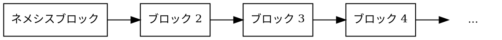
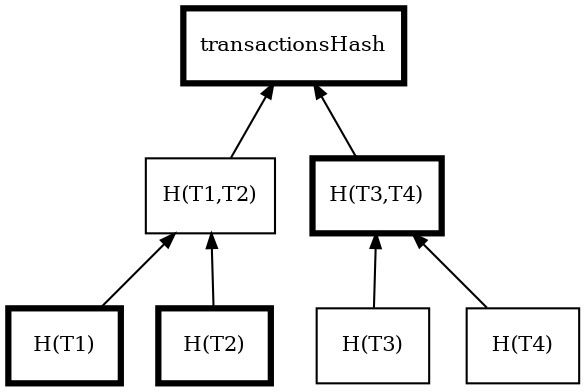
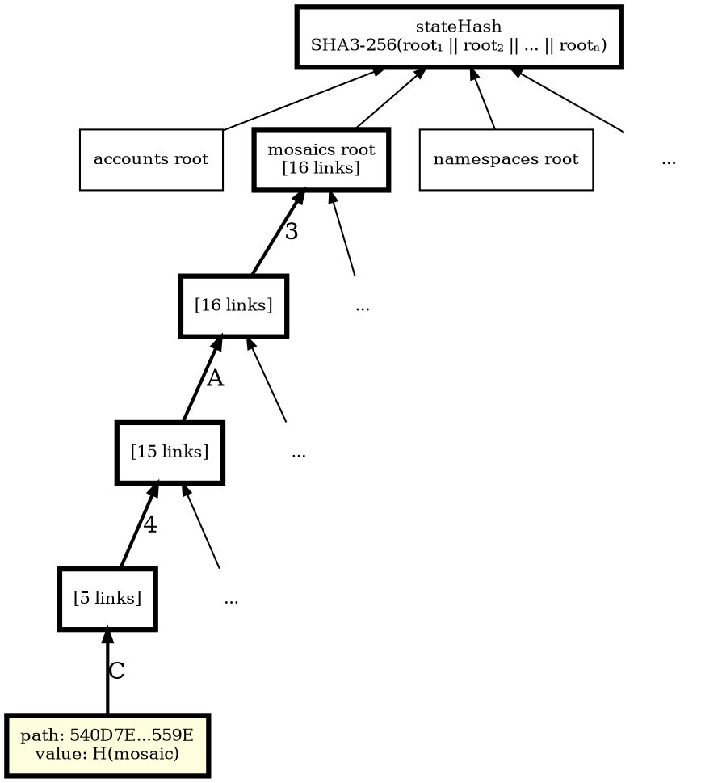

# ブロック

ブロック
:   ブロックとは、特定の時点で発生した[トランザクション](default:トランザクション)およびその他の「状態変更」をまとめて記録したものです。

状態変更とは、ブロックチェーン上のデータが更新されることを指します。
例えば、ある[アカウント](default:アカウント)から別のアカウントへの資金移動や、
新しい[モザイク](default:モザイク)の作成などです。

ブロックにはトランザクションに加えて、タイムスタンプや暗号学的な各種[ハッシュ](default:ハッシュ)などのメタデータが含まれ、
それぞれがブロックの整合性を保証します。
なかでも最も重要なのは「前のブロックのハッシュ」です。これは各ブロックを直前のブロックと結び付け、
チェーン全体の整合性を保証します。
この連結構造によって「ブロックチェーン」が成立します。

ブロックには、トランザクションの主目的以外に発生した副次的な影響を記録する
「レシート（receipt）」が含まれる場合もあります。

Symbol ネットワークでは、およそ３０秒ごとに新しいブロックが生成されます。

## ネメシスブロック

ネメシスブロック
:   Symbol ブロックチェーンにおける最初のブロック。
    他のすべてのブロックはネットワークの[コンセンサス](default:コンセンサス)によって作成されますが、
    ネメシスブロックだけはネットワークの立ち上げ時に手動で生成されます。

ネメシスブロックではブロックチェーンの初期状態を定義します。
ネメシスブロックには、特定のアカウントへの[XYM](default:モザイク)などのモザイクの初期分配、ネームスペースの作成、ネットワークの動作に必要な各種パラメータが含まれます。

チェーンの起点であるため、ネメシスブロックには「前のブロックのハッシュ」が存在しません。
それ以外のすべてのブロックは、直接的または間接的にこのブロックへとつながります。

他のブロックチェーンでは、これに相当するものを一般的に「ジェネシスブロック」と呼びます。
Symbol では、その前身である NEM にちなみ「ネメシス（Nemesis）」という名称が使われています。

ネメシスブロック以降のすべてのブロックは、
Symbol におけるマイニングに相当する[ハーベスティング](default:ハーベスティング)と呼ばれるプロセスによって生成されます。
ハーベスターはトランザクションを検証し、それらをチェーンに追加し、
報酬としてトランザクション手数料を受け取ります。

## ブロック構造

Symbol の各ブロックは、メタデータとトランザクションデータの組み合わせで構成されます。

| **フィールド**             | **説明**                                                                                                                                                                           |
| -------------------------- | ---------------------------------------------------------------------------------------------------------------------------------------------------------------------------------- |
| **ブロック高**        | チェーン内でのブロックの位置。[ネメシスブロック](default:ネメシスブロック)を １ とし、以降は１つ前のブロックより １ ずつ大きい値になります。 |
| **タイムスタンプ**         | ネメシスブロックからの経過ミリ秒。各ブロックで厳密に増加します。ブロック間隔は平均で３０秒前後になるように維持されます。                                                           |
| **前のブロックのハッシュ** | １つ前のブロックの[ハッシュ](default:ハッシュ)。もしそのブロックの内容が改ざんされるとハッシュ値が変わり、チェーンが分断され、後続のブロックは無効になります。                     |
| **ステートハッシュ**       | ブロック内のトランザクション一覧、生成されたレシート、およびそれらの結果として得られる最終状態を要約した[ハッシュ](default:ハッシュ)。                                             |
| **手数料乗数**             | ブロックを収穫したハーベスターが設定する乗数で、ブロック内の各トランザクションのサイズ（バイト数）に基づき手数料を計算するために使用されます。                                     |
| **トランザクション**       | ブロックに含まれる有効なトランザクションの一覧。各トランザクションはブロックに取り込まれる前に個別に検証されます。                                                                 |
| **レシート**               | トランザクション自体に直接は記録されない内部的な状態変化を示す記録。ブロック処理の過程で自動的に生成されます。                                                                     |

## ブロックスコア

[コンセンサス](default:コンセンサス)の過程を支援するために、各ブロックには次の量が定義されます。

ブロックスコア
:   各ブロックに割り当てられる数値で、
    そのブロックがどれだけ「ハーベスティングしにくかったか」を表します。
    値が高いほど難易度が高いとみなされ、
    [フォーク](default:フォーク)発生時の判断において優先されます。

$$
\textit{block score} = difficulty − \textit{time elapsed since last block}
$$

チェーンスコア
:   一定期間に生成された全ブロックの[ブロックスコア](default:ブロックスコア)の合計。

## レシート

レシート
:   ブロック内で発生した状態変更のうち、そのブロックに含まれるトランザクションから
    直接は読み取れないものを記録したもの。

レシートは、元になったトランザクションを過去までさかのぼって探すことなく、
それらの副次的な影響を追跡しやすくします。

例えば、あるトランザクションがネームスペースを１年間リースしたとします。
１年後にそのネームスペースが期限切れになっても、新たなトランザクションは発行されません。
その代わりに、ネームスペースの有効期限切れを示す「ネームスペース期限切れ」レシートが、
そのタイミングのブロックに生成されます。

同様に、アカウントがハーベスティング報酬を得た場合、
報酬を送金するトランザクションは存在しません。
代わりに、そのアカウントの残高が直接増加し、
「残高変更」レシートがそのブロックに記録されます。

レシートはブロック内に含まれ、「トランザクションステートメント」と「リゾリューションステートメント」という
２種類に整理されます。

### トランザクションステートメント

トランザクションステートメントは、個々のトランザクションに関連するレシートをまとめたものです。
対象のトランザクションは同じブロック内に含まれている場合もあれば、
過去のブロックで処理されたものの場合もあります。

各レシートは、トランザクションの実行によって引き起こされた状態変更を表しますが、
その変更内容がトランザクション本体に直接エンコードされていない場合に使用されます。

Symbol のトランザクションステートメントには、次の基本的な種類があります。

* **残高変更**: アカウントの残高を調整します。
* **残高転送**: アカウント間で[モザイク](default:モザイク)を移動します。
* **モザイク有効期限切れ**: モザイクの有効期間が終了したことを示します。
* **ネームスペース有効期限切れ**: ネームスペースのレンタル期間が終了したことを示します。
* **インフレーション**: インフレーションによりネットワーク通貨モザイクが新規発行されたことを示します。

### リゾリューションステートメント

リゾリューションステートメントは、トランザクションの実行時に
[ネームスペース](default:ネームスペース)がどのように解決（リゾルブ）されたかを記録します。

Symbol では、ユーザーは[モザイク](default:モザイク)や[アドレス](default:アドレス)を、
人間が読みやすいエイリアスであるネームスペース名で参照できます。
しかし、トランザクションを実行する前に、これらのエイリアスは必ず元の実体
（実際のモザイク ID やアドレス）に変換されなければなりません。

リゾリューションステートメントは、ブロック内で使用された特定のエイリアスが、
実際にはどの値に解決されたかを記録します。
これは履歴データの解析に特に有用です。
なぜなら、エイリアスは後から更新・削除される可能性があるため、
過去の時点で「どこを指していたのか」を再現する必要があるからです。

リゾリューションステートメントには次の２種類があります。

* **アドレス解決**: ネームスペースがどの[アドレス](default:アドレス)に解決されたかを記録します。
* **モザイク解決**: ネームスペースがどの[モザイク ID](default:モザイク)に解決されたかを記録します。

トランザクションステートメントと同様に、リゾリューションステートメントも
ブロックのレシートハッシュに含まれ、改ざん検出性と検証可能性が保証されます。

### サポートされているレシートタイプ

| **レシート**               | **説明**                                                                                                                                                               |
| -------------------------- | ---------------------------------------------------------------------------------------------------------------------------------------------------------------------- |
| **コア**                   |                                                                                                                                                                        |
| `Harvest Fee`              | ブロックがハーベストされた際に受け取った手数料の受取人・アカウント・金額。ブロックがハーベストされた時点で記録されます。                                                 |
| `Inflation`                | インフレーションにより新規発行されたネットワーク通貨[モザイク](default:モザイク)の量。新しいブロックによってインフレーションが発生したときに記録されます。             |
| `Transaction Group`        | 特定のソースに対して発生した一連の状態変更。状態変更レシートが発行される際に記録されます。                                                                             |
| `Address Alias Resolution` | 未解決エイリアスと、それが解決された[ネームスペース](default:ネームスペース)。トランザクションが[アドレス](default:アドレス)のエイリアスを使用した場合に記録されます。 |
| `Mosaic Alias Resolution`  | 未解決エイリアスと、それが解決された[ネームスペース](default:ネームスペース)。トランザクションが[モザイク](default:モザイク)のエイリアスを使用した場合に記録されます。 |
| **モザイク**               |                                                                                                                                                                        |
| `Mosaic Expired`           | このブロックで有効期限切れとなった[モザイク](default:モザイク)の識別子。モザイクの有効期間が終了した際に記録されます。                                                 |
| `Mosaic Lease Fee`         | モザイク登録時に発生する送信者・受信者・コスト。モザイクを登録したときに記録されます。                                                                       |
| **ネームスペース**         |                                                                                                                                                                        |
| `Namespace Expired`        | このブロックで有効期限切れとなった[ネームスペース](default:ネームスペース)の識別子。ネームスペースのリース期間が終了したときに記録されます。                           |
| `Namespace Deleted`        | このブロックで削除された[ネームスペース](default:ネームスペース)の識別子。期限切れになったネームスペースの猶予期間が終了したときに記録されます。                       |
| `Namespace Lease Fee`      | ネームスペースの登録または更新（レンタル延長）に関連する送信者・受信者・コスト。[ネームスペース](default:ネームスペース)の登録時または更新時に記録されます。             |
| **HashLock**               |                                                                                                                                                                        |
| `LockHash Created`         | 有効な `HashLockTransaction` がアナウンスされた際にロックされたモザイク ID と数量、および送信者が記録されます。                                                                      |
| `LockHash Completed`       | 対応する `AggregateBondedTransaction` が完了した結果として返還されたモザイクID、数量、送信者が記録されます。                                                                 |
| `LockHash Expired`         | ハッシュロックが期限切れになった際に返還されたモザイク ID と数量、および受取人が記録されます。ハッシュロックの有効期限が切れた際に記録されます。                                                                                       |
| **SecretLock**             |                                                                                                                                                                        |
| `LockSecret Created`       | 有効な `SecretLockTransaction` がアナウンスされた際にロックされたモザイク ID と数量、および送信者が記録されます。                                                                    |
| `LockSecret Completed`     | シークレットが正しく開示された結果として転送されたモザイク ID と数量、および受取人が記録されます。                                                                                   |
| `LockSecret Expired`       | シークレットロックが期限切れになった際に返還されたモザイク ID と数量、および受取人が記録されます。                                                                                   |

## ブロックハッシュ

各ブロックヘッダーには、ブロックの異なる側面を表す3つのハッシュが含まれています。

* トランザクションハッシュ: ブロックのトランザクションから構築されたマークルツリーのルート。
* レシートハッシュ: ブロックのレシートステートメントから構築されたマークルツリーのルート。
* ステートハッシュ: ブロック処理後の完全なチェーン状態のハッシュ。

これらのハッシュにより、任意のノードは情報のソースを信頼することなく、ブロックの内容を独立して検証できます。ブロックが改ざんされた場合、対応するハッシュが一致せず、そのブロックは拒否されます。

### トランザクションハッシュ

マークルツリー (Merkle tree)
:   各リーフ（葉）ノードがデータのハッシュを保持し、各親ノードがその2つの子ノードのハッシュを保持する二分木。ルートはデータセット全体を単一のハッシュに要約します。

トランザクションハッシュは、マークルツリーとして計算されます。各トランザクションは個別にハッシュ化され、隣接するハッシュがSHA3-256を使用してペアで結合され、最終的に単一のルートが残ります。どのレベルでもハッシュの数が奇数の場合、最後のハッシュは結合前に複製されます。

ブロック内のトランザクションが追加、削除、または変更されると、トランザクションハッシュは変化します。特定のトランザクションがブロックに属していることを証明するには、すべてのトランザクションペイロードではなく、中間ハッシュの短いパス（各レベルに1つ）のみが必要です。

例えば、4つのトランザクションがあるブロックにトランザクション T2 が存在することを証明するには、 **H(T2)** 、 **H(T1)** 、および **H(T3,T4)** のみが必要です。

検証者は **H(T2)** と **H(T1)** をハッシュ化して **H(T1,T2)** を取得し、それを **H(T3,T4)** とハッシュ化してルートを再計算します。結果がブロックのトランザクションハッシュと一致すれば、 T2 がブロックの一部であることが証明されます。

ツリーの各レベルでノード数が半分になるため、証明に必要なハッシュはわずか log₂(n) 個です。16個のトランザクションを持つブロックの場合、16個の完全なトランザクションペイロードの代わりに、わずか4個のハッシュが必要になります。

### レシートハッシュ

レシートハッシュはトランザクションハッシュと同じ方法で計算されますが、トランザクションの代わりにブロックのレシートステートメントから構築されたマークルツリーを使用します。

### ステートハッシュ

パトリシア木 (Patricia tree)
:   キーがツリーを通るパスとしてエンコードされるトライベースのデータ構造。マークルツリーとは異なり、パトリシア木は存在と非存在の両方の証明をサポートします。

ステートハッシュは、ブロック処理後のチェーン状態全体を表します。Symbolは、オンチェーンデータのタイプごとに_サブキャッシュ（sub-caches）_と呼ばれる個別のパトリシア木を維持しています。

* アカウントの残高、キー、および重要度スコア
* モザイクの定義とプロパティ
* ネームスペースの登録
* マルチシグアカウントの設定
* アカウントとモザイクの制限
* メタデータエントリ
* ハッシュロックとシークレットロックのデポジット

各パトリシア木は独自のルートハッシュを持っています。ステートハッシュは `SHA3-256(root₁ || root₂ || ... || rootₙ)` として計算され、すべてのサブキャッシュの連結されたルートに対する単一のハッシュとなります。

例えば、あるブロックでモザイクが特定の定義を持っていたことを証明するには、その定義のハッシュがツリー内に存在する必要があります。パトリシア木内のハッシュの検索は、その特性により非常に効率的です。

* モザイクのIDはSHA3-256でハッシュ化され、エンコードされたキー（図の 3A4C... ）が取得されます。
* このキーの各_ニブル_（半バイト、16進数の1桁）は、ツリーの各レベルでたどるべきブランチ（枝）を示します。
* 最終的なリーフ（葉）に到達すると、そこにはモザイク定義のハッシュが含まれています。

各ブランチノードは最大16個のリンク（ニブル値 `0`～`F` ごとに1つ）を持ち、それぞれが子ノードを指しています。各ノードは**パス（path）**も保持します。これは、その下にあるすべてのエントリで共有される、エンコードされたキーからのニブルの圧縮シーケンスです。上記の例ではブランチノードのパスは空ですが、それらの位置で分岐を必要とする他のエントリがない場合、ノードは一度に多くのニブルをスキップする長いパスを保持することがあります。完全なエンコードされたキーは、ルートからリーフまでたどった各ニブルとノードのパスを連結することで再構成されます： `3` + `A` + `4` + `C` + リーフのパス `540D7E...559E` = `3A4C540D7E...559E`

リーフには、モザイク定義のSHA3-256ハッシュ（ハッシュ化された値）が保存されます。

検証は、2つのステップで証明をブロックヘッダーに結び付けます。まず、サブキャッシュのルートがブロックのステートハッシュにハッシュ化されるかを確認し、それらが本物であることを検証します。次に、証明ツリーのルートがそれらのサブキャッシュルートの1つであることを確認します。両方のチェックに合格し、リーフの値が予想されるハッシュと一致すれば、そのエントリがオンチェーンに存在することが証明されます。

このハッシュはチェーン状態全体を捉えているため、ブロックのステートハッシュについて合意している2つのノードは、その高さにおけるすべてのアカウント、モザイク、およびネームスペースについて同一のビューを持っていることが保証されます。
