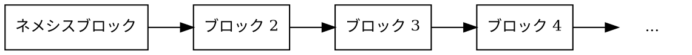

# ブロック

ブロック
:   ブロックとは、特定の時点で発生した[トランザクション](default:トランザクション)およびその他の「状態変更」をまとめて記録したものです。

状態変更とは、ブロックチェーン上のデータが更新されることを指します。
例えば、ある[アカウント](default:アカウント)から別のアカウントへの資金移動や、
新しい[モザイク](default:モザイク)の作成などです。

ブロックにはトランザクションに加えて、タイムスタンプや暗号学的な各種[ハッシュ](default:ハッシュ)などのメタデータが含まれ、
それぞれがブロックの整合性を保証します。
なかでも最も重要なのは「前のブロックのハッシュ」です。これは各ブロックを直前のブロックと結び付け、
チェーン全体の整合性を保証します。
この連結構造によって「ブロックチェーン」が成立します。

ブロックには、トランザクションの主目的以外に発生した副次的な影響を記録する
「レシート（receipt）」が含まれる場合もあります。

Symbol ネットワークでは、およそ３０秒ごとに新しいブロックが生成されます。

## ネメシスブロック

ネメシスブロック
:   Symbol ブロックチェーンにおける最初のブロック。
    他のすべてのブロックはネットワークの[コンセンサス](default:コンセンサス)によって作成されますが、
    ネメシスブロックだけはネットワークの立ち上げ時に手動で生成されます。

ネメシスブロックはブロックチェーンの初期状態を定義します。
ここには、特定のアカウントへの[XYM](default:モザイク)などの初期モザイク分配、
ネームスペースの作成、
ネットワークの動作に必要な各種パラメータが含まれます。

チェーンの起点であるため、ネメシスブロックには「前のブロックのハッシュ」が存在しません。
それ以外のすべてのブロックは、直接的または間接的にこのブロックへとつながります。

他のブロックチェーンでは、これに相当するものを一般的に「ジェネシスブロック」と呼びます。
Symbol では、その前身である NEM にちなみ「ネメシス（Nemesis）」という名称が使われています。

ネメシスブロック以降のすべてのブロックは、
Symbol におけるマイニングに相当する[ハーベスティング](default:ハーベスティング)と呼ばれるプロセスによって生成されます。
ハーベスターはトランザクションを検証し、それらをチェーンに追加し、
報酬としてトランザクション手数料を受け取ります。

## ブロック構造

Symbol の各ブロックは、メタデータとトランザクションデータの組み合わせで構成されます。

| **フィールド**             | **説明**                                                                                                                                                                           |
| -------------------------- | ---------------------------------------------------------------------------------------------------------------------------------------------------------------------------------- |
| **高�度（ハイト）**        | チェーン内でのブロックの位置。ネメシスブロックを １ とし、以降は１つ前のブロックより １ ずつ大きい値になります。これは[ネメシスブロック](default:ネメシスブロック)から始まります。 |
| **タイムスタンプ**         | ネメシスブロックからの経過ミリ秒。各ブロックで単調に増加します。ブロック間隔は平均で３０秒前後になるように維持されます。                                                           |
| **前のブロックのハッシュ** | １つ前のブロックの[ハッシュ](default:ハッシュ)。もしそのブロックの内容が改ざんされるとハッシュ値が変わり、チェーンが分断され、後続のブロックは無効になります。                     |
| **ステートハッシュ**       | ブロック内のトランザクション一覧、生成されたレシート、およびそれらの結果として得られる最終状態を要約した[ハッシュ](default:ハッシュ)。                                             |
| **手数料乗数**             | ブロックを収穫したハーベスターが設定する乗数で、ブロック内の各トランザクションのサイズ（バイト数）に基づき手数料を計算するために使用されます。                                     |
| **トランザクション**       | ブロックに含まれる有効なトランザクションの一覧。各トランザクションはブロックに取り込まれる前に個別に検証されます。                                                                 |
| **レシート**               | トランザクション自体に直接は記録されない内部的な状態変化を示す記録。ブロック処理の過程で自動的に生成されます。                                                                     |

## ブロックスコア

[コンセンサス](default:コンセンサス)の過程を支援するために、各ブロックには次の量が定義されます。

ブロックスコア
:   各ブロックに割り当てられる数値で、
    そのブロックがどれだけ「ハーベスティングしにくかったか」を表します。
    値が高いほど難易度が高いとみなされ、
    [フォーク](default:フォーク)発生時の判断において優先されます。

$$
\textit{block score} = difficulty − \textit{time elapsed since last block}
$$

チェーンスコア
:   一定期間に生成された全ブロックの[ブロックスコア](default:ブロックスコア)の合計。

## レシート

レシート
:   ブロック内で発生した状態変更のうち、そのブロックに含まれるトランザクションから
    直接は読み取れないものを記録したもの。

レシートは、元になったトランザクションを過去までさかのぼって探すことなく、
それらの副次的な影響を追跡しやすくします。

例えば、あるトランザクションがネームスペースを１年間リースしたとします。
１年後にそのネームスペースが期限切れになっても、新たなトランザクションは発行されません。
その代わりに、ネームスペースの有効期限切れを示す「ネームスペース期限切れ」レシートが、
そのタイミングのブロックに生成されます。

同様に、アカウントがハーベスティング報酬を得た場合、
報酬を送金するトランザクションは存在しません。
代わりに、そのアカウントの残高が直接増加し、
「残高変更」レシートがそのブロックに記録されます。

レシートはブロック内に含まれ、「トランザクションステートメント」と「リゾリューションステートメント」という
２種類に整理されます。

### トランザクションステートメント

トランザクションステートメントは、個々のトランザクションに関連するレシートをまとめたものです。
対象のトランザクションは同じブロック内に含まれている場合もあれば、
過去のブロックで処理されたものの場合もあります。

各レシートは、トランザクションの実行によって引き起こされた状態変更を表しますが、
その変更内容がトランザクション本体に直接エンコードされていない場合に使用されます。

Symbol のトランザクションステートメントには、次の基本的な種類があります。

* **残高変更**: アカウントの残高を調整します。
* **残高転送**: アカウント間で[モザイク](default:モザイク)を移動します。
* **モザイク有効期限切れ**: モザイクの有効期間が終了したことを示します。
* **ネームスペース有効期限切れ**: ネームスペースのリース期間が終了したことを示します。
* **インフレーション**: インフレーションによりネットワーク通貨モザイクが新規発行されたことを示します。

### リゾリューションステートメント

リゾリューションステートメントは、トランザクションの実行時に
[ネームスペース](default:ネームスペース)がどのように解決（リゾルブ）されたかを記録します。

Symbol では、ユーザーは[モザイク](default:モザイク)や[アドレス](default:アドレス)を、
人間が読みやすいエイリアスであるネームスペース名で参照できます。
しかし、トランザクションを実行する前に、これらのエイリアスは必ず元の実体
（実際のモザイク ID やアドレス）に変換されなければなりません。

リゾリューションステートメントは、ブロック内で使用された特定のエイリアスが、
実際にはどの値に解決されたかを記録します。
これは履歴データの解析に特に有用です。
なぜなら、エイリアスは後から更新・削除される可能性があるため、
過去の時点で「どこを指していたのか」を再現する必要があるからです。

リゾリューションステートメントには次の２種類があります。

* **アドレス解決**: ネームスペースがどの[アドレス](default:アドレス)に解決されたかを記録します。
* **モザイク解決**: ネームスペースがどの[モザイク ID](default:モザイク)に解決されたかを記録します。

トランザクションステートメントと同様に、リゾリューションステートメントも
ブロックのレシートハッシュに含まれ、改ざん検出性と検証可能性が保証されます。

### サポートされているレシートタイプ

| **レシート**               | **説明**                                                                                                                                                               |
| -------------------------- | ---------------------------------------------------------------------------------------------------------------------------------------------------------------------- |
| **コア**                   |                                                                                                                                                                        |
| `Harvest Fee`              | ブロックをハーベストした際に受け取った手数料の受取人・アカウント・金額。ブロックがハーベストされた時点で記録されます。                                                 |
| `Inflation`                | インフレーションにより新規発行されたネットワーク通貨[モザイク](default:モザイク)の量。新しいブロックによってインフレーションが発生したときに記録されます。             |
| `Transaction Group`        | 特定のソースに対して発生した一連の状態変更。状態変更レシートが発行される際に記録されます。                                                                             |
| `Address Alias Resolution` | 未解決エイリアスと、それが解決された[ネームスペース](default:ネームスペース)。トランザクションが[アドレス](default:アドレス)のエイリアスを使用した場合に記録されます。 |
| `Mosaic Alias Resolution`  | 未解決エイリアスと、それが解決された[ネームスペース](default:ネームスペース)。トランザクションが[モザイク](default:モザイク)のエイリアスを使用した場合に記録されます。 |
| **モザイク**               |                                                                                                                                                                        |
| `Mosaic Expired`           | このブロックで有効期限切れとなった[モザイク](default:モザイク)の識別子。モザイクの有効期間が終了した際に記録されます。                                                 |
| `Mosaic Rental Fee`        | モザイク登録時に発生するコストを示す送信者・受信者・金額。モザイクを登録したときに記録されます。                                                                       |
| **ネームスペース**         |                                                                                                                                                                        |
| `Namespace Expired`        | このブロックで有効期限切れとなった[ネームスペース](default:ネームスペース)の識別子。ネームスペースのリース期間が終了したときに記録されます。                           |
| `Namespace Deleted`        | このブロックで削除された[ネームスペース](default:ネームスペース)の識別子。期限切れになったネームスペースの猶予期間が終了したときに記録されます。                       |
| `Namespace Rental Fee`     | ネームスペースの登録または更新（リース延長）に関連する送信者・受信者・コスト。[ネームスペース](default:ネームスペース)の登録時または更新時に記録されます。             |
| **HashLock**               |                                                                                                                                                                        |
| `LockHash Created`         | 有効な `HashLockTransaction` がアナウンスされた際にロックされたモザイク ID と数量、および送信者。                                                                      |
| `LockHash Completed`       | 対応する `AggregateBondedTransaction` が完了した結果として返還されたモザイク ID と数量、および送信者。                                                                 |
| `LockHash Expired`         | ハッシュロックが期限切れになった際に返還されたモザイク ID と数量、および受取人。                                                                                       |
| **SecretLock**             |                                                                                                                                                                        |
| `LockSecret Created`       | 有効な `SecretLockTransaction` がアナウンスされた際にロックされたモザイク ID と数量、および送信者。                                                                    |
| `LockSecret Completed`     | シークレットが正しく開示された結果として転送されたモザイク ID と数量、および受取人。                                                                                   |
| `LockSecret Expired`       | シークレットロックが期限切れになった際に返還されたモザイク ID と数量、および受取人。                                                                                   |

