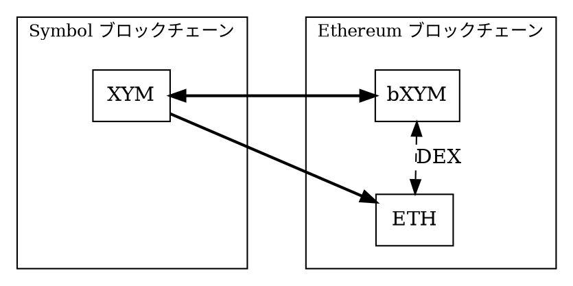
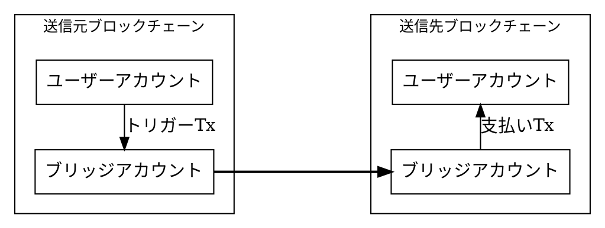
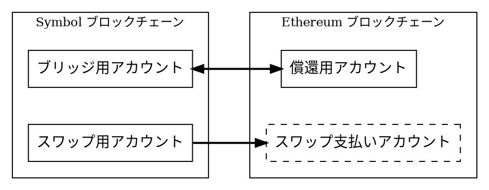

# Symbol から Ethereum へのブリッジ

このページでは、<XYM:> を
[Ethereum ブロックチェーン](https://ethereum.org)上の _Bridged XYM_（`bXYM`）と呼ばれる
[ERC-20](https://ethereum.org/developers/docs/standards/tokens/erc-20/) トークンとして移動したり、
`XYM` を Ethereum のネイティブ通貨 <ETH:> に変換したりするための Symbol Bridge の概念を説明します。

[クロスチェーンスワップ](./cross-chain-swaps.md)はユーザー間のトラストレスな交換を調整しますが、
Symbol Bridge は The Symbol Syndicate が運営する中央集権型のサービスです。
一方のブロックチェーン上の入金を監視し、もう一方のブロックチェーン上で対応する支払いを行います。

ブリッジの実装は [オープンソース](https://github.com/symbol/product/blob/dev/bridge) として公開されています。

ブリッジが直接サポートするワークフローは次の通りです。

* **ブリッジ**: `XYM` → `bXYM`
* **償還**: `bXYM` → `XYM`
* **スワップ**: `XYM` → `ETH`

`bXYM` と `ETH` はどちらも Ethereum ネットワーク上に存在するため、ブリッジを使わずに
[Uniswap](https://uniswap.org) のような一般的な <DEX:> で交換できます。
そのため、`ETH` は `bXYM` を経由して `XYM` に変換できます。

## ブリッジが必要な理由 {: #why-bridges-are-needed }

トークンは、それが作成されたブロックチェーンに属します。
例えば <XYM:> は Symbol 上に存在し、Symbol の [トランザクション](default:トランザクション) で転送できます。
Ethereum ノードは Symbol トランザクションを処理せず、Symbol ノードも Ethereum トランザクションを処理しないため、
`XYM` を Ethereum アカウントへ直接送ることはできません。

ブリッジは、両方のネットワーク上の動作を調整します。
一方のブロックチェーンでトークンを受け取り、リクエストを検証し、もう一方のブロックチェーンで対応するトークンを送信します。
これは2つのブロックチェーンが1つの台帳を共有するという意味ではありません。

## ブリッジアカウント {: #bridge-accounts }

ブリッジは、接続する両方のネットワーク上にアカウントを持ちます。
ユーザーはトークンをネットワーク間で直接送るのではありません。
代わりに、送信元ネットワーク上のブリッジアカウントへトークンを送り、支払いを受け取る送信先ネットワーク上のアドレスを指定します。

ブリッジは、自身のアカウントへのリクエストを監視します。
有効なリクエスト（後述の[無効なリクエスト](#invalid-requests-and-limits)を参照）が見つかると、
もう一方のネットワーク上のアカウントから対応する支払いを行います。
このため、支払い側のアカウントには、リクエストを満たすための十分なトークンと、ネットワーク手数料を支払うための十分なネイティブ通貨が必要です。

ブリッジは通常のブロックチェーンアカウントとトランザクションを通じて動作するため、
Symbol や Ethereum のコンセンサスプロトコルの一部ではありません。
一方のチェーンを監視し、もう一方のチェーンへトランザクションを送信するオフチェーンのサービスです。

ブリッジは、すべてのワークフローを処理するために4つのアカウントを使用します。

スワップ支払いアカウントを除くいずれかのアカウントへ転送すると、後述のワークフローが開始されます。

!!! warning "スワップ支払いアカウントへ資金を送らないでください"

    このアカウントは、スワップ後に Ethereum ネットワーク上でユーザーへ支払うためだけに存在します。
    このアカウントへ送金された資金は回収できません。

## Bridged XYM {: #bridged-xym }

Bridged XYM（`bXYM`）は、Symbol 上でブリッジが保持する `XYM` の持分を表す Ethereum 上の
[ERC-20](https://ethereum.org/developers/docs/standards/tokens/erc-20/) トークンです。
別のネットワーク上で `XYM` を表すという点ではラップトークンに似ていますが、変換レートは固定されていません。

言い換えると、`bXYM` は、ブリッジが保持するネイティブトークンと、そのトークンを保持している間に発生した報酬を含む、
比例的な所有権を表します。

ユーザーが `XYM` をブリッジする場合、Symbol 上のブリッジ用アカウントへ `XYM` を送り、
Ethereum 上で `bXYM` を受け取ります。
ユーザーが `bXYM` を償還する（つまり「アンブリッジ」する）場合、Ethereum 上の償還用アカウントへ `bXYM` を送り、
Symbol 上で `XYM` を受け取ります。

ブリッジの Symbol アカウントは、例えば [ハーベスティング](default:ハーベスティング) を通じて追加の `XYM` を獲得できます。
この場合、ブリッジが保持する `XYM` の総量は増加しますが、既存の `bXYM` の量は変わりません。
その結果、各 `bXYM` は、以前よりわずかに多い `XYM` に対する請求権を表すようになります。

例えば、発行済みの `bXYM` が 1'000、ブリッジアカウント内の `XYM` が 1'000 の場合、
両方のトークンは実質的に 1:1 のレートです。
その後ブリッジアカウントが追加で 500 `XYM` を獲得すると、同じ発行済み `bXYM` が 1'500 `XYM` に対する請求権を表します。
この時点で償還すると、以前より多くの `XYM` を `bXYM` あたりで受け取れます。

この変換レートは手数料が差し引かれる前に適用されるため、ユーザーが最終的に受け取る量とは正確には一致しません。
詳しくは、後述の[手数料と受取額](#fees-and-payout-amounts)を参照してください。

!!! note "補足"

    * ブリッジと償還以外で、ブリッジが保持する `XYM` の量を変化させる操作は、
        ハーベスティングと[寄付](#invalid-requests-and-limits)だけです。

        これらの操作はブリッジの残高を _増やす_ だけなので、通常 `bXYM` は `XYM` より価値が高くなり、
        1 `XYM` をブリッジすると、受け取る `bXYM` は 1 `bXYM` 未満になります。

    * `XYM` と `bXYM` の変換レートは、DEX 上の `bXYM` の市場価格とは別のものです。
        DEX 上の市場価格は流動性と取引活動に依存します。

        [アービトラージ](default:アービトラージ) は DEX 価格が償還価値を追跡する助けになりますが、
        ブリッジはその市場価格を制御または保証しません。

## プロセス {: #process }

ブリッジリクエストには、概念的に5つの段階があります。
ユーザーが開始する必要があるのは最初の段階だけで、その後は自動的に進行します。

1. **入金**

    ユーザーは、実行したい操作（ブリッジ、償還、スワップ）を扱う送信元ネットワーク上のブリッジアカウントへトークンを送ります。
    トランザクションには、送信先ネットワーク上の宛先アドレスを含めます。

2. **検出**

    ブリッジは送信元ネットワークを監視し、受信トランザクションを検出します。
    例えば、期待されるトークンが転送されていることや、有効な宛先アドレスが含まれていることを確認し、
    リクエストが有効かどうかを検証します。

3. **ファイナリティ**

    ブリッジは、送信元トランザクションが十分に [ファイナル](default:ファイナライズ) とみなされるまで待機します。
    後述の[ファイナリティと処理時間](#finality-and-processing-time)を参照してください。

4. **変換**

    ブリッジは、選択された操作に基づき、必要に応じて外部の価格プロバイダーを使用して支払額を計算します。
    また、ネットワーク手数料と、運営者が設定したブリッジ手数料も考慮します。
    後述の[手数料と受取額](#fees-and-payout-amounts)を参照してください。

5. **支払い**

    ブリッジは送信先ネットワーク上でトランザクションを送信し、変換されたトークンを指定された宛先アドレスへ送ります。
    その後、その送信トランザクションがファイナルになるまで追跡します。

## ワークフロー {: #workflows }

Symbol モバイルウォレットのようなアプリケーションは、上記の手順を処理し、次のワークフロー向けに簡略化されたユーザーインターフェイスを提供します。

!!! warning "無効なリクエストは返金されません"

    [無効なトランザクション](#invalid-requests-and-limits)は返金されないため、
    ブリッジアカウントへ直接送金するのではなく、アプリケーションを通じてブリッジを使用することを強く推奨します。

### `XYM` から `bXYM` へのブリッジ {: #bridging-xym-to-bxym }

ユーザーは Symbol 上で標準の [転送トランザクション](default:転送トランザクション) をアナウンスし、次のように設定して処理を開始します。

* **トランザクションの受取人**: Symbol 上のブリッジ用アカウントのアドレス。
* **転送するモザイク**: `XYM`。
* **トランザクション** [メッセージ](./transfer_transactions.md#optional-message):
    `bXYM` を受け取る **Ethereum 上** のアカウントの暗号化されていないアドレス。

ブリッジサービスは転送を検出し、上記のプロセスを開始します。

### `bXYM` から `XYM` への償還 {: #redeeming-bxym-to-xym }

ユーザーは Ethereum 上でトランザクションを送信し、次のように設定して処理を開始します。

* **トランザクションの受取人**: Ethereum 上の償還用アカウントのアドレス。
* **転送するトークン**: `bXYM`。
* **追加トランザクションデータ**: `XYM` を受け取る **Symbol 上** のアカウントのアドレス。

ブリッジサービスは転送を検出し、上記のプロセスを開始します。

### `XYM` から `ETH` へのスワップ {: #swapping-xym-to-eth }

ユーザーは Symbol 上で標準の [転送トランザクション](default:転送トランザクション) をアナウンスし、次のように設定して処理を開始します。

* **トランザクションの受取人**: Symbol 上のスワップ用アカウントのアドレス。
* **転送するモザイク**: `XYM`。
* **トランザクション** [メッセージ](./transfer_transactions.md#optional-message):
    `ETH` を受け取る **Ethereum 上** のアカウントの暗号化されていないアドレス。

ブリッジサービスは転送を検出し、上記のプロセスを開始します。

### `ETH` から `XYM` への戻し方 {: #swapping-back-eth-to-xym }

このワークフローはブリッジでは直接サポートされていませんが、次の2つの手順で行えます。

1. <DEX:> を使って `ETH` を `bXYM` にスワップします。

    The Symbol Syndicate は、この目的のために [Uniswap](https://uniswap.org) プールを維持しています。

2. 上記の償還ワークフローを使って、`bXYM` を `XYM` に償還します。

## 手数料と受取額 {: #fees-and-payout-amounts }

ブリッジリクエストでは、入金額以外にもコストが発生します。
ユーザーはリクエスト送信時に送信元ネットワークのトランザクション手数料を支払い、
ブリッジは支払い時に送信先ネットワークのトランザクション手数料を支払います。
ブリッジは、次の方法でその送信先ネットワークの手数料を受取額から差し引きます。

| 操作 | 手数料の扱い |
| --- | --- |
| ブリッジ | ブリッジは支払いトランザクション手数料を `ETH` で支払い、価格プロバイダーを使ってその `bXYM` 建て価値を推定し、受取額から差し引きます。 |
| 償還 | ブリッジは支払いトランザクション手数料を `XYM` で支払い、それを受取額から直接差し引きます。 |
| スワップ | ブリッジは支払いトランザクション手数料を `ETH` で支払い、それを受取額から直接差し引きます。 |

設定によっては、ブリッジが変換手数料を請求する場合もあります。
この手数料はブロックチェーンのトランザクション手数料とは別のものです。

## ファイナリティと処理時間 {: #finality-and-processing-time }

ブリッジは、トランザクションが最初に現れた瞬間には処理しません。
代わりに、送信元ネットワーク上でそのトランザクションが十分に [ファイナル](default:ファイナライズ) とみなされるまで待機します。
これにより、まだロールバックや置き換えが起こり得るトランザクションに対してブリッジが処理してしまうことを防ぎます。

処理時間は、いくつかの要因に依存します。

* 各ネットワークのブロック生成時間。
* 各ネットワークで使われるファイナリティのルール。
* 支払いネットワークの混雑状況とトランザクション手数料。

そのため、両方のブロックチェーンが正常に動作している場合でも、ブリッジリクエストは即時には完了しません。

!!! note

    ブリッジは <スリッページ:> 保護を提供しないため、受け取る量は変動する可能性があります。

## 無効なリクエストと制限 {: #invalid-requests-and-limits }

ブリッジは、選択されたワークフローのルールに一致するリクエストのみを処理できます。
通常、リクエストでは、正しいブリッジアカウントへ期待されるトークンを送り、
送信先ネットワークの有効な宛先アドレスを含める必要があります。

!!! warning "無効なリクエストは返金されません"

    誤ったブリッジアカウントへの転送、サポートされていないトークンの送信、宛先アドレスの省略、
    メッセージの暗号化、または設定された制限を超える転送は処理されません。
    その資金はブリッジアカウントに残り、_寄付_ として扱われます。

Symbol モバイルウォレットのようなアプリケーションは、リクエスト送信前に通常のチェックを行い、このリスクを最小限に抑えます。

ブリッジのアカウントへ直接トランザクションを送信して手動で利用する場合、
サポートされるトークン、方向、宛先アドレスの形式、手数料、制限を必ず確認してからリクエストを送信してください。

## 信頼モデルと責任 {: #trust-model-and-responsibilities }

ブリッジは、ブロックチェーンプロトコルの外部で運営されるサービスです。
アカウントを管理し、トランザクションを監視し、支払額を計算し、送信トランザクションへ署名します。
したがってユーザーは、ブリッジ運営者がサービスを正しく運用し、十分な流動性を維持し、署名鍵を保護し、
無効または遅延したリクエストを責任を持って扱うことを信頼する必要があります。

ブリッジは、次の外部サービスにも依存します。

* 交換レートを計算するための価格プロバイダー。
* ブロックチェーンの状態を読み取るためのネットワーク [API ノード](default:API ノード)。
* 進捗を表示するためのブロックエクスプローラーやステータス API。

これらの依存先に問題があると、ブリッジの運用が遅延または中断する可能性があります。

つまり、ブリッジは Symbol そのものとは別に評価する必要があります。
Symbol がユーザーの入金を正しくファイナルにしても、その入金を検出し、もう一方のネットワーク上で支払いを完了する責任は
引き続きブリッジ運営者にあります。
