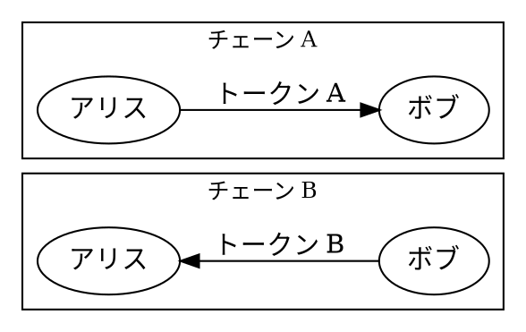

# クロスチェーンスワップ

クロスチェーンスワップ
:   クロスチェーンスワップは、仲介者（例: 中央集権型取引所など）に依存することなく、異なるブロックチェーン間でトラストレスにトークンを取引することを可能にします。

テクノロジーの異なるブロックチェーン間では、トークンを直接転送できないため、各チェーンで別々に転送を行います。

クロスチェーンスワッププロトコルは、両方の転送が成功するか、どちらも成功しないかのいずれかであることを保証します。

これは概念的には [アグリゲートトランザクション](default:アグリゲートトランザクション) に似ていますが、1つのブロックチェーン内で操作をグループ化するのではなく、スワップは2つの独立したチェーン間での操作を調整します。

## プロトコル {: #Protocol }

Symbolでのクロスチェーンスワップは、HTLCプロトコルを使用して実装できます。

HTLC
:   [Hashed Time-Lock Contract](https://en.bitcoin.it/wiki/Hash_Time_Locked_Contracts)。
    [ハッシュロック](default:ハッシュロック)（秘密の証明を公開することでのみ資金を請求できる）と [タイムロック](default:タイムロック)（期限までに請求されない場合は資金が返金される）を組み合わせて、当事者間のトラストレスな交換を可能にするプロトコルです。

### 仕組み {: #how-it-works }

HTLCは2つのロックメカニズムに依存しています。

ハッシュロック
:   誰かが特定の秘密（*証明*）を明かすまで資金をロックする仕組み。
    ロックには証明の暗号学的 [ハッシュ](default:ハッシュ) が保存されるため、資金を引き出すには証明をチェーン上に公開されることになる。

タイムロック
:   特定の時間またはブロック高に達するまで資金をロックする仕組み。

クロスチェーンスワップにおける重要な点は、両方のチェーンで**同じハッシュロック**が使用されることです。
開始者は、ハッシュロックを使用して一方のチェーン上でトークンをロックするため、証明が公開されるまで転送は完了しません。
相手方は、同じハッシュロックを使用してもう一方のチェーン上でトークンをロックします。
相手方のトークンを引き出すには、開始者が証明を公開する必要があります。これにより、相手方はその証明を使用して開始者のトークンを引き出し、スワップを完了できます。

タイムロックは、どちらの当事者も相手をだますことができないように設定する必要があります（以下の[安全上の考慮事項](#safety-considerations)を参照してください）。

### Symbolにおける実装 {: #in-symbol }

Symbolでは、`Secret Lock`と呼ばれるトランザクションタイプを提供しています。これは、単一の操作でトークン（Symbolにおける[モザイク](default:モザイク)）にハッシュロックとタイムロックの両方を設定し、ハッシュアルゴリズムと受取人を指定するものです。これに対応する`Secret Proof`トランザクションは、ハッシュロックと一致する証明を提示することで、それらのロックを解除します。

受信者がタイムロックの期限切れ前に引き出さない場合、ロックされたトークンは自動的に送信者に返還されます。
個別の返金トランザクションは必要ありません。

タイムロックの最大有効期間は365日です。

### 他のチェーンとの互換性 {: #compatibility-with-other-chains }

Symbolとスワップを行うには、もう一方のチェーンが、Symbolがサポートするハッシュアルゴリズムと互換性のある同等のHTLCメカニズムをサポートしている必要があります。

| アルゴリズム | 説明                                                                                                                                     |
|------------|-------------------------------------------------------------------------------------------------------------------------------------------------|
| `SHA3_256` | 証明は[SHA-3 256](https://en.wikipedia.org/wiki/SHA-3)でハッシュ化されます。                                                                      |
| `HASH_160` | 証明は最初に[SHA-256](https://en.wikipedia.org/wiki/SHA-2)でハッシュ化され、次に[RIPEMD-160](https://en.wikipedia.org/wiki/RIPEMD)でハッシュ化されます。 |
| `HASH_256` | 証明は[SHA-256](https://en.wikipedia.org/wiki/SHA-2)で2回ハッシュ化されます。                                                                  |

例：

* ビットコインは、 `OP_HASH160` と `OP_HASH256` を通じてHTLCをネイティブにサポートしています。
* イーサリアムのHTLCスマートコントラクトは、組み込みのSHA-256関数とRIPEMD-160関数を使用して実装できます。

## 例 {: #example }

アリスとボブは、このページの上部にある概要図のシナリオに従って、チェーンAとチェーンBという2つの異なるブロックチェーン間でトークンを交換したいと考えています。

* アリスはチェーンAで `トークンA` を保持しており、ボブの `トークンB` を欲しがっています。
* ボブはチェーンBで `トークンB` を保持しており、アリスの `トークンA` を欲しがっています。

アリスもボブも両方のチェーンにアカウントを持っているため、どちら側でも送受信できます。

スワップは4つのステップで進行します。

1. **アリスがチェーンA上でトークンをロックする:** アリスはチェーンAでボブへの `Token A` （トークンA）の転送を開始しますが、証明が公開されるまで転送が完了しないようにロックします。
    彼女はランダムな証明を生成し、そのハッシュを計算し、ボブを受信者として指定し、[タイムロック](default:タイムロック) を設定した [ハッシュロック](default:ハッシュロック) を作成します。
2. **ボブがチェーンB上でトークンをロックする:** ボブはチェーンA上のアリスの転送からハッシュロックを読み取り、チェーンBで自身が保有する `Token B` （トークンB）の転送を開始し、**同じハッシュロック**でロックしてアリスを受信者として指定します。
    ボブのタイムロックは、チェーンAのアリスのタイムロック**より前**に期限切れになる必要があります（[タイムロックの順序](#timelock-ordering)を参照）。
3. **アリスがチェーンBで請求する:** アリスはチェーンBで証明を公開してボブの転送を完了、 `Token B` を受け取ります。
4. **ボブがチェーンAで請求する:** ボブはチェーンB上で証明を読み取り、それを使用してチェーンAでアリスの転送を完了し、 `Token A` を受け取ります。

    ボブは証明が公開されるとすぐに請求できることに注意してください。
    彼は図に示されているように、Symbolでのタイムロックが期限切れになるのを待つ必要はありません。

タイムロックが正しく設定されていれば、プロトコルはすべての参加者がスワップの自分の分を受け取るための公平な機会を持つことを保証します。

| シナリオ                                        | 結果                                                                                           |
|-------------------------------------------------|---------------------------------------------------------------------------------------------------|
| ボブがトークンをロックしない                        | アリスのトークンは、チェーンAでの彼女のタイムロックが期限切れになった後に返金されます。                                |
| アリスが証明を公開しない                     | ボブのトークンは、彼のタイムロックが期限切れになると返金されます。アリスのトークンも後で返金されます。      |
| アリスが証明を公開し、ボブが時間内に請求する         | アリスはボブのトークンを取得します。ボブはアリスのタイムロックが期限切れになる前にアリスのトークンを請求できます。                |
| アリスが証明を公開し、ボブが時間内に請求しない | **ボブにとって最悪のケース**。アリスはボブのトークンを保持し、彼女のタイムロックが期限切れになったときに自分自身のトークンを取り戻します。 |

タイムロックを正しく設定する方法の詳細については、[安全上の考慮事項](#safety-considerations)を参照してください。

## 安全上の考慮事項 {: #safety-considerations }

クロスチェーンスワップは、双方が互いのロックを検証し、タイムロックが正しく設定され、各当事者が適切な確認数を待ち、双方が公開された証明が自分たちに対してどのように悪用される可能性があるかを理解している場合にのみ安全です。

以下のセクションでは、わかりやすくするためにアリスとボブの[例](#example)を使用して、これらの各懸念事項について説明します。

### ロックの検証 {: #lock-verification }

もう一方の当事者のロックに対して行動を起こす前に、各当事者はロックが合意された内容と一致していることを検証する必要があります。
このチェックを行わずに盲目的にプロトコルに従うと、カウンターパーティは間違った金額、トークン、ハッシュロック、受信者、または有効期限のロックを投稿することで不正を行うことができます。

各当事者は以下を検証する必要があります。

* **金額とトークン:** ロックには、合意されたトークンの予想される数量が保持されています。
* **ハッシュロック:** ロックでは合意されたハッシュロック（両方のチェーンで同じ値）が使用されています。
* **受信者:** ロックでは正しい受信者が指定されています。
* **タイムロック:** 有効期限は合意された順序に従っています（[タイムロックの順序](#timelock-ordering)および[タイムロックの差分](#timelock-difference)を参照）。

実際には：

* **ボブがロックする前**（ステップ2）に、ボブはチェーンAでのアリスのロックを検証します。
* **アリスが証明を公開する前**（ステップ3）に、アリスはチェーンBでのボブのロックを検証します。

いずれかのチェックが失敗した場合、当事者は続行を拒否する必要があります。
その場合、アリスは自身のタイムロックが期限切れになるのを待ってトークンの返金を受けることができ、その時点でボブはまだ資金をロックしていません。

### タイムロックの順序 {: #timelock-ordering }

アリスはスワップの開始者です。
アリスは最初から証明を知っているため、それが最初に公開されるタイミングを制御します。

この理由から、ボブのタイムロックはアリスのタイムロックより前に期限切れになる必要があります。
そうしないと、アリスは自分のトークンを回収するまで待ち、それでもボブのトークンを請求するのに間に合うように証明を公開できることになります。

### タイムロックの差分 {: #timelock-difference }

ボブのタイムロックの有効期限とアリスのタイムロックの有効期限の差は、ボブがチェーンBで証明を検出し、チェーンAで請求を送信し、承認を得るのに**十分な大きさ**でなければなりません。

最悪の場合、アリスはボブのロックが期限切れになる直前に証明を公開し、ボブには反応するためのわずかな残り時間しか与えられません。

必要なマージンには以下を考慮する必要があります。

* 両方のチェーンでの**ファイナライズ期間**（以下の[ファイナリティ](#finality)を参照）。
* ボブがチェーンBで証明を検出するための**観察時間**。
* チェーンAでの**トランザクションの送信と承認の時間**。
* ボブの請求トランザクションが最初にネットワークに受け入れられなかった場合の**再送信の可能性**。

ボブが許容期間が短すぎると判断した場合は、スワップを拒否し、チェーンAでより長いタイムロックを使用するようアリスに要求できます。

上記の例の[タイミング図](#example)を参照してください。

### 証明の遅延公開 {: #late-proof-revelation }

アリスはボブのタイムロックが期限切れになる十分に前に証明を公開する必要があります。

彼女がぎりぎりまで待ち、チェーンBでの彼女の請求トランザクションが時間内に承認されなかった場合、証明はすでに公開されているのにボブはチェーンBで返金を受ける可能性があります。

そうすると、ボブはその証明を使用してチェーンAでアリスのトークンを請求でき、アリスには何も残りません。

### ファイナリティ {: #finality }

各当事者は、次のステップに進む前に、前のステップのトランザクションがチェーン上で [ファイナライズ](default:ファイナライズ) されるのを待たなければなりません。

特に、アリスの _ロック_（ステップ1）はボブがロックする前にファイナライズされている必要があり、ボブのロック（ステップ2）はアリスが証明を公開する前にファイナライズされている必要があります。
いずれかの時点での [ロールバック](default:ロールバック) は、もう一方の当事者がすでに行動を起こした後にロックを削除してしまう可能性があります。

一方、_請求_ トランザクション（ステップ3または4）がロールバックされた場合、タイムロックが期限切れになっていない限り、当事者は再送信できます。

### フロントランニングのリスク {: #front-ｒunning-risk }

アリスがチェーンBで証明を公開すると（ステップ3）、トランザクションが承認される前に証明が [未承認トランザクションプール](default:未承認トランザクションプール
) に表示される可能性があります。
チェーンBの監視者は証明を抽出し、意図された受信者が請求する前にどちらかのチェーンで資金を請求しようとする可能性があります。

Symbolでは、誰でも証明を送信できますが、資金は常にロックで指定された受信者に送信されるため、このリスクは排除されます。
もう一方のチェーンのHTLC実装も、この攻撃を防ぐために受信者のみの請求を強制する必要があります。
クロスチェーンスワップにHTLCコントラクトを使用する前に、これを確認してください。

アリスの証明トランザクションの承認が失敗した場合でも、証明はすでに公開されています。
これはプロトコルを破るものではありません。アリスはチェーンBで再送信でき、ボブは公開された証明をチェーンAで使用できます。
それぞれのタイムロックが期限切れになっていない限り、双方は引き続き資金を請求できます。
