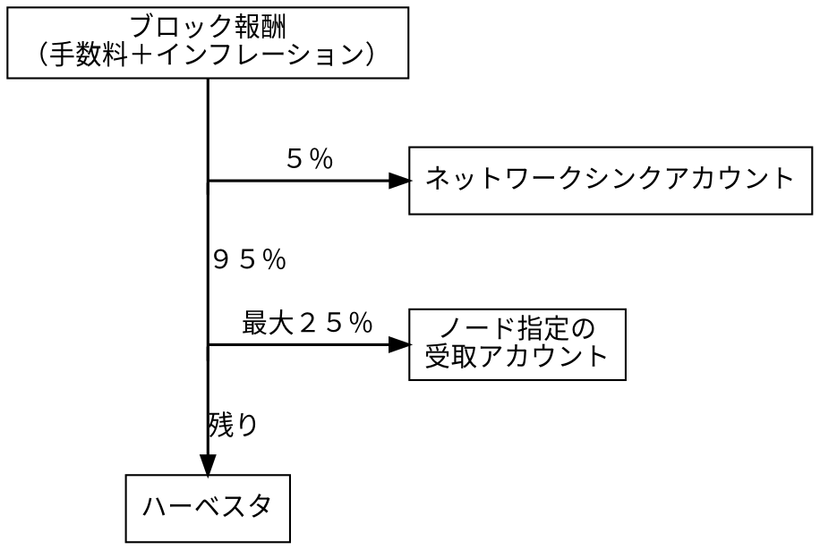

# ハーベスティング

ハーベスティング
:   Symbol が新しい [ブロック](default:ブロック) をチェーンに追加し、参加する
    [アカウント](default:アカウント) に報酬を分配するプロセス。
    <PoW:> におけるマイニング、または <PoS:> におけるステーキングに相当する役割を持つ。

各ブロックは単一のランダムな [ノード](default:ノード) により生成され、そのノードの「ハーベスタアカウント」によって署名される。
このアカウントはノードのメインアカウント、またはその [デリゲータ](default:デリゲータ) のいずれかである。

ブロックに含まれる [トランザクション](default:トランザクション) からの手数料と、
一部の [インフレーション](default:インフレーション) は、ハーベスタアカウントおよび
ノード運営者が指定した他のアカウントに分配される。
これらにはノードのメインアカウントが含まれる場合もあれば、含まれない場合もある。

<PoW:> のマイニングと異なり、ハーベスティングには専用ハードウェアは不要である。
参加条件は、少なくとも１０，０００ XYM を保有し、ノードに直接または委任経由で接続しているアカウントであること。
この残高はアカウントの [インポータンス](default:インポータンス) スコアに寄与し、
そのスコアがブロックをどれくらいの頻度でハーベストできるかを決定する。

## ハーベスティングの仕組み

Symbol は次のブロックをどのノードがハーベストするかを明示的に選出する方式を使用しない。
代わりに、すべてのノードが自分のメインアカウントおよびリンクされた
[デリゲータ](default:デリゲータ) アカウントそれぞれについて、独立に新しいブロックの生成を試みる。

そのために、まず各アカウントの [インポータンス](default:インポータンス) を主な要素として
「ターゲット値」が計算される。
インポータンスが高いほどターゲット値も高くなる。

ノードは次に、[未承認トランザクションプール](default:未承認トランザクションプール) から
トランザクションを収集してブロック候補を組み立て、ハーベスティング報酬の送付先を設定された受取人に割り当てる。
ブロックが組み上がると、ノードはそのブロックにハッシュを計算し、
「ヒット値」と呼ばれる乱数を生成する。

ヒット値がターゲット値より小さい場合、そのブロックは有効とみなされ、ネットワーク全体にアナウンスされる。
他のノードはそのブロックを検証し、次を確認する。

* 含まれるトランザクションが有効であること。
* ターゲット値およびヒット値が正しく計算されていること。
* ヒット値が実際にターゲット値より小さいこと。

これらのいずれかが満たされない場合、他のノードは新しいブロックを単に無視する。
[コンセンサス](default:コンセンサス) の仕組みにより、ネットワークの大多数が受け入れたブロックが
最終的に採用される。

ブロックが有効であれば、他のノードはそれをチェーンの一部として受け入れ、自身のコピーに追加する。
このプロセスは次のブロック高でも繰り返される。

!!! info "同時ブロック生成"
    特定のブロック高で複数のノードが同時にブロックを生成することを防ぐ特別な仕組みは存在しない。
    その場合、チェーン上の同じ位置に異なるブロックが現れるため、ネットワークは一時的に
    [フォーク](default:フォーク) する可能性がある。

    これらの競合は、ノード同士が互いのブロックを認識するにつれて
    [コンセンサス](default:コンセンサス) によって解決される。

??? abstract "ターゲット値とヒット値の計算"

    * **ターゲット値** は各ノードが独立して計算し、特定のアカウントで次のブロックを
        ハーベストできる見込みを表す。
        主に次の３つの要素に依存する。

        * アカウントの [インポータンス](default:インポータンス) スコア：
            より活発で資金量の多いアカウントほど、より頻繁にハーベストできる。
        * ネットワーク全体の「難易度」：
            直近のブロック生成時間に基づいて動的に調整され、一定の生成速度を維持する。
        * 直前のブロックから経過した「時間」：
            時間が長いほど新しいブロックが生成される確率が高まる。

    * **ヒット値** は、新しいブロックの内容とアカウントの [VRF キー](default:VRF キー)
        から導かれる乱数であり、事前に予測することはできない。

        VRF キーが無ければ、攻撃者は次にどのノードがブロックを生成しそうかを予測し、
        例えば <DoS:> 攻撃によってそのノードを検閲しようと試みる可能性がある。

    ブロックが有効となるには、そのノードで計算されたターゲット値がヒット値よりも
    **大きい** 必要がある。
    インポータンスが高いほど、または前回のブロックからの経過時間が長いほど、
    ターゲット値は大きくなり、この条件を満たしやすくなる。

## ハーベスティング方法

ノード運営者は、望むシンプルさとセキュリティのバランスに応じて
[ローカルハーベスティング](#_3)または [リモートハーベスティング](#_4)を有効化して参加できる。
ノードを運営していないアカウントでも、残高要件を満たしていれば
[デリゲートハーベスティング](#_5) を通じてノードにリンクし、
報酬を分け合うことができる。

### ローカルハーベスティング

ローカルハーベスティング
:   ハーベスティングの一種で、報酬が直接ハーベスタアカウントに送られる方式。
    ノードは運営者の「メインキー」を使って生成したブロックに署名する。
    このキーはノードのマシン上に保管される必要がある。

!!! warning "注意"
    ハーベスタアカウントは高い [インポータンス](default:インポータンス) スコアを保つために、
    相応の残高を保持する必要がある。
    常時オンラインのマシン上にその [秘密キー](default:秘密キー) を保存すると、
    何らかの不正アクセスがあった場合に、その残高全体が危険にさらされる。

ローカルハーベスティングは設定が分かりやすいが、上記のセキュリティリスクがあるため、
公開ノードにはあまり適していない。
そのため多くの運営者はリモートハーベスティングを好む。

### リモートハーベスティング

リモートハーベスティング
:   ハーベスティングの一種で、ブロック署名を別の「プロキシアカウント」に委任する方式。
    一方でノードの [インポータンス](default:インポータンス) と報酬は
    依然として運営者の「メインキー」に結び付いたままである。

プロキシアカウントは資金を保持せず、メインアカウントの代わりにブロックへ署名するためだけに存在する。
その [秘密キー](default:秘密キー) は常時オンラインのマシン上にあるノード設定ファイルに保存されるため、
失っても構わないものとして設計されている。

メインアカウントは引き続きノードのインポータンスを決定し、ブロック報酬を受け取る。
しかしそのキー自体はオフラインのままで、漏えいリスクを避けられる。
便宜上、ブロックに署名するのがプロキシアカウントであっても、
メインアカウントはハーベスタアカウントと呼ばれる。

この役割分離により、ハーベスタの資産は高い安全性を得られるため、
リモートハーベスティングは多くの運営者が選好する方式となっている。

### デリゲートハーベスティング

デリゲートハーベスティング
:   ノードを運営していないが条件を満たすアカウントが、外部のノードにハーベスティング業務を委任できる
    ハーベスティングの形態。
    アカウントの [インポータンス](default:インポータンス) スコアが使用され、
    収集された手数料は、そのアカウントとノード側で設定された受取人との間で分配される。

このようなアカウントは、実際のブロック署名はノードのプロキシアカウントが行っていても、
「デリゲータ」または「委任ハーベスタ」と呼ばれる。

デリゲータ
:   [デリゲートハーベスティング](default:デリゲートハーベスティング) を通じて
    自身のハーベスティングをサードパーティノードに委任しつつ、
    自身の [インポータンス](default:インポータンス) を維持し、
    ハーベスト報酬の一部を受け取るアカウント。
    「委任ハーベスタ」とも呼ばれる。

実際に作業を行うのはノードであるが、ハーベスタとして扱われるのは依然としてデリゲータである。
この仕組みは双方に有益である。
アカウント側はノードを運営せずに報酬を得られ、
ノード側は自分自身のインポータンスだけに依存せずにブロック生成（および手数料収集）の機会を増やせる。

デリゲートハーベスティングはリモートハーベスティングと同じプロキシ方式を使用する。
デリゲータは暗号化メッセージ付きの [転送トランザクション](default:転送トランザクション) に署名し、
ノードに対して自分の代わりにハーベストするよう依頼する。

ノードがその依頼を受け入れるかどうかは、ノード側の方針や他の競合する依頼内容によって決まる。

リモートハーベスティングと同様に、ブロック署名はデリゲータ本人とは別のアカウントが行うため、
デリゲータの [秘密キー](default:秘密キー) は安全な保管場所から持ち出す必要がない。

## 報酬の分配

ブロックがハーベストされると、報酬はいくつかの参加者に分配される。
報酬は次で構成される。

* ブロックに含まれる [トランザクション](default:トランザクション) が支払った手数料。
* 追加の [インフレーション](default:インフレーション)。

総報酬は次の当事者間で分配される。

* **ネットワークシンクアカウント**：
    {id="sink"}

    固定で５％の報酬を受け取るシステムアカウント。
    ここに蓄積された分は、ネットワーク全体の報酬プログラムに利用できる。

* **ノード指定の受取アカウント（ベネフィシャリ）**：
    {id="beneficiary"}

    （ネットワークシンク分を差し引いた後の）報酬の一定割合を受け取る任意指定アカウント。
    この割合はノード運営者が指定し、最大２５％まで設定できる。

    ノード運営者はこの取り分を自分のものとして保持してもよいし、
    デリゲータと共有するなど、自身の報酬プログラムとして再分配してもよい。

* **ハーベスタ**：
    {id="harvester"}

    ブロックを生成したアカウント。
    これはノードの [リモートハーベスティング](default:リモートハーベスティング) 用アカウント、
    またはその [デリゲータ](default:デリゲータ) のいずれかである。

!!! example "例"
    例えば報酬が１００ XYM（手数料＋インフレーション）で、ベネフィシャリの割合が２０％の場合：

    

    | 受取先                           | 計算式                |         受取量 |
    | -------------------------------- | --------------------- | -------------: |
    | **ネットワークシンクアカウント** | １００ XYM の５％     |         ５ XYM |
    | **ベネフィシャリアカウント**     | 残り９５ XYM の２０％ |       １９ XYM |
    | **ハーベスタアカウント**         | 残り７６ XYM          |       ７６ XYM |
    | **合計**                         |                       | **１００ XYM** |

    

## インポータンス

インポータンス
:   アカウントの残高、支払ったトランザクション手数料、
    そして新しいブロックの [ハーベスティング](default:ハーベスティング) への参加状況に基づき、
    ネットワークへの貢献度を数値化したもの。
    このスコアにより、ハーベスティングの優先度およびコンセンサス投票時の重みが決まる。

インポータンスは、<PoW:> システムにおけるハッシュレート、または <PoS:> におけるステーク量に似た役割を持つ。
値が高いほど、ブロックをハーベストして報酬を得られる可能性が高くなる。

??? info "インポータンスの計算"

    残高が少なくとも１０，０００ XYM あるすべてのアカウントは「高額アカウント」と呼ばれ、
    インポータンス計算に参加する。

    高額アカウントＡのインポータンススコア $I_A$ は、
    その「ステークスコア」、「トランザクションスコア」、
    および「ノードスコア」に基づく。

    * ステークスコア $S_A$：
        すべての高額アカウントが保有する通貨総量に対して、
        アカウントＡが保有する通貨の割合を示す。

    * トランザクションスコア $T_A$：
        すべての高額アカウントが支払った手数料総額に対して、
        アカウントＡが支払った手数料の割合を示す。

    * ノードスコア $N_A$：
        同じ期間内において、ハーベスティング報酬の受取先として
        どれだけ頻繁に指定されたかを、
        すべての高額アカウントの指定回数に対する割合として示す。

    これらのスコアがどのように組み合わされてインポータンススコアになるかの詳細は、
    [Symbol ホワイトペーパー](site:/assets/pdfs/SymbolWhitepaper.pdf) のセクション１４．１を参照。

!!! note "メモ"

    インポータンススコアは７２０ブロック（おおよそ６時間）ごとに再計算され、
    ハーベスティング確率の算出には直近２回のスコアのうち小さい方が使用される。
    したがって、新規にアカウントへ資金を入れた場合でも、
    実際にハーベスティングの確率が０より大きくなるまでには
    およそ１２時間が必要となる。
