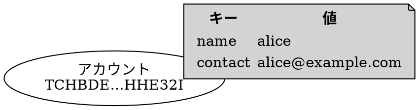
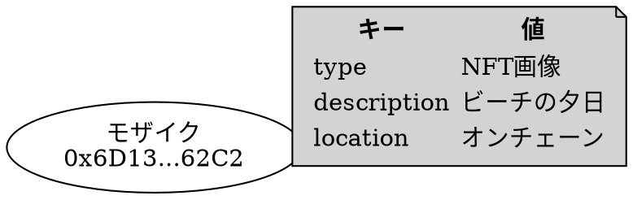
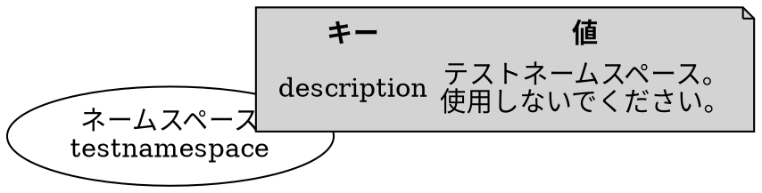

# メタデータ

メタデータ
:   メタデータトランザクションを介してオンチェーンに保存されるデータです。
    [アカウント](default:アカウント)、[モザイク](default:モザイク)、および [ネームスペース](default:ネームスペース) に関連付けできます。

プロトコルは、このメタデータにいかなる意味的な制約も課しません。その意味は、それを作成するアプリケーションによって完全に定義されます。

各データは、いくつかの部分からなる一意のキーによって識別されます。異なるアプリケーションによって提供されるデータ間の競合は、この一意のキーにメタデータ作成者のアドレスを含めることで回避されます。

メタデータが添付されるエンティティ（アカウント、モザイク、またはネームスペース）の所有者の署名を要求することで、不要なメタデータの受信を回避します。つまり、ターゲットエンティティの所有者がトランザクションに連署した場合にのみ、メタデータを添付できます。

各一意のキーは、対応する値に最大1024バイトを保存でき、必要に応じて更新または削除できます。

3つの異なるタイプのメタデータがサポートされています：[アカウント](#account-metadata)、[モザイク](#mosaic-metadata)、および [ネームスペース](#namespace-metadata) です。

## アカウントメタデータ {: #account-metadata }

メタデータは [アカウント](default:アカウント) に関連付けられます。

保存される各値の一意の識別子は、以下で構成されます。

* **署名者のアドレス**: メタデータを追加するアカウント。メタデータエントリを作成、更新、または削除する際には、その署名が必要です。
* **ターゲットアカウントのアドレス**: メタデータが添付されるアカウント。メタデータエントリを作成、更新、または削除する際には、その署名が必要です。
* **メタデータキー**: メタデータ作成者によって選択される64ビットの数値で、同じアカウントに複数のデータを添付できるようにします。

    使いやすさのために、テキスト文字列から簡単に生成できます。

メタデータは、明示的な承認なしにアカウントに添付することはできません。

ユースケースには以下のようなものがあります。

* アカウントにアイデンティティ情報のタグを付ける。
* 公開連絡先や使用状況データを追加する。
* 目的や所属を証明する。

## モザイクメタデータ {: #mosaic-metadata }

メタデータは [モザイク](default:モザイク) に関連付けられます。

保存される各値の一意の識別子は、以下で構成されます。

* **署名者のアドレス**: メタデータを追加するアカウント。メタデータエントリを作成、更新、または削除する際には、その署名が必要です。
* **ターゲットアカウントのアドレス**: モザイクを作成したアカウント。メタデータエントリを作成、更新、または削除する際には、その署名が必要です。
* **ターゲットモザイクID**: この特定のモザイクを識別するため。
* **メタデータキー**: メタデータ作成者によって選択される64ビットの数値で、同じモザイクに複数のデータを添付できるようにします。

    使いやすさのために、テキスト文字列から簡単に生成できます。

メタデータは、モザイクの所有者の明示的な承認なしにモザイクに添付することはできません。

モザイクはオンチェーンの資産を表しており、メタデータによってそれらに説明的な情報を加えて充実させることができます。
例えば、モザイクが [NFT](default:NFT) の保存に使用される場合、メタデータには以下のようなものを保存できます。

* 作成者情報
* 連絡先情報
* コンテンツがオフチェーンに保存されている場合の外部ハッシュ
* コンテンツがオンチェーンに保存されている場合の内部ハッシュ

## ネームスペースメタデータ {: #namespace-metadata }

メタデータは [ネームスペース](default:ネームスペース) に関連付けられます。

保存される各値の一意の識別子は、以下で構成されます。

* **署名者のアドレス**: メタデータを追加するアカウント。メタデータエントリを作成、更新、または削除する際には、その署名が必要です。
* **ターゲットアカウントのアドレス**: ネームスペースを作成したアカウント。メタデータエントリを作成、更新、または削除する際には、その署名が必要です。
* **ターゲットネームスペースID**: この特定のネームスペースを識別するため。
* **メタデータキー**: メタデータ作成者によって選択される64ビットの数値で、同じネームスペースに複数のデータを添付できるようにします。

    使いやすさのために、テキスト文字列から簡単に生成できます。

メタデータは、ネームスペースの所有者の明示的な承認なしにネームスペースに添付することはできません。

ネームスペースは、アカウントやモザイクの人間が読める識別子です。
メタデータを追加することで、例えば、その目的、所有権、連絡先情報などをさらに明確にすることができます。
