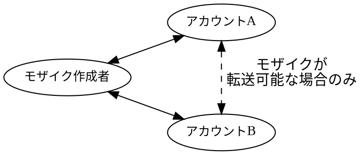

# モザイク

モザイク
:   Symbol ブロックチェーン上の資産を表す単位で、他のプロトコルで一般的に「トークン」と呼ばれるものに相当します。
    例として、通貨、ライセンス、コレクションアイテム、アクセス権、投票権などがあります。

他のプラットフォームのスマートコントラクトベースのトークンと異なり、
Symbol のモザイクはプロトコルレベルで直接サポートされており、追加のコードを必要としません。

各モザイクは新しい資産タイプを定義し、そのタイプに属する個々のトークンは「モザイク単位（ユニット）」と呼ばれます。

モザイクは、各単位が互換性を持つ「代替可能資産」（例：通貨）や、
各単位が一意である「非代替資産」（例：絵画や[NFT](default:NFT)）を表現できます。

新しいモザイクは必要に応じて作成でき、
それぞれに一意の識別子と、任意で人間が読みやすい名前が付与されます。
詳細は[モザイク ID とネームスペース](#id)を参照してください。

## モザイクのプロパティ

Symbol のモザイクには、その動作を定義する複数の設定可能なプロパティがあります。

### 可分性

可分性
:   モザイク数量の小数点以下の桁数を定義するプロパティです。
    可分性が `0` のモザイクは分割不可能であり、整数単位でしか転送できません。
    より大きな値を設定すると、単位を小数に分割できます。

例えば、可分性が `2` の場合、1単位を 100 分割（10^2^）でき、
`0.01` 単位ごとの取引が可能になります。

小数単位は「アトミック単位」とも呼ばれ、上記の例では 1 単位が 100 アトミック単位で構成されます。

多くの他プロトコルではこの値は固定です。
例として、Bitcoin は小数点以下 8 桁、Ethereum は 18 桁を使用します。
Symbol では、モザイクごとに自由に可分性を設定でき、資産の性質に合わせて柔軟に定義できます。

Symbol で許可される最大の可分性は `6` です。

### 初期供給量

発行時に作成されるモザイク単位の総量を定義します。
[供給量の可変性](#_5)が有効でない限り、この数量は固定されます。

### 供給量の可変性

作成後にモザイクの総供給量を増減できるかを示すプロパティです。
必要に応じてモザイク単位の発行や回収を動的に行えます。

供給量を変更できるのは、モザイクを最初に作成したアカウントのみです。
この変更は作成者の残高にのみ影響します。

* 供給量を増やす（ミント）場合、新しい単位が作成され、作成者のアカウントに追加されます。
* 供給量を減らす（バーン）場合、既存の単位が作成者のアカウントから削除されます。
  アカウントの残高が不足している場合、この操作は失敗します。

### 有効期間

モザイクは、特定の有効期限を指定して作成するか、無期限として作成することができます。

* **無期限モザイク** は決して有効期限が切れません。これは、通貨や恒久的なアクセス権など、ほとんどのユースケースで推奨される選択肢です。

* **期限付きモザイク** は、ブロック数で表される有効期限を持ちます。
    有効期限を指定する場合、Symbolで許容される最大値は10年（3650日）です。
    この期間が終了するとモザイクは期限切れとなり、転送したりトランザクションで使用したりすることができなくなります。
    残高はアカウントに残りますが、事実上凍結された状態になります。

!!! warning "警告"
    モザイクの有効期限は、総供給量が `0` の場合にのみ延長できます。
    供給量が発行（ミント）され分配された後は、有効期限を延長することはできません。
    無期限モザイクは、有効期限を一切変更できません。

    この動作は、常に更新可能な [ネームスペース](default:ネームスペース) とは異なります。

### 転送可能性

モザイクが自由にアカウント間で転送可能かどうかを指定します。
無効にした場合、作成者のみがそのモザイクを送受信できます。

### 制限可能性

モザイクの作成者が、どのアカウントがそのモザイクを保有または転送できるかを制限するルールを設定できます。
この機能はコンプライアンス、ホワイトリスト管理、アクセス制御などに有用です。

詳細は[モザイク制限](default:モザイク制限)のドキュメントを参照してください。

### 取り消し可能性

作成者が他のアカウントからモザイク単位を強制的に回収し、
自身のアカウントに戻すことを許可するプロパティです。
この機能はトークンの回収や契約条件の履行に利用できます。

## リース手数料

モザイクを作成するには、ネットワーク通貨（<XYM:>）で1回限りのリース手数料を支払う必要があります。

リース手数料の費用はネットワークに照会することで事前に確認でき、[Symbol Wallet](../userbook/wallet/install.md) のようなアプリケーションでは通常、この情報が表示されます。

この手数料は作成時に支払う必要があり、返金はされません。

!!! note "メモ"
    モザイクの作成にはトランザクションのアナウンスが必要であり、これにも関連する手数料がかかります。
    ただし、このトランザクション手数料は通常、リース手数料と比較してごくわずかです。

## モザイクIDとネームスペース

モザイクID
:   ネットワーク上のモザイクを一意に識別する64ビットの数値。
    モザイクIDは、作成者の [アドレス](default:アドレス) と [ノンス](default:ノンス) から決定論的に導き出されます。

ノンス 
:   モザイクを定義する際に作成者が選択する、任意の32ビット符号なし整数（0 ～ 4,294,967,295）。
    一意のノンスごとに、同じアカウントに対して異なる [モザイクID](default:モザイクID) が生成されます。
    同じアカウントは、すでにアクティブなモザイクを識別しているノンスを再利用することはできません。

例えば、Symbol ネットワークのネイティブ通貨 **XYM** は、[メインネット](default:メインネット)上でモザイク ID `0x6BED913FA20223F8` を持ちます。

モザイクをより分かりやすく参照できるように、特にユーザーインターフェイス上では、
人間が読みやすい[ネームスペース](default:ネームスペース)をモザイクにリンクすることができます。
これはインターネットのドメイン名と同様の仕組みで、
モザイク ID を直接参照する代わりに、`symbol.xym` のように名前で参照できます。

ネームスペースは任意であり、モザイクとは独立して再割り当てまたは有効期限切れとなることがあります。
詳細は[ネームスペース](default:ネームスペース)のドキュメントを参照してください。
