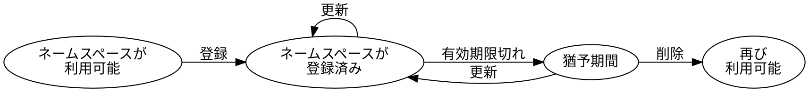

# ネームスペース {: #namespaces }

ネームスペース
:   [アドレス](default:アドレス)や[モザイクID](default:モザイクID)の代わりに使用できる、人間が読みやすいテキスト文字列です。

ネームスペースを使用すると、長くて読みにくい識別子に依存せずに資産やアカウントを参照できるようになります。
これによりウォレットやブロックエクスプローラーの利便性が向上し、
`symbol.xym` や `my_company.main_account` のような意味のあるエイリアスで
モザイク ID やアドレスを表現できるため、操作が明確になり、ミスも減少します。

ネームスペースは有限のリソースであり、永続的に所有するのではなく一定期間のリースとして扱われますが、
リースは更新可能です。

## サブネームスペース {: #subnamespaces }

Symbol のネームスペースはインターネットのドメイン名に似た階層構造を持ちます。
各名前はドットで区切られた 1 ～ 3 階層構造で、例として `foo`、`foo.bar`、`foo.bar.baz` のようになります。

最初の部分は _ルートネームスペース_ と呼ばれます。
追加の部分は _サブネームスペース_ であり、ルートの下に個別に登録する必要があります。

ルートネームスペース
:   親を持たず、単独で使用できるネームスペース。
    サブネームスペースを階層的にグループ化するために使用できます。
    各ルートネームスペースは、最大256個のサブネームスペースを持つことができます。

サブネームスペース
:   親であるルートネームスペースに属するネームスペース。
    サブネームスペースは、親ネームスペースの有効期限が切れると同時に期限切れになります（[有効期限](#duration)を参照）。

## プロパティ {: #properties }

### 名前 {: #name }

各ネームスペースにはネットワーク上で一意の名前が割り当てられ、特定のフォーマット規則に従う必要があります。

* 名前に使用できるのは英小文字、数字、ハイフン（`-`）、アンダースコア（`_`）のみです。
* 先頭は英字または数字でなければなりません。
* 長さは最大 64 文字です。

登録後、名前を変更することはできません。

### 有効期間 {: #duration }

ルートネームスペースを作成すると、30 日から 5 年の範囲で固定期間リースされます。
この期間中、作成者は次の操作を実行できます。

* ネームスペースを[モザイク](default:モザイク)または[アカウント](default:アカウント)にリンクし、
  より扱いやすいエイリアスとして使用する。
* ルートネームスペースの下にサブネームスペースを作成する。
* ルートネームスペースを更新して有効期間を延長する。
  サブネームスペースはルートと同じ期間を持つため、個別の更新は不要です。

ネームスペースを有効期限前に更新しなかった場合、30 日間の「猶予期間」に入ります。
この期間中はネームスペースが無効化されますが、まだ他の人が登録することはできません。
猶予期間中に更新できるのは元の作成者のみです。
猶予期間が終了するとネームスペースは完全に期限切れとなり、他者が登録できるようになります。

ネームスペースの状態に応じて実行可能な操作は次のとおりです。

| 操作内容                                 | 利用可能 | 登録済み | 猶予期間 |
| ---------------------------------------- | :------: | :------: | :------: |
| ネームスペースの登録                     |    ✅     |    ✗     |    ✗     |
| サブネームスペースの登録                 |    ✗     |    ✅     |    ✗     |
| モザイクまたはアカウントへのリンク       |    ✗     |    ✅     |    ✗     |
| エイリアスを使用したトランザクション送信 |    ✗     |    ✅     |    ✗     |
| ネームスペースの更新                     |    ✗     |    ✅     |    ✅     |

!!! note "メモ"
    [モザイク](default:モザイク)とは異なり、ネームスペースは有効期限前に更新できます。
    これにより、作成者が継続して更新を行う限り、無期限に有効状態を保つことができます。

## リース料金 {: #lease-fee }

ネームスペースを登録するには、ネットワーク通貨（[XYM](default:XYM)）によるリース料金の支払いが必要です。
これはネームスペースが限られた共有リソースであることを反映しており、
名前の買い占めを防ぐ目的もあります。

料金はネットワークの状況とネームスペースの種類によって異なります。

* **ルートネームスペース**：料金は希望する有効期間に比例します。
* **サブネームスペース**：料金は親ネームスペースの期間に依存しません。

リース費用は事前にネットワークへ照会することで確認でき、
[Symbol ウォレット](../userbook/wallet/install.md)などのアプリケーションでは通常この情報を表示します。

リース料金は登録または更新時に支払う必要があり、返金不可です。

!!! note "メモ"
    いかなる種類のネームスペースでも登録または更新にはトランザクションのアナウンスが必要であり、
    その際の[トランザクション手数料](default:トランザクション)も発生します。
    ただし、このトランザクション手数料はリース料金と比べてごく小額です。

## リンク {: #linking }

ネームスペースは[モザイク](default:モザイク)または[アカウント](default:アカウント)のいずれかにリンクでき、
その名前を対象オブジェクトのエイリアスとして扱うことができます。
これにより、モザイク ID やアドレスの代わりにネームスペースで参照できるようになります。

例：

* `symbol.xym` をネイティブモザイクにリンクすることで、
  読みにくい ID `0x6BED913FA20223F8` の代わりに、覚えやすい名前で表示・識別できます。

* `bob.wallet` をアカウントにリンクすることで、
  `NA5S6U...XDF3` のような長いアドレスを共有する必要がなくなり、わかりやすいラベルで送金できます。

各ネームスペースは同時に **1 つのオブジェクト** にのみリンクできますが、
同一のオブジェクトを複数のネームスペースでリンクすることは可能です。

* **モザイクにリンクする場合**：モザイクの作成者のみがリンクを設定できます。
  これにより第三者による無断エイリアス設定を防止します。

* **アカウントにリンクする場合**：リンクトランザクションが[アカウント操作制限](default:制限)によってブロックされていない必要があります。
  これによりアカウント所有者が無断リンクを制御できます。

リンクは任意であり、オブジェクトに紐づけずにネームスペースを存在させることもできますが、
実用的な価値はほとんどありません。

!!! warning "注意"
    ネームスペースのリンクは所有者によっていつでも変更または削除できます。

    この機能は柔軟性を提供しますが、ユーザーに混乱を与える可能性があるため注意が必要です。
    特に過去のトランザクションを閲覧する際に混乱が生じやすくなります。

    この問題を軽減するため、エイリアスを使用したトランザクションがブロックに追加されるたびに、
    その時点での対応関係を示す「解決ステートメント[レシート](default:レシート)」が記録されます。

    これにより、ウォレットやブロックエクスプローラーは、
    エイリアスが後に変更または削除された場合でも、当時の正しいアドレスやモザイク ID を表示できます。

    さらに、ユーザーが入力したエイリアスを受け入れる前に、ウォレットは現在のリンク対象とリンク作成日時を照会し、
    そのエイリアスが意図した宛先を指していることを確認できます。

## 所有権 {: #ownership }

ネームスペースは、ルートネームスペースを作成した[アカウント](default:アカウント)によって管理されます。

所有者のみが次の操作を行えます。

* ネームスペースのリンクまたは解除
* サブネームスペースの作成
* ルートネームスペースの更新

ネームスペースの所有権を直接譲渡することはできません。
所有者アカウント自体を譲渡することで管理権を移転します。
例えば、[マルチシグアカウント](default:マルチシグアカウント)を用いることで共同管理が可能です。

サブネームスペースは常にルートと同じ所有者を持ち、個別に管理することはできません。

## 結論 {: #summary }

以下の表は、ネームスペースに関する主な数値制限をまとめたものです。

| 制限項目                             | 値                     | 備考                               |
| ------------------------------------ | ---------------------- | ---------------------------------- |
| ネームスペース階層の最大深度         | 3 レベル               | ルート + 最大 2 サブネームスペース |
| 各ネームスペース名の最大長           | 64 文字                | 各階層に個別に適用される           |
| 使用可能な文字                       | `a–z`, `0–9`, `-`, `_` | 先頭は英字または数字である必要あり |
| ルートごとの最大サブネームスペース数 | 256                    |                                    |
| 最小ルートネームスペース期間         | 30 日                  |                                    |
| 最大ルートネームスペース期間         | 5 年                   |                                    |
| 有効期限後の猶予期間                 | 30 日                  |                                    |
