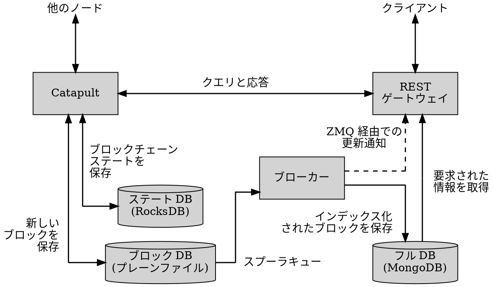
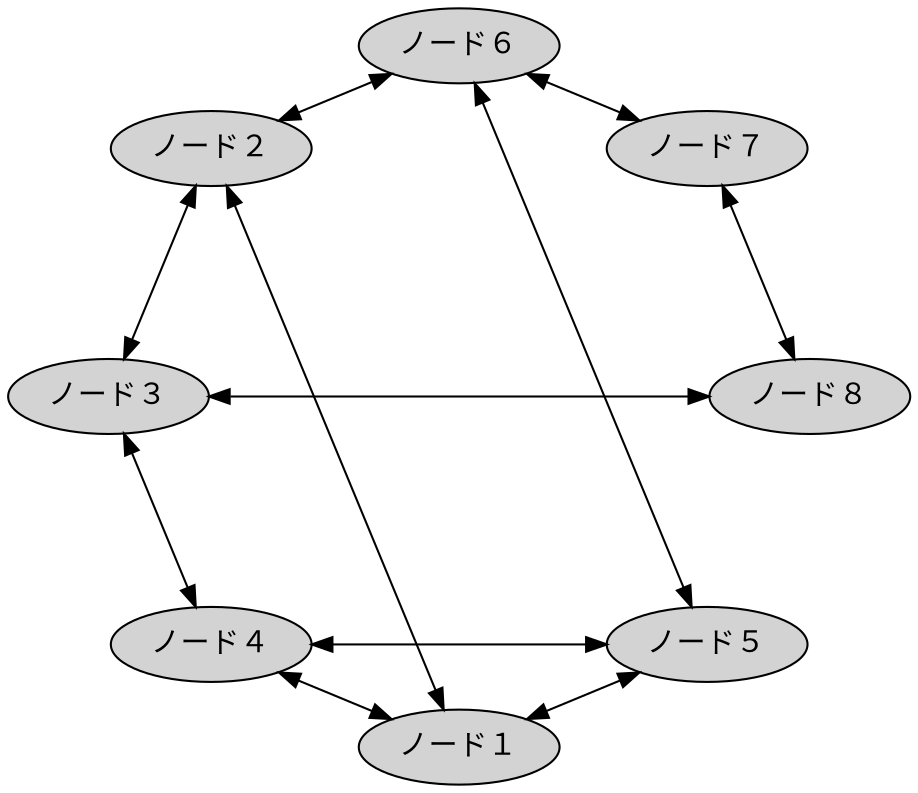

# ノード

ノード
:   Symbol ソフトウェアを実行し、他のノードと情報を共有し、受信した [トランザクション](default:トランザクション) を検証し、
    [コンセンサス](default:コンセンサス) とブロック生成に参加するコンピュータです。

ノードはブロックチェーンの中核を成し、十分な数のノードが稼働している限りネットワークが機能し続けることを保証します。

ブロック生成に参加するためには、各ノードはハーベスタの [アカウント](default:アカウント) に関連付けられている必要があります。
このアカウントがノードによって生成されたブロックに署名します。
運用コストを補うために、[ハーベスティング](default:ハーベスティング) による [XYM](default:XYM) の報酬は、
ノード運営者が指定した 1 つのアカウントに送ることができる。

Symbol ノードはいくつものソフトウェアコンポーネントで構成されており、
それぞれを個別に有効化および設定が可能です。
この柔軟性により、ハードウェア要件の異なる多様な構成を実現することができます。

最も一般的な構成は「ロール」と呼ばれます。下記がその説明です。

## ノード構造 {: #node-structure }

### :octicons-terminal-24: Catapult {: #catapult }

[Catapult](default:Catapult) クライアントは他のノードと
[後述するピアツーピア通信](#peer-to-peer-communication) で直接通信します。
パフォーマンス上の理由から、
[ブロックデータベース](#blocks-database) と [ブロックチェーン状態データベース](#state-database) を分離して保持しています。

また、[REST ゲートウェイ](#rest-gateway) からの基本的な問い合わせ
（ノードの公開鍵、ピアリスト、ネットワーク設定、時刻など）にも応答します。

### :octicons-database-24: 状態データベース {: #state-database }

Catapult は [RocksDB](http://rocksdb.org) というキー・バリュー型データベースを使用して、
ブロックチェーンの現在の状態を保持しています。
ここにはアカウント残高、アクティブなモザイク、ネームスペースなどが含まれています。

### :octicons-database-24: ブロックデータベース {: #blocks-database }

すべての [ブロック](default:ブロック) はプレーンファイルとしてディスク上に保存され、
[レシート](default:レシート)、[未承認トランザクションプール](default:未承認トランザクションプール)、
そして完了待ちの [アグリゲートボンデッドトランザクション](default:アグリゲートボンデッドトランザクション) が保存されています。

### :octicons-terminal-24: REST ゲートウェイ {: #rest-gateway }

外部クライアント（アプリやウォレットなど）がブロックチェーンとやり取りするための HTTP API を提供する。

多くの問い合わせは、ブロックや状態、未処理トランザクションを保存している
自身の [フルデータベース](#blocks-database) から直接応答されます。
ノード自体やネットワークに関する問い合わせは [Catapult](default:Catapult) エンジンへ転送されます。

REST ゲートウェイは WebSocket 接続もサポートしており、
アプリケーションが更新をポーリングする代わりに、
イベント発生時に即座に通知を受け取ることができます。

これらのイベントは [ZeroMQ](#zero-mq) によりゲートウェイに送信され、
そこから購読者へ転送されます。

### :octicons-terminal-24: ブローカー {: #broker }

このコンポーネントは、[ブロックデータベース](#blocks-database) からの更新を
[REST ゲートウェイ](#rest-gateway) が使用する [フルデータベース](#blocks-database) にコピーします。

有効化されている場合、[Catapult](default:Catapult) はスプーラーを使用して、
ブロックデータベースの変更を非同期的にブローカーへ通知する。
この分離により、インデックス作成やデータベース書き込みが
Catapult の時間に敏感な処理を妨げないようにしています。

変更が検出されるとすぐに、ブローカーは [ZeroMQ](#zero-mq) 経由で REST ゲートウェイにも通知し、
購読中のアプリケーションがタイムリーに更新を受け取れるようにします。

### :octicons-terminal-24: Zero MQ {: #zero-mq }

[ZeroMQ](https://zeromq.org/) は、
[ブローカー](#broker) から [REST ゲートウェイ](#rest-gateway) へ、
さらに最終的には購読アプリケーションへリアルタイムでイベントや状態変化を送信するためのメッセージングシステムです。

通常の HTTP リクエストとは異なり、ZeroMQ はプッシュ型通信を実現します。
これによりクライアントはポーリングすることなく、
新しいブロック、承認済みトランザクション、アカウント状態の変更などのイベントを即座に受け取れます。

### :octicons-database-24: フルデータベース {: #full-database }

[Catapult](default:Catapult) の [ブロックデータベース](#blocks-database) と
[状態データベース](#state-database) は高スループットに最適化されている。

並行して、ノードはこのデータのレプリカを [MongoDB](https://www.mongodb.com) に保持し、
[REST ゲートウェイ](#rest-gateway) が受け取る複雑な問い合わせを効率的に処理できるようにしています。

[フルデータベース](#blocks-database) への書き込みを行うのは [ブローカー](#broker) のみであり、
ブロックチェーンの基礎データと同期を保っています。

## ロール {: #roles }

Symbol ノードは高度に設定可能で、有効化されるコンポーネントによってさまざまなロールを担うことができます。

各ロールでは、有効なコンポーネントに応じてハードウェア要件が異なります。

### ピアノード {: #peer-nodes }

ピアノード
:   ピアノードは新しいブロックを生成し、受信したトランザクションとブロックを検証して、
    それらを隣接ノードへ中継することでネットワークのコンセンサスプロセスに参加します。

ピアノードは受信データを独立して検証したうえで転送し、ネットワークの整合性を保ちます。

このロールでは [Catapult](default:Catapult) エンジンとその関連データベースのみを実行します。

ピアノードは他のノードとだけ通信し、外部 API は公開しません。
ただし API ロールも兼ねる場合はその限りではありません。

### API ノード {: #api-nodes }

API ノード
:   API ノードは、外部クライアント（ウォレット、エクスプローラ、アプリケーションなど）が
    ネットワークとやり取りするための公開 [REST](https://ja.wikipedia.org/wiki/Representational_State_Transfer)
    インターフェイスを提供します。

このロールでは [ノード構造](#node-structure) で説明したすべてのコンポーネントを有効化する必要があります。
すべての API ノードはピアノードでもあります。

また、[アグリゲートボンデッドトランザクション](default:アグリゲートボンデッドトランザクション) を保存し、
トランザクションが完了して処理可能になるまで連署を収集する。

### 投票ノード {: #voting-nodes }

投票ノード
:   投票ノードは [ファイナライズ](default:ファイナライズ) プロセスに参加し、ブロックを不変にする。

投票ノードはピアノードまたは API ノードのどちらでもあり得ます。つまり API を公開していても公開していなくても構いません。

### デュアルノード {: #dual-nodes }

デュアルノード
:   [ハーベスティング](default:ハーベスティング) が有効化された API ノードを、
    しばしば「デュアルノード」と呼びます。

### ライト API ノード {: #light-api-nodes }

ライト API ノード
:   [Catapult](default:Catapult) の限定的な HTTP API が公開されているノードを「ライト API ノード」と呼ぶ。

この API はノードおよびネットワークに関する基本的な問い合わせにのみ応答でき、
フル [API ノード](default:API ノード) よりもはるかに少ないリソースで動作します。

このインターフェイスを公開することで、
クライアントがノードの公開鍵を取得できるようになり、
[委任ハーベスティング](default:委任ハーベスティング) が可能となります。

ライト API ノードで利用できる API エンドポイントは以下の通りです：

* <get:/chain/info>
* <get:/node/info>
* <get:/node/peers>
* <get:/node/server>
* <get:/node/unlockedaccount>

## ピアツーピア通信 {: #peer-to-peer-communication }

Symbol ノードは分散型のピアツーピア方式で直接通信を行う。
中央の調整者は存在せず、各ノードは他のノードの一部と接続して分散ネットワークを形成します。

ノードは既知のピアリストを共有し、
新しく接続したノードが他のノードをすばやく発見してネットワークに統合できるようにします。
この仕組みにより、個々のノードがオフラインになってもネットワーク全体の接続性と耐障害性が維持されます。

起動を容易にするため、[Catapult](default:Catapult) には初期ピアリストが同梱されています。
これにより新しいノードは最初の接続を確立し、他のノードを探索し始めることができる。
ただし、このリストに載っているノードが特別扱いされることはありません。
一度接続されると、すべてのピアはプロトコル上平等に扱われます。

### ノードの評価（レピュテーション） {: #node-reputation }

Symbol のような分散システムでは、ノードはどのピアを信頼し接続を維持するかを自律的に判断しなければならないです。
固定されたホワイトリストや手動で管理された接続に依存する代わりに、
Symbol ノードは「レピュテーション」システムを使用して、観測された挙動に基づきピアを動的に評価・順位付けします。

各ノードは通信成功率、応答時間、受信データの正当性などの指標をもとに独自に評価を算出します。
正常に動作し一貫して応答するノードは高いスコアを得ます。
無効なデータを送信したり、応答しなかったり、不正な挙動を示したノードは減点または一時的にブラックリスト化されます。

新しい接続を確立する際、ノードは過去のやり取りに基づく評価の高いピアを優先的に選択します。

レピュテーションスコアはローカルであり、各ノードが自身の直接的な経験のみに基づいて保持する点に注意してください。

!!! note "ノードのローテーション"

    孤立したり停滞したノード群の形成を防ぐため、
    Symbol ノードは定期的に最も長く接続されている一部のピアとの接続を切断します。
    これは、そのピアが高評価であっても行われます。

    この強制的な入れ替えにより、ノードは継続的に新しいピアを発見・評価し、
    接続性と適応性の高いネットワークトポロジーを維持します。

    レピュテーションに基づく安定性と意図的な接続更新のバランスを取ることで、
    プロトコルはネットワークの分断を防ぎ、長期的な分散性を促進しています。

最後に、このレピュテーションスコアはノードが他ノードへの接続可否を判断するための内部指標でです。
[ハーベスティング](default:ハーベスティング) の際、アカウントは任意のノードへ残高を委任でき、
その際に考慮される評価要素は、このページで説明したスコアと一致するとは限りません。
