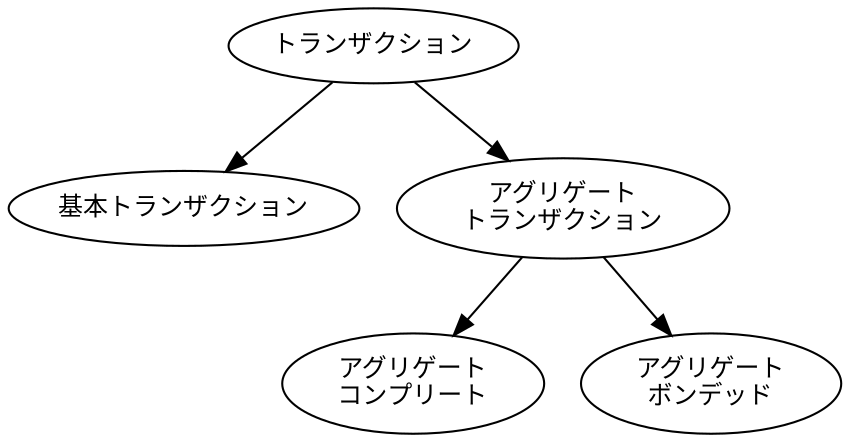
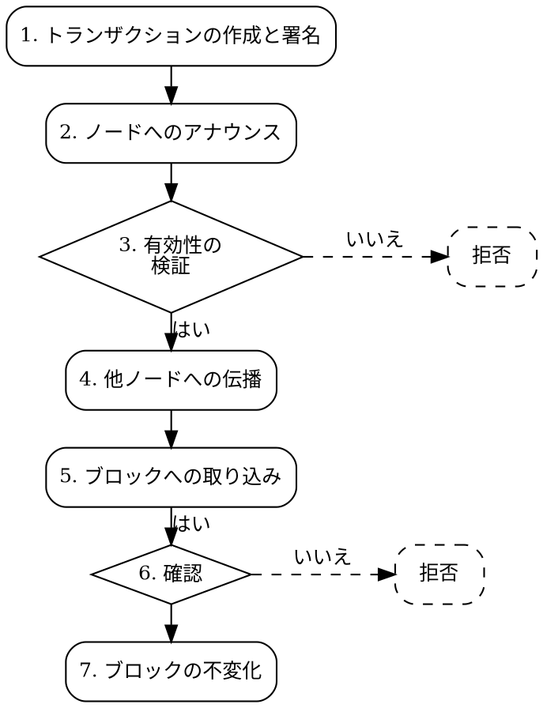

# トランザクション

トランザクション
:   トランザクションとは、Symbol ブロックチェーン上で実行される1つまたは複数のアクションを表します。
    例えば、ある[アカウント](default:アカウント)から別のアカウントへの資金移動や、新しい通貨の登録などが該当します。

これらのアクションは署名付きメッセージとして表現され、ネットワークにアナウンスされます。
ネットワーク上の[ノード](default:ノード)がそれを検証し、承認されるとトランザクションはブロックに含まれ、
ブロックチェーンの状態が更新されます。

## 基本的なトランザクションの種類

Symbol では、基本トランザクションとアグリゲートトランザクションの 2 種類のコアトランザクションをサポートしています。
アグリゲートトランザクションはさらに「コンプリート」と「ボンデッド」の 2 種に分類されます。



### 基本トランザクション

基本トランザクション
:   基本的な[トランザクション](default:トランザクション)は、1 つのアカウントによって開始され、
    そのアカウントの[署名](default:署名)のみを必要とする単一のアクションを表します。

例として、アカウント間の資金移動や新しい[ネームスペース](default:ネームスペース)の登録などがあります。

### アグリゲートトランザクション

アグリゲートトランザクション
:   アグリゲートトランザクションは、複数の基本トランザクションをまとめ、
    それらをアトミック（全体または無効のいずれか）に実行します。
    つまり、すべての[埋め込みトランザクション](default:埋め込みトランザクション)が受理されるか、すべてが拒否されます。

アグリゲートトランザクションは 1 つのアカウントによって開始されますが、
関係する他のアカウントの署名を必要とする場合があります。

共同署名
:   トランザクションが複数の署名を必要とする場合、それらの署名を「共同署名（コシグネチャ）」と呼びます。

アグリゲートトランザクションは、複数のアカウント間で信頼を必要とせずに連携動作を可能にするため、
Symbol に大きな柔軟性をもたらします。

!!! tip "アグリゲートトランザクションの例"

    アカウント A と B が資産を交換したいとします。
    その場合、2 つの[転送トランザクション](default:転送トランザクション)が必要になります。
    しかし、互いに信用していないため、どちらも先に自分のトランザクションをアナウンスして
    相手が実行しないリスクを負いたくありません。

    信頼を必要としない解決策は、両方のトランザクションを 1 つのアグリゲートにまとめることです。

    ```dot
    digraph {
        rankdir="LR";
        fontsize=12;
        subgraph clusterAggregate {
            label = "アグリゲートトランザクション";
            tooltip = "アグリゲートトランザクション";
            subgraph clusterT1 {
                label = "埋め込みトランザクション 1";
                tooltip = "埋め込みトランザクション 1";
                style = dashed;
                A1 [label="A" tooltip="A"];
                B1 [label="B" tooltip="B"];
                A1 -> B1;
            }
            subgraph clusterT2 {
                label = "埋め込みトランザクション 2";
                tooltip = "埋め込みトランザクション 2";
                style = dashed;
                A2 [label="A" tooltip="A"];
                B2 [label="B" tooltip="B"];
                A2 -> B2 [dir=back];
            }
        }
    }
    ```

    * 両者は署名前に全体の内容を確認できます。
    * 当事者双方が署名するまでトランザクションは処理されません。
    * すべてのトランザクションが実行されるか、どれも実行されないことが保証されます。
    * 署名後にトランザクションが改変されることはありません。
    * どちらの当事者がアグリゲートトランザクションをアナウンスしても問題ありません。

アグリゲートトランザクションがネットワークにアナウンスされる際、
必要な署名がすべて揃っているかどうかによって、「コンプリート」と「ボンデッド」の 2 種類に分類されます。

### アグリゲートコンプリートトランザクション

アグリゲートコンプリートトランザクション
:   すべての必要な[共同署名](default:共同署名)がすでに付与された状態でネットワークに送信される
    [アグリゲートトランザクション](default:アグリゲートトランザクション)。
    ノードはすぐに検証を行い、ブロックに含めることができます。

このタイプのトランザクションでは、すべての署名を事前にオフチェーンで収集する必要があります。

### ボンデッドアグリゲートトランザクション

ボンデッドアグリゲートトランザクション
:   必要な[共同署名](default:共同署名)がすべて揃っていない状態でネットワークに送信される
    [アグリゲートトランザクション](default:アグリゲートトランザクション)。
    ネットワークは追加署名を待つ間、そのトランザクションを一時的に保持します。

    _パーシャルトランザクション_（部分トランザクション）とも呼ばれます。

このタイプでは、関係者全員がオンチェーン上でのみやり取りを行います。

必要なアカウントは、特定の API を使用してネットワーク上の任意の[API ノード](default:API ノード)に
追加署名を送信できます。

すべての署名が揃うと、アグリゲートトランザクションの処理が再開されます。

ネットワークリソースを浪費するスパムを防ぐため、
ボンデッドアグリゲートトランザクションの開始には小額のデポジット（ボンド）が必要です。
署名がすべて揃う前にトランザクションの有効期限が切れた場合、ボンドは没収されますが、
揃えば返還されます。

### 埋め込みトランザクション

埋め込みトランザクション
:   基本トランザクションがアグリゲートトランザクションに含まれる場合、それらは「埋め込みトランザクション」と呼ばれます。

埋め込みトランザクションは基本トランザクションと同様に動作しますが、次の点が異なります。

* 各トランザクションには個別の署名が付与されません。
    代わりに、必要なすべてのアカウントがアグリゲートトランザクション全体に署名し、
    署名をまとめて添付します。
    例えば、同じアカウントが複数のトランザクションを含む場合、
    そのアカウントの署名は 1 回だけ必要です。

* 手数料や期限の情報は含まれません。
    これらはアグリゲートトランザクション側で指定されます。

* すべてのトランザクションタイプを埋め込みとして使用できるわけではありません。
    重要な例として、アグリゲートトランザクションを別のアグリゲート内に埋め込むことはできません。

!!! info "情報"
    現在、Symbol メインネットおよびテストネットでは次の制限が適用されています。

    * 1 つのアグリゲートあたり **最大 100 件の埋め込みトランザクション**
    * 1 つのアグリゲートあたり **最大 25 件の共同署名**

## トランザクションのライフサイクル

トランザクションは、他のブロックチェーンと同様の一般的なプロセスをたどります。



[ボンデッドアグリゲートトランザクション](default:ボンデッドアグリゲートトランザクション)は通常の流れと少し異なります。
署名が不足しているアグリゲートトランザクションは、各ノードの「部分トランザクションキャッシュ」に一時保存され、
ステップ２の後で処理が停止します。
必要な署名がすべて揃うと、それらのトランザクションは「コンプリート」となり、
ステップ３から処理を再開します。

### １．作成と署名

ソフトウェアクライアント（通常はアプリ）がトランザクションを作成し、すべてのパラメータを設定します。
例えば、転送トランザクションの場合、送信元[アカウント](default:アカウント)、送信先アカウント、金額などが必要です。

この段階で、必要なすべての署名を収集します。
転送トランザクションでは送信元アカウントの署名のみが必要ですが、
より複雑な[アグリゲートトランザクション](default:アグリゲートトランザクション)では
複数の署名が必要となる場合があります。

各署名は通常、[ウォレット](default:ウォレット)によって作成されます。
署名は、各アカウントの[秘密鍵](default:秘密鍵)の保有者のみが有効な署名を生成できることから、
すべての関係者がトランザクションを承認した証拠となります。

### ２．アナウンス

クライアントアプリケーションは、ネットワーク上の接続された[API ノード](default:API ノード)に
トランザクションを送信します。

### ３．検証

ノードはトランザクションの形式と署名を確認します。
[ボンデッドアグリゲートトランザクション](default:ボンデッドアグリゲートトランザクション)の場合、
すべての署名が揃うまで署名検証は保留されます。

一部のトランザクションタイプでは、追加の検証も必要です。
例えば、転送トランザクションでは送信元アカウントに十分な残高があるか確認します。

詳細な検証項目については、[検証の詳細](#_10)を参照してください。

いずれかの検証に失敗すると、トランザクションは拒否され、それ以上伝播されません。
すべての検証に合格すると、次の段階に進みます。

### ４．伝播

ノードがトランザクションを有効と判断すると、
それをネットワーク内の[ピアノード](default:ノード)にブロードキャストし、
各ノードの「未承認トランザクションプール」に追加します。

未承認トランザクションプール
:   ネットワーク全体で共有される、検証待ちトランザクションの一覧。

各ノードはこのプールからトランザクションを取得し、
構造・署名・タイプ固有の条件を再検証します。
問題がなければさらに他のピアへ伝播します。

これにより、ネットワークの広範囲にトランザクション情報が行き渡ります。

### ５．ハーベスティング

トランザクションが未確認プールに入ると、最終的に[ハーベスティング](default:ハーベスティング)プロセスによって
ブロックに含まれます。
この時点でトランザクションは「承認済み」となります。

### ６．確認

新しく作成されたブロックは他のノードへ伝播され、各ノードがそれを検証し、受け入れるか拒否します。
[コンセンサス](default:コンセンサス)の仕組みにより、ネットワーク全体が最終的に同じブロックに合意します。

まれに、すでに受け入れられたブロックが後にネットワークの多数派によって拒否され、
[ロールバック](default:ロールバック)されることがあります。
この場合、そのブロック内のトランザクションは取り消され、未確認プールに戻されます。

トランザクションが未確認プールにある間に期限が切れた場合は拒否されます。
これは例えば、手数料が低すぎてハーベスターに選ばれなかった場合などに発生します。

トランザクションが取り消されるリスクを減らすため、
アプリケーションは通常、トランザクション承認後に数ブロック分待機してから確定と見なします。
各ブロックが追加されるごとに信頼性が高まり、トランザクションが恒久的に残る確度が上がります。

さらに Symbol では、承認済みトランザクションが取り消されないことを保証する
追加の仕組みが存在します。

### ７．ファイナライズ

[ファイナライズ](default:ファイナライズ)はコンセンサスと並行して実行され、
追加されたブロックを一定単位で確定します。

ファイナライズを待つことで、アプリケーションは
[ロールバック](default:ロールバック)によってトランザクションが取り消されないことを確信できます。

## 共通トランザクション構造

Symbol のすべてのトランザクションタイプは、以下の共通属性を持ちます。

| 属性名           | 説明                                                                   |
| ---------------- | ---------------------------------------------------------------------- |
| **署名者公開鍵** | トランザクションを作成・署名したアカウントの[公開鍵](default:公開鍵)。 |
| **署名**         | 署名者がトランザクション内容を承認した暗号学的証明。                   |
| **期限**         | トランザクションが承認されなかった場合に失効する時刻。                 |
| **最大手数料**   | トランザクションをブロックに含めるために支払う意思のある最大手数料。   |
| **タイプ**       | トランザクションの種類。追加属性の有無を決定する。                     |

## 検証の詳細

トランザクションがブロックに含まれる前に、各ノードは以下の検証を個別に実施します。

| **検証項目**   | **説明**                                                                                 |
| -------------- | ---------------------------------------------------------------------------------------- |
| **署名検証**   | 署名が有効であり、署名者の公開鍵およびトランザクション内容と一致しているかを確認します。 |
| **手数料検証** | ノードの最小手数料基準を満たしているか、および署名者に十分な残高があるかを確認します。   |
| **期限検証**   | トランザクションの期限がすでに経過していないかを確認します。                             |
| **意味的検証** | トランザクションタイプに基づく論理的整合性を確認します。例：送信者の残高不足など。       |

これらの検証のいずれかに失敗したトランザクションは拒否され、ネットワーク上で伝播されません。

## サポートされるトランザクションタイプ

Symbol はさまざまな操作に特化した多くのトランザクションタイプをサポートしています。
すべてのタイプは[共通構造](#_9)を共有し、
同じ処理および検証ステップを経ますが、目的と必要フィールドが異なります。

<div class="subsections" markdown>

| **トランザクションタイプ**                                               | **説明**                                                                                                                               |
| ------------------------------------------------------------------------ | -------------------------------------------------------------------------------------------------------------------------------------- |
| **[転送トランザクション](default:転送トランザクション)**                 |                                                                                                                                        |
| `Transfer`                                                               | ２つの[アカウント](default:アカウント)間で[モザイク](default:モザイク)やメッセージを送信します。                                       |
| **[アグリゲートトランザクション](default:アグリゲートトランザクション)** |                                                                                                                                        |
| `Aggregate Complete`                                                     | 複数のアカウント間にまとめてトランザクションを送信します。                                                                             |
| `Aggregate Bonded`                                                       | 複数のアカウント間で合意が必要なトランザクションを提案します。                                                                         |
| `Hash Lock`                                                              | [ボンデッドアグリゲートトランザクション](default:ボンデッドアグリゲートトランザクション)のアナウンスに必要なデポジットをロックします。 |
| [**ファイナライズ**](#7)                                    |                                                                                                                                        |
| `Voting Key Link`                                                        | ファイナライズ投票に必要な BLS 公開鍵をアカウントにリンクします。                                                                      |
| **[ハーベスティング](default:ハーベスティング)**                         |                                                                                                                                        |
| `Account Key Link`                                                       | リモートまたは委任ハーベスティングを有効化するために必要なトランザクションです。                                                       |
| `Node Key Link`                                                          | 委任ハーベスティングを有効化するために必要なトランザクションです。                                                                     |
| `VRF Key Link`                                                           | ハーベスティングに必要な VRF 公開鍵をアカウントにリンクします。                                                                        |
| **ロック**                                                               |                                                                                                                                        |
| `Secret Lock`                                                            | 異なるチェーン間でトークンスワップを開始します。                                                                                       |
| `Secret Proof`                                                           | 異なるチェーン間でトークンスワップを完了します。                                                                                       |
| **メタデータ**                                                           |                                                                                                                                        |
| `Account Metadata`                                                       | アカウントにキー・値形式のメタデータを関連付けます。                                                                                   |
| `Mosaic Metadata`                                                        | モザイクにメタデータを関連付けます。                                                                                                   |
| `Namespace Metadata`                                                     | ネームスペースにメタデータを関連付けます。                                                                                             |
| **[モザイク](default:モザイク)**                                         |                                                                                                                                        |
| `Mosaic Definition`                                                      | 新しいモザイクを作成します。                                                                                                           |
| `Mosaic Supply Change`                                                   | モザイクの総供給量を変更します。                                                                                                       |
| `Mosaic Supply Revocation`                                               | モザイクを取り消します。                                                                                                               |
| **[マルチシグ](default:マルチシグアカウント)**                           |                                                                                                                                        |
| `Multisig Account Modification`                                          | マルチシグアカウントを作成または変更します。                                                                                           |
| **[ネームスペース](default:ネームスペース)**                             |                                                                                                                                        |
| `Namespace Registration`                                                 | ネームスペースを登録または更新します。                                                                                                 |
| `Address Alias`                                                          | ネームスペース（エイリアス）をアカウントアドレスに関連付けまたは解除します。                                                           |
| `Mosaic Alias`                                                           | ネームスペースをモザイクに関連付けまたは解除します。                                                                                   |
| **[制限](default:制限)**                                                 |                                                                                                                                        |
| `Account Address Restriction`                                            | 特定のアドレスに対する送受信トランザクションを許可または禁止します。                                                                   |
| `Account Mosaic Restriction`                                             | 特定のモザイクを含む受信トランザクションを許可または禁止します。                                                                       |
| `Account Operation Restriction`                                          | トランザクションタイプに応じて送信を許可または禁止します。                                                                             |
| `Mosaic Global Restriction`                                              | 制限可能なモザイクの送信に対してグローバルルールを設定します。                                                                         |
| `Mosaic Address Restriction`                                             | 制限可能なモザイクの送信に対してアドレス固有のルールを設定します。                                                                     |

</div>

新しいトランザクションタイプはプラグインを通じて追加することが可能です。
ただし、ネットワーク全体でコンセンサスを維持するためには、すべてのノードが同じプラグインセットをサポートしている必要があります。
