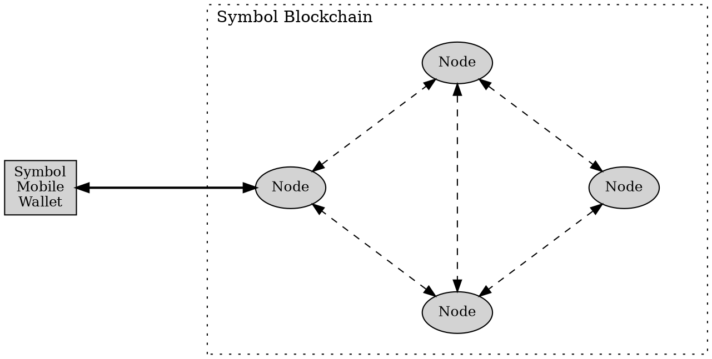

# ノードの変更

このページでは、Symbol モバイルウォレットアプリが使用する [ノード](default:ノード) を変更する方法を説明します。

アプリはノードに接続して、Symbol ブロックチェーンから情報を読み取り、トランザクションをアナウンスします。
資産はノード上に保存されていないため、ノードを変更しても資産が移動したり、アカウントが変わったりすることはありません。

現在のノードが応答しない、遅い、一時的に同期していない場合などに、ノードの変更が役立ちます。
応答性を高めるために、自分の場所に近いノードを選択することもできます。
ノードの場所や状態情報は [symbol.fyi/nodes](https://symbol.fyi/nodes) に掲載されています。

どのノードを使用すべきかわからない場合は、**Select automatically** を選択し、アプリに自動選択させます。

## 前提条件

* Symbol モバイルウォレットがインストールされていることを確認してください。
    まだインストールしていない場合は、[アプリのインストール](./install.md) ガイドを参照してください。

* すでにウォレットが設定され、アプリでロック解除されている必要があります。
    必要に応じて、[ウォレットの作成](./create-wallet.md) または [ウォレットのインポート](./import-wallet.md) を参照してください。

## ノードの変更方法

アプリで使用するノードを変更するには、次の手順に従ってください。



{{ tutorial.list_begin("portrait") }}

{{ tutorial.step_begin("create-wallet-5.webp") }}
ウォレットの **:material-home: HOME** 画面で、右上隅の **:material-cog: Settings** ボタンをタップします。
{{ tutorial.step_end() }}

{{ tutorial.step_begin("export-wallet-1.webp") }}
**:octicons-database-24: Network** をタップします。
{{ tutorial.step_end() }}

{{ tutorial.step_begin("network-2.webp") }}
**CONNECTED NODE INFO** ボックスには、アプリが現在使用しているノードから報告された情報が表示されます。

変更するには **NODE** ドロップダウンをタップします。
{{ tutorial.step_end() }}

{{ tutorial.step_begin("network-3.webp") }}
一覧からノードを選択するか、**Select Automatically** を選択します。
{{ tutorial.step_end() }}

{{ tutorial.list_end() }}

ノードを選択すると、**Network** 画面に戻ります。
更新された **CONNECTED NODE INFO** ボックスでは、次の情報を確認できます。

* **CHAIN HEIGHT** は、接続先ノードが認識している最新ブロックを示します。
    どのノードを使用しても基本的には同じ値になるはずです。
    他のノードより明らかに低い場合は、より新しい状態のノードに切り替えてください。

* **MIN FEE MULTIPLIER** は、そのノード経由でトランザクションをアナウンスする際のコストに影響します。
    値が高いほど、トランザクションが高くなる可能性があります。
    トランザクション手数料をどこで選択するかについては、[資金とメッセージの送信](./send-funds-and-messages.md) を参照してください。

アプリは、今後のブロックチェーン照会とトランザクションのアナウンスに、選択したノードを使用します。
自分にとって最も使いやすいノードを探すために、ノードは何度でも変更できます。

!!! abstract "すべてのノードがアプリからの接続を許可しているわけではありません"

    Symbol ネットワークは主に、互いに常時やり取りしながらトランザクションを検証し、ブロックチェーンの整合性を維持する [ピアノード](default:ピアノード) で構成されています。

    その一部だけが [API ノード](default:API ノード) でもあり、Symbol モバイルウォレットのようなプログラムからの接続を許可します。

    そのため、アプリに表示されるノード一覧は、ネットワーク全体のノード一覧よりかなり短い場合があります。
